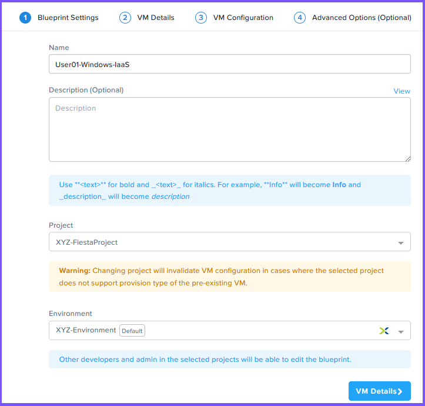
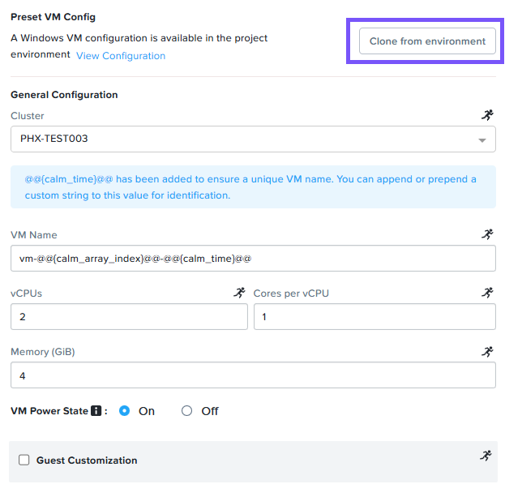

# Nutanix Cloud Platform - Pt 2

# [#](#creating-a-windows-blueprint-optional) Creating a Windows Blueprint (Optional)

Note:

Creating the Windows Blueprint is not required to complete the rest of the steps in this lab. Please feel free to complete these steps if you have time. Otherwise you can proceed to Operate Your Cloud.

A Blueprint is the framework for every application or piece of infrastructure that you model by using Nutanix Self-Service. While complex, multi-tiered applications utilize the Multi VM/Pod Blueprint, the streamlined interface of the Single VM Blueprint is conducive for IaaS use cases. You can model each type of infrastructure your company utilizes (for instance Windows, CentOS, or Ubuntu) in a Single VM Blueprint, and end users can repeatedly launch the Blueprint to create infrastructure on demand. The resulting infrastructure (which is referred to as an application), can then be managed throughout its entire lifecycle within Self-Service, including managing Nutanix Guest Tools (NGT), modifying resources, snapshots, and clones.

## [#](#create-blueprint) Create Blueprint

1.  Login to Prism Central using `adminuser##` and the PC password from the Connection Details page.
    
2.  Navigate to the App Switcher section in the top left of Prism Central. Click **Self Service** in the App Switcher.
    
3.  Click **Blueprint** in the left toolbar.
    
4.  Click **Create Blueprint** > **Single VM Blueprint**.
    
5.  Enter the below information:
    
    -   Name - **User`##`\-Windows-IaaS** where `##` is your assigned number.
    -   Project - Initials-FiestaProject
    -   Environment - Initials-Environment
    
    Note:
    
    The Project and Environment should be the same which you had created as part of the Projects Exercise.
    



6.  Click **VM Details**.
    
7.  Fill out the following fields on the VM Details page:
    
    -   Name - **User`##`\_VM** where `##` is your assigned number
    -   Operating System - Select Windows from the drop-down.
8.  Click **VM Configuration**.
    
9.  Click **Clone from environment**. Since you've previously specified the details for your Windows VM within your Project, there's no need to enter that same information again.
    
    
    
10.  In General Configuration - enter **vm-@@{calm\_array\_index}@@-@@{calm\_time}@@** within the VM Name field.
    
    Note:
    
    Take note of **`vm-@@{calm_array_index}@@-@@{calm_time}@@`**. In Self-Service, the **`@@{`** and **`}@@`** characters represent the start and stop of a macro. At runtime, Self-Service will automatically substitute the proper value(s) when it encounters a macro. A macro could represent a system defined value, a VM property, or (as it does in this case) a runtime variable.
    
    Self-Service macros are part of a templating language for Self-Service scripts. These are evaluated by Self-Service execution engine before the script is run.
    
11.  Check the **Guest Customization** box. Select **Prepared from the Install Type** drop-down, and paste in the following script.
    
    -   Guest customization allows for the modification of certain settings at boot. Windows uses XML-based sysprep unattend files.

```
<?xml version="1.0" encoding="UTF-8"?>
<unattend xmlns="urn:schemas-microsoft-com:unattend">
   <settings pass="oobeSystem">
      <component name="Microsoft-Windows-Shell-Setup" xmlns:wcm="http://schemas.microsoft.com/WMIConfig/2002/State" xmlns:xsi="http://www.w3.org/2001/XMLSchema-instance" processorArchitecture="amd64" publicKeyToken="31bf3856ad364e35" language="neutral" versionScope="nonSxS">
         <OOBE>
            <HideEULAPage>true</HideEULAPage>
            <HideOEMRegistrationScreen>true</HideOEMRegistrationScreen>
            <HideOnlineAccountScreens>true</HideOnlineAccountScreens>
            <HideWirelessSetupInOOBE>true</HideWirelessSetupInOOBE>
            <NetworkLocation>Work</NetworkLocation>
            <SkipMachineOOBE>true</SkipMachineOOBE>
         </OOBE>
         <UserAccounts>
            <AdministratorPassword>
               <Value>@@{WINDOWS.secret}@@</Value>
               <PlainText>true</PlainText>
            </AdministratorPassword>
         </UserAccounts>
         <FirstLogonCommands>
            <SynchronousCommand wcm:action="add">
               <CommandLine>cmd.exe /c netsh firewall add portopening TCP 5985 "Port 5985"</CommandLine>
               <Description>Win RM port open</Description>
               <Order>1</Order>
               <RequiresUserInput>true</RequiresUserInput>
            </SynchronousCommand>
            <SynchronousCommand wcm:action="add">
               <CommandLine>powershell -Command "Enable-PSRemoting -SkipNetworkProfileCheck -Force"</CommandLine>
               <Description>Enable PS-Remoting</Description>
               <Order>2</Order>
               <RequiresUserInput>true</RequiresUserInput>
            </SynchronousCommand>
            <SynchronousCommand wcm:action="add">
               <CommandLine>powershell -Command "Set-ExecutionPolicy -ExecutionPolicy RemoteSigned"</CommandLine>
               <Description>Enable Remote-Signing</Description>
               <Order>3</Order>
               <RequiresUserInput>false</RequiresUserInput>
            </SynchronousCommand>
         </FirstLogonCommands>
      </component>
      <component name="Microsoft-Windows-International-Core" xmlns:wcm="http://schemas.microsoft.com/WMIConfig/2002/State" xmlns:xsi="http://www.w3.org/2001/XMLSchema-instance" processorArchitecture="amd64" publicKeyToken="31bf3856ad364e35" language="neutral" versionScope="nonSxS">
         <InputLocale>en-US</InputLocale>
         <SystemLocale>en-US</SystemLocale>
         <UILanguageFallback>en-us</UILanguageFallback>
         <UILanguage>en-US</UILanguage>
         <UserLocale>en-US</UserLocale>
      </component>
   </settings>
   <settings pass="specialize">
      <component name="Microsoft-Windows-Shell-Setup" xmlns:wcm="http://schemas.microsoft.com/WMIConfig/2002/State" xmlns:xsi="http://www.w3.org/2001/XMLSchema-instance" processorArchitecture="amd64" publicKeyToken="31bf3856ad364e35" language="neutral" versionScope="nonSxS">
         <ComputerName>@@{name}@@</ComputerName>
         <RegisteredOrganization>Nutanix</RegisteredOrganization>
         <RegisteredOwner>Acropolis</RegisteredOwner>
         <TimeZone>UTC</TimeZone>
      </component>
      <component name="Microsoft-Windows-TerminalServices-LocalSessionManager" xmlns="" publicKeyToken="31bf3856ad364e35" language="neutral" versionScope="nonSxS" processorArchitecture="amd64">
         <fDenyTSConnections>false</fDenyTSConnections>
      </component>
      <component name="Microsoft-Windows-TerminalServices-RDP-WinStationExtensions" xmlns="" publicKeyToken="31bf3856ad364e35" language="neutral" versionScope="nonSxS" processorArchitecture="amd64">
         <UserAuthentication>0</UserAuthentication>
      </component>
      <component name="Networking-MPSSVC-Svc" xmlns:wcm="http://schemas.microsoft.com/WMIConfig/2002/State" xmlns:xsi="http://www.w3.org/2001/XMLSchema-instance" processorArchitecture="amd64" publicKeyToken="31bf3856ad364e35" language="neutral" versionScope="nonSxS">
         <FirewallGroups>
            <FirewallGroup wcm:action="add" wcm:keyValue="RemoteDesktop">
               <Active>true</Active>
               <Profile>all</Profile>
               <Group>@FirewallAPI.dll,-28752</Group>
            </FirewallGroup>
         </FirewallGroups>
      </component>
   </settings>
</unattend>
```

12.  Click **Advanced Options**.
    
13.  Click **Add/Edit Credentials**. This is required to make any changes to this entire section.
    
14.  Click **Add Credential**, fill out the following fields.
    
    -   Name WINDOWS
    -   Username `administrator`
    -   Password `nutanix/4u`
    -   Click **Done**
15.  (Optional) Scroll down to the Update Configs section, and click Add Config.
    
16.  Enter **User`##`UpdateConfig** where `##` is your assigned number within the Name the update configuration field,
    
17.  Click **Update** on the right side of Memory (GiB) row, fill out the following fields,
    
    -   Memory (GiB) - Increase
    -   Update - 1
    -   Enable the Editable switch
    -   Max Value - 6
    -   Click **Done**
18.  **(Optional)** Click on **Add Snapshot/Restore Config** within the Snapshot/Restore section
    
19.  Fill out the following field, and click Save. This is required to allow the user to snapshot the application.
    
    -   Snapshot/Restore action suffix - **User`##`** where `##` is your assigned number.
    -   Click the Save button.
20.  Click **Save**
    

🎉 You have successfully created your first Single VM Windows Blueprint !!!

## [#](#defining-variables) Defining Variables

1.  Click **Blueprints** > **User`##`\-Windows-IaaS** where `##` is your assigned number.
    
2.  Click the App variables button along the top pane to bring up the variables menu.
    
3.  In the pop-up that appears, you should see a note stating you currently do not have any variables. Click the Add Variable button, and fill out the following fields.
    

-   Within the left column, click the **running person** icon to mark this as a runtime variable.
-   In the main pane, set the variable Name as **vm\_name\_prefix**.
-   Click the **Show Additional Options** link at the bottom.
-   Check the **Mark this variable mandatory** checkbox. This ensures a value is input, as this variable contributes to the VM name.

4.  Click **Done**
    
5.  Click **Save** to save the changes made to the blueprint
    

## [#](#marketplace) Marketplace

Now that we know we have a known-good Blueprint, let's publish it to the Marketplace.

## [#](#publishing-the-blueprint) Publishing the Blueprint

1.  Click **Blueprints** > **User`##`\-Windows-IaaS** where `##` is your assigned number.
    
2.  Click the **Publish** button, and enter the following:
    
    -   Name - **User`##`\-Windows-IaaS** where ## is your assigned number.
    -   Enable Publish with secrets
    -   Initial Version - 1.0.0
    -   Description - Standard Windows VM Deployment
    -   Click **Submit for Approval**.

## [#](#approving-blueprints) Approving Blueprints

Once the blueprint is submitted, it also needs to be approved.

1.  Click **Marketplace Manager**
    
2.  You will see the list of Marketplace Blueprints, and their versions listed.
    
3.  Select **Approval Pending** at the top of the page.
    
4.  Click on the **User`##`\-Windows-IaaS** Blueprint where `##` is your assigned number
    
5.  Select Initials-FiestaProject from the drop-down of the Projects Shared With field.
    
6.  Click the **Approve** button
    
7.  Select **Approved** at the top of the page.
    
8.  Click on the **User`##`\-Windows-IaaS** Blueprint where `##` is your assigned number
    
9.  Click the **Publish** button.
    
10.  Click the **Deploy** button
    
11.  Give your app a name and for the **vm\_name\_prefix** use **User`##`\_WinPrefix**
    
12.  Click the **Deploy** button
    

Congratulations!

🎉 You have successfully published your application to Marketplace. You can view it by going to **Admin Center** > **Marketplace**

## [#](#takeaways) Takeaways

What key things should you know about Nutanix Self-Service and Single VM Blueprints?

-   Nutanix Self-Service natively provides application and infrastructure automation within Prism, turning complex, week-long ticketing processes into one-click self-service provisioning.
    
-   There are multiple methods to configure and control credentials.
    
-   While Multi VM Blueprints enable the provisioning and lifecycle management of complex, multi-tiered applications, Single VM Blueprints allow IT to provide Infrastructure-as-a-Service for their end users.
    
-   Common day two operations, like snapshots, restoring, cloning, and updating the infrastructure, can all be done by end users directly within Nutanix Self-Service.