# [#](#data-protection) Data Protection

## [#](#overview) Overview

Nutanix มีความสามารถในการสร้างจุดกู้คืน (Recovery Points) ของพื้นที่เก็บข้อมูลในระดับ VM/vDisk จาก Prism Central โดย Protection Policies คือโครงสร้างที่ใช้ในการจัดกลุ่ม VM เข้าด้วยกัน เพื่อสร้างจุดกู้คืนพร้อมกันและยังสามารถใช้สำหรับการทำสำเนา (Replication) ได้อีกด้วย

ในส่วนนี้ เราจะใช้ Prism Central ในการสร้างและกู้คืน VM จาก Snapshots รวมถึงการสร้าง Protection Policy สำหรับ VM

### VM Recovery Points

Recovery Points โดยพื้นฐานแล้วก็คือ snapshots แต่จะถูกจัดการจากภายใน Prism Central ครอบคลุมทุก cluster ที่ PC ดูแลอยู่ โดยสามารถสั่งทำสำเนา (Replicated) ไปยังค cluster อื่นใน environemtn ที่ต้องการได้

1.  จากเมนูแถบด้านข้าง ภายใต้ **VMs** (ถึงตอนนี้คุณน่าจะรู้แล้วว่ามันอยู่ตรงไหน 😄) ให้ค้นหา Linux VM และตรวจสอบให้แน่ใจว่าได้ปิดเครื่อง (powered off) ไว้แล้ว

    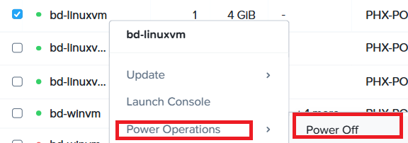

2.  จากนั้น คลิกขวา เลื่อนเมาส์ไปที่ **Data Protection** แล้วคลิก **Create Recovery Point**

    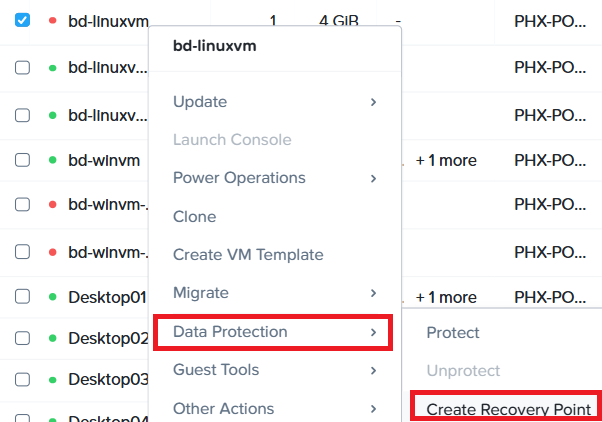

3.  กรอกรายละเอียดต่อไปนี้ แล้วคลิก **Create**

      - **Recovery Point Name** - `Initial`-linuxvm-rp
      - **Expire Date** - ปล่อยเป็นค่าเริ่มต้นคือไม่มีวันหมดอายุ (does not expire) ซึ่งหมายความว่าแม้ VM จะถูกลบไปแล้ว แต่จุดกู้คืนสำหรับ VM นั้นจะไม่ถูกลบออกจากระบบ

    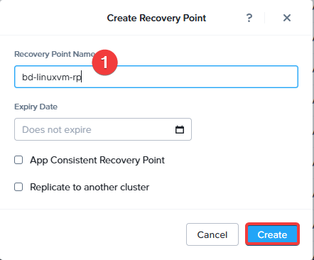

    > **หมายเหตุ**

    > จุดกู้คืนแบบ App consistent จะใช้ Nutanix Guest Tools ในการเรียกใช้งาน VSS ที่เกี่ยวข้อง เพื่อหยุดการทำงานของแอปพลิเคชันชั่วคราว (quiesce) ก่อนที่จะทำการสร้างจุดกู้คืน

4.  คลิกที่ชื่อ VM แล้วคลิก **Recovery Points**

    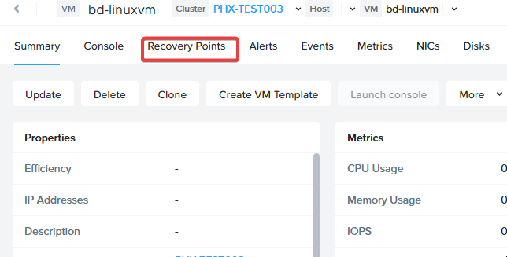

5.  คุณจะเห็นรายละเอียดของจุดกู้คืนที่เราเพิ่งสร้างขึ้น

    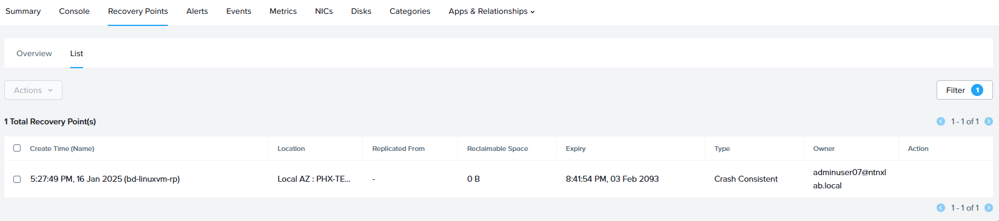

ทีนี้มาลองทำความเข้าใจให้มากขึ้น

6.  ในหน้า **Summary** ของ VM ให้คลิก **Update** จากนั้นคลิก **General Configuration**

    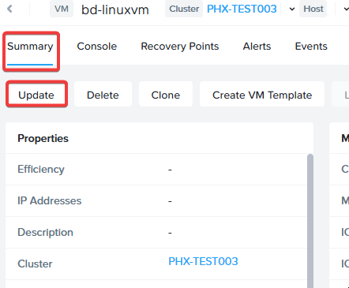

7.  ในหน้า Update VM คุณสามารถอัปเดตคุณสมบัติใดๆ ก็ได้ หรือจะปล่อยไว้เหมือนเดิมก็ได้ และในส่วนของ **Discs** ให้คลิกที่ลิงก์ **Disks Page** แล้วทำการลบดิสก์โดยเลือก **Actions** และ **Delete** จากนั้นกด **Ok**

    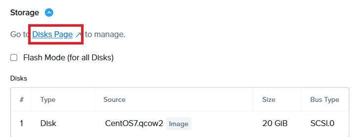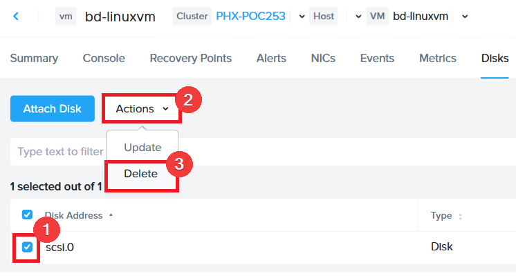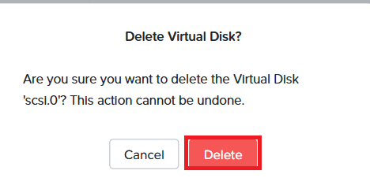

8.  ในหน้า VM ให้ทำการเปิดเครื่อง (Power On) VM และเมื่อเปิดขึ้นมาแล้ว ให้คลิก **Launch Console** ไปที่ VM นั้น ซึ่ง VM จะไม่สามารถบูตขึ้นมาได้เนื่องจากเราเพิ่งลบดิสก์ของมันทิ้งไป

    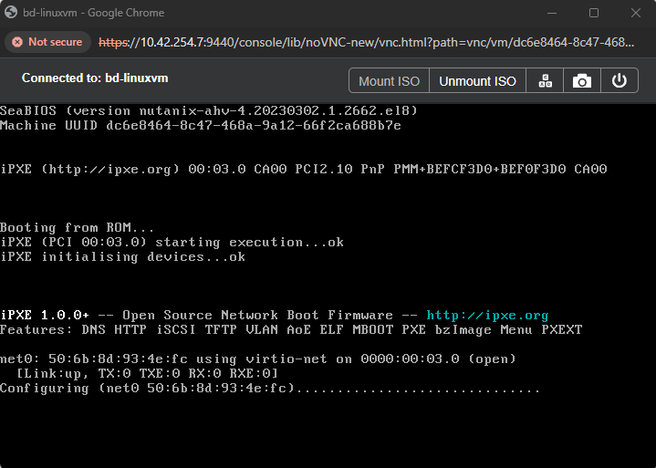

9.  ปิดเครื่อง VM แล้วคลิกที่ **Recovery Points** ทำเครื่องหมายในช่องสี่เหลี่ยมถัดจาก Recovery Point ที่เราสร้างไว้ คลิก **Actions** แล้วคลิก **Clone**

    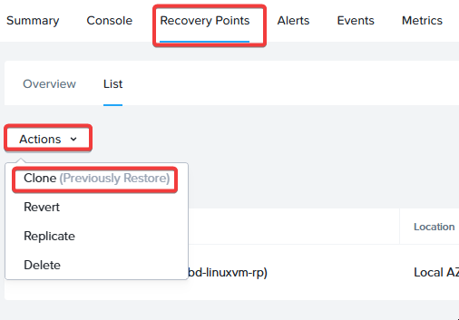

10. ขั้นตอนนี้คือการกู้คืน VM กลับไปยังจุดกู้คืน ในหน้าต่างที่ปรากฏขึ้น คุณสามารถตั้งชื่อใหม่ให้กับ VM หรือจะใช้ชื่อที่แนะนำพร้อมเวลา (timestamp) ก็ได้ จากนั้นคลิก **Clone**

    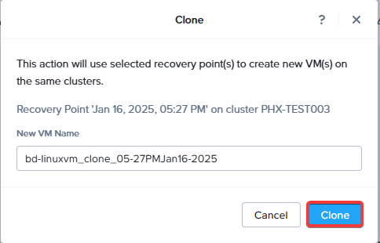

11. กลับไปที่หน้ารายการ VMs แล้วคุณจะเห็น VM ที่ถูกสร้างขึ้นมาพร้อมกับการกำหนดค่า (configuration) เดียวกับที่เราเคยมี เปิดเครื่อง VM (Power ON) และเปิดหน้าต่างคอนโซลของ VM คุณจะเห็นว่า VM สามารถบูตขึ้นมาได้ตามปกติ

    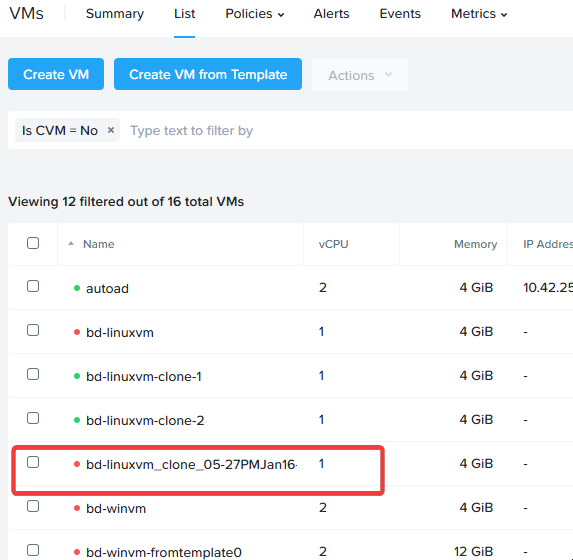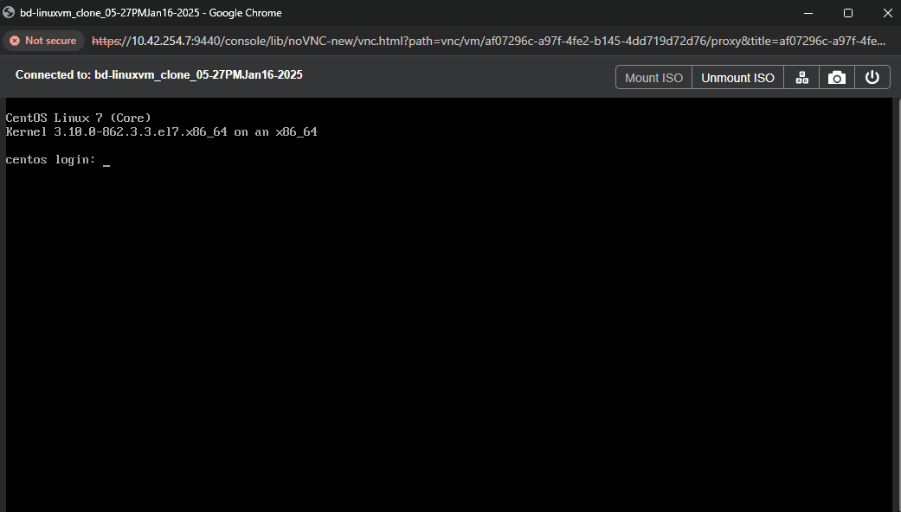

อย่างที่ได้กล่าวไปก่อนหน้านี้ สแนปช็อตของ Nutanix AOS ใช้แนวทางการทำงานแบบ [redirect-on-writeopen in new window](https://www.nutanixbible.com/4c-book-of-aos-storage.html#snapshots-and-clones) ซึ่งไม่ได้รับผลกระทบจากปัญหาประสิทธิภาพลดลงแบบที่เกิดในสแนปช็อตแบบลูกโซ่ (chained snapshots) แถมยังประหยัดพื้นที่จัดเก็บข้อมูลได้ดีมากอีกด้วย

### Protection Policies

Protection policies คือนโยบายที่สามารถกำหนดค่าได้ ซึ่งให้วิธีการในการปกป้องเอนทิตี (entities) ของคุณแบบอัตโนมัติ โดยการสร้างจุดกู้คืนตามกำหนดเวลา นโยบายเหล่านี้สามารถตั้งค่าให้สร้างขึ้นภายในระบบคลาวด์ของคุณ (locally) และยังสามารถทำสำเนา (replicating) ไปยังคลัสเตอร์อื่นเพื่อการกู้คืนจากความเสียหาย (Disaster Recovery หรือ DR) ได้ เนื่องจากเรามีเพียง 1 คลัสเตอร์ เราจะทำการสร้างจุดกู้คืนแบบโลคัล (local recovery points) แต่ขั้นตอนการทำงานจะเหมือนกันเลยหากคุณกำลังตั้งค่าสำหรับ DR ไปยังตำแหน่งกู้คืนอื่นๆ

1.  เราจะสร้าง Category และ Value แบบกำหนดเองอีกอันหนึ่งเพื่อใช้กับ Protection Policy ที่เรากำลังจะสร้าง จากเมนูแถบด้านข้าง เลือก **Administration** และในส่วนนั้นให้คลิกที่ **Categories** จากนั้นคลิกที่ลิงก์ **Admin Center**

    

2.  มาลงมือสร้าง Category แบบกำหนดเองเพื่อใช้สำหรับนโยบายนี้กันเลย คลิก **New Category**

    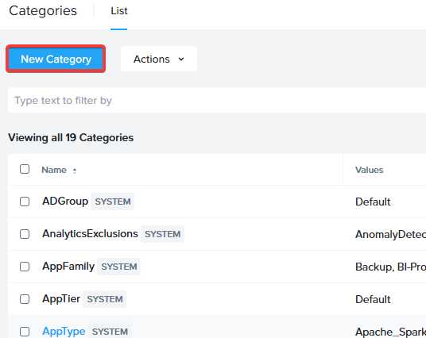

3.  กรอกรายละเอียดต่อไปนี้ แล้วคลิก **Save**

      - **Name** - `Initial`-protect
      - **Values** - local

    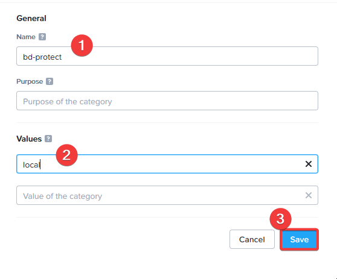

4.  มาสร้าง Protection Policy จากเมนูหลัก (app switcher) เลือก **Infrastructure** จากนั้นในเมนู ให้เลือก **Data Protection** และคลิก **Protection Policies**

    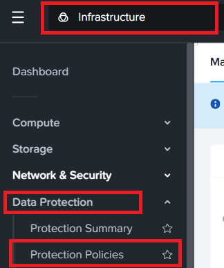

5.  คลิก **Create Protection Policies**

    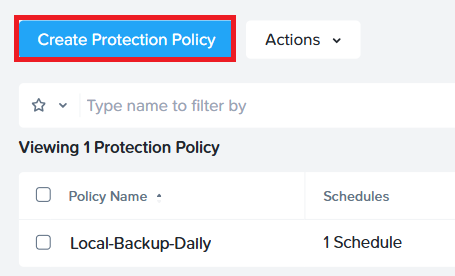

6.  กรอกรายละเอียดดังต่อไปนี้:

      - **Policy Name** - `Initial`-pp-hourly
      - **Primary Location**
          - **Location** - Local AZ (แต่ละอินสแตนซ์ของ Prism Central จะถือว่าเป็น Availability zone หรือ AZ ของตัวเอง)
          - **Cluster** - คลัสเตอร์ของคุณ (Your Cluster)
      - คลิก **Save**

    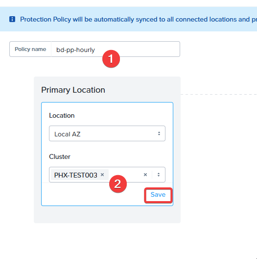

7.  หากเรามีคลัสเตอร์อื่น เราจะระบุข้อมูลนั้นลงในหมวดตำแหน่งสำหรับการกู้คืน (Recovery Location) โดยตำแหน่งดังกล่าวสามารถเป็น Local AZ หรือ Remote AZ ก็ได้ ขึ้นอยู่กับว่าคุณใช้ Prism Central ตัวเดียวกันในการจัดการคลัสเตอร์กู้คืน หรือใช้ Prism Central แบบแยกส่วน คลิก **Cancel**

    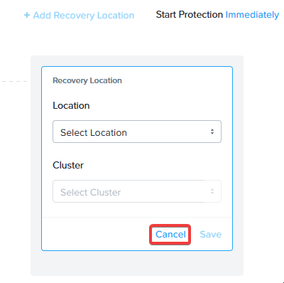

8.  มาเพิ่มกำหนดการสำหรับ Local Recovery Point กัน ภายใต้หมวด Primary ให้คลิก **Add Local Schedule**

    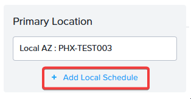

9.  เพิ่มรายละเอียดต่อไปนี้สำหรับกำหนดการ แล้วคลิก **Save Schedule**

      - **Hours** : 1
      - **Retention Type** : Linear
      - **Retention on Local AZ** : 24

    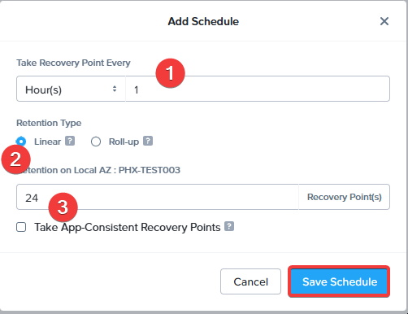

    การตั้งค่าด้านบนหมายความว่านโยบายนี้จะทำการสร้างจุดกู้คืนภายในเครื่องสำหรับเอนทิตีต่างๆ ทุกๆ ชั่วโมง และจะเก็บไว้ 24 รายการบนคลัสเตอร์โลคัล โดยจะลบรายการที่เก่าที่สุดทิ้งเมื่อมีจุดกู้คืนเกิน 24 รายการ นอกจากนี้ คุณสามารถเลื่อนเมาส์ไปที่เครื่องหมาย ? ถัดจาก Linear และ Roll up เพื่อทำความเข้าใจถึงความแตกต่างของประเภทการจัดเก็บ (retention types) ได้

    > **หมายเหตุ**

    > จุดกู้คืนที่สร้างด้วยตนเอง (manual recovery points) จะไม่ถูกนับรวมในจำนวนจุดกู้คืนที่ต้องเก็บไว้หรือลบออกตามที่ระบุใน Protection Policy ส่วนจุดกู้คืนแบบทำเองหรือสร้างโดยโซลูชันสำรองข้อมูล (backup) ของ 3RD party จะปฏิบัติตามนโยบายการจัดเก็บและลบของ solution ที่เลือก

10. คลิก **Next** ที่มุมขวาล่าง

![](data:image/png;base64,iVBORw0KGgoAAAANSUhEUgAAAQgAAADQCAYAAAD77P8JAAAABGdBTUEAALGPC/xhBQAAAAlwSFlzAAAOwwAADsMBx2+oZAAACkdJREFUeF7t3f9rVfcdx/H+C/utP+yHLowGhQV/yVKwcEtAJexC3RTBuYw2lFaxYBxD/MUpwiJIw1D3y0yHrWUbgSJTsAaJJk33pXZdSLFOMQSaEBaXS81uqPMmucl7n8+955qbc++rnnsS9OT6fMAHPffkXv0c8nnmnJPofc4AQCAQACQCAUAiEAAkAgFAIhAAJAIBQCIQACQCAUAiEAAkAgFAIhAAJAIBQCIQACQCAUAiEAAkAgFAIhAAJAIBQCIQACQCAUAiEAAkAgFAIhAAJAIBQCIQACQCAUAiEAAkAgFAIhAAJAIBQCIQACQCAUAiEAAkAgFAIhAAJAIBQCIQACQCAUAiEAAkAgFAIhAAJAIBQCIQACQCAUAiEAAkAgFAIhAAJAIBQCIQACQCAUAiEAAkAgFAIhAAJAIBQCIQACQCAUAiEAAkAgFAIhAAJAIBQCIQACQCAUAiEAAkAgFAIhAAJAIBQCIQACQCAUAiEAAkAgFAIhAAJAIBQCIQACQCAUAiEAAkAgFAIhAAJAIBQCIQACQCAUAiEAAkAgFAIhAAJAIBQCIQACQCAUAiEAAkAgFAIhAAJAIBQCIQACQCAUAiEAAkAgFAIhAAJAIBQCIQACQCAUAiEAAkAgFAIhAAJAIBQCIQACQCAUAiEAAkAgFAIhAAJAIBQCIQACQCAUAiEAAkAgFAIhAAJAIBQCIQACQCAUAiEAAkAgFAIhAAJAIBQCIQACQCAUAiEAAkAgFAIhAAJAIBQCIQACQCAUAiEAAkAgFAIhAAJAIBQCIQACQCAUAiEAAkAgFAIhAAJAIBQCIQACQCAUAiEAAkAgFAIhAAJAIBQHpu9pv/GYPBYFQbnEEAkAgEAIlAAJAIBACJQACQCAQAiUAAkAgEAIlAAJAIBACJQACQCAQAiUAAkAgEAIlAAJAIBACJQACQCAQAiUAAkAgEnklLX39tudOn7cFbb9nsyy/X3Xjw+uv2sKvL8l9+Gcw4HgKxDmRnv7Hhm6N29ePPrW/gM0Yw/PHwx8Ufn1rMf/SR/XfrtqoLqx5H7oMPgpnXjkAknP/k9wthfPI/trCQDx6F54+HPy7++ESNxOLUlM288krVhVTPIz88HByB2hCIhPNfIf0igOaPjz9OUWSPHau6gOp93H/tteAI1IZAJJz/6siZw7fzx8cfpyjuvfrqioXzm2277Qc/PmTf2fmruhkv/uSwvfmjN1fMcyaVCo5AbQhEwvlrbTxe1ONUvmj8ePGXH9oLPfes4Q8P62a88PuMfffEjYq5xkEgEo5ARBM3EN97b6bqIquHEZ5rHAQi4QhENHEDUW1h1csIzzUOApFwBCIaAlE5wnONg0AkHIGIhkBUjvBc4yAQCUcgoiEQlSM81zgIRMIRiGgIROUIzzUOApFwaxqIfM5GP+23vit+DNmtTC7Y8TTNur/TmGWDrbiebCBy1nkzb71fzFXuG1yw3n/NWyr8+FMY4bnGQSASbq0CkR05YzuamqyhabOlWtssldpsDY3NtvXEjVUvzlUZf9/SjbusZzLYjunJBiJvxZ/bXLKBv6/c13VvqfB4b9lj8cac9Uwt2sV/VtsXbYTnGgeBSLg1CcSYW4Qbm6zlwAWbKDtpyH5+xtJN+603EzzwNJQCMR5sx/R0AuHkFq3r0vK+tQtE8c8YHau2L9oIzzUOApFwqw9EzvoOuDOHLWfs1mN+Ynv66ju2J73ZNjQ22aZUux29ulyO4VPbbV/vkPW+vd02udhsajtovWPBTi83aX3H2q2luXiWsuNYv02X/rx8Znlfc+vKfes4ENnZpcLZV/bewqNLiopAXJq3izNLlis+bNmZvB0NgtI57p7vtjuCj00NL9r03KL1XMvbrTn38Z47Ttn7edtTer0aRniucRCIhFt9IIbssFvQW39XvpqryFy2fbu6rO9uxqYzGbt17g3b1PjGo7OLgUNucTe2WeeVMbd/zHoPtBajU9ibsd6fu/073rEB//zJG9bzdrt1jyzv82cvo9mc5bLF57YcGXLpctZzIFwYOtwi90bHivcjVgZi3gYeunbO5q17cM7SgwvWN+u2XRT8gvdB8IGZnpx3IVmw4QW3L+uDMWfdoy4Wfl9G3OuIMMJzjYNAJNxaBKLTnRGk3414kf9gthCIaR8M97zO68WHC4H4RX9xwxs7a1tLC/vmGUs1ttv5qeKuFQr7DtrFB8G2l71gHaX4rPNA+HsFvX6V510UBkOBuLnoIrhkfdfKnjuYdwt/yQb+VtzuGHNnF257wh8fd/awfLnCJQYiWH0gblt3a5Olum8H20L2hnWlm23DS23Fm5itxUuNFYE4NFTc8MoX9vXD1pA+W/iEruD3bdxsLYXXLH/t7fbbu27/ug+E23aXBKP+kunhop0vD4Rb/F7OnxmUDb9/eKT0WnPWF8Tz1u1c8JgfBAIRrD4Q7hPvVJtbpO6reJVvV+TuzxZO9Sfe3WUNP/1T4bS2qHjmESkQHx91lx+hs4QSv2/jYRtQ9z/qIRBulC4XcoV5BoEYDWJRdhMzPFY8zwXm8KN9BAIRrEUg7MGIdbW5Bb55v/V8OmlZVwR/L6DvyHa3eN2lgbv6mDi3MhBZ95W/JWog8iN2dHOTtRzqN3cJ7bZnbfiP79uAv+QI9qW7Rx59OzU33m/d50bq4h7E8mO54PLCCwJxaaFwYzibWXh0IzL9j7wNTy0Ubzq6yw1/5uFfJ1X++8LHuue6l5sYj3f/wY/wXOMgEAm3JoHwCt9l2FX4DkSDW/h+bNhy0HpGZov7V1xitNrWvfst7S4Njgb/D8vAEXeZcqrsMiVzwTo2uoVdurUxddk6tzSXvfZh6yvdkyjt8z+D8ZL7tXmXdf45uGk66QLhzm5Kp9lxPdlAFBf+9MR86HF3ueD/57v8ovUEj6U+cwvfX1a4xV44S1hastHxYgSOTvkHl+87lO5H9A0VX6t3xv+Ni885H7xeLSM81zgIRMKtWSBK8jn3FS1j0/40oorc/YxlV7FYc1n32vfFa3/LvtV6soGofaQH563zk7nQT1jmLBW6/EhdKr8PkbM9n8xbx5WVHxN1hOcaB4FIuDUPRJ1KeiCexgjPNQ4CkXAEIhoCUTnCc42DQCQcgYiGQFSO8FzjIBAJRyCiIRCVIzzXOAhEwhGIaAhE5QjPNQ4CkXAEIpq4gdhwPlt1cdXDCM81DgKRcLxxzuPV8sY5mdDb7v3s1wNVF9d6Hz/s+feKefoRB4FION567/Fqeeu9L3burFg4z8L4atu24AjUhkAkHG/eq/nj4Y+LPz5R37x38MSJqguo3sdf9u0LjkBtCMQ64D/5/VdIvxD8tTajOPzx8Mclahy8O3fu2F937666iOp13E2nbai/7J/q14BA4Jlz+fJl+3DvXpvcsqXqgqqX4e+3XG9vt/fOnnVnW4V/Z14zAoFn0sjIiJ0+fdqOHz9et+PkyZN27dq12HHwCAQAiUAAkAgEAIlAAJAIBACJQACQCAQAiUAAqOr5579v/wfhj8wQJcfMlAAAAABJRU5ErkJggg==)

11. ในขั้นตอนนี้ เราจะทำการกำหนด Category ที่เราสร้างไว้ข้างต้นให้กับนโยบายนี้ ค้นหา Category ที่คุณสร้างไว้ ทำเครื่องหมายในช่องสี่เหลี่ยมถัดจากมัน คลิก **Add** แล้วคลิก **Create** ที่มุมขวาล่าง

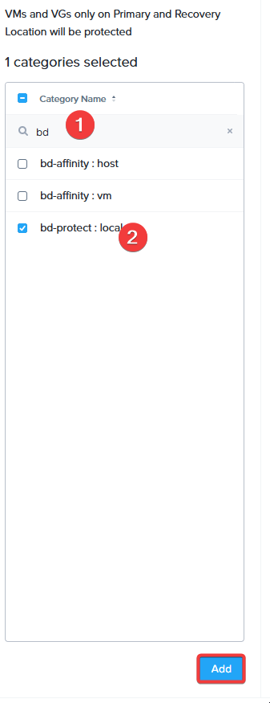

12. บางท่านอาจสงสัยว่า เราได้กำหนด Category ให้กับนโยบายแล้ว แต่เรายังไม่ได้กำหนดเอนทิตีใดๆ ให้กับ Category เลย ดังนั้นเรามาทำขั้นตอนนี้กัน จากเมนูแถบด้านข้าง ให้คลิกและไปที่ **VMs**

13. เราจะกำหนด Category ให้กับ Windows VM 2 เครื่องที่เราใช้งานจากเทมเพลต ทำเครื่องหมายในช่องสี่เหลี่ยมถัดจาก VM เหล่านั้น คลิก **Actions** เลื่อนเมาส์ไปที่ **Other Actions** แล้วคลิก **Manage Categories**

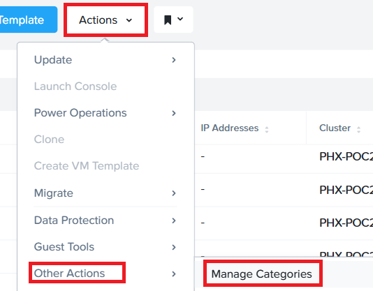

14. VM เหล่านี้จะมี Category เริ่มต้นสำหรับสตอเรจ (storage default category) ใช้งานอยู่แล้ว เนื่องจากพวกมันเป็นส่วนหนึ่งของเทมเพลต ให้ค้นหา Protection Category ที่เราสร้างไว้ข้างต้น คลิกเครื่องหมาย "+" เพื่อเพิ่มเข้าไป จากนั้นคลิก **Save**

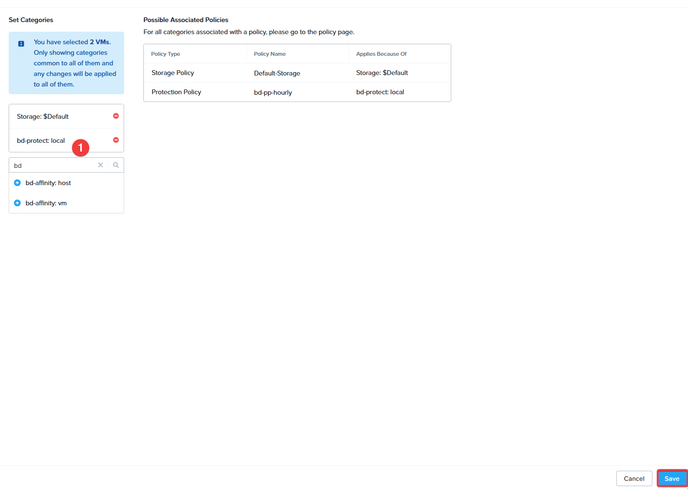

> **หมายเหตุ**
> 
> อีกวิธีหนึ่งในการกำหนดนโยบายให้กับ VM แต่ละเครื่องด้วยตนเองคือ การคลิกขวาที่ VM แล้วเลือก **Protect** จากตัวเลือกต่างๆ ซึ่งจะช่วยให้คุณสามารถเลือก Protection Policy ที่จะประยุกต์ใช้กับ VM แต่ละเครื่องได้ อย่างไรก็ตาม การทำผ่าน Categories เป็นวิธีที่ดีกว่า ซึ่งสามารถนำไปตั้งค่าแบบอัตโนมัติโดยใช้ **Self-Service** ได้

15. เมื่อ VM ถูกกำหนดไปยัง Category ที่ผูกกับ Protection Policy แล้ว VM จะเริ่มทำการสร้างจุดกู้คืนตามกำหนดการ ซึ่งในกรณีของเราคือเริ่มทันที ดังนั้น ให้คลิกที่ชื่อ VM ใดชื่อหนึ่ง แล้วคลิก **Recovery Points** คุณก็จะเห็นรายละเอียดของจุดกู้คืนที่ถูกสร้างขึ้น

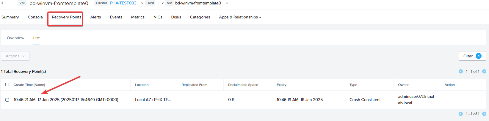

เพียงเท่านี้ก็เรียบร้อย\! คุณได้กำหนดค่าการป้องกันข้อมูลแบบอัตโนมัติสำหรับเอนทิตีของคุณสำเร็จแล้ว และถ้าหากคุณมี remote cluster คุณก็สามารถตั้งค่าการกู้คืนจากความเสียหาย (Disaster Recovery) ในลักษณะเดียวกันได้ การทำงานทั้งหมดนี้ใช้ความสามารถพื้นฐานของสแนปช็อตที่มีอยู่แล้วใน AOS และ Prismwww Central โดยไม่จำเป็นต้องติดตั้งซอฟต์แวร์เพิ่มเติมเพื่อทำการเก็บสแนปช็อตหรือจัดการระบบอัตโนมัติ ทุกอย่างมีให้พร้อมอยู่ในแพลตฟอร์มเพื่อช่วยให้งานของผู้ดูแลระบบง่ายและไร้รอยต่อ

## Takeaways

  - Nutanix นำเสนอโซลูชันการป้องกันข้อมูลสำหรับเวอร์ชวลดาต้าเซ็นเตอร์ผ่านกลยุทธ์ที่หลากหลาย รวมถึงการทำสำเนา (replication) แบบหนึ่งต่อหนึ่ง (one-to-one) หรือแบบหนึ่งต่อหลายจุด (one-to-many)
  - Nutanix มีฟังก์ชันการป้องกันข้อมูลในระดับ VM, ไฟล์ และกลุ่มวอลุ่ม (volume group) เพื่อให้มั่นใจได้ว่า VM และข้อมูลต่างๆ จะปลอดภัย
  - นโยบายการทำสแนปช็อตและทำสำเนาระดับ VM สามารถจัดการได้ผ่าน Prism Central สำหรับไฮเปอร์ไวเซอร์ (hypervisor) ทุกตัวที่รองรับ