# Planned Failover

มี failovers อยู่ 3 ประเภท: Test, Planned, และ Unplanned

-   _Test failovers_ มีไว้สำหรับทดสอบ recovery plan โดย VMs จะถูกเริ่มต้นใน test network ตามที่ระบุไว้ใน recovery plan ซึ่ง VMs ที่ primary location จะไม่ได้รับผลกระทบ
-   _Planned failovers (PFO)_ คือเมื่อมีการคาดการณ์ว่าจะเกิดการหยุดชะงักของบริการที่ primary site ตัว recovery plan จะสร้าง snapshot ของแต่ละ VM ก่อน จากนั้นทำการ replicate แล้วจึงเริ่มต้น VMs ที่ recovery location การ Replication จะเริ่มในทิศทางตรงกันข้าม (จาก _Recovery_ site ไปยัง _Primary_ site) VMs เหล่านั้นจะไม่ทำงานที่ primary site อีกต่อไปหลังจากที่เกิด planned failover
-   _Unplanned failovers (UPFO)_ เกิดขึ้นเมื่อมีภัยพิบัติเกิดขึ้นที่ primary location แล้ว VMs จะถูกกู้คืนจาก snapshot ล่าสุดและเริ่มต้นที่ _Recovery_ site

ในแบบฝึกหัดนี้ คุณจะได้ทำการ _Planned_ failover สำหรับ application ของคุณ

!!! note
    หากคุณทำแบบฝึกหัด [Unplanned Failover with Nutanix Disaster Recovery](dr-unplanned-failover.md) เสร็จแล้ว คุณสามารถข้ามไปที่ [Performing A Planned Failover](dr-planned-failover.md)

## Instructor Lead

!!! note
    ขั้นตอนต่อไปนี้ควรดำเนินการโดย instructor หรือผู้ใช้ที่ได้รับมอบหมาย เนื่องจากการเปิดใช้งาน Disaster Recovery และการกำหนดค่า Availability Zone เป็นการดำเนินการเพียงครั้งเดียวต่อ Prism Central instance

### Enable Disaster Recovery

1.  ภายใน _Primary_ site Prism Central ของคุณ ให้นำทางไปที่ **\> Prism Central Settings**
    
2.  ภายในส่วน _Setup_ ให้คลิก **Enable Disaster Recovery > Enable > Enable**
    
3.  ภายใน _Recovery_ site Prism Central ให้นำทางไปที่ **\> Prism Central Settings**
    
4.  ภายในส่วน _Setup_ ให้คลิก **Enable Disaster Recovery > Enable > Enable**
    

### Creating a New Availability Zone

1.  ภายใน _Primary_ site Prism Central ให้นำทางไปที่ **\> Administration > Availability Zones** และสังเกตว่า Local AZ ได้ถูกสร้างไว้โดย default แล้ว
    
2.  คลิก **Connect to Availability Zone**
    
    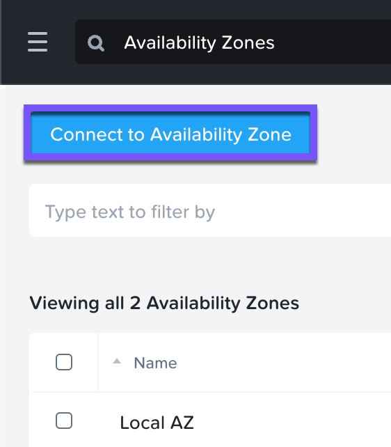
    
3.  ใน drop-down _Availability Zone Type_ ให้เลือก **Physical Location** ป้อน IP, username, และ password สำหรับ _Recovery_ site PC จากนั้นคลิก **Connect**
    
    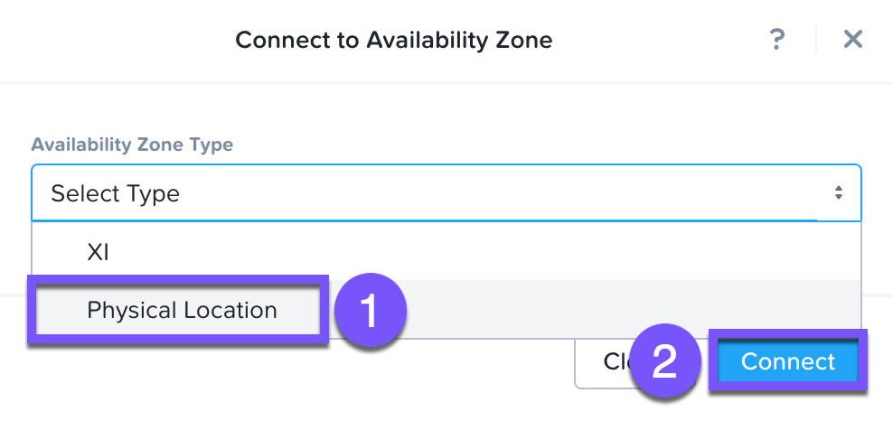
    
    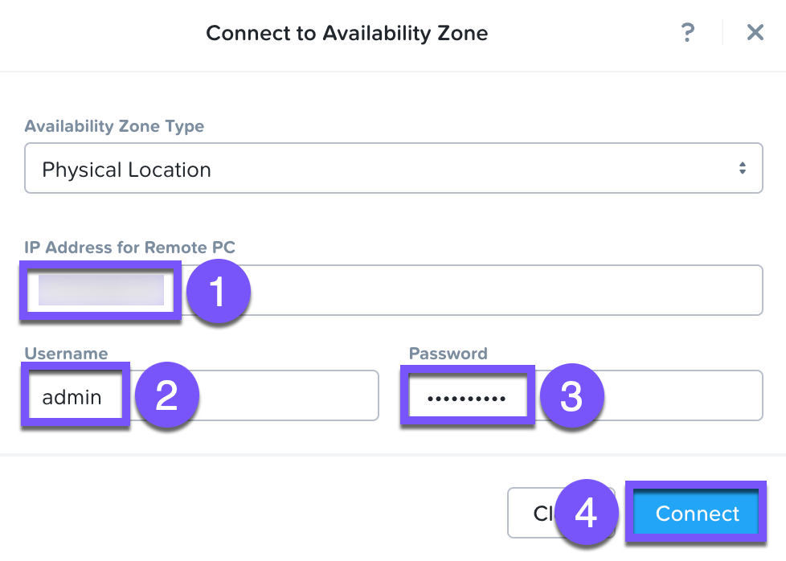
    
4.  สังเกตว่า cluster ของ _Recovery_ site จะแสดงเป็น _Physical_ แล้ว และ _Connectivity Status_ จะแสดงเป็น _Reachable_
    

## Staging Guest Script

Disaster Recovery อนุญาตให้คุณรัน scripts ภายใน guest เพื่ออัปเดตไฟล์ configuration หรือทำ functions ที่สำคัญอื่นๆ เป็นส่วนหนึ่งของ runbook ในแบบฝึกหัดนี้ คุณจะใช้ script บน WebServer VM ของคุณที่จะอัปเดตข้อมูล IP ที่กำหนดค่าไว้สำหรับการเชื่อมต่อ MySQL VM โดยอัตโนมัติ ทำให้ WebServer สามารถเชื่อมต่อกับ MySQL database ได้หลังจากที่ทำการ failover หรือ failback

!!! note
    script ด้านล่างนี้ได้ถูก deploy ไปแล้ว เนื่องจาก Calm อนุญาตให้แทรกขั้นตอนต่างๆ ได้ง่าย (เช่น script นี้) ที่จุดใดก็ได้ระหว่างการ deploy blueprint

    ขั้นตอนต่อไปนี้รวมไว้เพื่อเป็นภาพประกอบเท่านั้น

    1.  SSH เข้าไปที่ `User##`**\-WebServer** VM ของคุณโดยใช้ credentials ต่อไปนี้:
        
        -   **User Name** - `centos`
        -   **Password** - `nutanix/4u`
    2.  ภายใน SSH session ให้รันคำสั่งต่อไปนี้ คลิกไอคอนที่มุมขวาบนของหน้าต่างด้านล่างเพื่อ copy คำสั่งไปยัง clipboard ของคุณ คุณสามารถ paste ใน SSH session ของคุณได้
        
        ```
        sudo wget -O /usr/local/sbin/production_vm_recovery [https://raw.githubusercontent.com/nutanixworkshops/hol_files/master/scripts/production_vm_recovery](https://raw.githubusercontent.com/nutanixworkshops/hol_files/master/scripts/production_vm_recovery)
        sudo chmod +x /usr/local/sbin/production_vm_recovery
        ```
        
    3.  หากคุณต้องการดูเนื้อหาของ failover script ให้รัน `sudo cat /usr/local/sbin/production_vm_recovery`
        
    4.  คุณสามารถออกจาก SSH session ได้เลยตอนนี้
    

## Installing Nutanix Guest Tools (NGT)

จะต้องติดตั้ง Nutanix Guest Tools (NGT) ภายใน guest VMs ที่กำลังถูกปกป้องก่อน เพื่อใช้งาน functionality ของ guest script

1.  ภายใน _Primary_ site Prism Central ให้นำทางไปที่ **\> Compute & Storage > VMs**
    
2.  เลือกทั้ง `User##`**\-WebServer** และ `User##`**\-MySQL** VMs ของคุณ
    
3.  คลิก **Actions > Install NGT** คุณอาจต้องเลื่อนลงภายในรายการ drop-down
    
    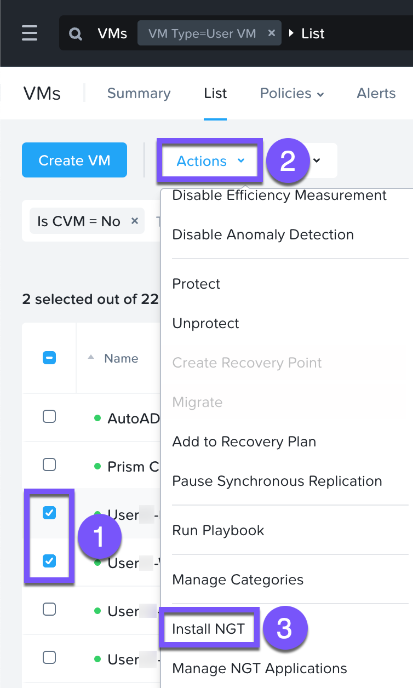
    
4.  เลือก **Restart as soon as the install is completed** จากนั้นคลิก **Confirm & Enter Password**
    
    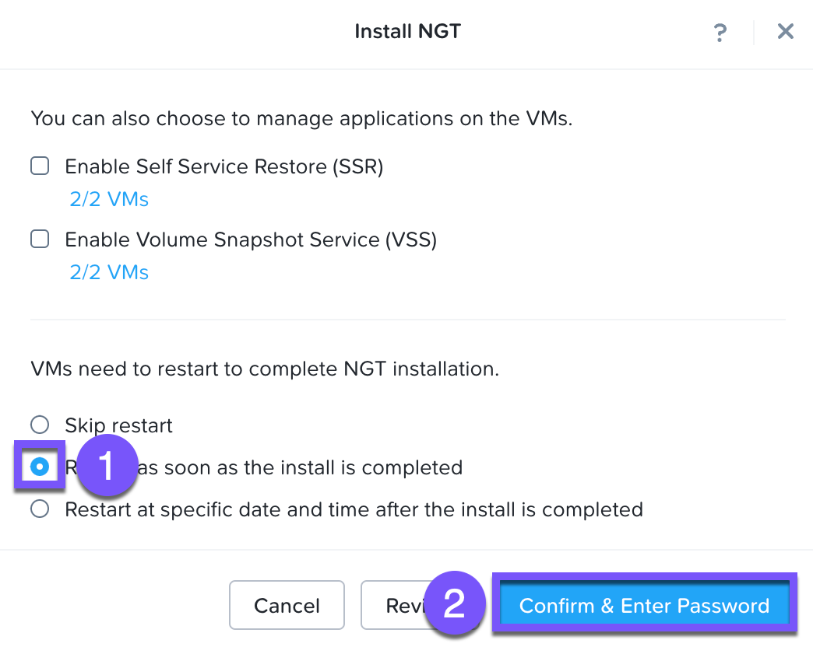
    
5.  ระบุ credentials ต่อไปนี้ แล้วคลิก **Done** เพื่อเริ่มการติดตั้ง NGT:
    
    -   **User Name** - centos
    -   **Password** - nutanix/4u
    
    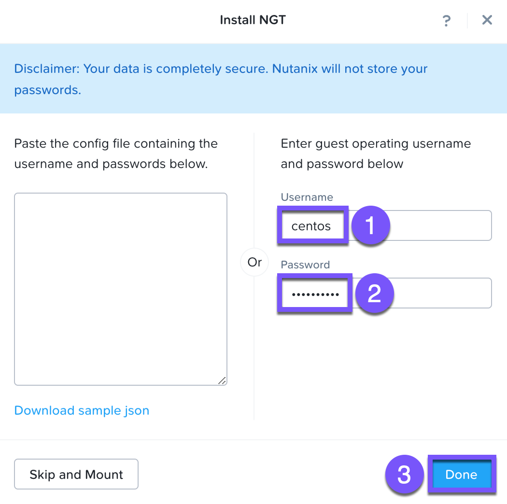
    
6.  เมื่อ VMs ทั้งสอง reboot เสร็จสิ้น ให้ตรวจสอบว่า VMs ทั้งสองมี CD-ROM drives ที่ว่างเปล่า และ _Installed Version_ แสดงเป็น **Latest** ใน Prism Central
    
    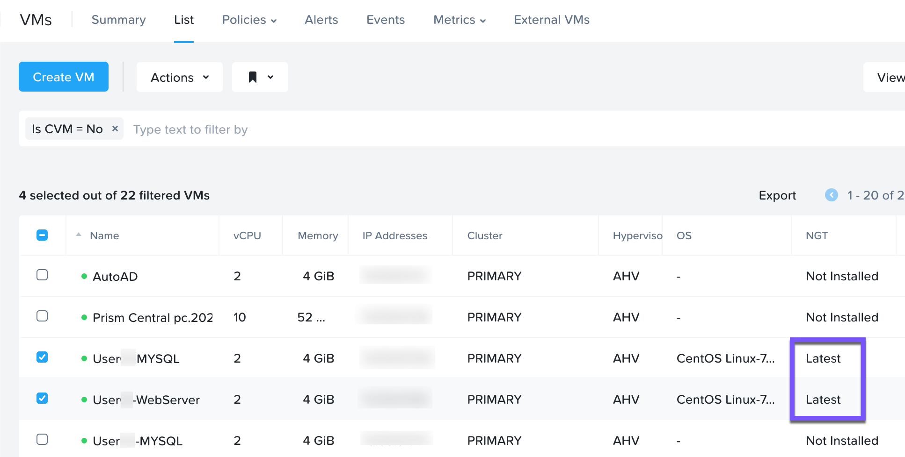
    

## Creating A Protection Policy

protection policy คือที่ที่คุณระบุ Recovery Point Objectives (RPO) และ retention policies ของคุณ

1.  ภายใน _Primary_ site Prism Central ให้นำทางไปที่ **\> Data Protection & Recovery> Protection Policies**
    
2.  คลิก **Create Protection Policy**
    
3.  ภายในฟิลด์ **Policy name** ให้ป้อน `User##`**\-FiestaProtection**
    
4.  กรอกข้อมูลในฟิลด์ต่อไปนี้ภายในส่วน _Primary Location_ จากนั้นคลิก **Save**
    
    -   **Location** - `Local AZ`
    -   **Cluster** - Primary

5.  กรอกข้อมูลในฟิลด์ต่อไปนี้ภายในส่วน _Recovery Location_ จากนั้นคลิก **Save**
    
    -   **Location** - `PC_<RECOVERY-SITE-PC-IP>`
    -   **Cluster** - Recovery

6.  คลิก **\> Add Schedule** เลือก **Synchronous > Save Schedule** จากนั้นคลิก **Next**
    
7.  คลิก **Create**
    
    !!! note    
        แม้ว่าเราจะไม่ได้สาธิตวิธีนี้ แต่ protection policies สามารถนำมาประยุกต์ใช้ได้โดยอัตโนมัติตามการกำหนด category ซึ่งช่วยให้ VMs ได้รับการปกป้องโดยอัตโนมัติตั้งแต่การ provisioning เริ่มต้น
    
    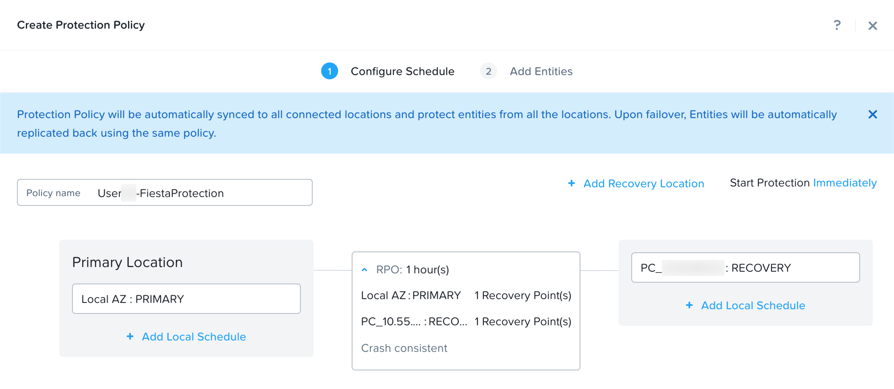
    
8.  ภายใน _Primary_ site Prism Central ให้นำทางไปที่ **\> Compute & Storage > VMs**
    
9.  เลือกทั้ง `User##`**\-WebServer** และ `User##`**\-MySQL** VMs ของคุณ
    
10.  คลิก **Actions > Protect**
    
11.  เลือก protection policy `User##`**\-FiestaProtection** ของคุณ จากนั้นคลิก **Protect**
    
    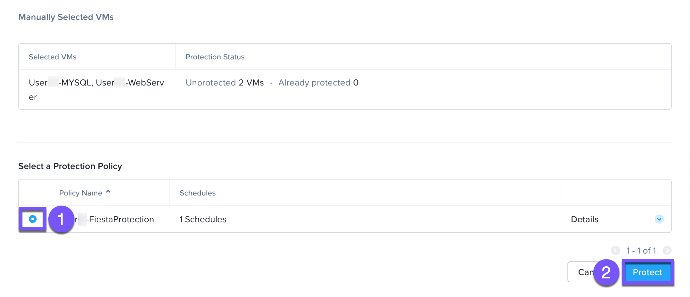
    

## Creating A Recovery Plan

!!! note
    เช่นเดียวกับ Protection Policies คุณสามารถเพิ่ม categories ให้กับ protection policy ใดก็ได้

1.  ภายใน _Primary_ site Prism Central ของคุณ ให้นำทางไปที่ **\> Data Protection & Recovery> Recovery Plans**
    
2.  คลิก **Create New Recovery Plan**
    
3.  กรอกข้อมูลในฟิลด์ต่อไปนี้ภายในส่วน _General_ จากนั้นคลิก **Next**
    
    -   **Recovery Plan Name** - `User##`**\-FiestaRecovery**
    -   **Recovery Plan Name** - (optional)
    -   **Primary Location** - Local AZ
    -   **Recovery Location** - `PC_<RECOVERY-SITE-PC-IP>`
    
    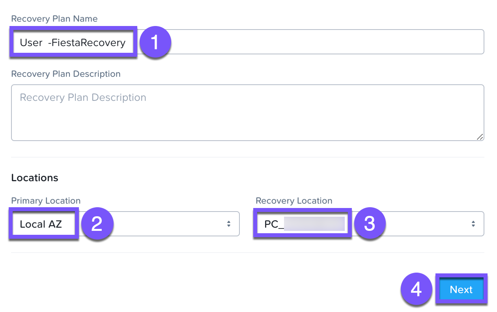
    
    !!! note
        หากคุณไม่เห็น VMs ของคุณ แสดงว่าการ synchronization ระหว่าง sites ยังคงต้องทำให้เสร็จสิ้น ซึ่งมักเกิดจากการพยายามทำขั้นตอนนี้ก่อนที่การ replication จะเสร็จสมบูรณ์ อย่างไรก็ตาม อาจบ่งบอกถึงปัญหา communication ระหว่าง clusters ตรวจสอบ Prism Central สำหรับ errors ใดๆ หากคุณพบปัญหาในการเริ่ม stretch cluster ให้ทบทวนคำแนะนำเรื่อง firewall เบื้องต้นและตรวจสอบให้แน่ใจว่าขั้นตอนเหล่านั้นได้ดำเนินการอย่างถูกต้อง
    
4.  ภายใต้ **Power On Sequence** เราจะเพิ่ม VMs ของเราเป็น stages ใน plan คลิก **Add Entities**
    
5.  เลือก `User##`**\-MySQL** VM ของคุณ จากนั้นคลิก **Add**
    
6.  คลิก **Add New Stage** ภายใน **Stage 2** ให้คลิก **Add Entities**
    
    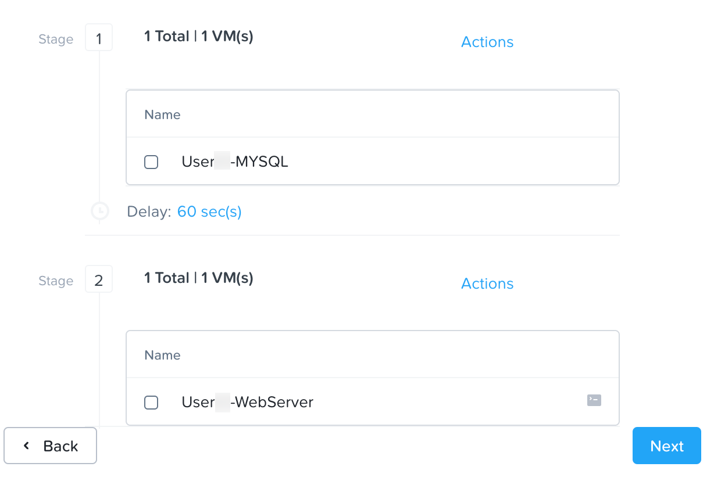
    
7.  เลือก `User##`**\-WebServer** VM ของคุณ จากนั้นคลิก **Add**
    
8.  เลือก `User##`**\-WebServer** VM ของคุณ คลิก **Manage Scripts > Enable** เพื่อทริกเกอร์ _production\_vm\_recovery_ script ภายใน guest VM เมื่อใดก็ตามที่เกิด failover หรือ failback
    
9.  คลิก **Add Delay** ซึ่งแสดงอยู่ระหว่างสอง stages ของคุณ
    
10.  ระบุ **60** วินาที จากนั้นคลิก **Add**
    
11.  คลิก **Next**
    
    ในขั้นตอนต่อไปนี้ คุณจะได้กำหนดค่า network settings ที่ทำให้คุณสามารถ map networks ใน local availability zone (_Primary_ site) ไปยัง networks ที่ recovery location (_Recovery_ site)
    
12.  คลิก **OK. Got it**
    
13.  เลือก **Primary** สำหรับรายการ _Virtual Network or Port Group_ ทั้งหมด
    
    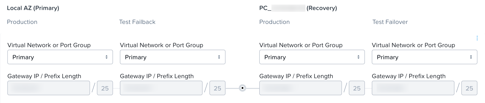
    
14.  คลิก **Done**
    

!!! note
    ตำแหน่งของ Disaster Recovery guest script:

    -   **Windows** (สัมพัทธ์กับ directory ของ Nutanix ใน Program Files)
        
        Production: scripts/production/vm\_recovery.bat
        
        Test: scripts/test/vm\_recovery.bat
        
    -   **Linux**
        
        Production: /usr/local/sbin/production\_vm\_recovery
        
        Test: /usr/local/sbin/test\_vm\_recovery สำหรับ Windows และ Linux guests
    

## Performing A Planned Failover

!!! info
    Failovers จะถูกเริ่มต้นจาก remote site ซึ่งสามารถเป็น on-premises Prism Central อีกแห่งที่ตั้งอยู่ที่ DR site หรือ Xi Cloud Services ของคุณ

ในแบบฝึกหัดนี้ เราจะเชื่อมต่อไปยัง on-premises Prism Central ที่ _Recovery_ site ซึ่งเราได้จับคู่กับ _Primary_ site on-prem cluster ไว้แล้ว

ก่อนทำการ failover เรามาอัปเดต application ของเรากันอย่างรวดเร็ว

1.  เปิด `http://<USER##-WEBSERVER-IP-ADDRESS>` (ตัวอย่างเช่น http://10.42.212.50) ใน browser tab ใหม่
    
2.  ภายใต้ _Stores_ ให้คลิก **Add New Store** และกรอกข้อมูลในฟิลด์ที่จำเป็น ตรวจสอบให้แน่ใจว่า store ใหม่ของคุณปรากฏใน UI
    
    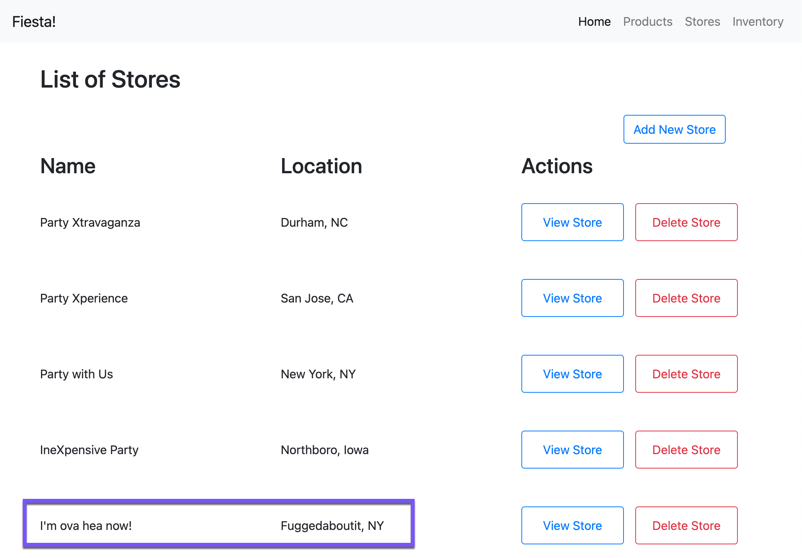
    
3.  Log into Prism Central สำหรับ _Recovery_ site ของคุณ
    
4.  นำทางไปที่ **\> Data Protection & Recovery > Recovery Plans**
    
5.  เลือก `User##`**\-FiestaRecovery** plan ของคุณแล้วคลิก **Actions > Failover**
    
6.  ภายใต้ **Failover Type** ให้เลือก **Planned Failover** (default) จากนั้นคลิก **Failover**
    
    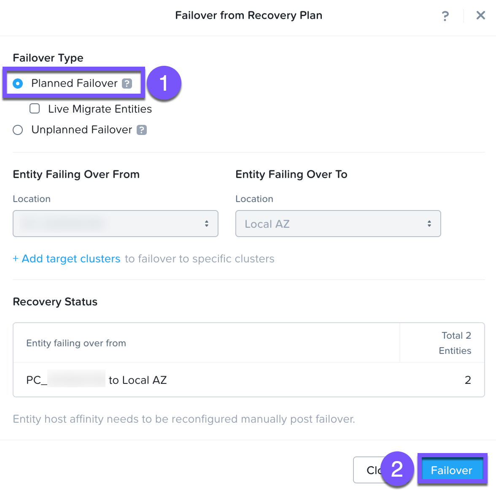
    
7.  พิมพ์ **failover** ใน text field แล้วคลิก **Failover**
    
    !!! note    
        คุณอาจสงสัยว่าทำไมเราไม่เช็คกล่อง _Live Migrate VMS_ ในสภาพแวดล้อม HPOC ของเรา ที่อยู่ CIDR (เช่น /25, /26) จะแตกต่างกันระหว่างทุก cluster ซึ่งป้องกันไม่ให้เราใช้ตัวเลือกนี้ในสภาพแวดล้อม HPOC การ Live migration ต้องการให้ทั้งสอง sites อยู่บน stretched layer-2 network
    
8.  ข้ามคำเตือนใดๆ ใน Recovery AZ (_Recovery_ site) จากนั้นคลิก **Execute Anyway**
    
9.  คลิกที่ `User##`**\-FiestaRecovery** เพื่อ monitor status ของการรัน plan เลือก **Tasks > Failover** เพื่อดูรายละเอียดทั้งหมด
    
    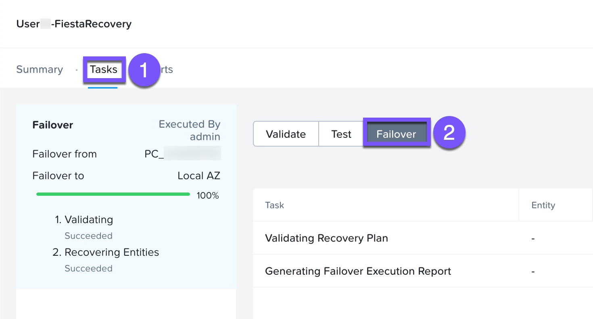
    
    !!! note    
        สมมติว่าคุณมีคำเตือนจากการ validation ก่อนเริ่มต้น failover ในกรณีนั้น เป็นเรื่องปกติที่ขั้นตอน _Validating Recovery Plan_ จะแสดงสถานะเป็น _Failed_
    
10.  เมื่อ Recovery Plan ถึง 100% ให้คลิกที่มุมขวาบน ซึ่งจะใช้เวลาน้อยกว่า 5 นาที
    
11.  เปิด **\> Compute & Storage > VMs** และสังเกต _Recovery_ site IP address ของ `User##`**\-WebServer** ของคุณ
    
12.  เปิด `http://<USER##-WEBSERVER-VM-RECOVERYSITE-IP-ADDRESS>` (ตัวอย่างเช่น http://10.42.212.50) ใน browser tab ใหม่และตรวจสอบว่าการเปลี่ยนแปลงที่คุณได้ทำกับ application ปรากฏอยู่
    

## Performing A Planned Failback

ก่อนทำการ failback เรามาอัปเดต application ของเรากันอีกครั้ง

1.  กลับไปที่ browser tab สำหรับ `http://<USER##-WEBSERVER-VM-RECOVERYSITE-IP-ADDRESS>` (ตัวอย่างเช่น http://10.42.212.50)
    
2.  ภายใต้ **Stores** ให้คลิก **Add New Store** จากนั้นกรอกข้อมูลในฟิลด์ที่จำเป็น ตรวจสอบว่า store ใหม่ของคุณปรากฏใน UI
    
    
    
3.  Log in เข้าสู่ Prism Central สำหรับ _Primary_ site ของคุณ
    
4.  นำทางไปที่ **\> Data Protection & Recovery > Recovery Plans**
    
5.  เลือก `User##`**\-FiestaRecovery** plan ของคุณ จากนั้นคลิก **Actions > Failover**
    
6.  ภายใต้ **Failover Type** ให้เลือก **Planned Failover** (default) จากนั้นคลิก **Failover**
    
    
    
7.  ข้ามคำเตือนใดๆ ใน Recovery AZ (_Primary_ site) จากนั้นคลิก **Execute Anyway**
    
8.  คลิกชื่อ Recovery Plan ของคุณเพื่อ monitor สถานะของการรัน plan เลือก **Tasks > Failover** เพื่อดูรายละเอียดที่ครบถ้วน
    
    
    
    !!! note    
        สมมติว่าคุณมีคำเตือนจากการ validation ก่อนเริ่มต้น failover ในกรณีนั้น เป็นเรื่องปกติที่ขั้นตอน _Validating Recovery Plan_ จะแสดงสถานะเป็น _Failed_ ให้คลิกที่มุมขวาบน
    
9.  เมื่อ Recovery Plan ถึง 100% ซึ่งจะใช้เวลาน้อยกว่า 5 นาที
    
10.  เปิด **\> Compute & Storage > VMs** และสังเกต _Primary_ site IP Address ของ `User##`**\-WebServer** ของคุณ
    
11.  เปิด `http://<USER##-WEBSERVER-VM-PRIMARYSITE-IP-ADDRESS>` ใน browser tab ใหม่ จากนั้นตรวจสอบว่าการเปลี่ยนแปลงที่คุณได้ทำกับ application ของคุณนั้นปรากฏอยู่
    

ยินดีด้วย! คุณได้ทำการ planned failover และ failback ครั้งแรกของคุณสำเร็จแล้วด้วย Nutanix AHV โดยใช้ประโยชน์จากความสามารถของ native Disaster Recovery runbook และ synchronous replication