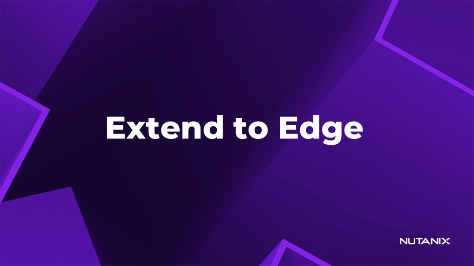
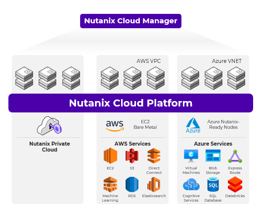
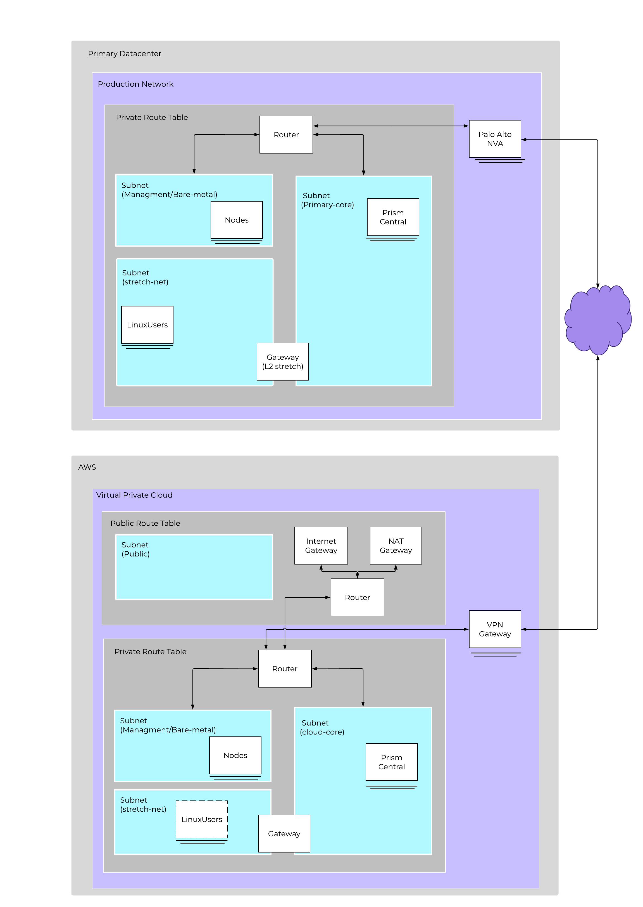

# Extending NCP from Core to Edge and Cloud

Instructor slide

Nutanix ออกแบบซอฟต์แวร์เพื่อให้ลูกค้าที่รัน **workloads** บน **cloud computing providers** อย่าง **Amazon Web Services (AWS)** และ **Azure** ได้รับประสบการณ์เดียวกันกับที่คาดหวังจาก **on-premises Nutanix clusters** เนื่องจาก **Nutanix Cloud Clusters (NC2)** รันบน **Nutanix AOS** และ **AHV** ด้วย **CLI**, **UI**, และ **APIs** ชุดเดียวกัน ทำให้กระบวนการทาง **IT** ที่มีอยู่เดิมและการรวมระบบกับ **third-party** ยังคงทำงานได้ต่อเนื่องไม่ว่าจะรันอยู่ที่ใดก็ตาม 

**Lab** นี้เน้นที่ **NC2 on AWS** โดยที่ **NC2 on AWS** จะวางโครงสร้าง **Nutanix hyperconverged infrastructure (HCI)** stack ทั้งหมดลงบน **Amazon Elastic Compute Cloud (EC2) bare-metal instance** โดยตรง ซึ่ง **bare-metal instance** นี้จะรัน **Controller VM (CVM)** และ **Nutanix AHV** ในฐานะ **hypervisor** เช่นเดียวกับการปรับใช้ **Nutanix** แบบ **on-premises** โดยใช้ **AWS elastic network interface (ENI)** เพื่อเชื่อมต่อกับเครือข่าย ทั้งนี้ **AHV guest VMs** ไม่จำเป็นต้องมีการกำหนดค่าเพิ่มเติมใดๆ เพื่อเข้าถึง **AWS services** หรือ **EC2 instances** อื่นๆ 

หลังจากตรวจสอบการกำหนดค่า **AWS** บน **cluster** ที่เพิ่งถูกติดตั้งใหม่แล้ว เราจะตั้งค่า **layer 2 stretch** หรือ **Subnet Extension** จาก **private datacenter** ของเราไปยัง **AWS cluster** โดย **layer 2 stretch** ช่วยให้เราสามารถคง **VM IP address** และรักษาการเชื่อมต่อระหว่างไซต์ไว้ได้ เพื่อให้เราสามารถ **fail over** เพียง **VM** เดียวไปยัง **AWS** และมั่นใจได้ว่า **applications** ของเราจะทำงานได้โดยไม่กระทบต่อ **application dependencies** หลังจากที่เรา **fail over** แล้ว เราจะตรวจสอบเพื่อให้แน่ใจว่ามีการเชื่อมต่อผ่าน **layer 2 stretch** เรียบร้อยแล้ว 

เมื่อสิ้นสุด **lab** นี้ คุณจะสามารถ: 

- เข้าใจวิธีการตั้งค่าส่วนประกอบของ **AWS** เพื่อเชื่อมต่อ **NC2 cluster** ของคุณเข้ากับ **private data center** 
- สร้าง **layer 2 stretch (Subnet Extension)** จาก **private data center** ไปยัง **AWS** เพื่อการเชื่อมต่อ **application** ที่ราบรื่น 
- สร้าง **DR plan** ของคุณเองเพื่อย้าย **workloads** เข้าสู่ **NC2 on AWS** 

## Lab Agenda

### Setting up AWS After Deployment [15min]

- มุมมองของ **AWS console** โดยมีผู้สอนแนะนำ 

### VPN Connectivity [5min]

- **Routing** ใน **AWS** 
- **VPN Options** 

### Layer 2 Stretch Options and Configuration [30min]

- สร้าง **local** และ **remote gateways** ทั้งแบบ **on-prem** และใน **cloud** 
- ขยาย **subnet** ครอบคลุมทั้งสอง **clusters** 

### DR to AWS 2 While Using Layer 2 Stretch [45min]

- สร้าง **protection policies** และ **recovery plans** เพื่อจำลอง (**replicate**) **VMs** ไปยัง **Cloud** 
- **Failover** ตัว **VM** ไปยัง **Cloud** และทดสอบ **layer 2 stretch** 

[Next: Configure AWS →](edge-lab-scenario1-setupaws.md)
