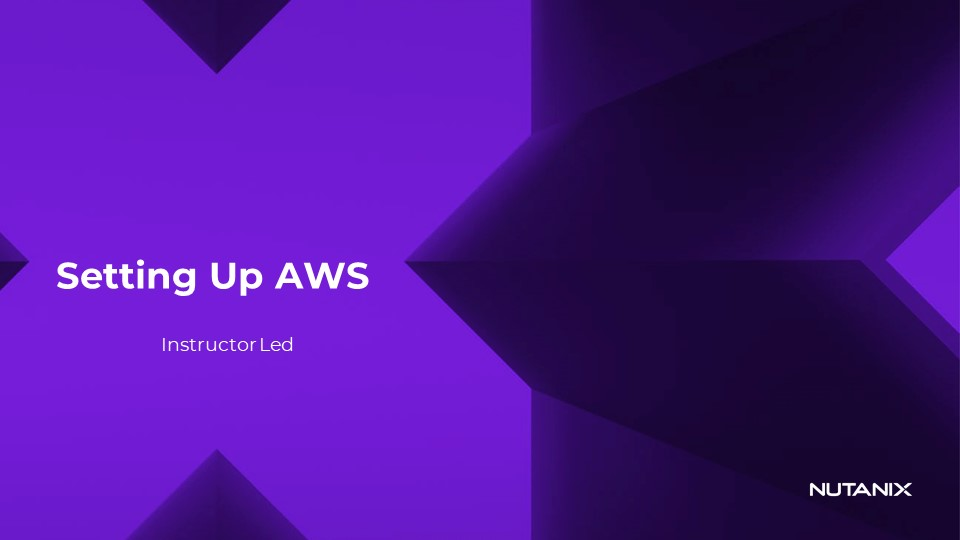

# Setting Up AWS Instructor

## Instructor slide

หากคุณกำลังเข้าร่วมเซสชันที่มีผู้สอน ให้ทำตามผู้สอนโดยคลิกปุ่มด้านล่าง ผู้สอนจะแนะนำขั้นตอนการกำหนดค่า **AWS console** ทั้งหมดเพื่อตั้งค่า **networks** และ **VPNs** 

[Instructor Led](https://nutanix.storylane.io/demo/erscop0bzjgl) 

## Self-guided Option

หากคุณกำลังทำ **lab** ด้วยตนเองโดยไม่มีผู้สอน โปรดดูวิดีโอด้านล่างเพื่อเรียนรู้วิธีตั้งค่า **AWS** สำหรับ **NC2** 

[Self-paced](https://players.brightcove.net/5850956868001/4w8I84SI6_default/index.html?videoId=6346893337112) 

[← Back: Getting Started](edge-getting-started.md) | [Home](edge-getting-started.md) | [Next: VPN Connectivity →](edge-lab-scenario1-vpn.md)
