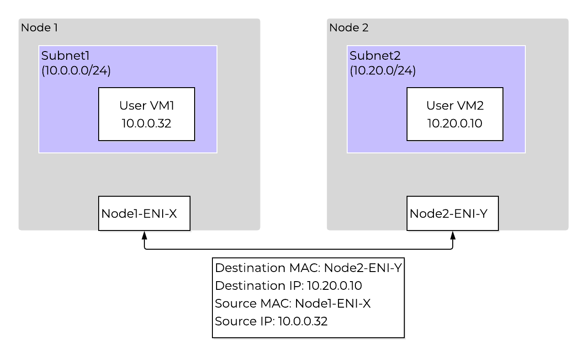
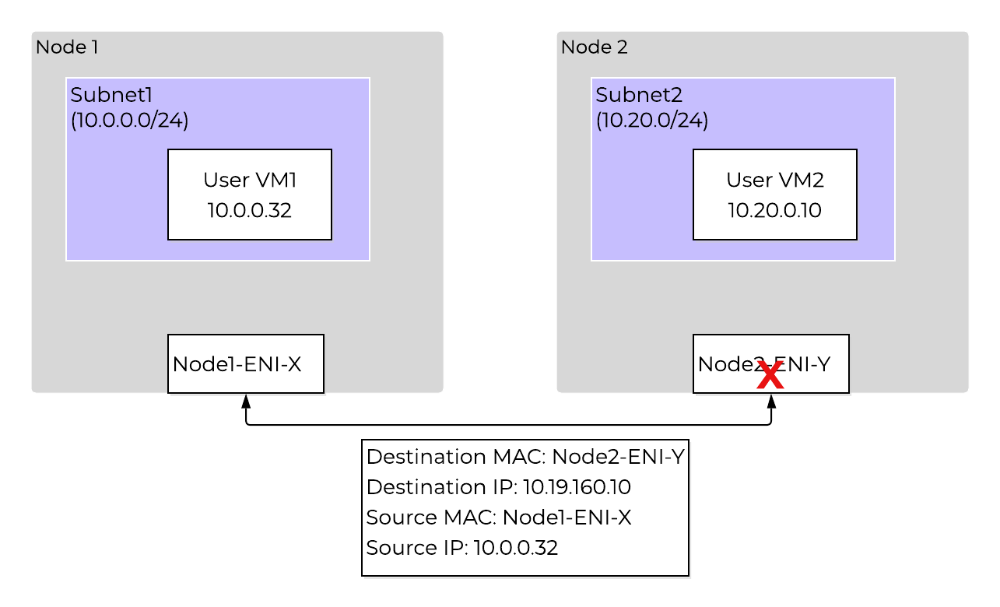
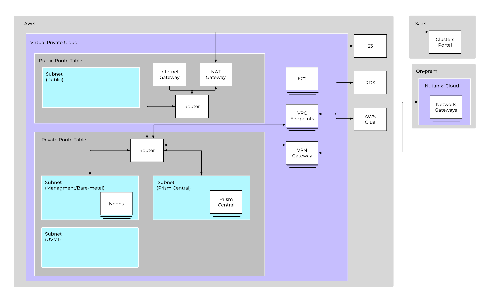
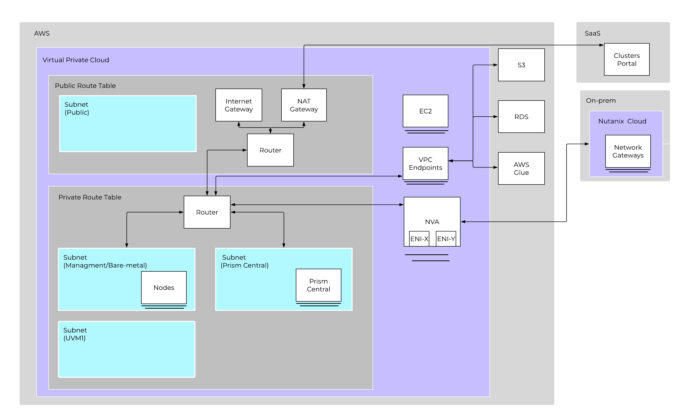

# VPN Connectivity

## Routing in AWS

ใน **AWS**, **route table** สามารถกำหนด **destinations** ไปยัง **elastic network interface (ENI)** ได้เท่านั้น **VPN gateway** ในช่วงต้นของ **lab** ได้แสดงให้เห็นว่าเรากำหนดทิศทางของ **AWS traffic** ไปยัง **private data center** ของเราได้อย่างไร ในปัจจุบัน การสร้าง **user VM** เพื่อทำหน้าที่เป็น **VPN** หรือ **firewall** บน **NC2 AWS cluster** นั้นยังไม่รองรับ (not supported) ซึ่งส่วนหนึ่งเกิดจากข้อจำกัดด้าน **routing** ดังกล่าว และวิธีที่ **NC2** จัดการกับ **source** และ **destination MAC addresses** ระหว่าง **nodes** 

จากตัวอย่างด้านบน **traffic** ที่ส่งจาก **User VM1** บน **node 1** ไปยัง **User VM2** บน **node 2** จะได้รับการยอมรับ เพราะเมื่อมันไปถึง **ENI** บน **node 2** ด้วย **MAC address** ที่ถูกต้อง มันจะพบรายการที่ตรงกับ **secondary IP** ดังนั้น **traffic** จะดำเนินการต่อไปได้ 

อย่างไรก็ตาม ในตัวอย่างข้างต้น **User VM2** เป็น **Network Virtual Appliance (NVA)** ที่ทำหน้าที่เป็น **VPN** หรือ **router** เมื่อ **User VM1** ต้องการส่ง **traffic** ไปยัง **private data center** โดยมี **destination IP** คือ 10.19.160.10 สำหรับทรัพยากรใน **private data center** ซึ่ง **IP** นี้ไม่ได้มีอยู่บน **ENI** ใดๆ หากคุณพยายามใช้ **User VM2** เป็น **router** หรือ **VPN**, **AWS** จะส่ง **traffic** ไปยัง **ENI** ของ **User VM2** แต่ข้อมูลจะถูกทิ้ง (**dropped**) เนื่องจากไม่ปรากฏ **destination IP** อยู่ ทาง **Nutanix** กำลังดำเนินการแก้ไขเรื่องนี้ แต่ ณ ปัจจุบัน ทางเลือกเดียวของคุณคือการใช้ **AWS VPN** หรือการติดตั้ง **NVA** ในรูปแบบของ **native EC2 instance** ซึ่ง **native EC2 instance** สามารถติดตั้งโดยใช้ **AWS ENIs** สำหรับ **private** และ **public interfaces** ได้ โดย **ENIs** จาก **NVA** จะสามารถระบุเป็น **destination** ใน **AWS routing table** ได้ 

## On-premises Connectivity

มีตัวเลือกมากมายสำหรับการเชื่อมต่อ **AWS VPC** ของคุณเข้ากับ **private data center** ดังนี้: 

- **AWS Site-to-Site VPN** 
- **Direct Connect** 
- **AWS Transit Gateway + AWS VPN** 
- **Software Network Virtual Appliance** 

**Lab** นี้จะมุ่งเน้นไปที่ **AWS Site-to-Site VPN** และการใช้ **Software Network Virtual Appliance (NVA)** ซึ่งทั้งสองตัวเลือกนี้มักจะเป็นวิธีที่นิยมที่สุดในการทำ **proof-of-concept** 

**AWS Site-to-Site VPN**

**AWS VPN** ถูกสร้างขึ้นโดยการระบุ **customer gateway** ซึ่งเป็นตัวแทนของ **public IP** ของ **private data center VPN** ของคุณ เมื่อสร้างและกำหนดค่า **VPN** เรียบร้อยแล้ว คุณสามารถเชื่อมต่อเข้ากับ **AWS VPC** ได้ และเมื่อเชื่อมต่อแล้ว มันจะปรากฏเป็นตัวเลือก **destination** ใน **AWS route table** จากตัวอย่างในแผนภาพด้านบน เราจะทำการแก้ไข **AWS private route table** และตั้งค่า **destination** สำหรับ **traffic** ทั้งหมดที่จะไปยัง **private data center** ให้ส่งไปยัง **AWS VPN Gateway** ที่เชื่อมต่อกับ **on-prem** 

**Network Virtual Appliance**

หากต้องการใช้ **NVA** ให้ติดตั้ง **EC2 instances** ที่ตรงตามข้อกำหนดของ **vendor** ใน **VPC** เดียวกันกับ **NC2 cluster** ของคุณ หลังจากติดตั้ง **EC2 instance** แล้ว ให้เพิ่ม **ENIs** สำหรับ **network interfaces** ซึ่ง **ENIs** เหล่านี้จะสามารถปรากฏเป็นตัวเลือกใน **AWS route table** ได้ โดยทั่วไป ลูกค้ามักชอบใช้ **VPN vendor** รายเดียวกับที่ใช้อยู่ใน **private data center** แต่ก็ไม่ใช่ข้อกำหนดบังคับ 

เมื่อสร้างการเชื่อมต่อกับ **private data center** สำเร็จแล้ว คุณเพียงแค่ต้องตรวจสอบให้แน่ใจว่าได้แก้ไข **security groups** ของ **NC2 Clusters** เพื่ออนุญาตให้ **traffic** เข้ามาได้ ในส่วนก่อนหน้านี้ของ **lab** เราได้ใช้ **Custom VPC Security Group** เพื่ออนุญาตให้ **traffic** ทั้งหมดจาก **on-premises** เข้าสู่ **cluster** ได้ 

## Takeaways

- การรวมระบบเครือข่ายแบบ **Nutanix native networking integration** ช่วยให้ลูกค้ามีความยืดหยุ่นอย่างมากในการตัดสินใจเลือกวิธีการเชื่อมต่อ 
- หลังจากเชื่อมต่อ **VPN** เข้ากับ **private data center** แล้ว คุณอาจยังต้องแก้ไข **security groups** ของ **NC2 cluster** เพิ่มเติม 

[← Back: Configure AWS](edge-lab-scenario1-setupaws.md) | [Home](edge-getting-started.md) | [Next: Overview & Pre-reqs →](edge-lab-scenario2-overview.md)
