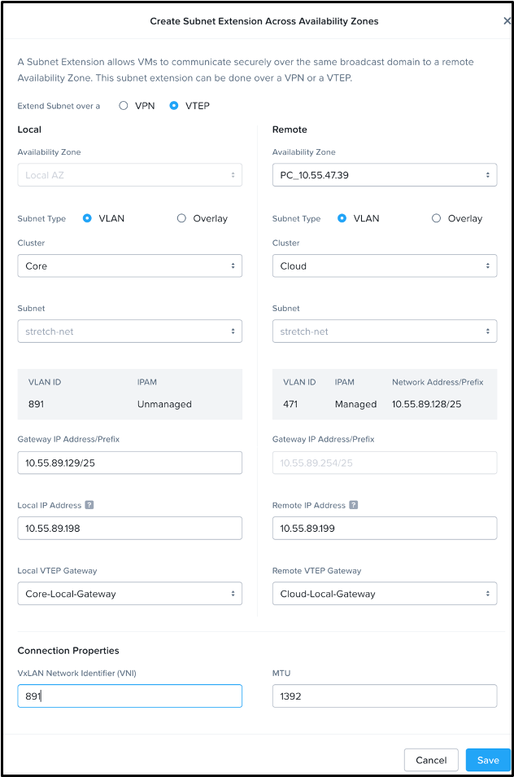
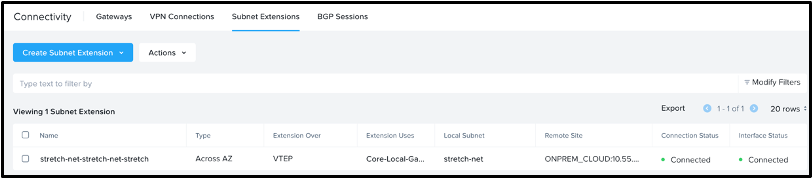

# Create the Subnet Extension

The Subnet Extension only needs to be created from one Prism Central, leveraging the pair of gateways created earlier. We'll originate the L2 subnet extension from the **Core** cluster Prism Central.

The Subnet Extension is created only once per cluster pair, follow along in the [guided Subnet Extension demo.](https://nutanix.storylane.io/share/85ff2hct9ydo?flow=4&scale=true) Come back to these instructions when you reach the Enable DR step: **5 - Enable DR**.

1.  Select **\> Network and Security > Connectivity**
    
2.  **Select** the **Subnet Extension** tab
    
3.  Click the **Create Subnet Extension** button
    
4.  Select Extend Subnet over **VTEP**
    
5.  Select **Across Availability Zones** from the drop-down
    
6.  Fill out the fields with the following information
    
    -   Local Availability zone: **Local AZ**
    -   Remote Availability Zone: (**PC IP address of the Cloud Cluster**)
    -   **Subnet Type Local and Remote:** VLAN
    -   **Local Cluster:** Core
    -   **Remote Cluster:** Cloud
    -   **Subnet, Local and Remote:** stretch-net
    -   **Local Gateway IP Address/Prefix:** _x.x.x.129/25_
    -   **Remote Gateway IP Address/Prefix** _x.x.x.254/25_
    -   **Local IP Address:** x.x.x.198
    -   **Remote IP Address:** x.x.x.199
    -   **VxLAN Network Identifier (VNI)** 891
        -   Use the VLAN tag of the **Core** stretch-net.
        -   This identifier can be any value as long as it's unique between these AZs and matches on both sides.

    !!! note

        The **Subnet** field may appear gray, indicating that it cannot be edited. This is a UI issue, and the field is still editable. Please click the **Subnet** drop down to select **stretch-net**.

    

    !!! note

        The **Local IP Address** and **Remote IP Address** are free addresses in the stretched network that are outside the configured DHCP scope to avoid conflict with guest VMs. These IP addresses are assigned to the network gateway VMs inside the extended subnet, **stretch-net**.

### Verify Subnet Extension

Once the subnet extension has been established, you should see the following on the **Connectivity, Subnet Extensions** tab. Connection Status of **Connected** means that the two local gateways can reach each other and should be able to exchange traffic from one site to another.

It may take a few minutes for the connection to complete. Ask your instructor for assistance if you do not see **Connected** after a few minutes.

## Next Steps

Now that the layer 2 subnet extension is configured, you're ready to seamlessly move your applications across sites.

[← Back: Deploy Remote Gateways](edge-lab-scenario2-remotegw.md) | [Home](edge-getting-started.md) | [Next: Overview →](edge-lab-scenario3-overview.md)