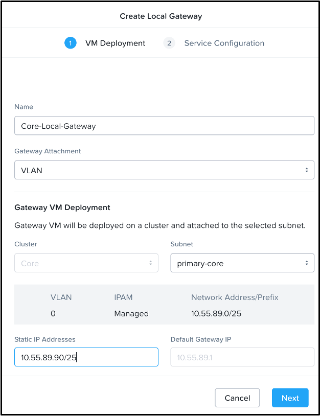
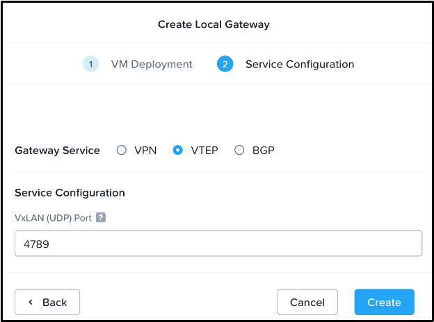

# Create the Local Gateways

First, create the Network Gateway VMs that provide the VLAN extension (VTEP) function for the local network we wish to extend. Complete the following tasks on both the **Core** and the **Cloud** cluster Prism Central.

The local gateway is created once per cluster. follow along in the [guided local gateway deployment demo.](https://nutanix.storylane.io/share/85ff2hct9ydo?flow=2&scale=true) Come back to these instructions when you reach the remote gateway step: **3 - Create Remote Gateways**.

### Core Local Gateway

1.  Connect to the **Core** Prism Central as `admin`.
    
2.  Select \>**Network and Security > Connectivity > Create Gateway > Local**.
    
3.  Use the following details on the **Core** cluster VM Deployment tab.
    
    -   **Name:** Core-Local-Gateway
    -   **Gateway Attachment:** VLAN
    -   **Cluster:** Core
    -   **Subnet:** primary-core
    -   **Static IP:** x.x.x.90/25
        -   Replace x.x.x with your **Core** Cluster primary network subnet IP and mask with slash notation.
        -   This IP address is outside of the stretched network and used for communication to the remote VTEP gateway. It must be reachable from the remote site.

    

4.  Click **Next** to enter the **Service Configuration** tab and use the following details.

    -   **Gateway Service:** VTEP
    -   **VxLAN (UDP) Port** 4789
        -   The default port, which can be customized. This port must match on both sides of the VXLAN tunnel.

    

5.  Click **Create**.

This gateway VM creation will take a few minutes on the **Core** cluster, so let's proceed to the next steps on **Cloud**.

### Cloud Local Gateway

1.  Connect to the **Cloud** Prism Central as `admin`.
    
2.  Select **\> Network and Security > Connectivity > Create Gateway > Local**.
    
3.  Use the following details on the **Cloud** cluster VM Deployment tab.
    

    -   **Name:** Cloud-Local-Gateway
    -   **Gateway Attachment:** VLAN
    -   **Cluster:** Cloud
    -   **Subnet:** primary-cloud
    -   **Static IP:** y.y.y.90/25
        -   _Replace y.y.y with your cloud cluster primary network_

4.  Click **Next** to move to the Gateway Service Configuration tab and enter the following details.

    -   **Gateway Service:** VTEP
    -   **VxLAN (UDP) Port** 4789

5.  Click **Create**.

VM creation will take a few minutes. You might need to click the **Gateways** list to refresh the page.

## Next Steps

The local gateways are now created in both the **Core** and **Cloud** clusters. These VMs will sit and wait for incoming connections on the IPs and ports defined above. Let's create the remote gateways next so the clusters know about each other.

[← Back: Overview & Pre-reqs](edge-lab-scenario2-overview.md) | [Home](edge-getting-started.md) | [Next: Deploy Remote Gateways →](edge-lab-scenario2-remotegw.md)