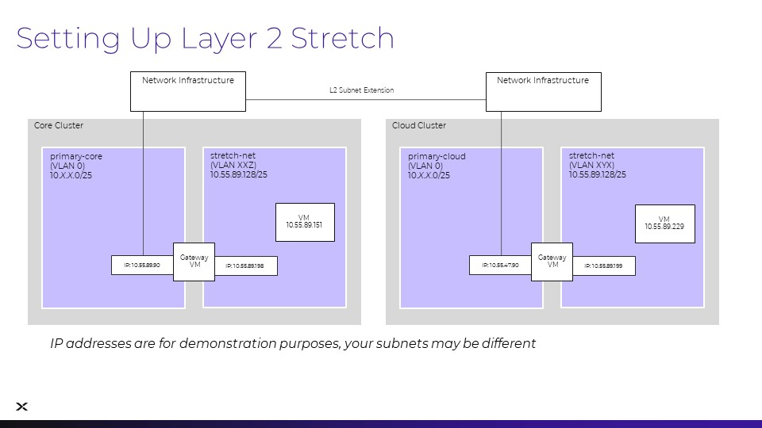
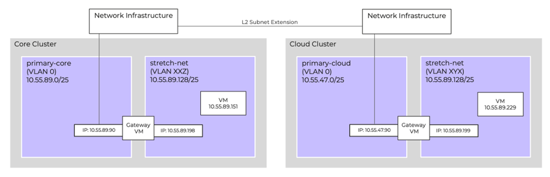

# Layer 2 Subnet Extension

ในส่วนนี้ คุณจะได้ติดตั้งคู่ของ **network gateway VMs** เพื่ออำนวยความสะดวกในการทำ **layer 2 subnet extension** ระหว่าง **clusters** ของทั้งสองไซต์ ได้แก่ **Core** และ **Cloud** ด้วย **subnet extension** นี้ **VMs** จะสามารถสื่อสารข้ามไซต์ได้อย่างราบรื่นเสมือนอยู่ในเครือข่ายเดียวกัน และคุณยังสามารถย้าย **VMs** ระหว่างไซต์ได้โดยไม่ต้องเปลี่ยน **IP addresses** ของพวกมัน

**gateway VMs** จำเป็นต้องมี **IP address** ที่กำหนดไว้โดยเฉพาะและสามารถติดต่อได้บน **primary VLAN subnet** ที่อยู่เหล่านี้จำเป็นสำหรับการสร้างการสื่อสารกับ **remote network gateway VM** บนอีก **cluster** หนึ่ง สำหรับ **lab** นี้ เราจะใช้ **IP address** X.X.X.90/25 ใน **primary VLAN** ของแต่ละ **cluster** เพื่อเป็น **public address** สำหรับ **network gateway VMs**

เหล่านี้คือ **IP subnets** สองชุดเดียวกันกับที่ใช้สำหรับ **Core** และ **Cloud Prism Central** โปรดตรวจสอบหน้าจอ **Connection Details launcher** ของคุณสำหรับรายละเอียดเพิ่มเติม

## Pair Availability Zones

การจับคู่ **availability zones** เป็นสิ่งที่จำเป็นต้องทำก่อน (**pre-requisite**) สำหรับการใช้งาน **Subnet Extension wizard** ระหว่างสอง **clusters** เราจะกำหนดค่าการจับคู่ **AZ** ระหว่าง **Prism Central clusters** สองแห่งที่นี่ โดยการจับคู่ **AZ** นี้จะถูกใช้งานโดยทั้ง **Subnet Extension** และ **Disaster Recovery** ของเรา

!!! info
    โปรดทำตามขั้นตอนใน [guided AZ pairing demoopen in new window](https://nutanix.storylane.io/share/85ff2hct9ydo?flow=1&scale=true) แต่ห้ามทำการเปลี่ยนแปลงใดๆ ใน **cluster**

1. ใน **Core Prism Central** ให้เลือก **> Administration > Availability Zones**
    
2. คลิก **Connect to Availability Zone**
    
3. คลิกที่รายการ **drop-down** สำหรับ **Availability Zone Type** และเลือก **Physical Location**
    
4. ป้อน **IP Address** ของ **Cloud Prism Central**
    
5. ป้อน **username** `admin` และ **password** จากนั้นคลิก **Connect**
    

ขณะนี้ **Core** และ **Cloud Availability Zones** ได้รับการจับคู่กันเรียบร้อยแล้ว

## Subnet Extension Logical Overview

แผนภาพต่อไปนี้แสดงให้เห็นถึง **L2 Subnet Extension** ระหว่าง **Core** และ **Cloud clusters** **Network Gateway VMs** ถูกติดตั้งด้วย **external IP** ที่สามารถติดต่อได้ใน **primary-core** และ **primary-cloud subnets** (แสดงที่ด้านซ้ายของ **gateway VM**) ส่วนอินเทอร์เฟซอื่นในแต่ละ **network gateway VM** จะขยายเข้าสู่ **stretch-net** ของทั้งสองไซต์ (แสดงที่ด้านขวาของ **gateway VM**)

โปรดสังเกตว่าช่วง **IP subnet** ของ **primary-core** และ **primary-cloud** นั้นแตกต่างกัน แต่ **stretch-net IP subnet** จะเหมือนกันทั้งสองไซต์! **VM** ใน **Core stretch-net** จะมี **IP** เดียวกันและสามารถติดต่อสื่อสารได้เหมือนกับ **VM** ที่ไซต์ **Cloud** เมื่อเราดำเนินการเสร็จสิ้น!

!!! note
    ในสภาพแวดล้อม **lab** ของคุณ **IP addresses** เหล่านี้จะแตกต่างกัน โปรดใช้ช่วงเครือข่ายจาก **clusters** ของคุณที่ได้รับมอบหมายใน **connection details**

## Next Steps

เมื่อ **AZs** ของเราจับคู่กันแล้ว เราก็พร้อมที่จะติดตั้ง **local** และ **remote gateways** เพื่อใช้งานกับทั้งสองฝั่งของ **layer 2 subnet extension** ของเรา

[← Back: VPN Connectivity](edge-lab-scenario1-vpn.md) | [Home](edge-getting-started.md) | [Next: Deploy Local Gateways →](edge-lab-scenario2-localgw.md)