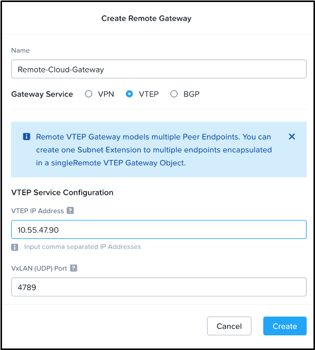

# Create the Remote Gateways

!!! info

    The remote gateway is created once per cluster., follow along in the [guided remote gateway configuration demo.open in new window](https://nutanix.storylane.io/share/85ff2hct9ydo?flow=3&scale=true) Come back to these instructions when you reach the Subnet Extension step: **4 - Create Subnet Extension**.

Each local gateway must point to a remote gateway to form a pair.

On the **Core** cluster, we create a **Remote Gateway** using the external and reachable IP address of the **Cloud** cluster local gateway.

On the **Cloud** cluster, we create a **Remote Gateway** using the external and reachable IP address of the **Core** cluster local gateway.

### Create the Remote Gateway on Core

1.  Connect to the **Core** Prism Central as `admin`.
    
2.  Select **\> Network and Security > Connectivity**.
    
3.  Click **Create Gateway > Remote** and enter the following.
    
    -   **Name:** Remote-Cloud-Gateway
    -   **Gateway Service:** VTEP
    -   **Public IP Address:** y.y.y.90
        -   This is the IP of the **Local Gateway** on the **Cloud** cluster
        -   Replace y.y.y with your **Cloud** cluster network.

4.  Click **Create** to complete the creation of the **Core** cluster remote gateway that points to the **Cloud**.
    

### Create the Remote Gateway on Cloud

1.  Connect to the **Cloud** Prism Central as `admin`.
    
2.  Select **\> Network and Security > Connectivity**.
    
3.  Click **Create Gateway > Remote** and enter the following.
    
    -   **Name:** Remote-Core-Gateway
    -   **Gateway Service:** VTEP
    -   **Public IP Address:** y.y.y.90
        -   This is the IP of the **Local Gateway** on the **Core** cluster
        -   Replace y.y.y with your **Core** cluster network.

4.  Click **Create** to complete the creation of the **Cloud** cluster remote gateway that points to the **Core**
    

### Verify Gateway Creation

Once completed, the gateway screen should show that a local gateway is present in each cluster and the gateways are in an up state. Each cluster should also show a remote gateway that corresponds with the IP of the remote cluster network gateway.

## Next Steps

With the local and remote gateways created, we can now provision a subnet extension to bridge these two networks using the gateway VMs.

[← Back: Deploy Local Gateways](edge-lab-scenario2-localgw.md) | [Home](edge-getting-started.md) | [Next: Extend Layer 2 Subnet →](edge-lab-scenario2-layer2.md)