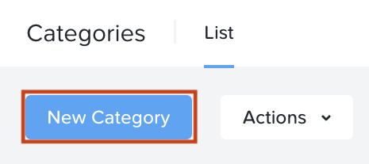

# Category Creation & VM Association

## Create a Category

1. ใน **Core Prism Central** ให้เลือก **> Administration > Categories**
    
2. เลือก **New Category** ที่มุมซ้ายบนของหน้าต่าง 
    
3. ในช่องข้อความ **Name** ให้พิมพ์ **DR-RPO-User##** โดยที่ ## คือหมายเลขผู้ใช้งานของคุณ
    
4. ช่อง **Purpose** เป็นตัวเลือกเสริม (optional) แต่จะช่วยให้ระบุได้ง่ายขึ้นว่าหมวดหมู่นี้ถูกใช้งานอย่างไร
    
5. ในช่อง **Values** ให้ใส่ค่า **1hr** จากนั้นคลิก **Save**
    

!!! note

    คุณสามารถสร้างหลายค่าที่สอดคล้องกับ **RPOs** ที่แตกต่างกันได้ ตัวอย่างเช่น 1m, 1hr, 6hr, 24hr ค่าข้อความเหล่านี้สามารถนำไปใช้เพื่อจับคู่ **entities** เข้ากับ **protection policies** ที่เกี่ยวข้องได้

## Associate Category with VM

1. ใน **Core Prism Central** ให้เลือก **> Compute & Storage > VMs**
    
2. เลือกช่องติ๊กถูกถัดจาก **VM** ที่ชื่อ **Linux-User##** โดยที่ **##** คือหมายเลขผู้ใช้งานของคุณ
    
3. คลิก **> Actions > Manage Categories**
    
4. ในช่องค้นหาใต้หัวข้อ **Set Categories** ให้พิมพ์ชื่อของ **category** ที่สร้างไว้ก่อนหน้านี้ คือ **DR-RPO-User##** จากนั้นคลิกเครื่องหมายบวก
    
5. คลิก **Save**
    

## Next Steps

ขณะนี้ **category** ของเราได้เชื่อมโยงกับ **VM** นี้เรียบร้อยแล้ว นโยบาย (**policies**) ใดๆ ที่อ้างอิงถึง **category** นี้จะมีผลกับ **VM** นี้ด้วย ขั้นตอนต่อไปเราจะไปสร้างนโยบายกันครับ

[← Back: Setup](edge-lab-scenario3-setup.md) | [Home](edge-getting-started.md) | [Next: Create a Protection Policy →](edge-lab-scenario3-protect.md)