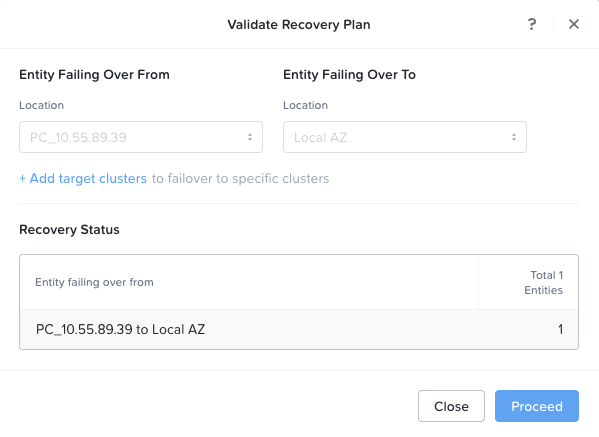
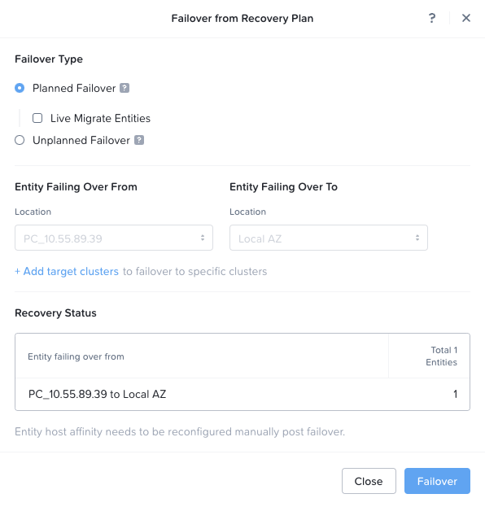
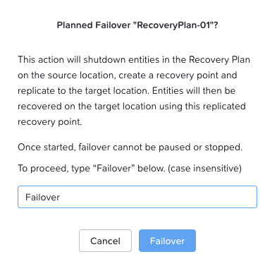

# Failover

!!! note

    ในกรณีที่เกิดภัยพิบัติจริง **Primary** หรือ **Core Prism Central** จะออฟไลน์ ดังนั้นต้องเริ่มดำเนินการกู้คืนที่ **Prism Central** ปลายทาง ซึ่งในกรณีนี้คือ **Cloud**

1. ใน **Core Prism Central** ให้ login ด้วยชื่อผู้ใช้ `admin` จากนั้นเลือก **> Compute & Storage > VMs** และจดบันทึก **IP Address** ของ **VM** ของคุณไว้
    
2. ใน **Cloud Prism Central** ให้ login ด้วยชื่อผู้ใช้ `admin` จากนั้นเลือก **> Data Protection > Recovery Plans**
    
3. เลือกช่องติ๊กถูกถัดจาก **recovery plan** ของคุณ คือ **RecoveryPlan-##** (โดยที่ ## คือหมายเลขผู้ใช้งานของคุณ)
    
4. คลิก **Actions** จากนั้นคลิก **Validate**
    
    
    
5. คลิก **Proceed**
    
6. หาก **Recovery Plan** ของคุณผ่านการ **validate** สำเร็จ คุณจะเห็นข้อความ **Validation completed successfully**
    
7. คลิก **Close**
    
8. เลือกช่องติ๊กถูกถัดจาก **Recovery Plan** ของคุณ (**RecoveryPlan-##**) หากยังไม่ได้เลือกไว้ แล้วเลือก **> Actions > Failover**
    
9. หากเป็นภัยพิบัติจริง ในส่วนของ **Failover Type** คุณควรเลือก **Unplanned Failover** แต่เนื่องจากนี่เป็น **lab** เราจะเลือก **Planned Failover**
    
10. ตรวจสอบในส่วน **Recovery Status** ว่าคุณเห็น **Total 1 Entities** ซึ่งควรจะเป็น **VM entity** ตัวเดียวที่คุณเลือกไว้ในแผน
    
    
    
11. คลิก **Failover**
    
12. ในหน้าต่างป๊อปอัพ **Planned Failover** ให้พิมพ์คำว่า **Failover** ในช่องข้อความ แล้วคลิกปุ่ม **Failover**
    
    
    
13. การดำเนินการนี้จะใช้เวลาประมาณสามนาที จากนั้น **VM** ของคุณจะไปรันอยู่บน **Cloud cluster**
    
14. เมื่อ **VM** ของคุณเปิดขึ้นมาแล้ว ให้เข้าระบบด้วย **VM credentials** คือ Username = `ubuntu` / Password = `nutanix/4u` โดยใช้หน้าจอ **VM console** ใน **Cloud Prism Central**
    
15. ทดสอบ **Ping 10.x.y.129** (**Core Gateway**) เพื่อตรวจสอบว่า **traffic** กำลังวิ่งผ่าน **L2 Stretch** และออกไปทาง **gateway** ที่ไซต์ **Core**
    
16. ทดสอบ **Ping 8.8.8.8** (**Google DNS**) เพื่อตรวจสอบว่า **traffic** กำลังวิ่งจาก **Cloud cluster** ผ่าน **Subnet Extension** และออกไปสู่เครือข่ายอินเทอร์เน็ตจาก **Core cluster**
    

## Key Takeaways

เมื่อคุณทำแบบฝึกหัดใน **lab** เหล่านี้เสร็จสิ้นแล้ว คุณจะสามารถติดตั้งและทำ **fail workloads** ไปที่ใดก็ได้โดยที่ยังคงรักษาการเชื่อมต่อไว้ สรุปสิ่งที่เราได้เรียนรู้มีดังนี้:

- วิธีการกำหนดค่า **cloud networking** ใน **AWS** และการจับคู่เครือข่าย **AWS** เข้ากับเครือข่าย **on-prem** ผ่าน **VPN**
- วิธีการตั้งค่า **layer 2 stretch** โดยการติดตั้ง **Nutanix gateways** และสร้าง **subnet extension** ระหว่างกัน
- โครงสร้างของ **Nutanix Disaster Recovery** และวิธีการกำหนดค่า **category**, **protection policy** และ **recovery plan**
- วิธีการทำ **planned failover** ของ **VM** ไปยัง **Cloud cluster** โดยที่ยังคงรักษาทั้ง **IP address** และการเชื่อมต่อกับ **on-prem workloads** เดิมไว้
- วิธีการขยายระบบไปสู่ **cloud**! 🪜 ☁️

[← Back: Create a Recovery Plan](edge-lab-scenario3-recover.md) | [Home](edge-getting-started.md) | [Next: Conclusion →](edge-conclusion.md)