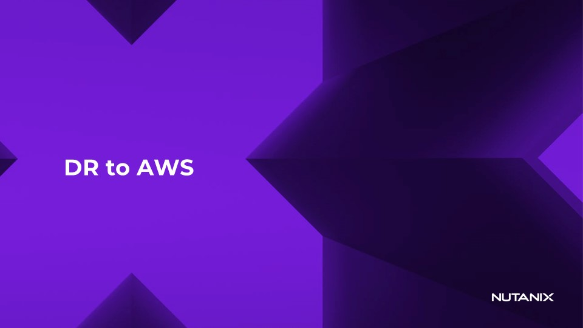
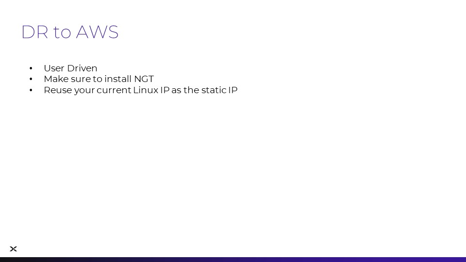

# Getting Started with DR Student

This lab provides hands-on experience on why Nutanix is the best platform for virtualization workloads thanks to the built-in capabilities of Nutanix Disaster Recovery (DR) allowing customers to seamlessly extend to the public cloud. With Nutanix DR, customers can protect their workloads locally or remotely using on-prem Nutanix Clusters. You can also choose to recover to Nutanix Cloud Clusters (NC2) in the public cloud, giving additional flexibility on where to recover workloads in the event of a disaster.

Historically, replication and DR technologies have been complex to set up and maintain. Issues such as incompatibilities or reduced functionality tend to surface when using storage-based replication combined with a high-level DR orchestration tool.

Nutanix eliminates many of these challenges and makes disaster recovery much easier to provision, test, and execute by providing:

-   Easy-to-understand constructs such as protection policies and recovery plans allow you to quickly protect workloads by replicating them to additional locations and to recover with ease.
-   A simple way to associate VMs to policies via categories.
-   A straightforward network mapping process.
-   The ability to test a recovery plan before executing in a real disaster.

By the end of this lab, you will be able to:

-   Understand the fundamentals of Nutanix Disaster Recovery and leverage built-in capabilities to extend to the public cloud.
-   Correctly configure the constructs required for entity-centric Nutanix Disaster Recovery such as
    -   Protection Policies
    -   Recovery Plans
    -   Categories
-   Understand how to leverage layer 2 stretch (Subnet Extension) to preserve IP addresses and maintain connectivity during partial failover.

[← Back: Extend Layer 2 Subnet](edge-lab-scenario2-layer2.md) | [Home](edge-getting-started.md) | [Next: Definitions →](edge-lab-scenario3-def.md)