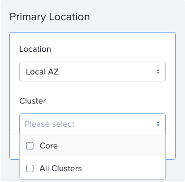

# Create a Protection Policy

1. ใน **Core Prism Central** ให้เลือก **> Data Protection > Protection Policies**

    !!! note

        หากคุณเป็นผู้ใช้รายแรกที่เข้ามาถึงส่วนนี้ของ **lab** คุณจะเห็นหน้าจอภาพรวมของ **Protection Policies**

        ให้คลิก **Create Protection Policies** เพื่อออกจากหน้าจอนี้

2. ในช่อง **Policy Name** ให้พิมพ์ **ProtectionPolicy-##** โดยที่ ## คือหมายเลขผู้ใช้งานของคุณ
    
3. ในช่องรายการ **drop-down** ของ **Location** สำหรับ **Primary Location** ให้เลือก **Local AZ**
    
4. ในช่องรายการ **drop-down** ของ **Cluster** สำหรับ **Primary Location** ให้เลือก **Core Cluster** ในเครื่อง และคลิก **Save**
    
    
    
5. ในช่องรายการ **drop-down** ของ **Location** สำหรับ **Recovery Location** ให้เลือก **IP Address** ที่ตรงกับ **Cloud Prism Central**
    
6. ในช่องรายการ **drop-down** ของ **Cluster** สำหรับ **Recovery Location** ให้เลือก **Cloud** cluster และคลิก **Save**
    
7. ในช่อง **Values** ให้ใส่ค่า **1hr** จากนั้นคลิก **Save**
    
8. คลิก **Next**
    
9. ในช่องค้นหาที่หน้าต่าง **Categories** ด้านซ้าย ให้พิมพ์ชื่อของ **category** ที่คุณสร้างไว้ก่อนหน้านี้ คือ **DR-RPO-User##:1hr** จากนั้นเลือกช่องติ๊กถูกที่ตรงกับหมายเลขผู้ใช้งานของคุณ แล้วคลิก **Add**
    
10. คลิก **Create**
    

## Next Steps

ขณะนี้ **protection policy** ที่เลือก **VM entity** เฉพาะของคุณถูกสร้างขึ้นเรียบร้อยแล้ว โดย **Snapshots** สำหรับ **VM** ของคุณจะถูกสร้างขึ้นทั้งบน **Core** cluster ในเครื่อง และ **Cloud** cluster ปลายทาง ตามค่า **RPO** หนึ่งชั่วโมงที่คุณกำหนดไว้ นอกจากนี้จะมีการสร้าง **initial snapshot** ขึ้นด้วย

[← Back: Create Category & Associate VM](edge-lab-scenario3-cat.md) | [Home](edge-getting-started.md) | [Next: Create a Recovery Plan →](edge-lab-scenario3-recover.md)