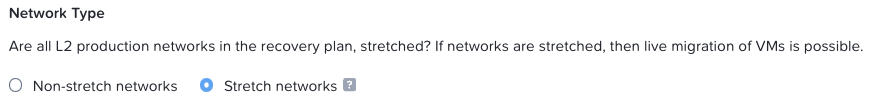
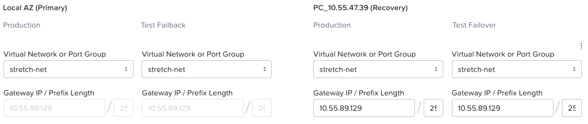

# Create a Recovery Plan

Our snapshots are being created and replicated. Now let's get everything in place to recover from those snapshots in the **Cloud** cluster.

1.  In the **Core** Prism Central, select **\> Data Protection > Recovery Plans**.

    !!! note

        If you are the first user to get to this portion of the lab, you will see the Recovery Plan overview screen. Click **Create new Recovery Plan** to dismiss the screen.

2.  In the **General** section **Recovery Plan Name** field, enter **RecoveryPlan-##** where ## is your user number.
    
3.  You may enter a Recovery Plan Description if you would like to but it is optional.
    
4.  Under Locations, Click the drop-down under **Primary Location** and select **Local AZ**
    
5.  Click the drop-down under **Recovery Location** and select the **Cloud** Prism Central.
    
6.  Click **Next**.
    
7.  In the **Recovery Sequence** screen, click **\+ VM(s)** to add your VM to the Recovery Plan.
    
8.  Select the drop-down box and select **Category**.
    
    !!! note

        You can also use the VM Name to add to a Protection Policy or a Recovery Plan, but using categories is the best practice. These are more flexible and easy to change later without managing individual VMs.

10.  In the search box to the right of Category, type in the name of the category you created, **DR-RPO-User##:1hr**.
    
11.  Select it in the results and click **Add**.
    
    !!! note

        After adding your VM, it is placed into VM Stage 1. Boot Stages are where you can order VM boot sequences. This is helpful when protecting an application, as the administrator can have the database server power-on before the application and web servers.

12.  Under **Network Type**, select **"Stretch networks"**
    
    
    
13.  In the Network Settings tab, under Local AZ (Left side) click the drop-down under Production **Virtual Network or Port Group** and select **stretch-net**. Notice that Prism populates the Gateway IP and Prefix Length fields automatically.
    
14.  Since this is a lab environment, in the **Test Failback Virtual Network or Port Group** drop-down, select **stretch-net**. Production environments may have different test networks.
    
15.  Under the **Cloud** PC portion (right side) select the same network of **stretch-net** in both **Virtual Network or Port Group** boxes.
    
16.  Copy the **Gateway IP** and **Prefix Length** from the Local AZ to fill in those fields in the **Cloud** PC (Recovery) side.
    
    
    
17.  Click **Done**
    

## Next Steps

-   Our **Cloud** cluster is setup.
-   Our Subnet Extension is live between **Core** and **Cloud**.
-   The VM has a static IP.
-   The VM's snapshots are being replicated per policy from the **Core** to the **Cloud**.
-   The recovery plan is defined so the VM knows how to run in the **Cloud**.

It's time to move to the **Cloud**. ⌚ 🚚 ☁️

[← Back: Create a Protection Policy](edge-lab-scenario3-protect.md) | [Home](edge-getting-started.md) | [Next: Failover →](edge-lab-scenario3-failover.md)