# Application Policies

Application Policies เป็นวิธีหลักในการควบคุมการเข้าถึง network ด้วย Flow Network Security มันมีความยืดหยุ่นเนื่องจากอนุญาตให้ระบุ incoming และ outgoing traffic ที่อนุญาตได้อย่างแม่นยำ

Application policies จะถูกประเมิน (evaluated) หลังจาก Quarantine, Isolation, และ Shared Service policies

## The Development Application

คำแนะนำเหล่านี้จะช่วยเราในการปกป้อง development application ของเรา มาทบทวน security requirements และเริ่มต้นอนุญาตให้ traffic ที่จำเป็นผ่านกันเลย

1.  ใน application นี้ เราจำเป็นต้องอนุญาต inbound access ไปยัง dev web VMs ของเราจาก Parallels client และ Internet บน TCP port 80
    
2.  end-user developer VM ของเราควรสามารถเข้าถึง Development web server ได้ผ่าน TCP port 80 เท่านั้น
    
3.  developer VM ควรจะสามารถเข้าถึง Database ได้ผ่าน TCP 22 และ TCP 5432 ด้วยเช่นกัน
    
4.  ภายใน application ของเรา เราจำเป็นต้องอนุญาตให้ Web VMs สื่อสารกับ Database VMs ผ่าน port 5432
    
developer web VM ของเรามีการกำหนด categories 3 อย่างดังต่อไปนี้

-   **AppTier: User`##`Web**
-   **AppType: User`##`ToDo**
-   **Environment: User`##`Dev**

ไม่มี sources อื่นใดที่ได้รับอนุญาตให้สื่อสารกับ database tier ของเรา

ไม่มี requirements ในการจำกัด outbound access ส่วนนี้ถูกจัดการโดย physical firewall ที่ขอบเขตระดับองค์กร (corporate perimeter)

### Creating the Development Security Policy

#### Process Overview

security policy ประกอบด้วยรายการดังต่อไปนี้:

1.  Secured Entity - นี่คือรายการที่อยู่ตรงกลางของ application policy สิ่งนี้คือสิ่งที่เรากำลังปกป้อง

2.  Inbound Sources - รายการที่อยู่ทางด้านซ้ายของ policy นี่คือสิ่งที่เราอนุญาตให้เข้ามา (allow in)

3.  Outbound Destinations - รายการที่อยู่ทางด้านขวาของ policy นี่คือสิ่งที่เราอนุญาตให้ออกไป (allow out)

4.  Rules - สิ่งเหล่านี้คือ ports และ protocols ที่อนุญาตระหว่าง entities

กระบวนการของเราด้านล่างคือ

1.  สร้าง Secured Entities ทั้งหมด

2.  สร้าง Inbound Sources ทั้งหมด

3.  สร้าง Rules ทั้งหมดระหว่าง Inbound Sources และ Secured Entities

เป็นไปได้ที่จะทำสิ่งนี้ในรูปแบบที่ต่างออกไปโดยการสร้าง Secured Entities จากนั้นสร้าง inbound แบบ single แล้วตามด้วย rules จาก inbound นั้นไปยัง secured entity ในท้ายที่สุด ผลลัพธ์ก็จะเหมือนกัน

#### Create the Policy

1.  ใน Prism Central ตรวจสอบให้แน่ใจว่าคุณอยู่ใน **Infrastructure** แล้วนำทางไปที่ **Network & Security** > **Security Policies**

    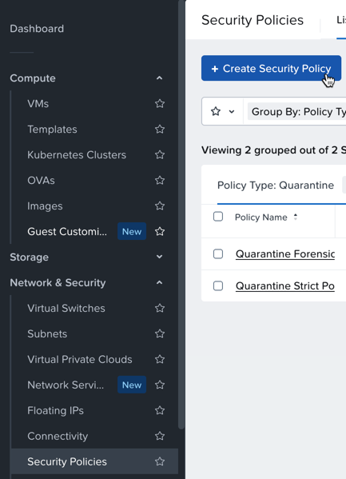

2.  เลือก **\+ Create Security Policy**
    
    -   ตั้งชื่อ security policy ของคุณเป็น **User`##`\-DevSecurityPolicy**
    -   ระบุคำอธิบาย (description) สำหรับ development security policy นี้
    -   policy type ของคุณคือ Application : Secure Entities

    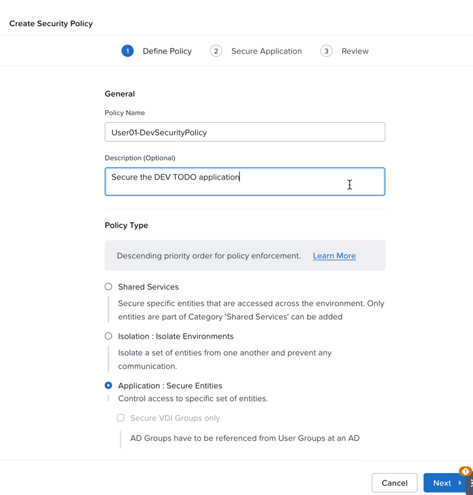

3.  ก่อนที่เราจะดำเนินการต่อ โปรดสังเกต additional settings สำหรับ policy hit logs และ IPv6 ให้คงค่าเหล่านี้ไว้ที่ default values
    
    -   Hit logs จะเปิดใช้งานตามแต่ละ policy (per-policy basis) และสร้าง Syslog messages สำหรับ connections ที่ allowed และ denied
    -   IPv6 policy เป็นของใหม่ใน Flow Network Security 7.5 และอนุญาตให้สร้าง IPv6 rules

4.  เลือก Next ที่มุมขวาล่างเพื่อดำเนินการต่อ
    

#### Secured Entity Definition - Web

ต่อไป เราจะกำหนด secured entities ที่อยู่ตรงกลางของ application security policy ของเรา สิ่งนี้คือสิ่งที่เรากำลังปกป้องด้วย policy

1.  เลือก **\+ Add Secured Entity**

    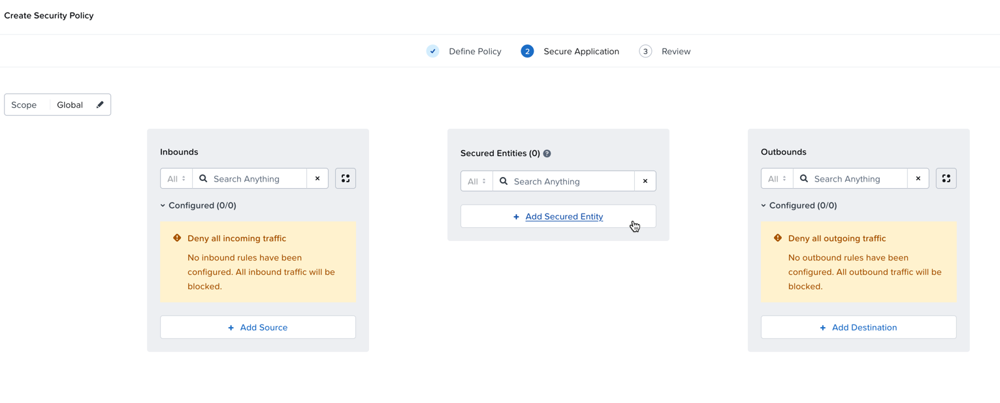

    เรากำลังใช้ categories หลายอัน (multiple categories) เพื่อกำหนด secured entity ของเรา
    มาเริ่มต้นด้วยการกำหนด web tier สำหรับ **User`##`Dev** ToDo application

2.  ในช่อง category drop down (สามารถค้นหาได้) ให้เลือก categories เหล่านี้สำหรับ Web Tier ของ secured entity:

    !!! note
        เมื่อค้นหา categories ให้ใช้ autocomplete เพื่อลดการพิมพ์

    พิมพ์ user number ของคุณตามด้วยตัวอักษรตัวต่อไปของ category เช่น `01w` จะทำ autocomplete เป็น `AppTier: User01Web`

    -   **AppTier: User`##`Web**
    -   **AppType: User`##`ToDo**
    -   **Environment: User`##`Dev**

    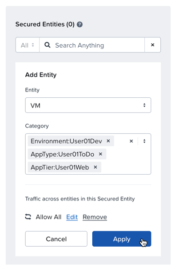

3.  หลังจากเพิ่ม categories ทั้งสามเข้าไปใน VM entity เดียวกัน ให้เลือก **Apply**
    
4.  เลื่อนเมาส์ไปเหนือ (Hover over) Secured Entity เพื่อดู category values ทั้งหมดที่ได้รับมอบหมาย
    

#### Secured Entity Definition - Database

ต่อไป เราจะกำหนด **Database Tier** ของเรา

1.  เลือก **\+ Add Secured Entity**

    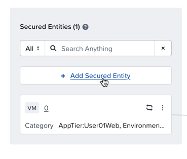

2.  ใน category drop down ให้เลือก categories ทั้งสามเหล่านี้เพื่อกำหนด database tier

    -   **AppTier: User`##`DB**
    -   **AppType: User`##`ToDo**
    -   **Environment: User`##`Dev**

    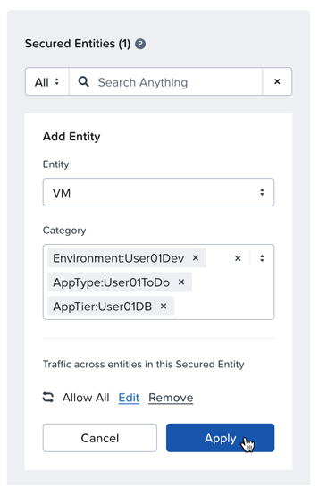

3.  เลือก **Apply**

#### Inbound Source Requirements

ตอนนี้ เราจะกำหนด inbound sources และ unique traffic ผ่านทาง TCP port ที่จะได้รับอนุญาตให้สื่อสารกับ ToDo application ของเรา

Inbound sources สามารถเป็น Categories, Subnets, VPCs, Address Groups, Specific Network Addresses, หรือ Entity Groups

ใน policy ของเรา เรามี inbound requirements ดังต่อไปนี้:

-   **Web Tier** จะต้องสามารถสื่อสารไปยัง **DB Tier** ผ่านทาง **TCP port 5432**

    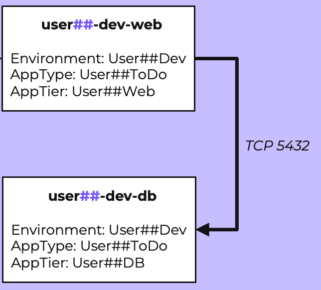

-   **User##-developer** desktop จำเป็นต้องสามารถเข้าถึง **Web Tier** ผ่านทาง **TCP port 80** นอกจากนี้ desktop นี้ยังจำเป็นต้องเข้าถึง **DB Tier** ผ่านทาง **TCP port 22** และ **TCP port 5432**

    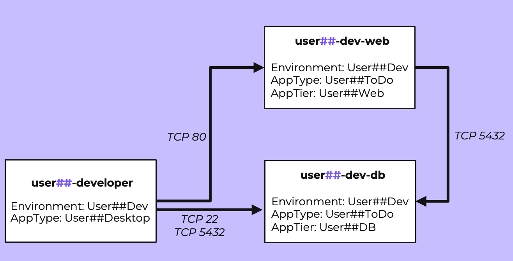

-   นอกจากนี้ เราจำเป็นต้องอนุญาต traffic จาก **Internet** และ **Parallels subnet** ไปยัง **Environment:Dev** ToDo app **Web Tier**
    
    -   traffic นี้จะต้องถูกจำกัด (**restricted**) ไว้ที่ **TCP port 80** เท่านั้น

    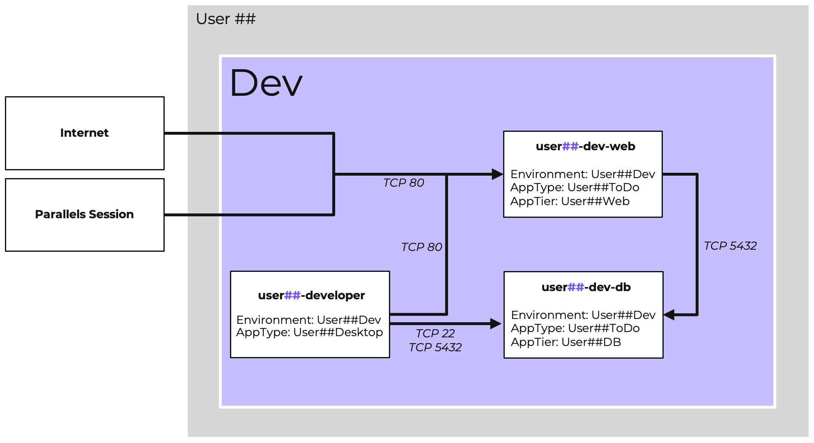

#### Add the Web Source for Connections to DB

1.  ในฝั่ง Inbound ของ policy ทางด้านซ้าย ให้เลือก **\+ Add Source**

    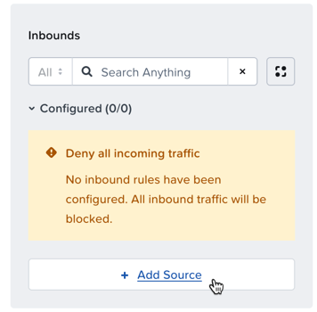

2.  ใน **Add Entity** ตรง Entity dropdown ให้เลือก **VM**
    
3.  ในส่วนของ Category ให้เลือก categories ดังต่อไปนี้:
    
    -   **AppTier:User`##`Web**
    -   **AppType:User`##`ToDo**
    -   **Environment: User`##`Dev**

    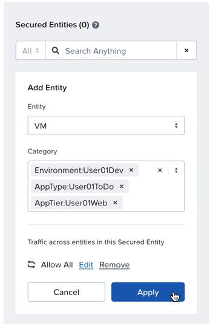

4.  เลือก **Apply**

#### Add The Internet Source

1.  ในฝั่ง Inbound ของ policy ทางด้านซ้าย ให้เลือก **\+ Add Source**
    
2.  ใน **Add Entity** ตรง Entity dropdown ให้เลือก **Address Group**
    
3.  ใน **Address Group** dropdown ให้เลือก address group ที่ชื่อ **Public-Internet-Addresses**
    
    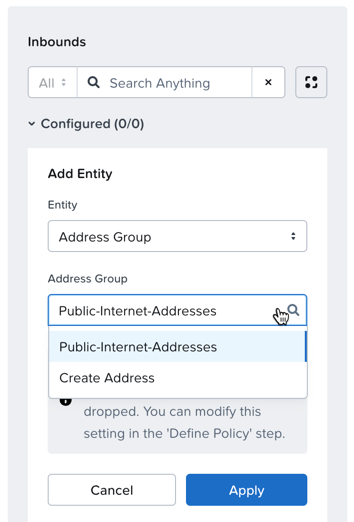

4.  เลือก **Apply**

#### Add The Parallels Source

ตอนนี้เราจะเพิ่ม Parallel Sessions address group ให้เป็น Inbound source อีกอัน

1.  ในฝั่ง Inbound ของ policy ทางด้านซ้าย ให้เลือก **\+ Add Source**
    
2.  ใน **Add Entity** ตรง Entity dropdown ให้เลือก **Address Group**
    
3.  ใน **Address Group** dropdown ให้เลือก address group ที่ชื่อ **Parallel-Sessions**
    
    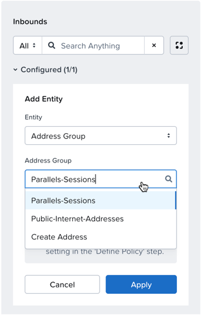

4.  เลือก **Apply**

#### Add The Dev Desktop Source

สุดท้าย เราจะเพิ่ม developer desktop ของเราให้เป็น inbound source

1.  ในฝั่ง Inbound ของ policy ทางด้านซ้าย ให้เลือก **\+ Add Source**
    
2.  ใน **Add Entity** ตรง Entity dropdown ให้เลือก **VM**
    
3.  ใน **Category** dropdown ให้เลือก categories ดังต่อไปนี้:
    
    -   **AppType:User`##`Desktop**
    -   **Environment: User`##`Dev**

    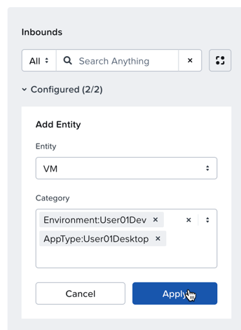

4.  เลือก **Apply**

#### Add Rules From Internet to Web

ตอนนี้เราได้เพิ่ม inbound sources ของเราแล้ว ถึงเวลากำหนด (configure) unique traffic ports ที่อนุญาตไปยัง ToDo application ของเรา

1.  ทางด้านซ้ายของ policy เลือก Inbound source: **Network Address Group Public-Internet-Addresses** โดยการคลิกหนึ่งครั้งเพื่อเลือกมัน

    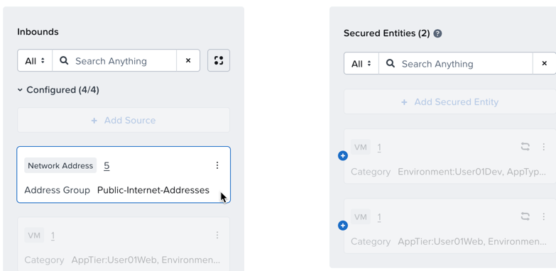

2.  ถัดไป โดยไม่ต้องคลิกที่ใดเพิ่มเติม ให้คลิกที่ **เครื่องหมายบวก +** (plus sign) ของ Secured Entity **AppTier:User`##`Web**

    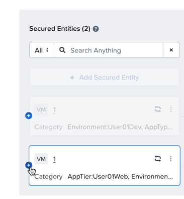

3.  ในส่วนของ Configuration Traffic Filtering Section เลือก **Allow Specific Traffic**

    !!! note
        การเพิ่มคำอธิบาย (description) เข้าไปใน rule จะช่วยให้เห็นจุดประสงค์ของ rule นี้ได้ง่ายขึ้นเมื่อดู policy หรือตอนแก้ไขในภายหลัง

4.  ในส่วนของ Protocol-Ports / Services area ให้เลือก:
    
    -   **Add New Protocol-Port / Service**
    -   เลือก **TCP**
    -   ใส่ port **80**

    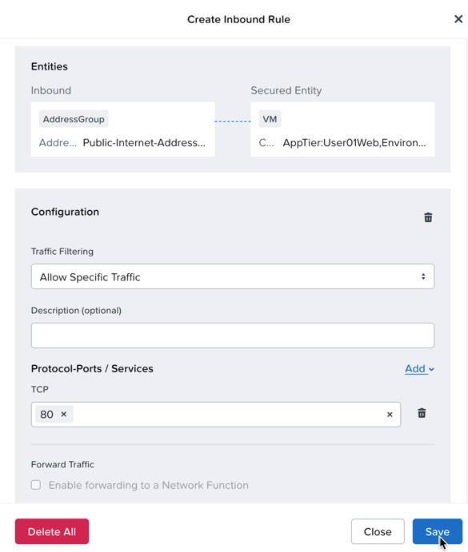

5.  เลือก **Save** เพื่อบันทึก inbound rule นี้

#### Add Rules from Parallels to Web

ทำซ้ำขั้นตอนเหล่านั้นสำหรับ Inbound source ประเภท Network Address Group สำหรับ Parallels-Sessions

#### Add Rules from Developer Desktop to Web

ถัดไปเราจะ configure rules สำหรับการเข้าถึงจาก **developer desktop** ของเรา

1.  ทางด้านซ้ายของ policy คลิกที่ Inbound source เพื่อเลือก:

    -   **AppType: User`##`Desktop**
    -   **Environment: User`##`Dev**

2.  เลือกเครื่องหมายบวก **+** (plus sign) ของ **Secured Entity** **AppTier: User`##`Web** เพื่อเพิ่ม rule
    
3.  ในส่วน Traffic Filtering Section ให้เลือก:
    
    -   **Allow Specific Traffic**
4.  ในส่วน Protocol-Ports / Services area ให้เลือก:
    
    -   **Add New Protocol-Port / Service**
    -   เลือก **TCP**
    -   ใส่ port **80**

    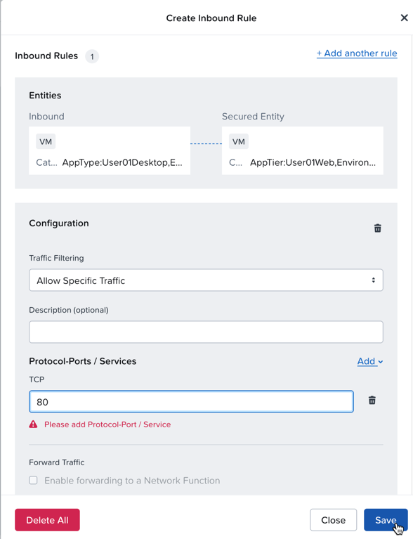

5.  เลือก **Save**

#### Add Rules from Developer Desktop to DB

1.  ทางด้านซ้ายของ policy คลิกที่ Inbound source เพื่อเลือก:

    -   **AppType: User`##`Desktop**
    -   **Environment: User`##`Dev**

2.  เลือก **เครื่องหมายบวก** **+** (plus sign) ของ Secured Entity **AppTier:User`##`DB**
    
3.  ในส่วน Traffic Filtering Section ให้เลือก **Allow Specific Traffic**
    
4.  ใน Protocol-Ports / Services ให้เลือก:
    
    -   **Add New Protocol-Port / Service**
    -   เลือก **TCP**
    -   ใส่ port **22**
5.  กดปุ่ม return (หรือ Enter) เพื่อเพิ่ม TCP port เพิ่มเติม
    
    -   ใส่ **port 5432**

    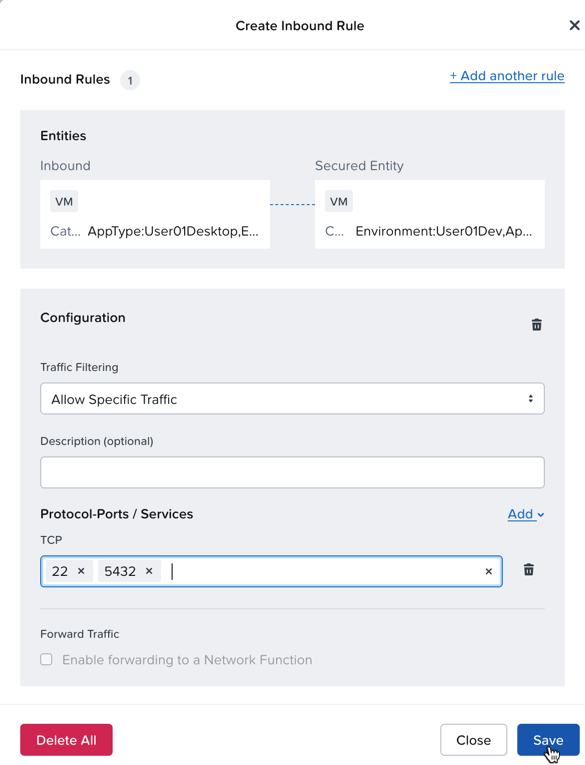

6.  เลือก **Save**

#### Add Rule from Web to DB

สุดท้าย เราจำเป็นต้องอนุญาตให้ **Web tier** ของเราสื่อสารกับ **database tier** ของเราบน **TCP port 5432**

1.  ทางด้านซ้ายของ policy คลิกที่ Inbound source เพื่อเลือก:
    
    -   **AppTier:User`##`Web**
    -   **AppType: User`##`ToDo**
    -   **Environment: User`##`Dev**
2.  เลือก **เครื่องหมายบวก +** ของ Secured Entity **AppTier:User`##`DB**
    
3.  ในส่วน Traffic Filtering Section ให้เลือก **Allow Specific Traffic**
    
4.  ใน Protocol-Ports / Services ให้เลือก:
    
    -   **Add New Protocol-Port / Service**
    -   เลือก **TCP**
    -   ใส่ port **5432**

    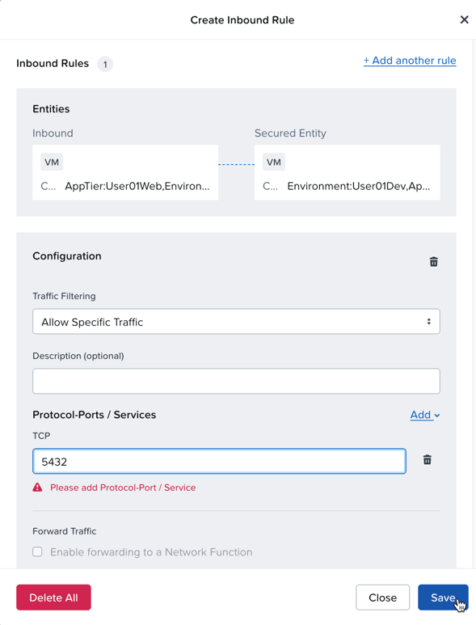

5.  เลือก **Save**

    !!! note
        เรายังสามารถสร้าง traffic rules ได้โดยใช้ pre-built services อย่างเช่น http หรือ ssh แทนที่จะระบุหมายเลข TCP port โดยตรง

#### Check the List or Table View

จนถึงตอนนี้ เราได้สร้าง rules ทั้งหมดของเราในแบบ visual view ทาง Flow Network Security ยังมี list view สำหรับการสร้างและดู application security policies อีกด้วย

1.  ที่มุมขวาบน ให้นำทางไปยัง list view โดยคลิกที่ **List** เพื่อดู policy ที่คุณเพิ่งสร้างขึ้นในรูปแบบ table

    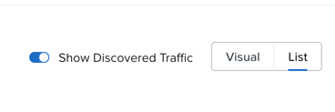

2.  นำทางกลับไปยัง visual view โดยคลิก **Visual**

#### Review and Save The Policy in Monitor Mode

เมื่อ inbound rules ทั้งหมดได้ถูกสร้างขึ้นเรียบร้อยแล้ว ให้เลือก **Next** ที่มุมขวาล่าง

คุณจะเห็นวิธีการที่ policy นี้สามารถถูกจัดเก็บได้ เรากำลังจะวาง policy ของเราใน monitor mode

1.  เลือก radio button **Apply (Monitor)**
    
2.  เลือก **Confirm** ที่มุมขวาล่าง
    
    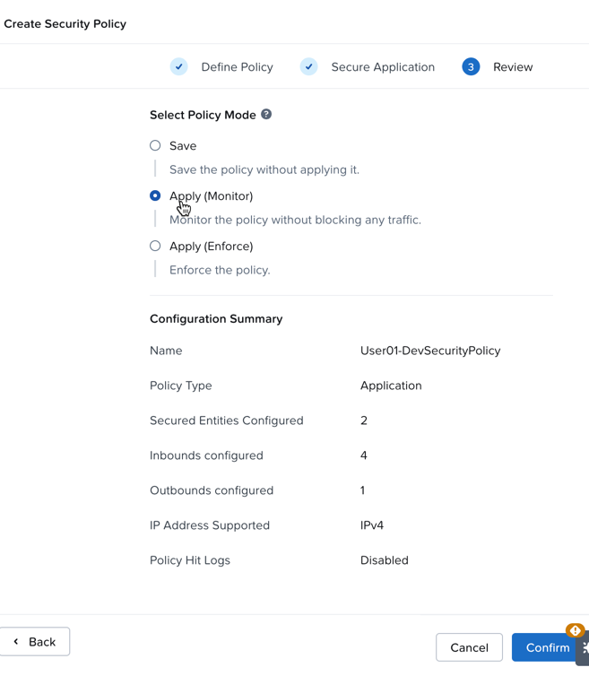

## Takeaways

application policy อนุญาตเฉพาะ traffic ที่เฉพาะเจาะจงให้เข้ามาได้ สิ่งใดที่ไม่ได้รับอนุญาตจะถูก drop ทิ้ง เราได้ทำการบันทึก policy เฉพาะนี้ในรูปแบบ monitor mode ดังนั้นมันยังคงอนุญาตให้มี traffic อยู่ และ exceptions ใดๆ ที่เกิดกับ policy นี้จะถูกแสดงให้เห็น (visualized)

นี่คือ policy mode ที่ยอดเยี่ยมสำหรับการสร้าง new policies โดยไม่กระทบต่อ applications ของคุณ
