# Clone the Policy

ตอนนี้เรามี ToDo application ที่มีการ protected และใช้งานได้ใน development environment ของเรา เรามีอีก instance หนึ่งของ ToDo App ของเราที่รันอยู่ใน production environment แต่มันถูกเปิดกว้างทั้งหมดโดยไม่มี security policy

มาดูกันว่าเราจะสามารถใช้ประโยชน์จากความพยายามในการสร้างและ securing ตัว development ToDo app ของเราใน production environment ได้อย่างไร

เราจะทำการ clone ตัว **User`##`\-DevSecurityPolicy** เพื่อใช้เป็น baseline สำหรับ production Todo application security policy ของเรา

การ cloning ทำให้สามารถคัดลอก (copy) ตัว complex policy ออกมาได้ สิ่งนี้จะมีประโยชน์อย่างมากสำหรับ production version ของ app ของเรา

## Make a Copy

1.  ไปที่ **Infrastructure** > **Network & Security** > **Security Policies** > **Policy Type: Application**
    
2.  เลือก **User`##`\-DevSecurityPolicy** โดยคลิกที่ check box ทางด้านซ้ายของ policy
    
3.  เลือก Clone operation ในแถบเมนูด้านบน
    
    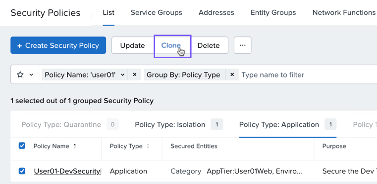

4.  เปลี่ยนชื่อ policy โดยตั้งค่า Policy Name เป็น **User`##`\-`Prod`SecurityPolicy**
    
5.  Update ตัว description เพื่อให้สะท้อนถึงการปกป้อง (protecting) ตัว prod environment ToDo application
    
6.  เลือก Next
    
    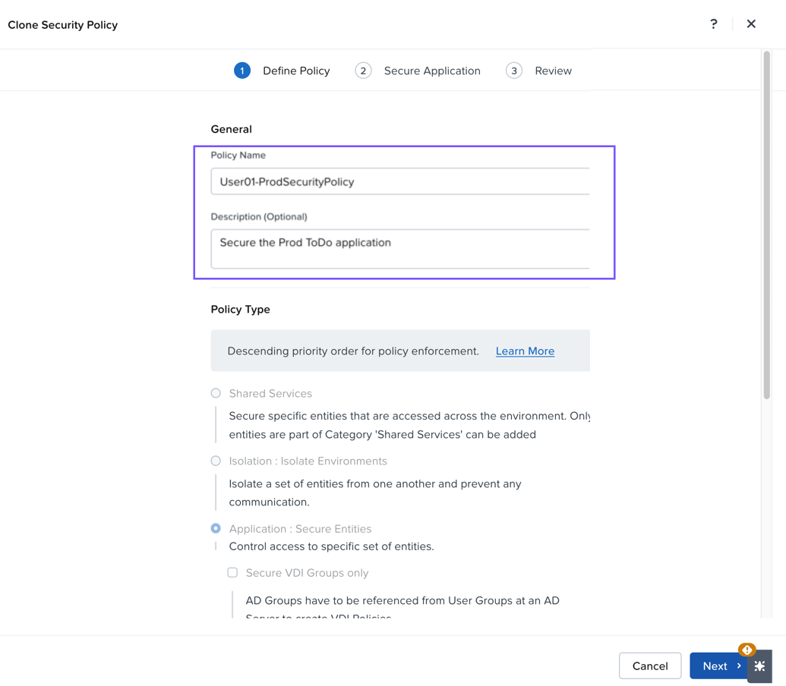

## Update the Database Secured Entities

เราจำเป็นต้อง update ตัว Secured Entities ของเราที่อยู่ตรงกลางของ policy เพื่อให้แน่ใจว่าตอนนี้เรากำลัง protecting ตัว application ใน Prod Environment

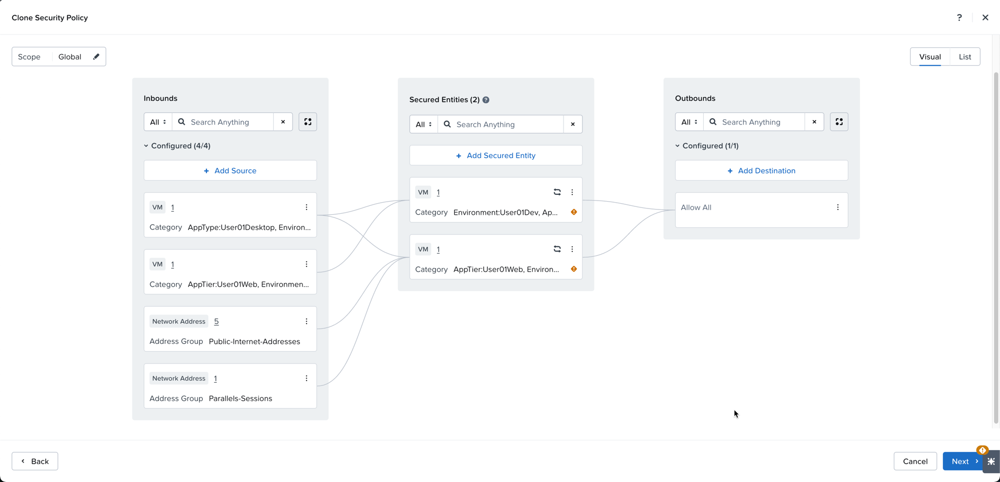

เราจะเริ่มต้นที่ DB tier

1.  คลิกจุด 3 จุดที่ด้านขวาของ development database Secured Entity
    
2.  เลือก Edit
    
    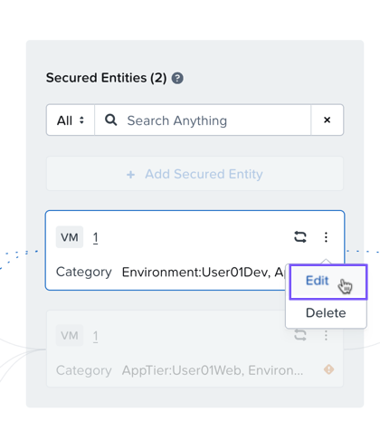

3.  ลบ (Remove) category **Environment:User`##`Dev**

    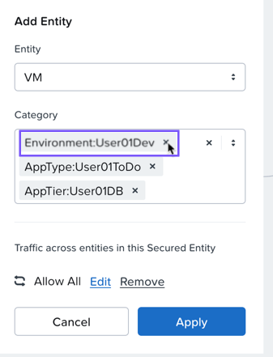

4.  เพิ่ม category **Environment:User`##`Prod**

    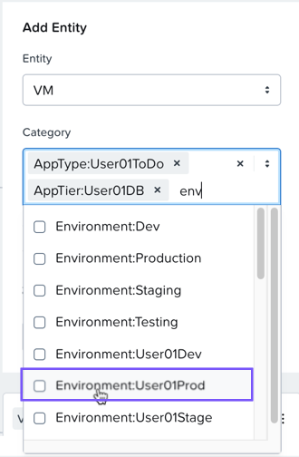

    ปล่อย categories อื่นๆ ไว้โดยไม่ต้องเปลี่ยนแปลง หน้าตาควรจะออกมาคล้ายๆ แบบนี้

    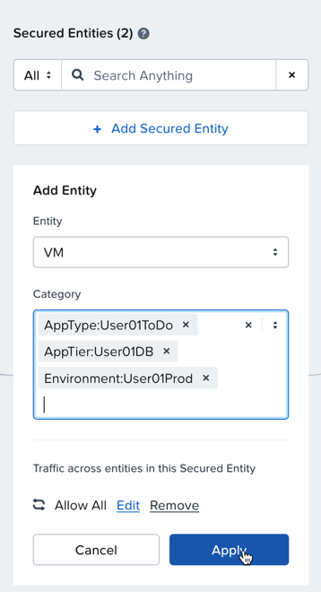

5.  เลือก Apply

## Update the Web Secured Entities

ตอนนี้เราจะทำซ้ำขั้นตอนเหล่านี้สำหรับ web tier

1.  คลิกจุด 3 จุดที่ด้านขวาของ web Secured Entity
    
2.  เลือก Edit
    
    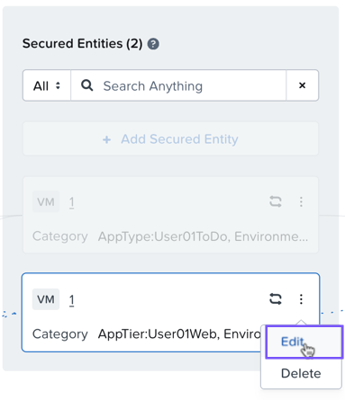

3.  ลบ (Remove) category **Environment:User`##`Dev**

    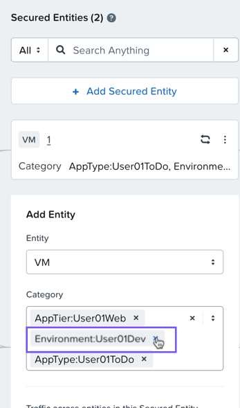

4.  เพิ่ม category **Environment:User`##`Prod**

    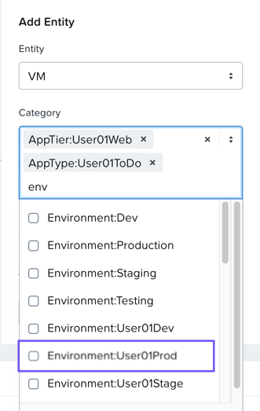

    ปล่อย categories อื่นๆ ไว้โดยไม่ต้องเปลี่ยนแปลง หน้าตาควรจะออกมาคล้ายๆ แบบนี้

    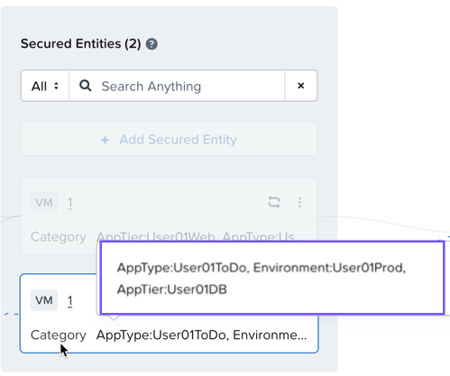

5.  เลือก Apply

## Update Inbound Web to Database Access

กระบวนการเดียวกันนี้จะต้องทำให้เสร็จสมบูรณ์ใน inbound rule ของเรา ซึ่งจะ permits ให้ Web tier สามารถสื่อสารกับ database tier ได้

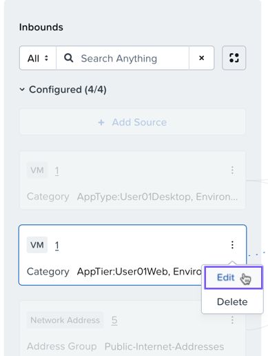

1.  คลิกจุด 3 จุดที่ด้านขวาของ Inbounds web source
    
2.  เลือก Edit
    
3.  Update ตัว category สำหรับ inbound web source จาก values ต่อไปนี้:
    
    -   **AppTier:User`##`Web**
    -   **AppType:User`##`ToDo**
    -   **Environment:User`##`Dev** <-- ลบ (Delete) อันนี้

    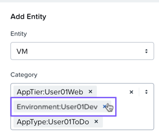

4.  ตั้งค่า category สำหรับ inbound web source ด้วย values ต่อไปนี้:
    
    -   **AppTier:User`##`Web**
    -   **AppType:User`##`ToDo**
    -   **Environment:User`##`Prod** <-- เพิ่ม (Add) อันนี้

    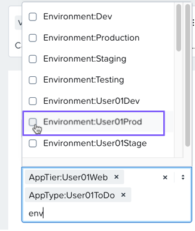

## No Changes for Address Group Sources

inbound sources ที่เป็น address groups จะไม่มีการเปลี่ยนแปลงใดๆ

## Update Desktop Source

1.  Update ตัว category ของ inbound desktop จาก values ต่อไปนี้:
    
    -   **AppType:User`##`Desktop**
    -   **Environment:User`##`Dev** <-- ลบ (Delete) อันนี้

2.  เป็น category values ต่อไปนี้:
    
    -   **AppTier:User`##`Desktop**
    -   **Environment:User`##`Prod** <-- เพิ่ม (Add) อันนี้

3.  เลือก Apply
    
    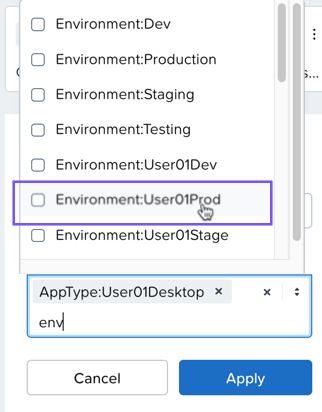

## Restrict Desktop Access with Rule Changes

เมื่อมองย้อนกลับไปที่ application requirements ก่อนหน้านี้ production desktop ของเราต้องการแค่ access ไปยัง **User`##`Web** tier เท่านั้น ไม่ควรมี access จาก production desktop ไปยัง production **User`##`DB** tier นี่เป็นสิ่งที่แตกต่างจากสิ่งที่เรามีใน development application policy ดังนั้นเรามาเปลี่ยนมันกันเถอะ!

1.  เลือก rule ที่ permitting ให้ **AppType:User`##`Desktop** สามารถสื่อสารกับ **AppTier:User`##`DB** ได้

    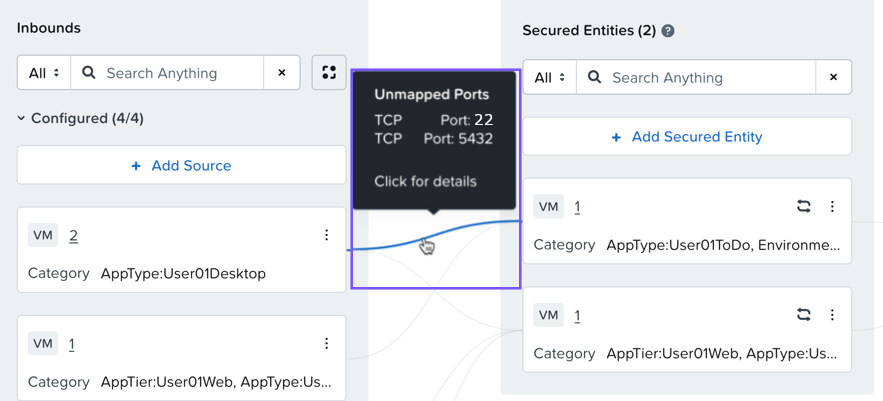

2.  คลิกเส้นสีน้ำเงินเชื่อมต่อที่แสดง allowed traffic
    
3.  เลือก **Delete All** ที่ด้านซ้ายล่างของ pop-up Edit Inbound Rule
    
    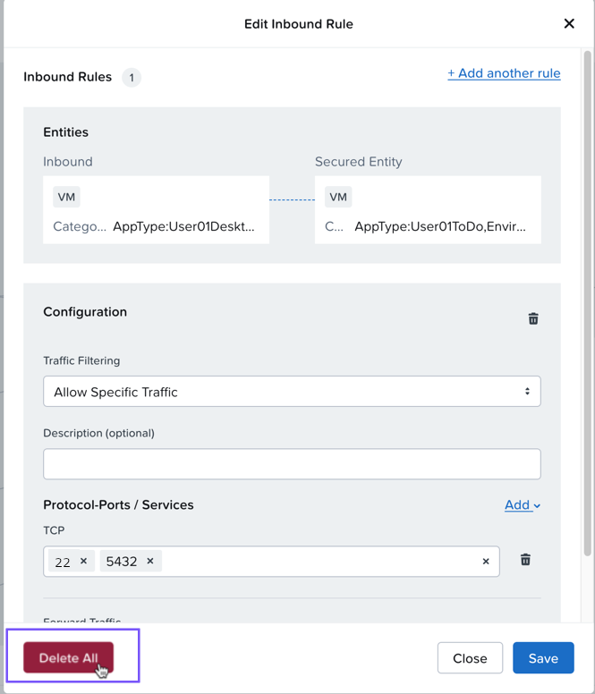

4.  เมื่อเสร็จแล้ว เลือก **Next**

    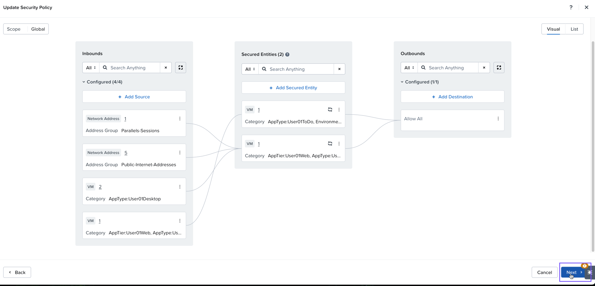

5.  เลือก **Apply (Monitor)**
    
6.  เลือก **Confirm**
    
    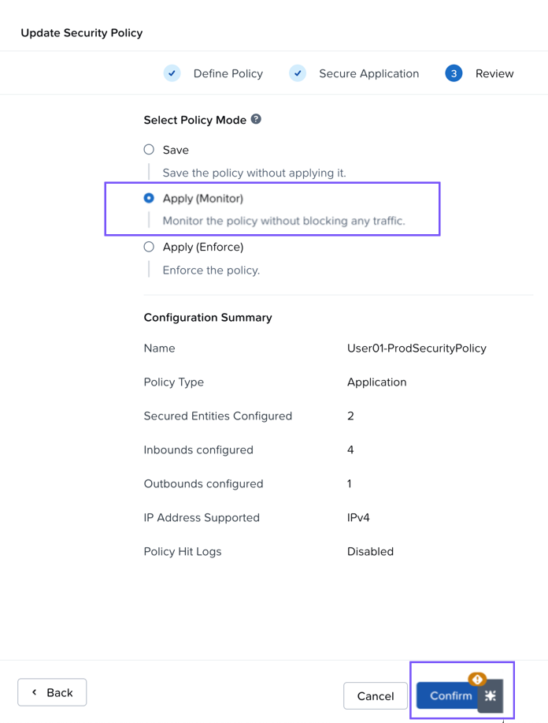

หลังจากการ save เสร็จสมบูรณ์ ให้รีวิว (review) production Security Policy ใหม่โดยคลิกที่ secured entities เพื่อให้แน่ใจว่า production VMs ของคุณแสดงขึ้นมาตามที่คาดหวัง

## Takeaways

ด้วยการเปลี่ยนแปลงเล็กน้อยเพียงไม่กี่อย่าง เราสามารถ clone ตัว existing policy เพื่อช่วยให้การสร้าง additional policy เร็วขึ้นอย่างเห็นได้ชัด งานที่เราทำเพื่อสร้าง development policy นั้นถูกนำมาใช้ซ้ำ (reused)