# Monitor and Enforce the Policy

มาตรวจสอบกันว่า policy ของเราทำงานตามที่คาดไว้หรือไม่ก่อนที่จะทำการ enforcing มัน

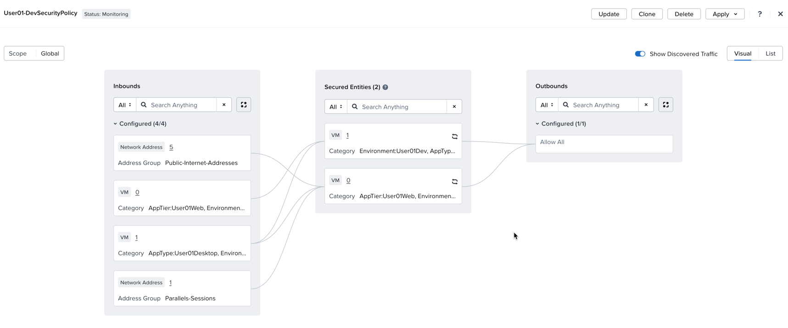

ด้วย policy ที่อยู่ใน Monitor Mode, traffic ทั้งหมดจะถูก allowed สิ่งนี้ช่วยให้เราสามารถทดสอบ policy ของเราเพื่อให้แน่ใจว่ามันกำลัง allow ตัว traffic ที่เราต้องการและ blocking ตัว traffic ที่เราไม่ต้องการ ใน mode นี้ traffic ที่ไม่ได้ถูก configured ไว้ใน policy ว่าเป็น allowed จะแสดงขึ้นมาเป็น discovered traffic

มาทดสอบสิ่งนี้กัน เราจะทำการ generate ตัว traffic บางส่วนแล้วไปดูที่ policy ของเรา

## Generate Test Traffic

1.  ใน Prism Central ไปที่ **Infrastructure** -> **Compute** -> **VMs**
    
2.  ค้นหา VM **user`##`\-dev-web** และจด IP address ของมันไว้ คุณจะต้องใช้มันในไม่ช้า VM นี้คือ secured entity ใน development policy ที่เราเพิ่งสร้างขึ้น
    
    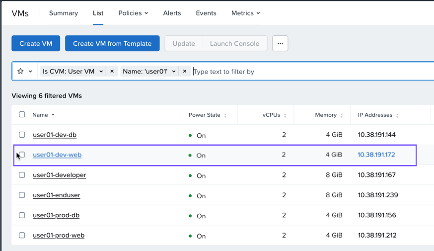

3.  ถัดไป ค้นหา VM **user`##`\-developer** ใน VM list
    
4.  คลิกขวาที่ VM **user`##`\-developer** และเลือก Launch Console
    
    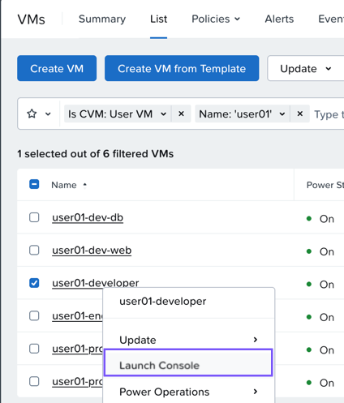

5.  Log into เข้า VM โดยใช้ user name nutanix และ lab password ที่ให้ไว้

    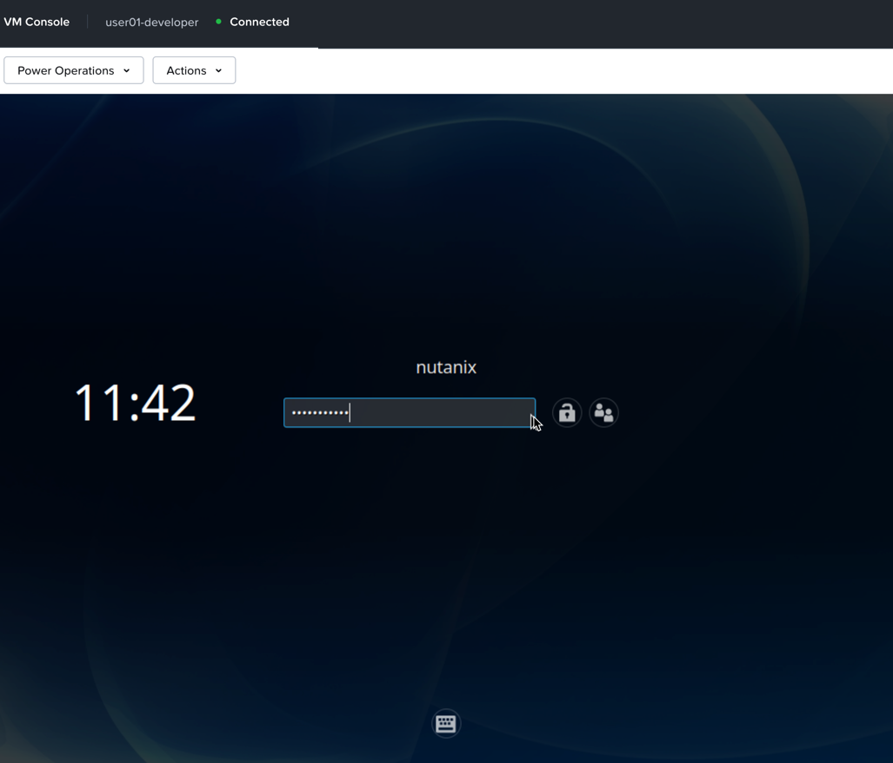

6.  เปิด terminal session บน User##-Developer VM
    
    -   (คลิกไอคอน terminal ที่เมนูด้านล่างของ VMs)

    

7.  ในหน้าต่าง terminal ให้ ping ไปยัง IP address ของ VM ที่จดไว้ก่อนหน้านี้

    ```
    ping 'user##-dev-web'
    ```

8.  ปล่อยให้ ping นี้รันต่อไป

    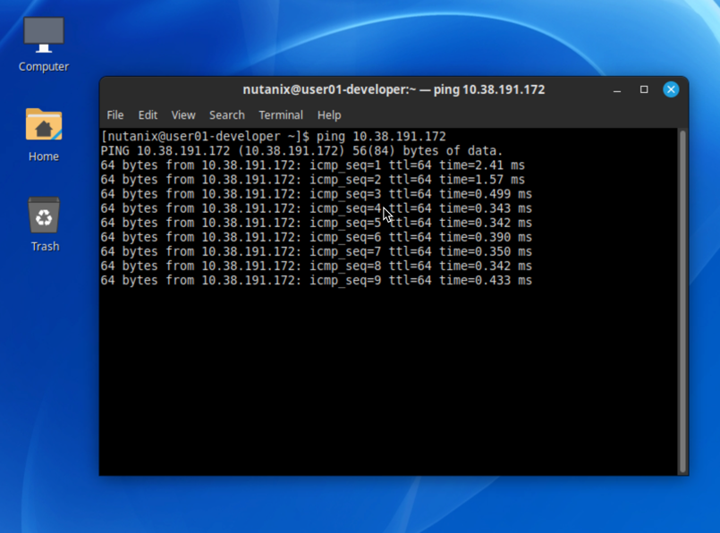

## View Discovered Traffic in Policy

เรากลับไปดูกันว่า traffic นี้ซึ่งควรจะถูก blocked โดย policy ของเรา จะแสดงผลอย่างไรเมื่อ policy อยู่ใน monitor mode

1.  ใน Prism Central ไปที่ **Infrastructure** -> **Network & Security** -> **Security Policies**

    !!! note
        Security policies จะถูกจัดกลุ่มตาม Policy Type เนื่องจาก policy ของเราคือ `Application` เราจึงต้องเลือก type นี้

2.  เลือก **Policy Type: Application**
    
3.  เลือก application policy **User`##`\-DevSecurityPolicy** ที่คุณสร้างไว้ก่อนหน้านี้
    
    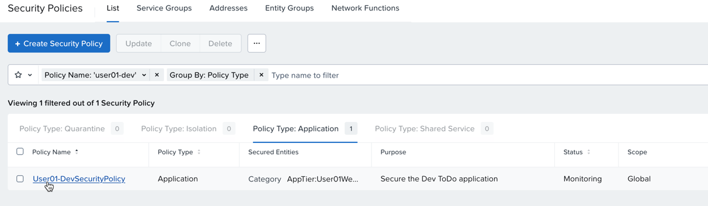

เราจะเห็น traffic นี้แสดงขึ้นมาเป็น discovered โดยมีสีเหลืองไฮไลต์ไว้ เมื่อ traffic แสดงเป็น discovered นั่นหมายความว่ามันจะไม่ได้รับการ permitted ภายใต้ configured rules ของ policy นี้

สิ่งสำคัญที่ต้องย้ำคือ เมื่อ policy อยู่ใน monitor mode ตัว traffic ทั้งหมดจะถูก permitted โดยไม่คำนึงถึง configured rules

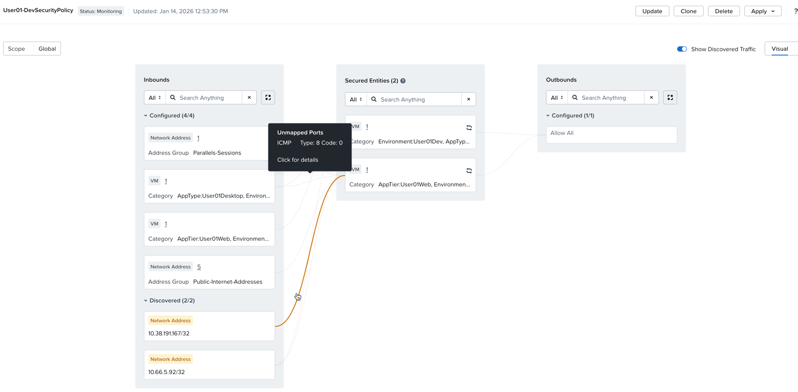

## Enforce the Policy

ตอนนี้มา apply ตัว policy นี้ใน enforce mode กัน mode นี้จะ allow เฉพาะ configured traffic และ traffic อื่นๆ ทั้งหมดจะถูก blocked

1.  จากมุมมอง Security Policy ให้เลือก drop down สำหรับ Apply ที่มุมขวาบน
    
2.  เลือก Apply (Enforce)
    
    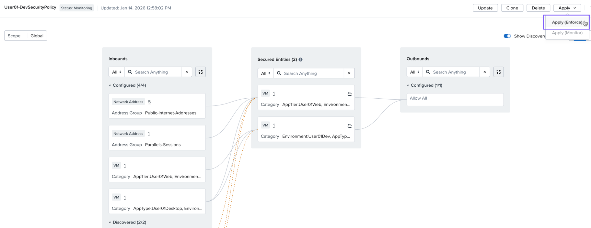

3.  กล่องยืนยัน (confirmation box) สำหรับ secondary action จะปรากฏขึ้น
    
    -   พิมพ์ **ENFORCE** ลงในกล่อง

4.  เลือก Confirm
    
    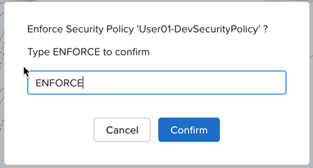

    !!! note
        คุณอาจต้องรอสักสองสามวินาทีเพื่อให้ discovered traffic แสดงขึ้นมา

หากคุณใจร้อน ⌛ คุณสามารถปิด policy แล้วเปิดขึ้นมาใหม่จากมุมมอง policy list

Traffic ที่เคยแสดงเป็น discovered ด้วยสีเหลือง ตอนนี้จะแสดงเป็น blocked ด้วยสีแดง

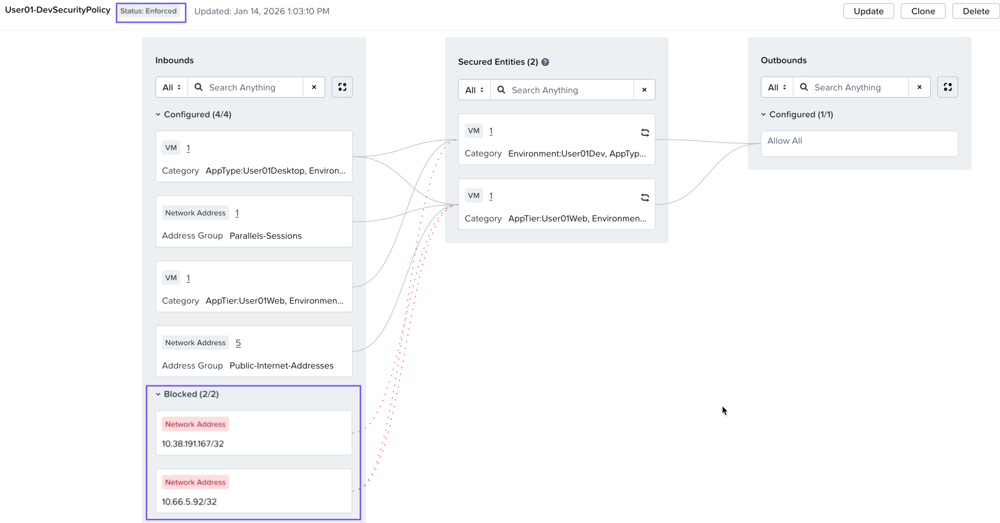

## Check Application Connectivity

1.  กลับไปที่ **user`##`\-developer** VM console
    
2.  VM ยังสามารถ ping ไปยัง **user`##`\-dev-web** VM ได้หรือไม่?
    
    -   ไม่ได้แล้ว! policy ของเราไม่ allow ตัว traffic นี้

    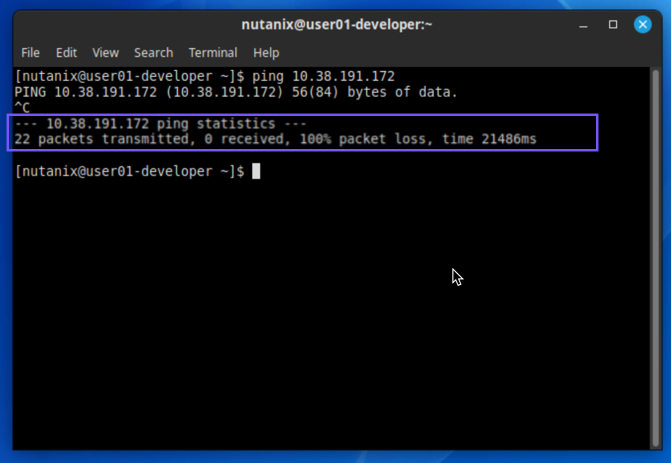

3.  ใน VM console เดียวกันนั้น ให้เปิด browser ขึ้นมา
    
    -   เลือกไอคอน Firefox ที่แถบด้านล่าง

    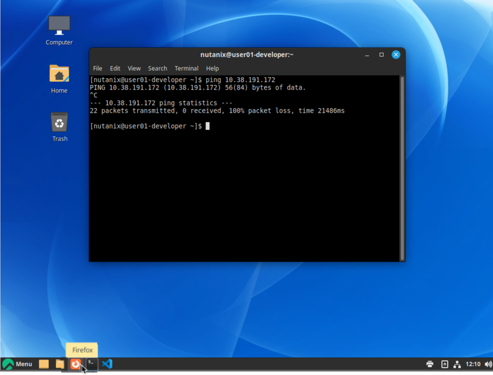

4.  พิมพ์ IP address ของ **user`##`\-dev-web** ลงไป

    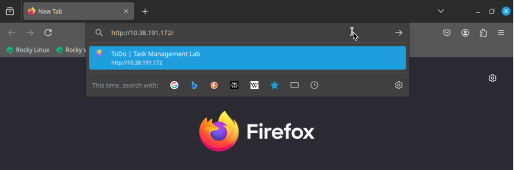

คุณสามารถเข้าถึง ToDo app ได้หรือไม่?

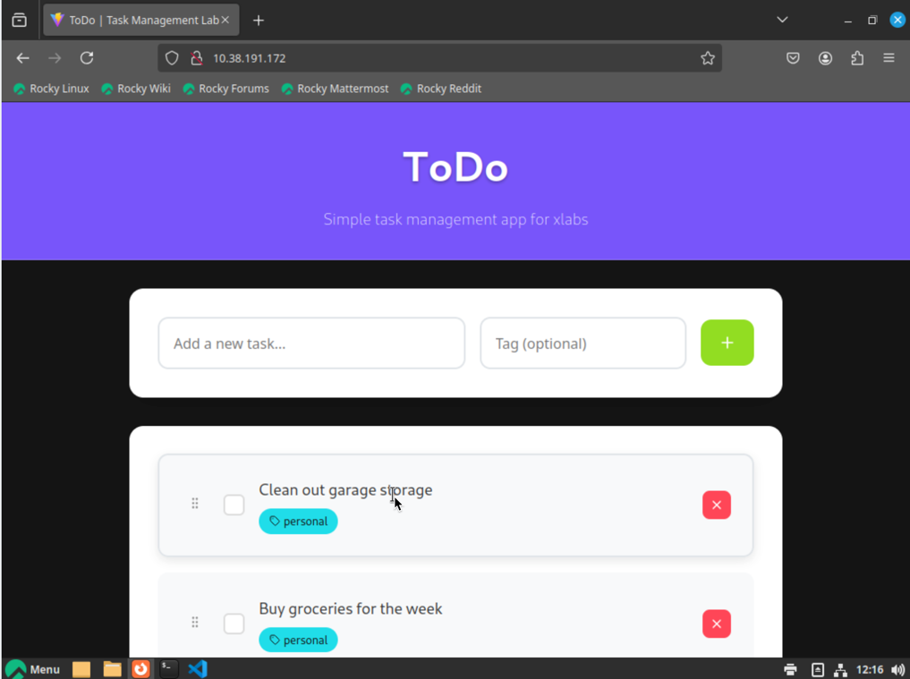

traffic นี้ได้รับ permission จาก security policy ของเรา! นี่คือ application ที่ทำงานได้ตามปกติ (working application) ลองเพิ่ม new tasks ลงใน application ดูได้เลย

สำหรับทุกๆ task ที่ถูก added หรือ deleted ตัว web VM ของเราจะสื่อสารกับ database ผ่าน TCP port 5432 ซึ่งได้รับ allow ไว้ใน security policy ของเราด้วยเช่นกัน!

## Takeaways

Flow Network Security ทำให้การ create และ update ตัว security policies เป็นเรื่องง่าย Monitor mode มีประโยชน์อย่างมากในการแสดง discovered traffic ก่อนที่จะทำการ enforcing ตัว security policy
