# Verify the Policy

ตอนนี้ production policy ของเราถูกนำมาใช้งานแล้ว มาตรวจสอบกันว่า traffic Flows ทั้งหมดของเราเป็นไปตามที่คาดไว้หรือไม่ 😉

## Access the Production App

1.  ใน Prism Central ไปที่ **Infrastructure** > **Compute** > **VMs**
    
2.  ค้นหา VM IP address ของ **user`##`\-prod-web** ของคุณ
    
    -   จดบันทึกไว้ คุณจะต้องใช้สำหรับการทดสอบ

    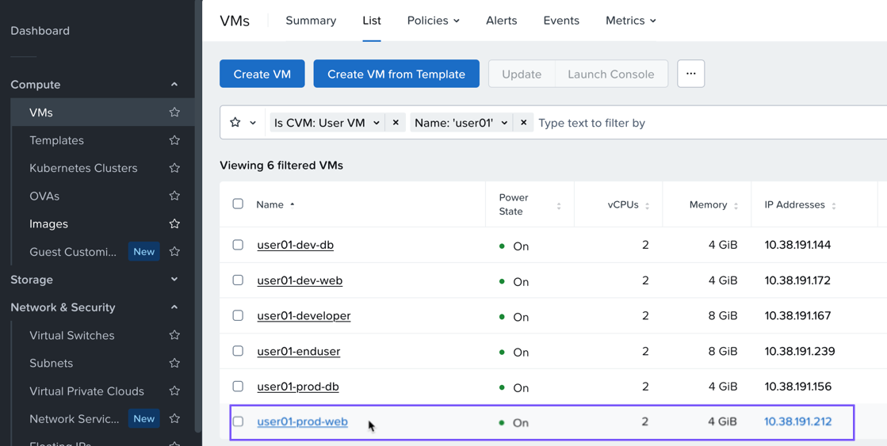

### Verify Ping Access to the Application

1.  จากมุมมอง Prism Central VM ให้เลือก VM **user`##`\-enduser** ของคุณ
    
2.  เปิด console session ไปยัง VM โดยการคลิกขวาที่ VM หรือเลือก VM แล้วไปที่ **Launch Console**
    
    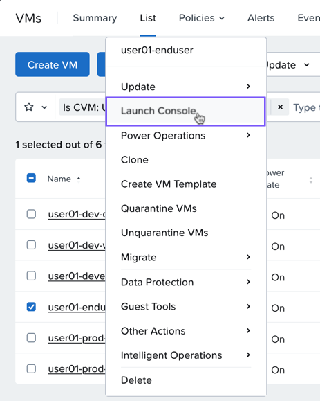

3.  หากมีการแจ้งเตือน (prompted) ให้ login ให้ใช้ username nutanix และ cluster password ที่ให้ไว้เมื่อเริ่ม lab
    
4.  จากภายใน **user`##`\-enduser** VM console session ให้เปิด terminal session โดยใช้ไอคอน terminal ที่ด้านซ้ายล่าง
    
    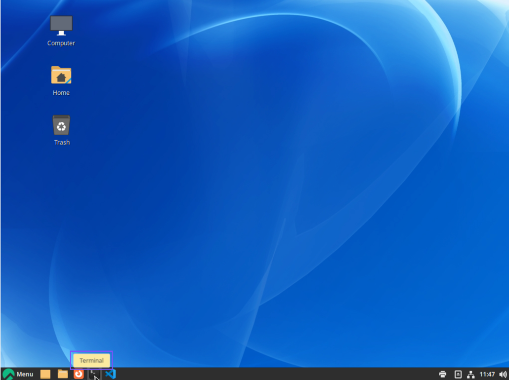

5.  ใน terminal session ให้ ping ไปยัง IP address ของ **user`##`\-prod-web** VM ที่คุณจดบันทึกไว้ก่อนหน้านี้

    ```
    ping 'user##-prod-web-ip'
    ```

    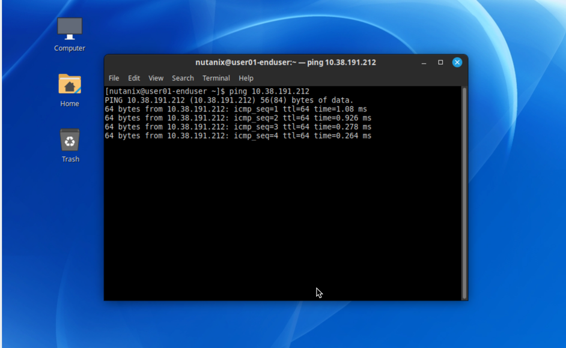

    การ pings ควรจะสำเร็จเนื่องจาก policy ของเราอยู่ใน monitor mode ปล่อยให้ pings เหล่านี้รันต่อไป

    เราจะ enforce ตัว policy นี้ในภายหลัง เนื่องจาก pings ไม่ควรถูก allowed ใน production application ของเราตาม requirements ก่อนหน้านี้

### Verify Web Access to the Application

access เดียวที่เราควร allow ให้กับ application คือผ่านทาง web ดังนั้นมาตรวจสอบให้แน่ใจว่ามันทำงานได้

1.  ภายใน **user`##`\-enduser** VM console เดียวกัน ให้เปิดเบราว์เซอร์ Firefox

    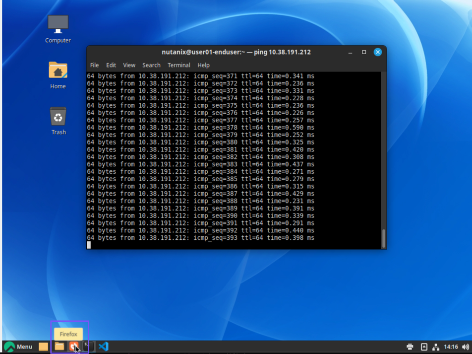

2.  ในแถบที่อยู่ของเบราว์เซอร์ ให้พิมพ์ address ของ **user`##`\-prod-web** VM ที่คุณบันทึกไว้ก่อนหน้านี้
    
    -   รูปแบบควรจะเป็น `http://IP.address.of.prod-web.VM`

    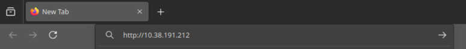

4.  กด Enter

    คุณควรจะเห็น Prod ToDo App ของคุณรันอยู่ สิ่งนี้แสดงให้เห็นว่าคุณสามารถเข้าถึง application ได้ และ application สามารถเข้าถึง database ได้

    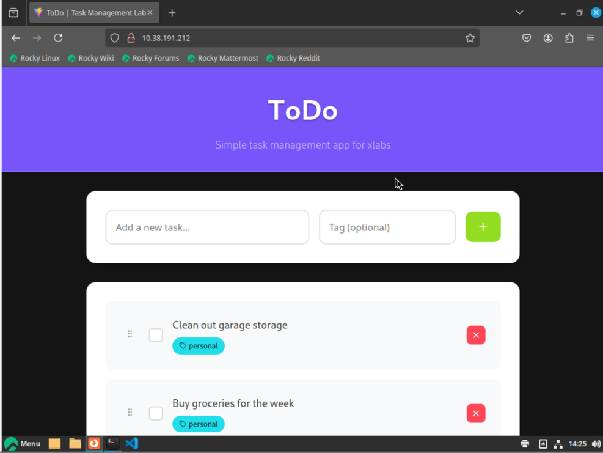

5.  ย่อ (Minimize) หรือย้ายหน้าต่าง VM console เพื่อให้เราสามารถกลับไปดู security policy ได้

## Check the Security Policy

ตอนนี้มาดูที่ **User`##`\-ProdSecurityPolicy**

ใน Prism Central ไปที่ **Infrastructure** > **Network & Security** > **Security Policies** > **Policy Type: Application** และเลือก **User`##`\-ProdSecurityPolicy**

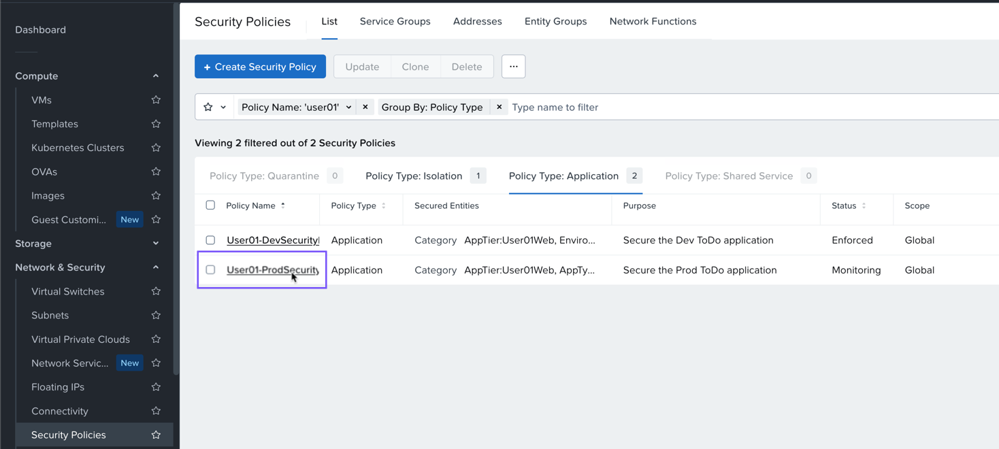

ด้วย security policy ของเราใน Monitor mode เราจะเห็น ping traffic จาก **user`##`\-enduser** VM แสดงขึ้นมาเป็น discovered traffic ในสีเหลือง

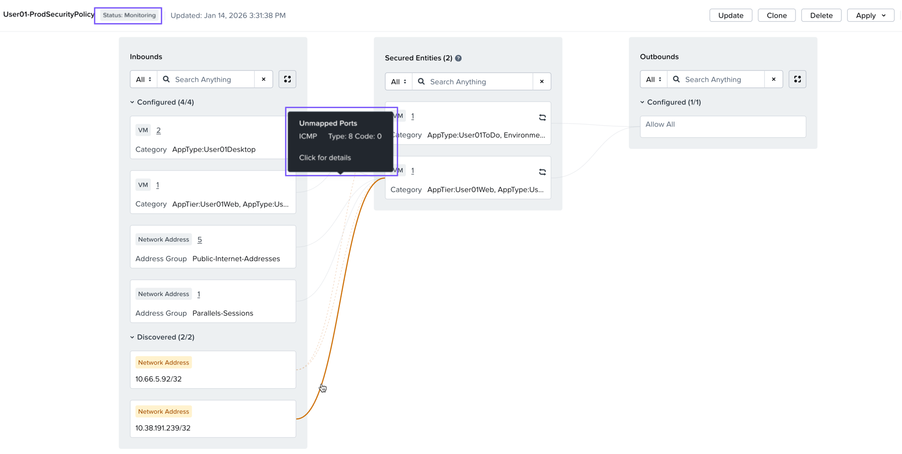

### Enforce the Security Policy

มาเปลี่ยน mode ของ policy นี้จาก Monitor เป็น Enforce และดูว่าเกิดอะไรขึ้น

1.  ขยาย Apply dropdown ที่มุมขวาบนของหน้า policy details
    
2.  เลือก **Apply (Enforce)**
    
    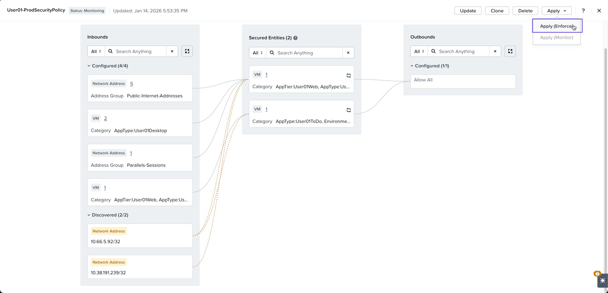

3.  ใน confirmation box ให้พิมพ์ **ENFORCE** และเลือก **Confirm**

    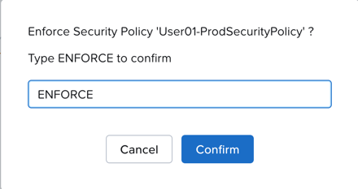

## Check the Application Again

1.  นำทางกลับไปยัง **user`##`\-enduser** VM console session
    
2.  เปิด terminal session ใน VM ขึ้นมา
    
    -   คุณยังสามารถ ping ไปยัง **user`##`\-prod-web** VM ได้สำเร็จหรือไม่?

    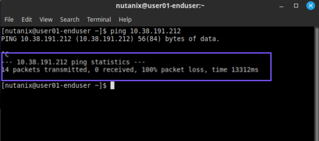

    traffic ประเภทนี้จาก **user`##`\-enduser** VM ของเราไปยัง **user`##`\-prod-web** VM ไม่ได้รับอนุญาต (not permitted) ใน policy ของเรา เมื่อ security policy ถูก Enforced แล้ว traffic นี้กำลังถูก dropped

    

3.  สุดท้าย กลับไปที่ console ของเราสำหรับ **user`##`\-enduser** VM
    
4.  ใช้ Firefox ภายใน VM's console เพื่อเปิด IP address ของ **user`##`\-prod-web** VM ของคุณ
    
    -   คุณควรจะเห็นหน้า web สำหรับ Prod ToDo application ของคุณ

    

5.  เพิ่ม Item ลงใน ToDo app

    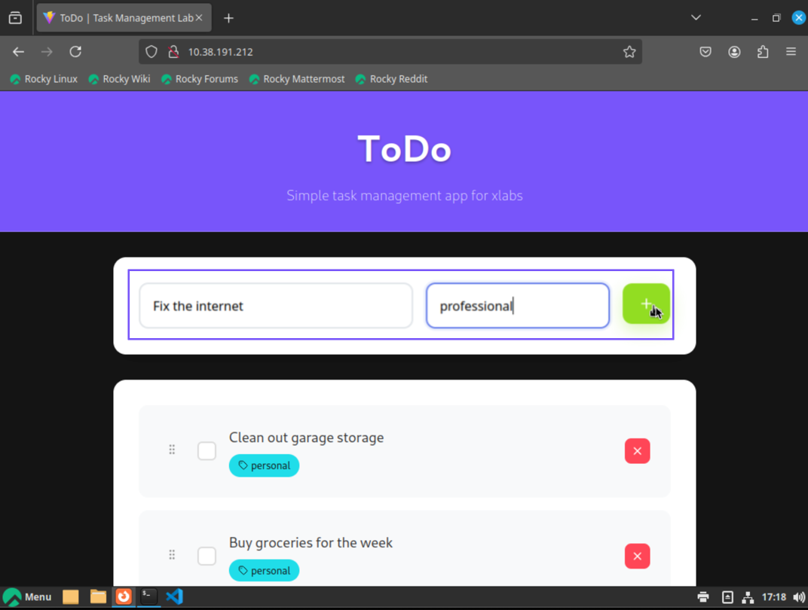

    action นี้จะสร้าง item ใหม่ใน database ของเรา

    ดังนั้นเป็นการทดสอบ connectivity จาก:

    -   **AppTier:User`##`Web**
    -   **AppType:User`##`ToDo**
    -   **Environment:User`##`Prod**

    ไปยัง:

    -   **AppTier:User`##`DB**
    -   **AppType:User`##`ToDo**
    -   **Environment:User`##`Prod**

การทดสอบนี้แสดงให้เห็นว่า ports ที่จำเป็นเพื่อให้ application ของเราสามารถทำงานได้นั้นถูกเปิดไว้ และสิ่งอื่นๆ ทั้งหมดเช่น ping จะถูก protected โดย security policy

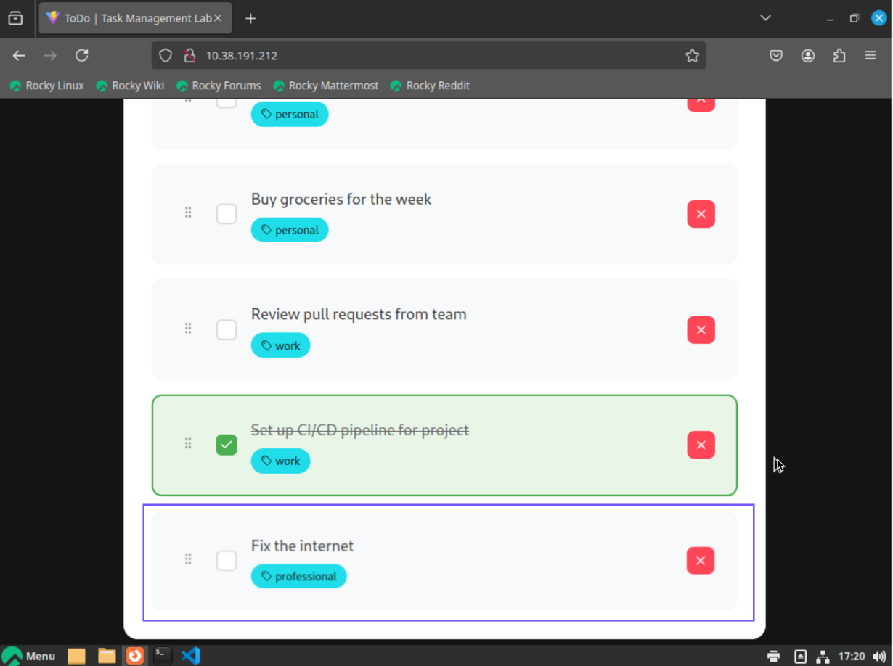

มันไม่ได้ยากเกินไปใช่ไหม?

นี่คือมุมมองอีกแบบของสิ่งที่เราเพิ่งสร้างขึ้น

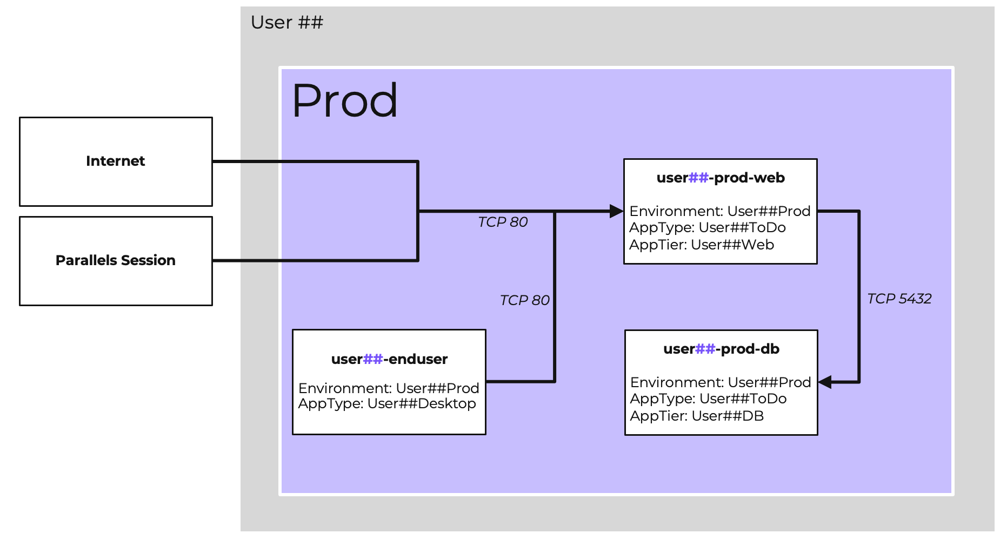

### From the VM Perspective

เรายังสามารถตรวจสอบ associated policies และ categories จากมุมมองของหนึ่งใน web VMs ของเราได้ ลองตรวจสอบที่ dev แต่คุณก็สามารถตรวจสอบที่ prod ได้เช่นกัน

1.  ไปที่ **Infrastructure** > **Compute** > **VMs**
    
2.  คลิกที่ชื่อ dev web VM ของคุณ **user`##`\-dev-web**
    
3.  เลือก Categories
    
    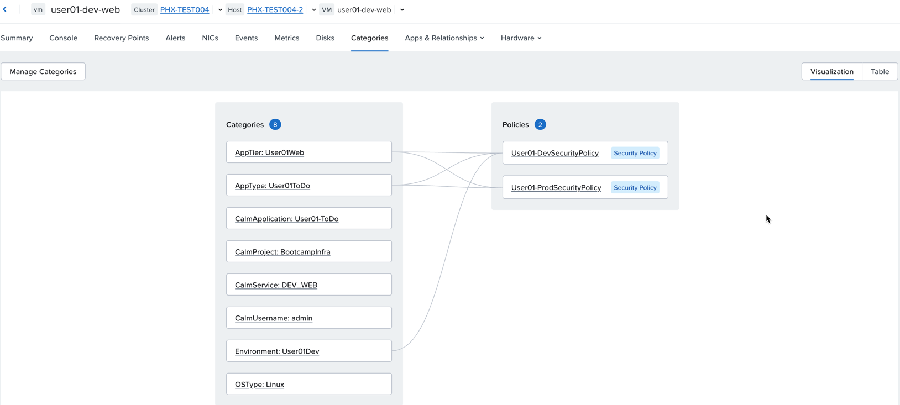

4.  สังเกตว่าเราสามารถมองเห็น associated categories และ security policies ที่ถูก mapped เข้ากับ VM ผ่าน categories เหล่านั้นได้

## Takeaways

Flow Network Security Next-Gen เป็นเครื่องมือที่ทรงพลังและยืดหยุ่นสำหรับการ securing ตัว applications ของคุณ คุณสามารถผสมผสาน (Combine) ตัว Flow Network Security policies หลายประเภทเพื่อทำ protection ให้กับ applications ของคุณ ใช้ฟีเจอร์ต่างๆ เช่น การ saving ตัว policy โดยไม่ต้อง applying, การ cloning ตัว policy เพื่อเริ่มต้นด้วย baseline ที่ดี, และ monitor mode เพื่อให้แน่ใจว่า policy จะบรรลุเป้าหมายที่ต้องการโดยไม่ทำให้สิ่งใดพังทลาย

ขอแสดงความยินดี คุณทำได้แล้ว! 🎉
