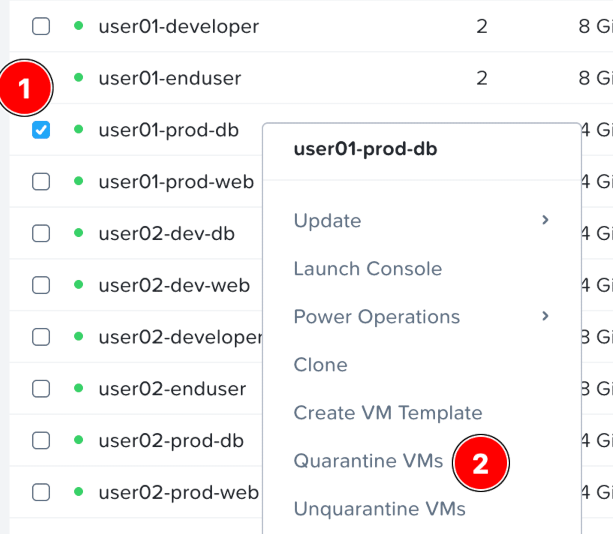
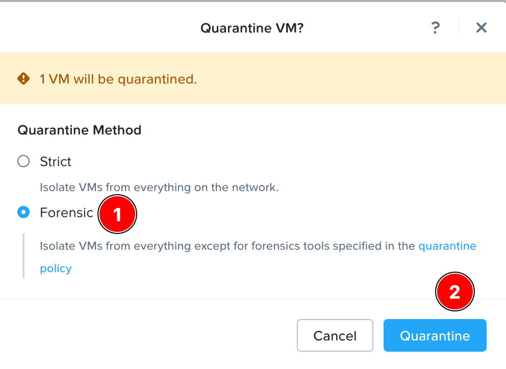
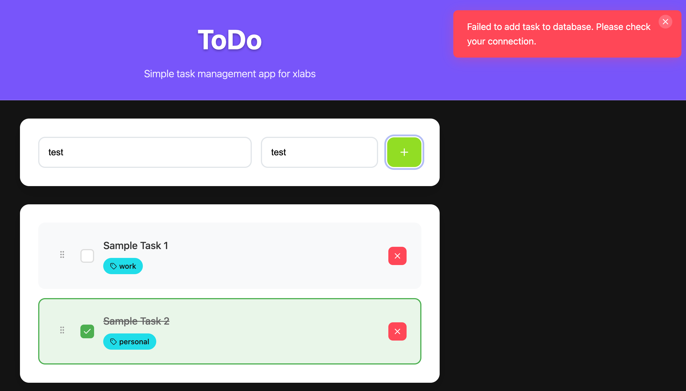
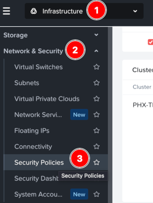
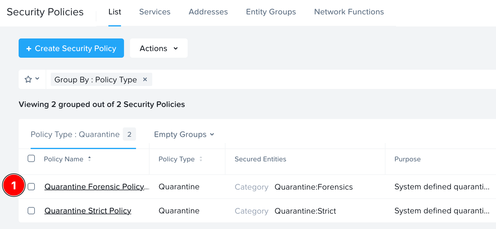
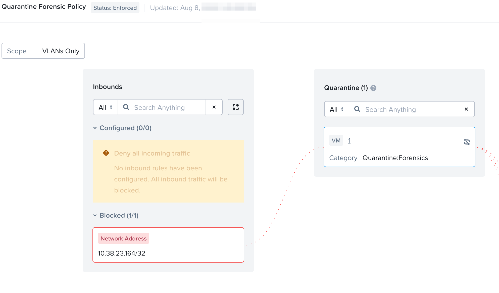
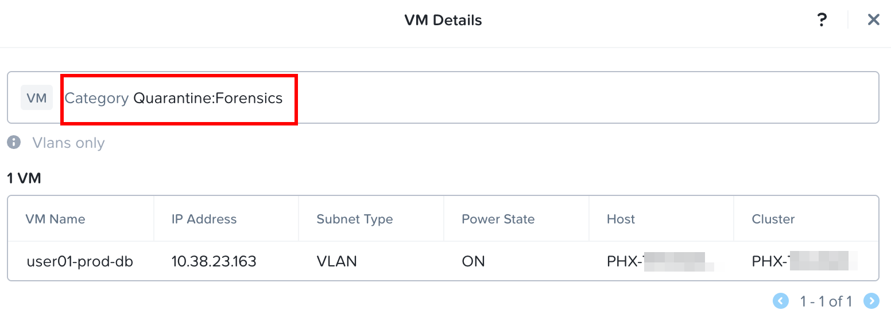

# Quarantine a VM

ก่อนที่เราจะเริ่มต้นกับ security policies ที่ขั้นสูงขึ้นเพื่อ implement ตาม requirements ทั้งหมดของเรา ลองมาตรวจสอบ operation ที่ง่ายที่สุดของ Flow Network Security นั่นคือ Quarantine

## Quarantine Forensic

เพื่อตรวจสอบว่า Flow Network Security กำลัง enforcing traffic อยู่ ลองจินตนาการว่า production database ถูก compromised และเราต้องการทำ quarantine มันให้เร็วที่สุดเท่าที่จะเป็นไปได้

1.  กลับไปที่ Prism Central
    
2.  เลือก **Infrastructure** > **Compute** > **VMs**
    
3.  คลิกขวาที่ **user`##`\-prod-db** และเลือก **Quarantine VMs**
    
    

    สิ่งนี้จะแสดงตัวเลือกของ Quarantine Strict หรือ Quarantine Forensic. Forensic จะอนุญาตให้เปิด specific sources และ destinations สำหรับการตรวจสอบ ดังนั้นเราจะเลือกสิ่งนั้น

4.  เลือก **Forensic** และเลือก **Quarantine**

    

## Verify Application Operation

มาดูกันว่าเกิดอะไรขึ้นกับ application ของเราเมื่อ database ออฟไลน์

1.  นำทางกลับไปยังเบราว์เซอร์ Chrome ใน Parallels desktop ของคุณ หรือ Firefox ใน user`##`\-enduser desktop
    
2.  ลอง add หรือ delete ตัว task จาก ToDo app
    
    คุณควรจะเห็นข้อผิดพลาด (failure) ที่มุมขวาบนของ ToDo app

    

## View Security Policy

มาดูกันว่าหน้าตาจะเป็นอย่างไรภายใน security policy

1.  ไปที่ Prism Central **Infrastructure** > **Network & Security** > **Security Policies**

    

    !!! note
        คุณอาจเห็น guided tutorial pop-up หากนี่เป็นครั้งแรกที่คุณเข้ามาที่หน้านี้ สามารถอ่านและจากนั้นปิด pop-up นี้ได้เลย

        ตัว policies จะถูกจัดกลุ่มตาม Policy Type และ Quarantine คือกลุ่มแรกที่แสดง

2.  เลือก **Quarantine Forensic Policy**

    

3.  สังเกตว่า web server แสดงขึ้นมาเป็น blocked source ทางด้านซ้ายมือ

    

4.  เลื่อนเมาส์ (Hover) เหนือเส้นประสีแดงของ blocked traffic ระหว่าง source ทางด้านซ้ายและ Quarantine secured entity ตรงกลาง
    
    -   สังเกตว่า TCP port 5432 คือ blocked port ที่แสดงอยู่ใน pop-up

5.  คลิกที่ **VM #** ตรงกลางของ policy. สิ่งนี้จะแสดง Forensic quarantined VMs ทั้งหมดและรายละเอียดของพวกมัน สังเกตว่า quarantine process เพียงแค่ทำการ apply ตัว category **Quarantine: Forensics** ไปยัง VMs เหล่านี้
    
    

6.  คลิก **Close** ด้วยเครื่องหมาย **X** ที่มุมขวาบนของ security policy
    
7.  นำทางกลับไปยัง **Infrastructure** > **Compute** > **VMs**
    
8.  คลิกขวาที่ **user`##`\-prod-db** และเลือก **Unquarantine VMs**
    
9.  คลิก **Unquarantine**
    

## Takeaways

Flow Network Security Next-Gen ใช้ categories และ policies เพื่อทำ restrict traffic. ตัว Policy Type ที่มี priority สูงสุดคือ Quarantine. ตัว traffic ใดๆ ที่ถูก blocked สามารถถูกมองเห็นได้แบบ visually ใน policy

---

[← Back: The Application](flow-env-application.md) | [Home](flow-overview.md) | [Next: Isolation Policies →](flow-basic-isolation.md)