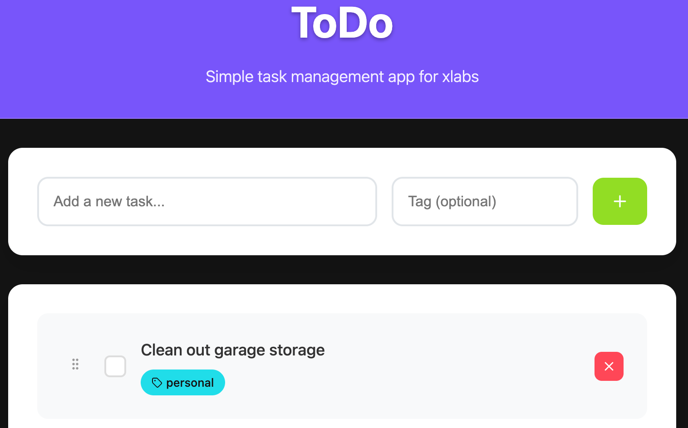
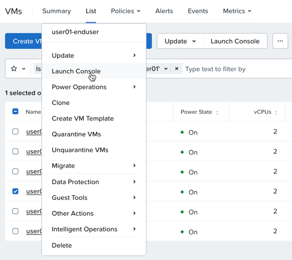
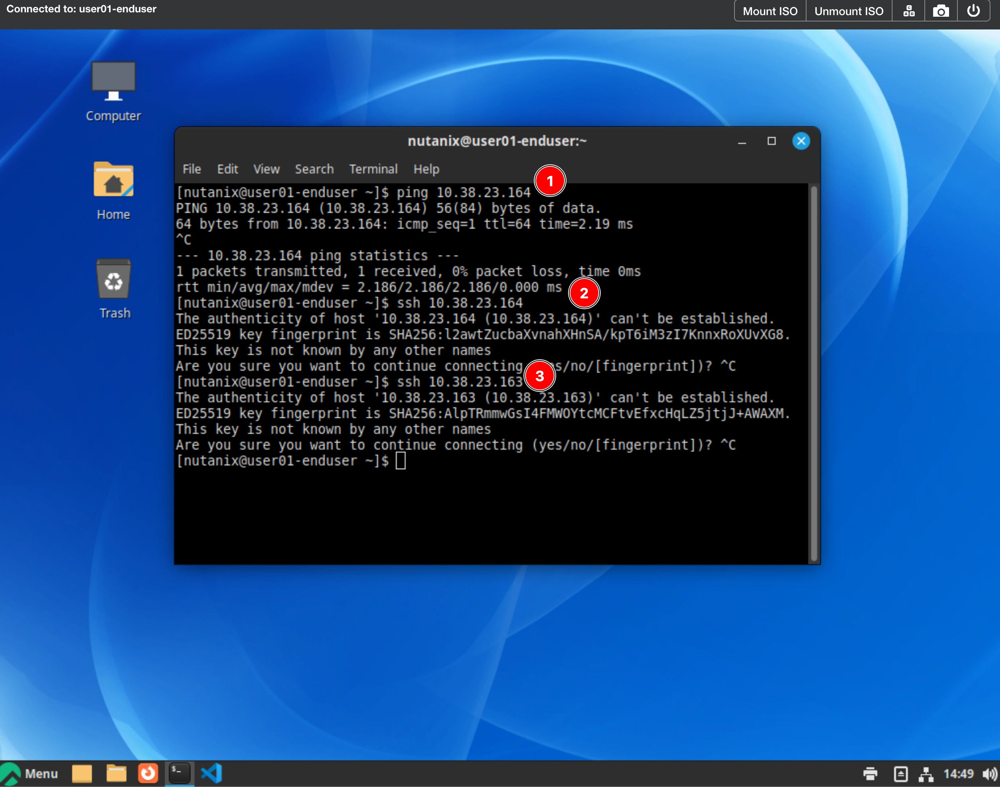
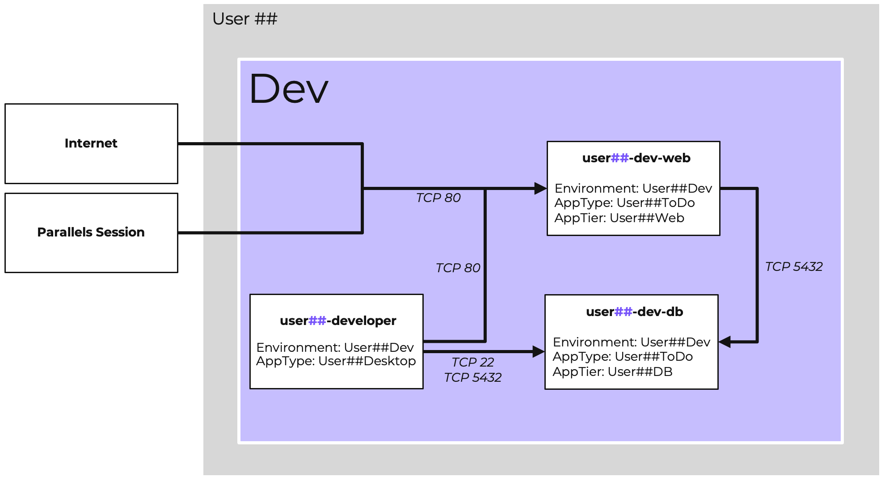
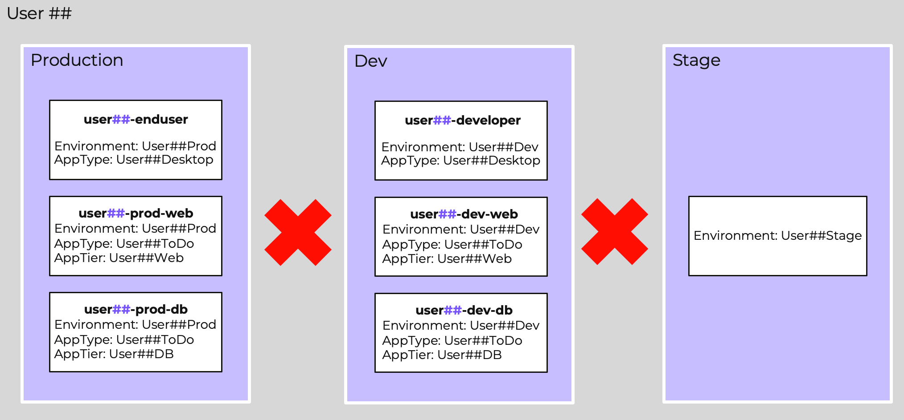

# The Application

สภาพแวดล้อม lab มี application ที่รันอยู่แล้ว โดยมี virtual machines ทั้งหมด 6 เครื่องสำหรับแต่ละ user. สามเครื่องสำหรับ production และสามเครื่องสำหรับ development. เรามี web และ database application แบบง่ายๆ พร้อมกับ client. ตอนนี้เรามาโฟกัสแค่ 3 VMs ในส่วน production ของ application กันก่อน.

เป้าหมายของคุณคือการทำความคุ้นเคยกับ application และทำการ apply ชุดของ security rules เพื่อให้ตรงตาม business requirements ของเรา.

## Exploring the Application

ค้นหา IP address ของ production web server ของคุณโดยใช้ Prism Central.

1.  ภายใต้ **Infrastructure** ให้เลือก **Compute** > **VMs**
    
2.  พิมพ์ **user`##`** ลงในช่อง search.
    
3.  จดบันทึก IP address ของ prod-web server ที่ชื่อ **user`##`\-prod-web**.
    
    -   คุณจะต้องใช้สิ่งนี้ในภายหลัง ดังนั้นเราขอแนะนำให้จดบันทึกไว้เพื่อให้ง่ายต่อการ copy และ paste. คุณสามารถใช้ notepad ภายใน Parallels desktop ได้.

4.  จดบันทึก database VM IP ของคุณด้วยเช่นกัน ที่ชื่อ **user`##`\-prod-db**.
    
5.  ทำซ้ำขั้นตอนเหล่านี้สำหรับ **dev** VMs ด้วย. สิ่งนี้จะทำให้ขั้นตอนการ ping และ SSH ในภายหลังง่ายขึ้น.
    
### Examine the Web Application

จากภายใน Parallels VDI desktop environment ของคุณ ให้ทำการ connect ไปยัง IP address ของ **user`##`\-prod-web** server.

1.  เปิด Chrome.
    
2.  ใส่ IP ลงใน URL navigation bar ของ Chrome.
    
    คุณควรจะเห็น web front-end ซึ่งจะดึงรายการ tasks มาจาก database server.

    

    ใช้ web interface เพื่อ add, complete และ delete บาง tasks.

### Verify Connectivity Exceeds Intended Policy

มาทำการ validate เรื่อง connectivity จากมุมมองของ production end user กัน. เรามี desktop VM ที่รันอยู่สำหรับจุดประสงค์นี้.

เราจะทำการ launch ตัว console ไปยัง production end-user desktop และทำการ connect เข้าสู่ application จากที่นั่น.

1.  ใน Prism Central ให้เลือก checkbox ถัดจาก **user`##`\-enduser** หรือคลิกขวาที่ VM.

    

2.  ไปที่ **Launch Console**.
    
3.  Sign in เข้าสู่ desktop VM ด้วย username `nutanix` และ password ที่ได้รับจาก instructor ใน lab connection details.
    
    -   คุณยังไม่สามารถ paste ลงใน AHV VM console ได้ ดังนั้นคุณจะต้องพิมพ์ password นี้แบบ manually.

4.  จากภายใน VM console ให้ launch ตัว **Terminal Session** โดยการคลิกขวาที่ Desktop แล้วเลือก Open in Terminal หรือคลิกที่ไอคอน $_ Terminal ที่ panel ด้านซ้ายล่าง.
    
5.  ทำการ Ping ไปยัง web และ database server ด้วย command: `ping <server-ip>`. ใช้ `Ctrl + c` เพื่อหยุดการ ping.
    
6.  พยายามทำ SSH ไปยัง web server ด้วย command `ssh <server-ip>`. ใช้ `Ctrl + c` เพื่อ disconnect ออกจาก SSH session โดยไม่ต้อง logging in.
    
    

7.  ทำซ้ำความพยายามในการ SSH ไปยัง database server.

สิ่งนี้เป็น potential security concern! (ข้อกังวลด้านความปลอดภัยที่อาจเกิดขึ้น)

เราสามารถ SSH ไปยัง production web server และ database server ซึ่งอาจมีการ logging in เข้าไปเพื่อ stop ตัว services หรือ delete ไฟล์ต่างๆ ได้.

## Security Requirements

ตอนนี้เราคุ้นเคยกับ application และส่วนประกอบต่างๆ (moving parts) แล้ว มาทบทวน (revisit) เรื่อง security requirements และดูว่าเราจะสามารถ protect ตัว application ของเราให้มี connectivity เฉพาะเท่าที่จำเป็นขั้นต่ำ (minimum required connectivity) ได้อย่างไร.

### Production Web Access

ใน application นี้ ตัว end-user desktop ของเราควรเข้าถึงได้แค่ production web server เท่านั้น. เราควร guarantee ว่า end-user desktop จะไม่สามารถเข้าถึง development หรือ database components ใดๆ ได้.

เราจำเป็นต้อง allow ตัว inbound access ไปยัง production web จากทั้ง Parallels client และจาก Internet.

เราไม่ควร allow ตัว inbound access ไปยัง production database จากที่ใดๆ ยกเว้นจาก specific management subnet เท่านั้น.

ไม่มี requirements ในการจำกัด (restrict) outbound access. สิ่งนั้นจะถูก handled โดย physical firewall ที่ corporate perimeter.

### Development Web Access

requirements สำหรับ development ของเรานั้นคล้ายคลึงกัน แต่เรา ALSO (ยัง) ต้องการการเข้าถึง (access) จาก developer workstation ไปยัง database ด้วย.

### Separating Production from Development

อย่างไรก็ตาม เพื่อป้องกันอุบัติเหตุใน production เราจะ block ตัว development workstation จากการเข้าถึง production database.

เราจะทำสิ่งนี้ไปอีกขั้นและทำการ block ทุกๆ VM ภายใน development จากการเข้าถึง (reaching) production VM ใดๆ ก็ตามอย่างง่ายดาย.

## Takeaways

ณ จุดนี้ใน lab ตอนนี้เรามี application ที่ถูก provisioned พร้อมด้วย categories ที่ถูกต้องแล้ว. เรารู้ว่า application ทำงานตามที่เราคาดหวัง. เรายังรู้ถึง requirements ของ application ที่กำหนดโดย business และสิ่งที่ application ต้องการในทางเทคนิค (technically) เพื่อให้สามารถทำงานได้.

ขั้นตอนที่เหลืออยู่คือการเพิ่ม Security Policies เพื่อจำกัด (restrict) การ access ให้อนุญาตเฉพาะสิ่งที่ required เท่านั้น.

---

[← Back: Categories](flow-env-categories.md) | [Home](flow-overview.md) | [Next: Quarantine a VM →](flow-basic-quarantine.md)