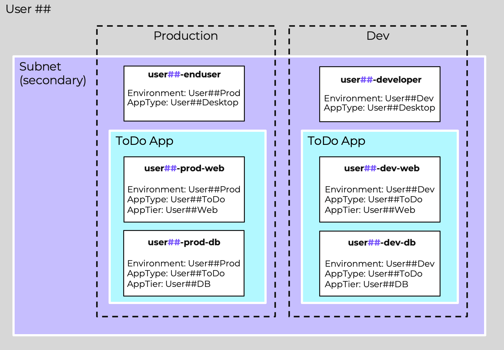
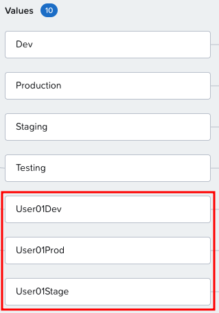
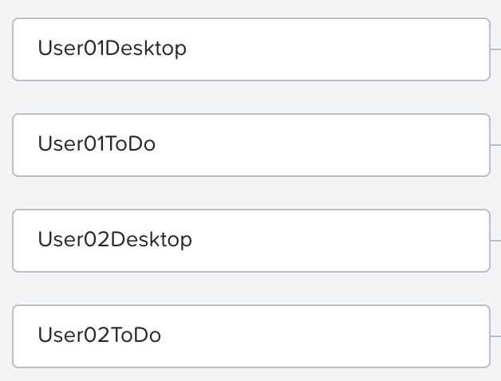
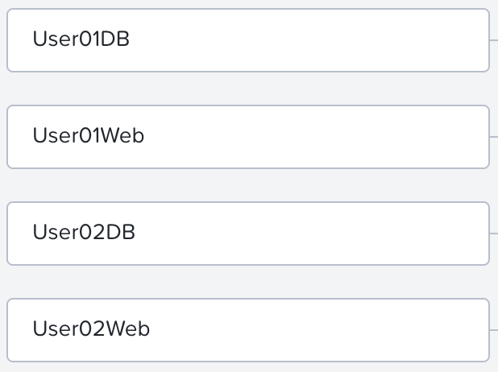
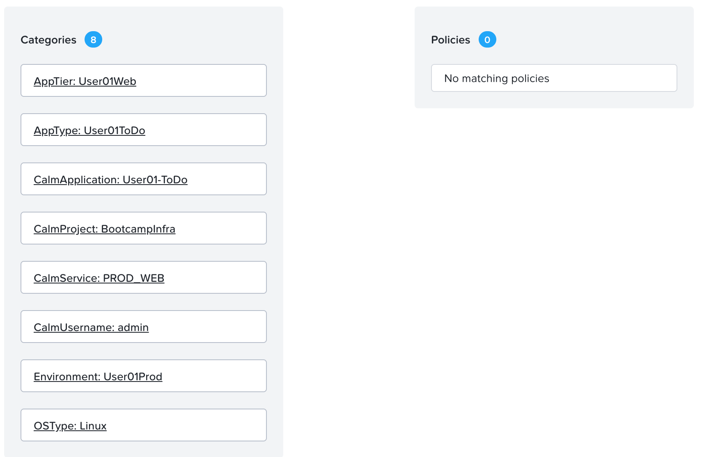
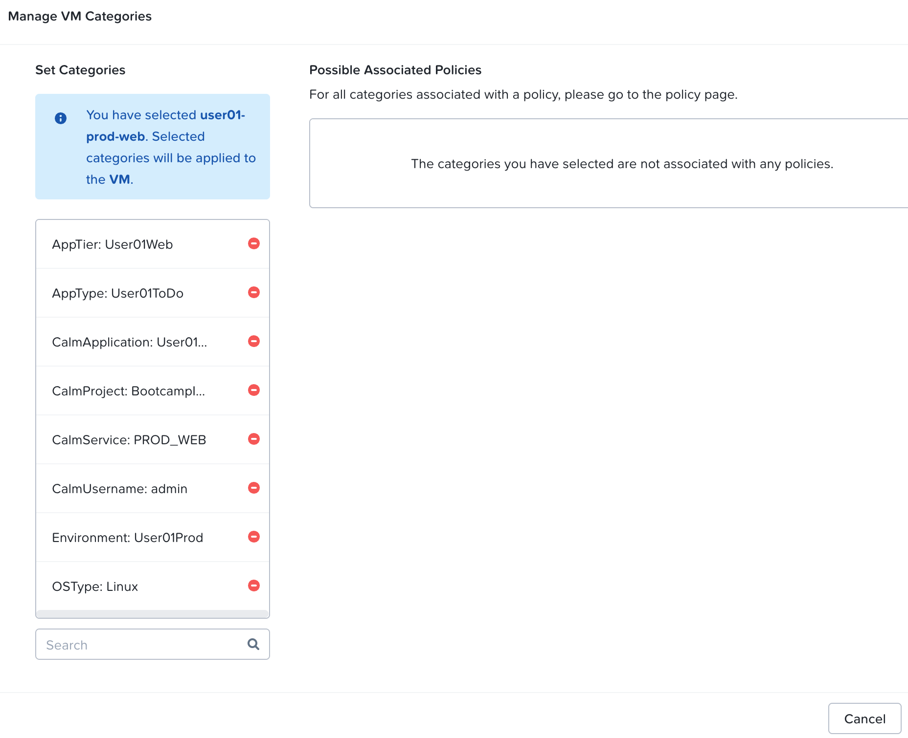

# Categories

Categories เป็นองค์ประกอบหลักของการจัดการ Prism Central โดย Policies ใน Prism Central จะถูกกำหนดค่าเพื่อเลือกหรือดำเนินการกับ categories ที่ระบุ จากนั้น Categories จะถูกนำไปใช้กับ virtual machines หลายๆ เครื่องโดยเป็นส่วนหนึ่งของ metadata ของพวกมัน สิ่งนี้จะแยก policy ออกจาก entities ช่วยให้ policy configuration สามารถปรับขนาด (scale) และรองรับ dynamic VM selection ได้

ข้อดีที่สำคัญอีกประการหนึ่งคือ provisioning tools อย่างเช่น NCM Self-Service, Terraform, และ Ansible สามารถทำ auto-provision ให้กับ VMs และ entities อื่นๆ ด้วย categories ที่ถูกต้อง เพื่อรับประกันว่ามีการบังคับใช้ policy-enforcement อย่างสม่ำเสมอ แม้แต่กับ entities ที่เพิ่งสร้างใหม่

## Exploring Categories

Nutanix lab automation ได้สร้าง categories ทั้งหมดที่จำเป็นในการใช้งาน Flow Network Security ใน application ของเราแล้ว แต่เรามาทำการตรวจสอบกันก่อน Categories นั้นสร้างได้ง่าย ดังนั้นคุณจึงสามารถเพิ่ม categories ใหม่ๆ หรือแม้แต่ใช้ categories อื่นๆ นอกเหนือจากที่สร้างไว้ล่วงหน้า (pre-created) ได้

แผนภาพต่อไปนี้แสดง example application สำหรับ **user`##`** และ categories ทั้งหมดที่ assigned ให้กับ VMs สำหรับ user นั้น มี environment เพิ่มเติมที่ถูกสร้างขึ้นสำหรับ staging ซึ่งไม่ได้แสดงไว้ที่นี่ แต่เราจะได้เห็นในภายหลัง

Categories ถูกย้ายจากเมนู Infrastructure ของ Prism Central ไปยังมุมมอง Admin Center

1.  ไปที่ Application Switcher ซึ่งปัจจุบันแสดง **Infrastructure** และคลิกที่เมนู drop down
    
2.  เลือก **Admin Center** ภายใต้ Platform Services
    
3.  เลือก **Categories** ใน left navigation menu
    

### Environment Categories

system category แรกที่เราจะไปสำรวจคือ Environment โดย pre-created category นี้ช่วยให้การแยก workloads ออกเป็นกลุ่มต่างๆ เช่น development, staging, และ production ทำได้ง่ายขึ้น

1.  เลือก **Environment `System`**
    
2.  เนื่องจากนี่เป็น shared environment ให้สังเกต user specific categories ที่ถูกสร้างขึ้น เช่น **Environment: User`##`Prod** และ **Environment: User`##`Dev** โดยที่ `##` คือหมายเลข cluster user ของคุณ
    
    

## AppType Categories

lab นี้ใช้ AppType เป็น category key แต่นี่ไม่ใช่ข้อบังคับ คุณสามารถสร้าง key ใดๆ ก็ได้ที่คุณต้องการใช้ภายใน security policy มาดู AppType categories ที่ถูกสร้างขึ้นกันเถอะ

1.  เลือกปุ่มลูกศรย้อนกลับ **<** ที่มุมบนซ้าย
    
2.  เลือก **AppType** category โดยคลิกที่มัน
    
3.  เลื่อนลงและเลือก **Showing 10 of ##. Load More**
    
4.  สังเกต user-specific categories สำหรับ types แบบ ToDo และ Desktop
    
    

## AppTier Categories

การ apply ตัว multiple categories ให้กับ virtual machine นั้นเป็นเรื่องง่าย การผสมผสานของ categories สามารถเป็นตัวกำหนดพฤติกรรม (behavior) ของ VM ได้ จนถึงตอนนี้เราได้เห็น categories แบบ Environment: **User`##`Prod** และ **AppType: User`##`ToDo** สิ่งนี้บอกเราว่า VM เป็นส่วนหนึ่งของ production ToDo app แต่เราจะแยก web server ออกจาก database server ได้อย่างไร? นั่นคือจุดที่ additional categories อย่าง AppTier เข้ามามีบทบาท

คุณสามารถใช้ category **ใดๆ ก็ได้** สำหรับจุดประสงค์นี้ แต่เนื่องจาก AppTier มีอยู่แล้ว เราจึงใช้มันที่นี่

1.  เลือกปุ่มลูกศรย้อนกลับ **<** ที่มุมบนซ้าย
    
2.  เลือก **AppTier**
    
3.  เลื่อนลงและเลือก **Showing 10 of ##. Load More**
    
4.  สังเกต user-specific categories สำหรับ types แบบ ToDo และ Desktop
    
    

## Applying Categories to VMs

ตัว lab automation ยังได้ applied ตัว categories ลงใน VMs ของเราด้วย มาดูกันว่ามันทำงานอย่างไร เผื่อในกรณีที่เราต้องการ apply ตัว categories ของเราเองในภายหลัง

1.  ไปที่ Application Switcher และคลิก drop down ถัดจาก **Admin Center**
    
2.  เลือก **Infrastructure**
    
3.  ภายใต้ **Compute** ใน left navigation bar ให้เลือก **VMs**
    
4.  กรอง (Filter) ตัว VMs ด้วยหมายเลข cluster user ของคุณ โดยพิมพ์ **user`##`** ในแถบ search filter แล้วกด enter
    
    -   ตอนนี้ filter ควรจะมี **Name: 'user`##`'**

5.  เลือก **user`##`\-prod-web** โดยคลิกที่ VM name
    
6.  เลือก **Categories**
    
    สังเกตว่า Environment, AppType, และ AppTier ได้ถูก applied พร้อมกับ categories อื่นๆ

    

    มุมมอง specific category ของ virtual machine นี้มีประโยชน์ในการแสดง policies ที่เกี่ยวข้องกับ assigned categories หาก VM นี้เป็นส่วนหนึ่งของ Storage Policies, Protection Policies, หรือ Security Policies ความเกี่ยวข้องเหล่านั้นก็จะสามารถมองเห็นได้ทั้งหมดที่นี่

7.  เราสามารถ assign ตัว categories ให้กับ VM นี้ได้โดยเลือก **Manage Categories** สังเกตว่ามุมมอง policy mapping แบบเดียวกันจะแสดงขึ้นที่นี่ คุณสามารถเพิ่มหรือลบ categories ได้
    
8.  เนื่องจากเรายังไม่ได้ทำการเปลี่ยนแปลงใดๆ ให้คลิก **Cancel**
    
    

## Takeaways

Categories ถูกใช้ทั่วทั้ง Prism Central เพื่อทำการ map ตัว entities เข้ากับ policies แบบ dynamically การสร้าง category key value pairs ใหม่และการเปลี่ยน assignment ของมันไปยัง VMs นั้นเป็นเรื่องง่าย อย่างไรก็ตาม ขอแนะนำให้ใช้ automation อย่างที่เรามีใน lab นี้เพื่อ provision ตัว categories ในระหว่างการ VM creation

เมื่อ categories ถูก provisioned แล้ว คุณจะสามารถมองเห็นการ mapping ของ VM ไปยัง category และต่อไปยัง policy ได้อย่างง่ายดาย

เราจะได้เห็นว่า policies เหล่านี้ทำงานอย่างไรในหัวข้อถัดไป
