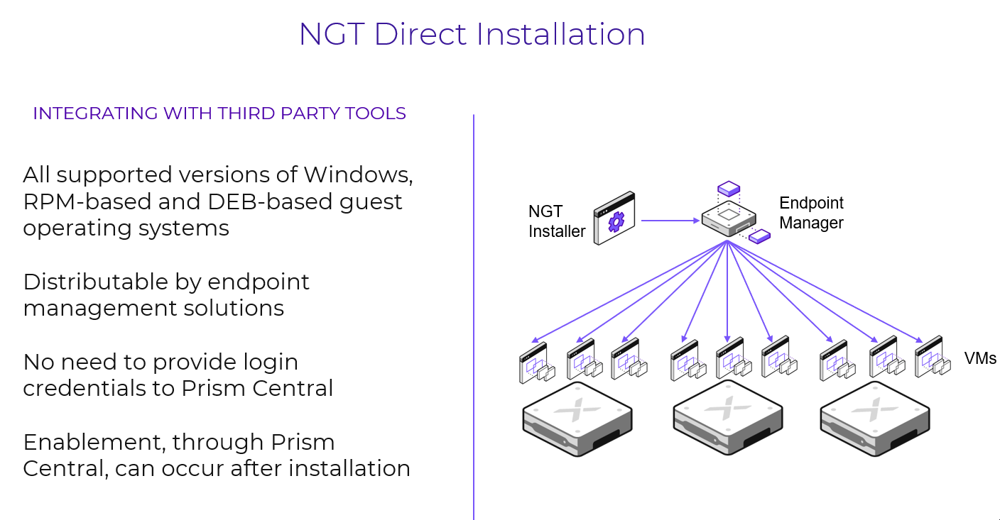
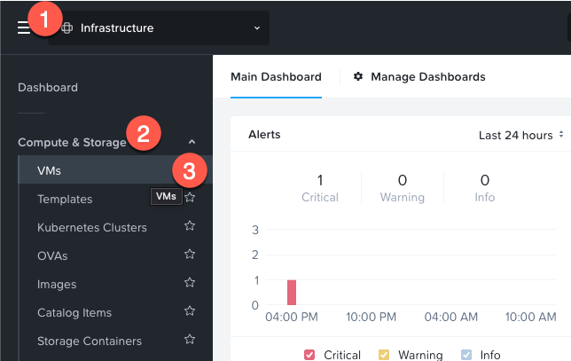
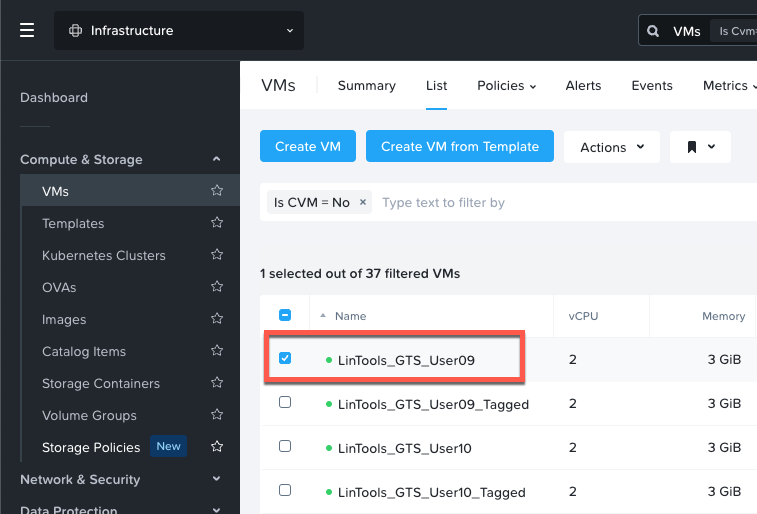
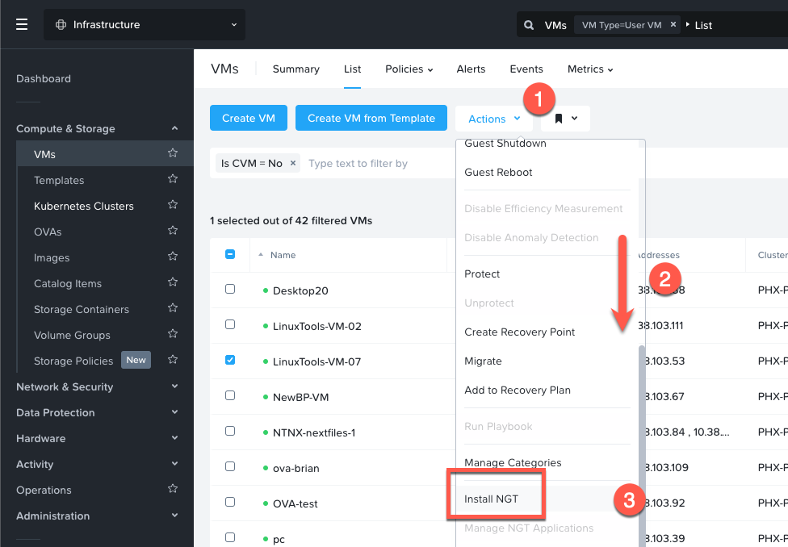
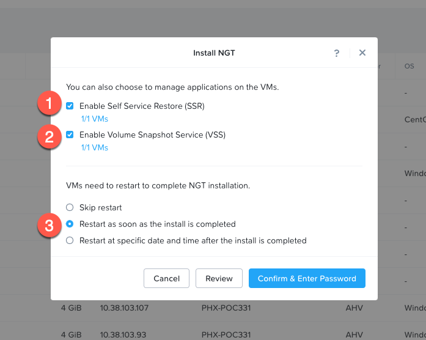
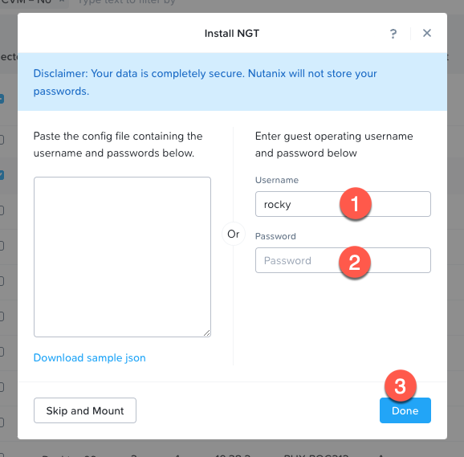
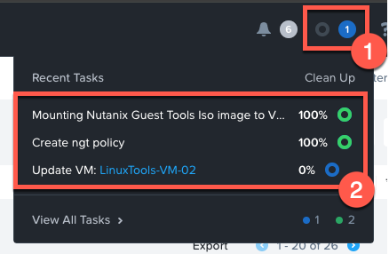
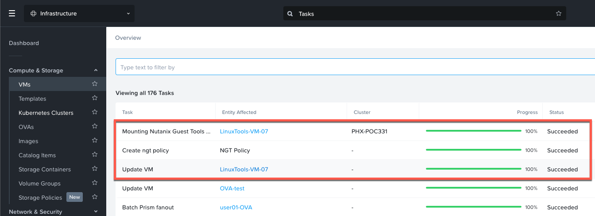
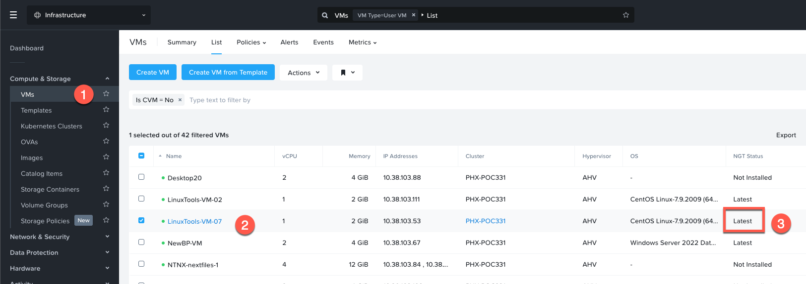

# Nutanix Guest Tools

## Overview

NGT ย่อมาจาก Nutanix Guest Tools และประกอบด้วยหลายส่วน คุณสามารถใช้ส่วนประกอบ NGT เหล่านี้ร่วมกันในรูปแบบใดก็ได้ โดยที่ device drivers เป็นส่วนที่สำคัญที่สุด

-   Device Drivers
-   VSS Driver (Volume Shadow Copy Service)
-   Self Service Backup

NGT ยังรายงานรายละเอียดกลับไปยัง Prism ด้วย เช่น operating system ตัวไหนกำลังทำงานอยู่ และข้อมูลอื่นๆ

อย่างน้อยที่สุด ส่วนของ device drivers ของ NGT จะต้องถูก install ก่อนทำการ migrating ตัว VM ไปยัง AHV หรือในระหว่างการ install ตัว VM OS ใหม่ ส่วน functions อื่นๆ ของ NGT สามารถถูก enabled หรือ disabled ได้ตลอดเวลา

!!! note
    คุณจะทำการ install ตัว NGT ลงใน Linux VM ที่ถูก migrated จาก ESXi ไปยัง AHV cluster ของคุณก่อนหน้านี้ Move ได้ทำการ install เพียงแค่ device drivers เท่านั้น ไม่ใช่ full NGT package

## Installing NGT from Prism Central

ตอนนี้คุณจะทำการ install ตัว NGT ใน migrated VM ของคุณ

คุณควร logged in เข้าสู่ Prism Central instance ของคุณเพื่อดำเนินการขั้นตอนต่อไปนี้

1.  คลิกที่ navigation เพื่อขยายเมนู คลิกที่ **Compute & Storage** เพื่อขยาย เลือก **VMs** เพื่อดูรายชื่อของ VMs ที่มีอยู่บน PC instance
    
    
    
2.  ค้นหา VM ของคุณที่ชื่อ `XXX-User##` โดยที่ `XXX` คือคำนำหน้า (preface) ที่ instructor ให้ไว้ และเลือกโดยการทำเครื่องหมายในช่องด้านซ้าย
    
    
    
3.  ถัดไป ให้คลิกที่ drop-down menu ของ **Actions** ด้านบน เลื่อนเมนูลงมา และคลิกที่ **Install NGT**
    
    
    
4.  หน้าต่าง Install NGT จะเปิดขึ้นมา เลือก checkboxes เพื่อ enable ทั้ง SSR & VSS ถัดไป เลือก radio box ที่ **Restart as soon as the install is completed**
    
    
    
5.  คลิก **Confirm & Enter Password** เพื่อดำเนินการต่อ
    
6.  ถัดไป ระบุ local credentials ให้กับ guest OS เพื่อให้กระบวนการ NGT install สามารถดำเนินการต่อได้ ใส่ credentials ด้านล่างและคลิก **Done**
    
    -   Username: **rocky**
    -   Password: **nutanix/4u**
    
    
    
7.  กระบวนการเริ่มต้น installing ตัว NGT ใน VM ของคุณได้เริ่มขึ้นแล้ว หากคุณต้องการ monitor ความคืบหน้า (progress) คุณสามารถคลิกที่ไอคอน recent tasks บนเมนูด้านบนของ Prism Central เพื่อดูสถานะ (status) ได้ คุณจะสังเกตเห็นว่ามี three tasks ถูกสร้างขึ้นสำหรับกระบวนการนี้
    
    
    
8.  หากมี tasks เริ่มต้นขึ้นมากเกินไปเนื่องจากจำนวน participants ใน boot camp คุณสามารถคลิกที่ตัวเลือก **View All Tasks** ที่ด้านล่างของหน้าต่าง tasks ได้ สิ่งนี้จะพาคุณไปยัง log ของ tasks ทั้งหมดของ cluster และคุณสามารถระบุตำแหน่งและ monitor ตัว tasks สำหรับ VM name ของคุณได้
    
    
    
9.  เมื่อ tasks ทั้งหมดสำหรับ VM ของคุณเสร็จสิ้น คุณสามารถนำทางกลับไปยัง VM list และค้นหา VM ของคุณได้
    
10.  ค้นหา VM ของคุณใน list และดูที่คอลัมน์ **NGT Status** ตอนนี้มันควรจะแสดงว่า NGT ถูก installed ด้วย latest version แล้ว หรืออาจแนะนำให้ทำ upgrade หากมี
    
    
