# Task Automation with Playbooks

## Overview

**X-Play** เป็น automation tool ที่ใช้งานง่าย ออกแบบมาเพื่อเพิ่มความคล่องตัว (streamline) ให้กับ administrative tasks ที่ทำเป็นประจำ และช่วยแก้ไขปัญหาที่เกิดขึ้นภายในระบบของคุณโดยอัตโนมัติ การทำ automation นี้สำเร็จได้ด้วยการสร้าง Playbooks

**Playbook** ประกอบด้วย trigger และชุดของ actions ที่จะทำงาน (execute) เมื่อ trigger ถูกเปิดใช้งาน (activated)

ตัว trigger สามารถกำหนดตาม alert ที่ระบุ หรือกลุ่มของ alerts, รวมถึง events เช่นการสร้างหรือการลบ VM, การสั่งเริ่มแบบ manual (manual initiation) เพื่อรัน tasks ต่างๆ ด้วยการคลิกเพียงครั้งเดียว, การตั้งเวลา (scheduled) เพื่อให้รันในเวลาที่กำหนด (คล้ายกับ cron jobs), หรือถูก trigger ผ่าน webhook ด้วยการเรียกใช้ REST API จาก third-party tool

ใน action gallery มี 45 native actions ที่สามารถนำมาเชื่อมต่อ (chained) เข้าด้วยกันได้ ซึ่งรวมไปถึงการทำ integrations กับ tools ต่างๆ เช่น PagerDuty, ServiceNow, Slack, Microsoft Teams และอื่นๆ หากไม่มี native action ที่ต้องการ คุณสามารถใช้ REST APIs และ scripting actions เพื่อสร้าง custom workflows ได้

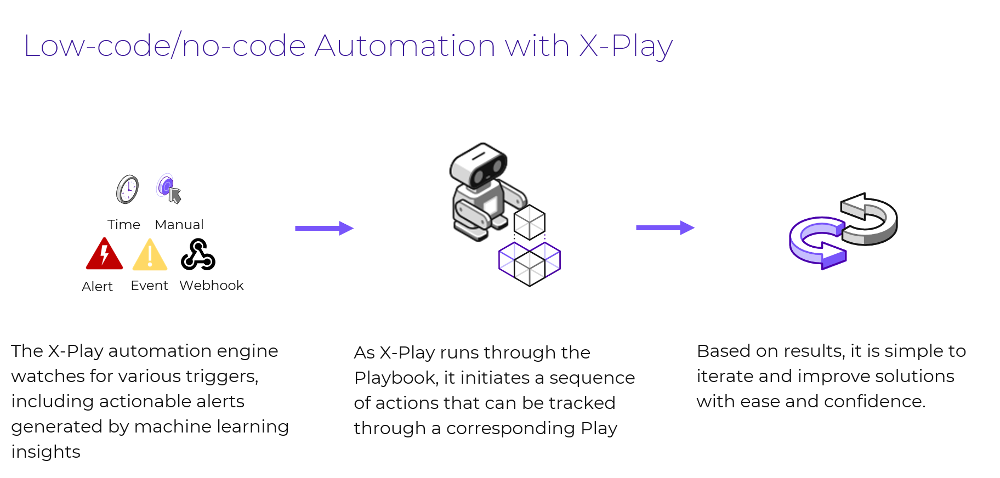

## Create a Playbook

IT Admin ต้องการรับ email notification เมื่อใดก็ตามที่มีการสร้าง VM ขึ้นมาใน Environment ตัวอย่างเช่น เมื่อ VMs ถูก migrated จาก ESXi ไปยัง AHV มาดูกันว่า Playbooks จะสามารถทำ automate ในกระบวนการนี้ได้อย่างไร เราจะใช้ trigger แบบง่ายๆ แล้วตามด้วย branch condition เพื่อกรอง (filter) รายชื่อของ VMs

1.  Login เข้าสู่ Prism Central โดยใช้ `adminuser##` และ PC password จากหน้า Connection Details
    
2.  ไปที่ส่วนของ App Switcher ที่มุมบนซ้ายของ Prism Central คลิก **Intelligent Operations** ใน App Switcher
    
    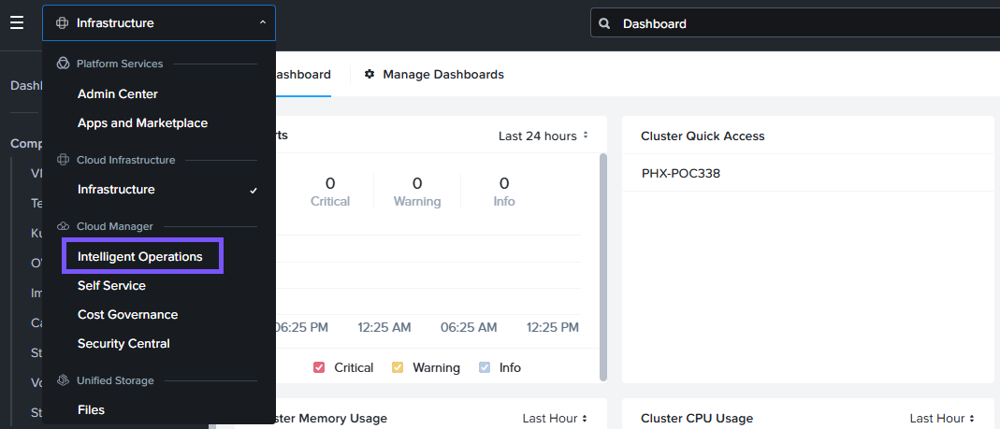

3.  เลือก **Playbooks** จาก Intelligent Operations Dashboard
    
4.  คลิก **Get Started**
    
5.  คลิก **Create Playbook**
    
    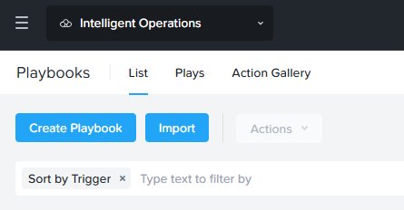

6.  เราสามารถดูรายการ triggers ที่มีให้ใช้งานได้ ซึ่งประกอบด้วย Alerts, Events, Time-based, Manual และ Webhook triggers สำหรับตัวอย่างนี้ ให้เลือก trigger แบบ event-based เนื่องจากเรากำลังโฟกัสไปที่ VM creation event 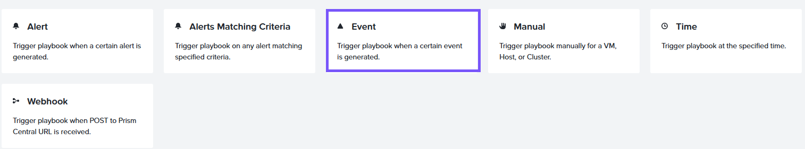
    
7.  ค้นหา Created VM event ในช่อง **Select an Event Type** 

    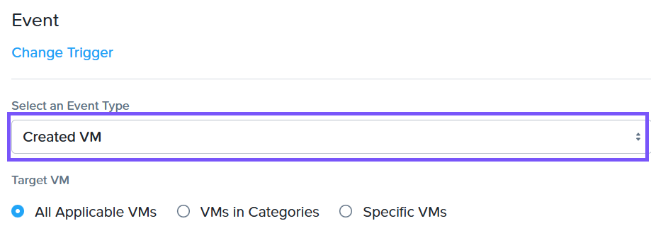
    
8.  ในส่วนของ Target VM ให้เลือก **All Applicable VMs** 

    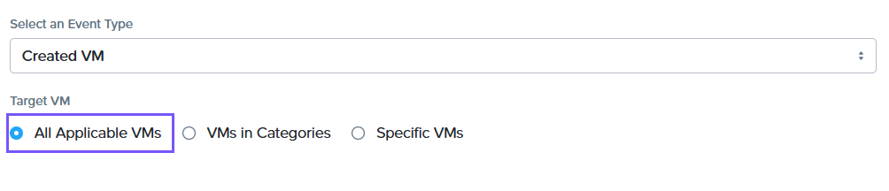
    
9.  คลิก **Add Action** 

    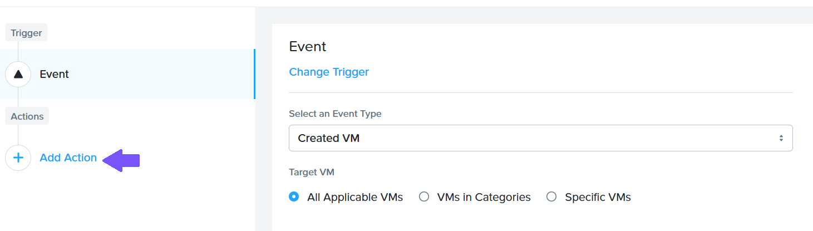
    
10.  เราสามารถดูรายการของ actions ที่มีให้ใช้งาน ให้เลือก **Branch** action 

    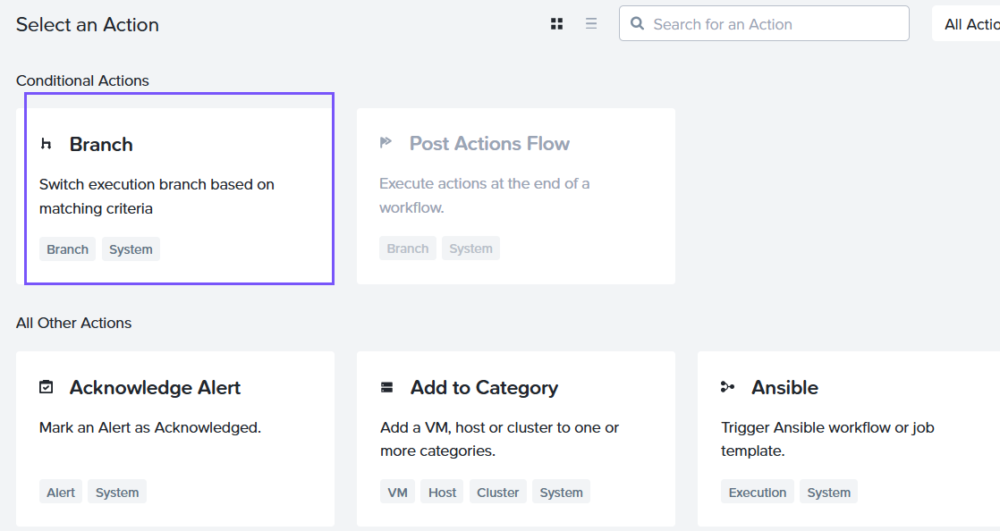
    
11.  กำหนด Values ต่อไปนี้สำหรับ branch condition:
    
    Condition: `If`
    Operand: คลิก **Parameters** และเลือก `Event: Source Entity Name`
    Operator: `regexp`
    Value: User`##` โดยที่ `##` คือ `User #` ที่คุณได้รับมอบหมายจาก Connection Details ในตัวอย่างนี้ เราจะใช้ User01

    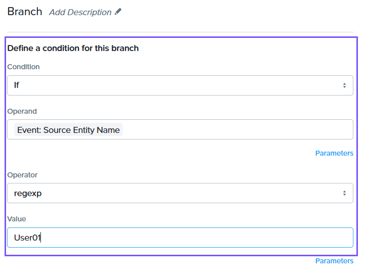

12.  เราจะทำการเพิ่ม action ที่สองเข้าไปใน branch นี้ คลิก **Add Action** ภายใน Branch Condition

    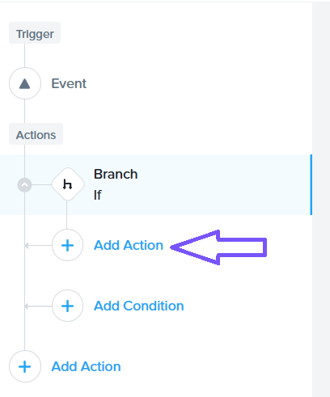

13.  เลือก **Lookup VM Details** เนื่องจาก IT Admin ต้องการรับข้อมูลเกี่ยวกับ VM ที่ถูกสร้างขึ้นมาใหม่ 
    
    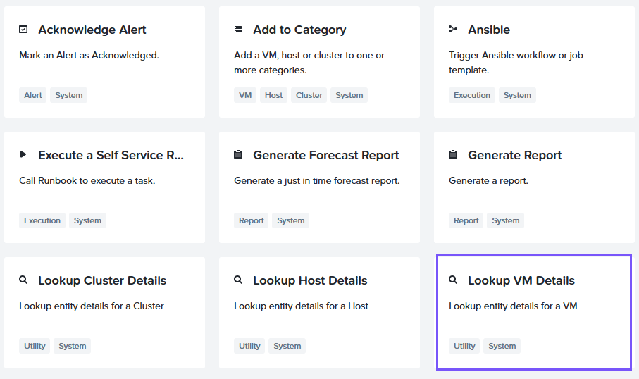
    
14.  ในช่อง **Target VM** ให้ปล่อยไว้เป็น _Trigger:_ **Source Entity Name**

    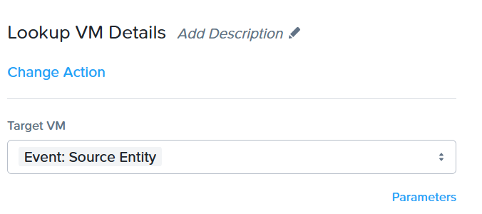
    
15.  เราจะทำการเพิ่ม action ที่สาม คลิก **Add Action** ภายใน Branch Condition
    
    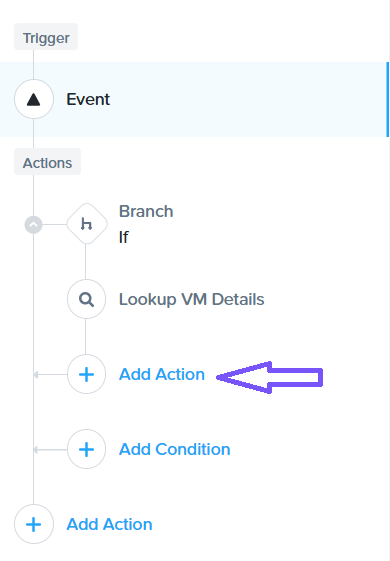

16.  เลือก Email Action
    
17.  ระบุ Email Address ของคุณเองลงในช่อง **Recipient** ซึ่งควรจะเป็นอีเมลที่คุณสามารถเข้าไปเช็คได้ในอีกไม่กี่นาทีข้างหน้า
    
18.  ระบุ "Your virtual machine is created" ลงในช่อง **Subject**
    
19.  ในช่อง Message Field ให้คลิก **Parameters** ตรวจสอบให้แน่ใจว่าได้เลือก parameters ด้านล่างนี้:

    พิมพ์ **Playbook Run Time:** และเลือก Parameter **Playbook: Current Time**
    พิมพ์ **Playbook Name:** และเลือก Parameter **Playbook: Playbook Name**
    พิมพ์ **VM Name:** และเลือก Parameter **Lookup VM Details: VM Name**
    พิมพ์ **VM Owner:** และเลือก Parameter **Lookup VM Details: VM Owner Name**
    พิมพ์ **VM IP Address:** และเลือก Parameter **Lookup VM Details: VM IP Address**
    พิมพ์ **Source Cluster:** และเลือก Parameter **Event: Source Cluster**

    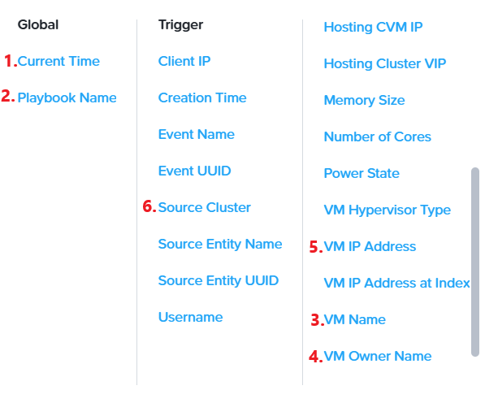

20.  คลิก **Save & Close**
    
21.  ตั้งชื่อที่ไม่ซ้ำกันให้กับ Playbook ให้ตั้งชื่อว่า "User`##` VM Created" โดยที่ `##` คือหมายเลขที่คุณได้รับมอบหมาย
    
22.  เปิดใช้งาน Playbook โดยการสลับ status ไปเป็น **Enabled**
    
    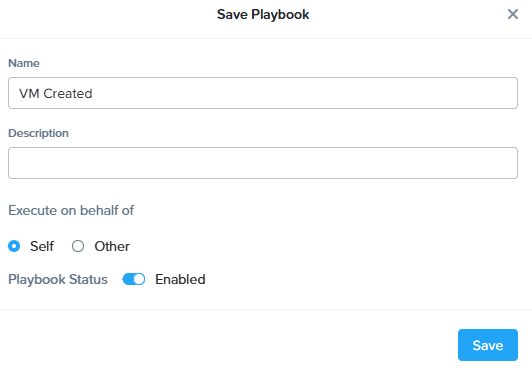

23.  คลิก Save
    
24.  คุณจะเห็น playbook นี้ในรูปแบบ in action ในขณะที่คุณ migrate ตัว VMs ของคุณ
    
!!! note
    คุณจะได้รับ email notifications เมื่อ VMs ของคุณถูก migrate อย่างสำเร็จ (migrated successfully) ตรวจสอบให้แน่ใจว่าใช้อีเมลที่คุณสามารถเข้าไปเช็คได้ในระหว่างที่ทำ lab อยู่