# Category and Policy Management

## Overview of Categories

Category จะจัดกลุ่ม entities ออกเป็น key-value pairs ซึ่งช่วยให้สามารถทำ assignment ได้ตาม criteria ที่กำหนด Policies สามารถถูกนำไปใช้กับ entities ที่ถูกจัดกลุ่มตาม value ของ category ได้

ตัวอย่างเช่น category key ที่ชื่อ "Department" ซึ่งมี values เช่น Engineering, Finance และ HR สามารถรองรับ backup policies ที่แตกต่างกันได้: policy หนึ่งสำหรับ Engineering และ HR และอีก policy ที่เข้มงวดกว่าสำหรับ Finance

Prism Central ช่วยให้สามารถมองเห็นภาพ (visualization) ของความสัมพันธ์เหล่านี้ได้อย่างรวดเร็ว

ในส่วนนี้ คุณจะได้เรียนรู้วิธีการสร้าง category และนำไป apply กับ entities (ในตัวอย่างนี้คือ VMs)

## Create a Category

1.  Login เข้าสู่ Prism Central โดยใช้ `adminuser##` และ PC password ที่คุณได้รับ
    
2.  ขยาย **Admin Center** จาก App Switcher
    
3.  คลิก **Categories**
    
4.  Prism Central มี system categories ที่กำหนดไว้ล่วงหน้า 20 รายการ ซึ่งไม่สามารถ update หรือ delete ได้ คุณสามารถ assign ตัว entities ให้กับ system categories เหล่านี้ได้ในขณะที่สร้างหรือ update ตัว VMs และ entities อื่นๆ 

    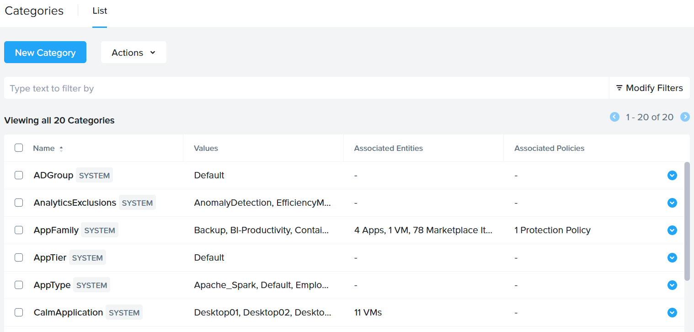
    
5.  คลิก New Category
    
6.  กำหนด parameters ของ category
    
    -   Name: ตั้งชื่อให้กับ category คุณสามารถตั้งชื่อเป็น User`##` โดยที่ `##` คือ `User #` ที่คุณได้รับมอบหมาย ในตัวอย่างนี้เราตั้งชื่อว่า **User01**
        
    -   Purpose: กำหนดจุดประสงค์ให้กับ category ของคุณ
        
    -   Values: **Production**
        
    -   คลิก **Save**
        
    
    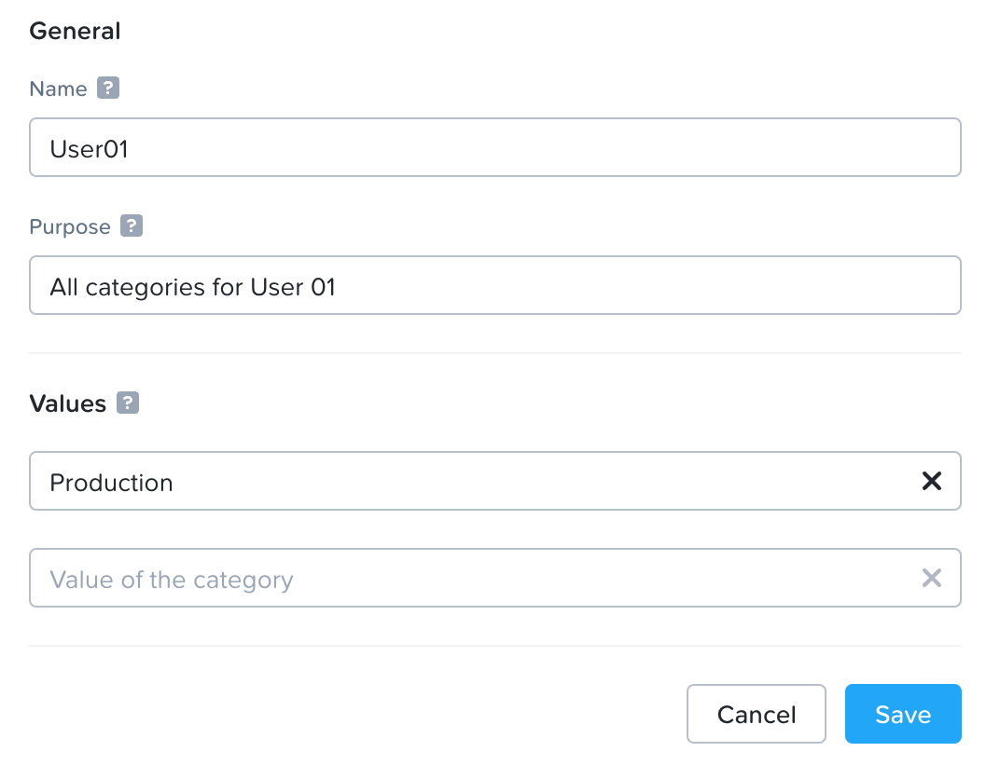
    
7.  ต่อไปเราจะ assign ตัว category นี้ให้กับ VMs Desktop`##` และ User`##`\-Move
    
8.  เลือก **Infrastructure** จาก App Switcher ขยาย **Compute** และคลิกที่ **VMs**
    
9.  ค้นหา VMs Desktop`##` โดยที่ `##` คือหมายเลขที่คุณได้รับมอบหมาย

    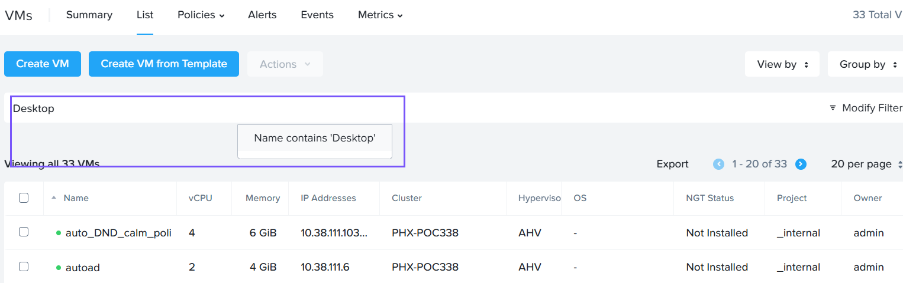

10.  เลือก Desktop`##` VM คลิก Actions เลื่อนเมาส์ไปที่ **Other Actions** และเลือก **Manage Categories**

    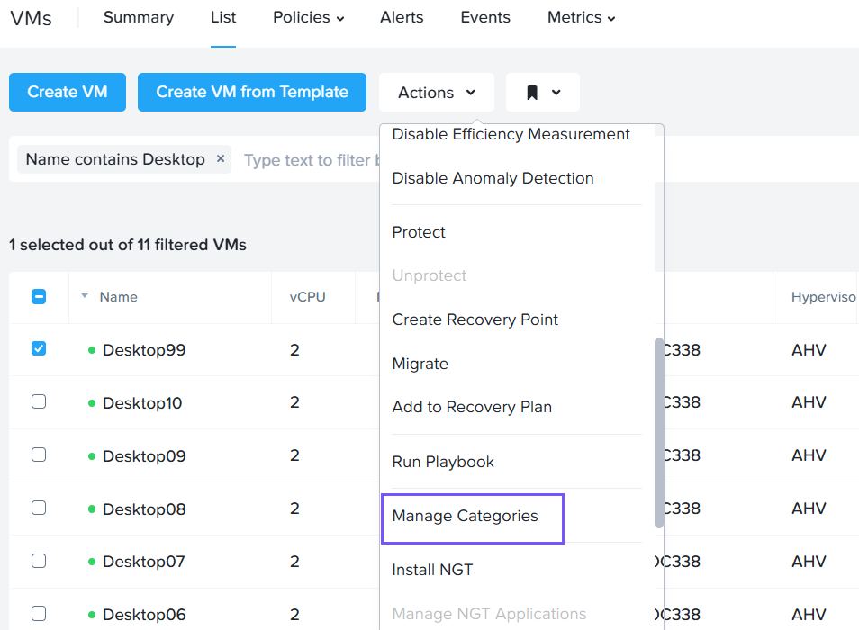

11.  ค้นหา category ที่คุณสร้างไว้ ในตัวอย่างของเราคือ User01:Production

    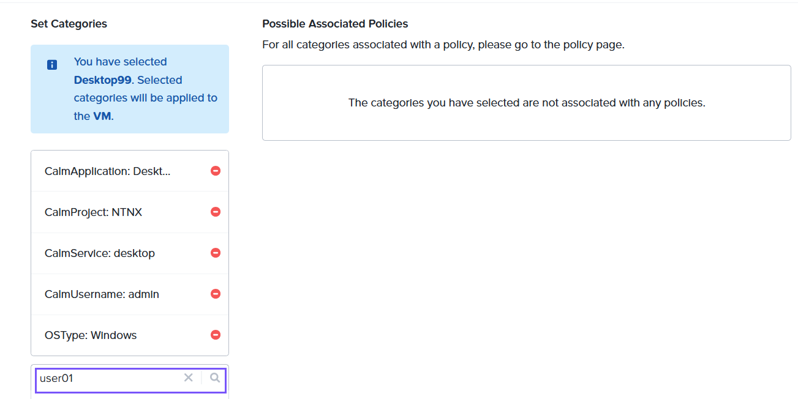

12.  เพิ่ม category โดยคลิกที่เครื่องหมาย **+** ถัดจาก User`##`:Production

    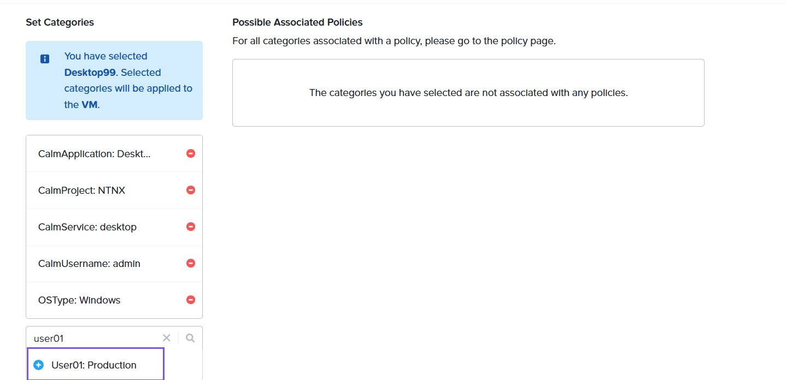

13.  คลิก Save เมื่อคุณเพิ่ม category แล้ว
    
14.  ถัดไปเพิ่ม VM User`##`\-Move อีกตัวเข้าสู่ category User`##`:Production โดยทำตามขั้นตอนที่ 9 ถึง 13
    
ต่อไป เราจะไปที่ส่วน Categories เพื่อดูความสัมพันธ์ระหว่าง categories และ entities

1.  ไปที่ **Admin Center** จาก App Switcher
    
2.  คลิก **Categories** จาก side menu
    
3.  ค้นหา Category User`##` โดยที่ `##` คือ `User #` ที่คุณได้รับมอบหมายจาก Connection Details
    
4.  คลิก User`##`
    
    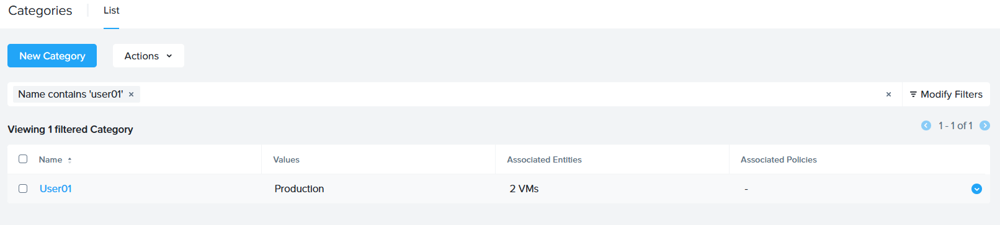

5.  คุณจะสังเกตเห็นว่า category มี 2 VM เป็น associated entities ของมัน

    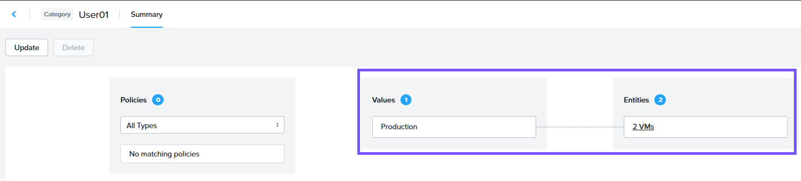

## Overview of Policies

Policies ถูกใช้เพื่อกำหนด configuration guidelines อย่างเป็นระบบสำหรับ entities เช่น VMs, Images, Storage และ Network Security

Nutanix Prism Central ช่วยให้คุณสามารถสร้างและจัดการ policies ต่อไปนี้ได้

-   _VM Management_ - ช่วยให้คุณสามารถจัดการ policies ที่เกี่ยวข้องกับ VM-Host Affinity, VM-VM Anti-Affinity และ NGT Policies
    
-   _Image Management_ - ช่วยให้คุณสามารถจัดการ policies ที่เกี่ยวข้องกับ Image Placement และ Bandwidth Throttling
    
-   _Storage Policies_ - ช่วยให้คุณสามารถจัดการ policies ที่เกี่ยวข้องกับ storage attributes เช่น Replication Factor, encryption, compression และ QoS ของ VMs และ Volume Groups entities
    
-   _Security Policies_ - ช่วยให้คุณสามารถจัดการ policies ที่เกี่ยวข้องกับ VM network traffic
    
-   _Protection Policies_ - ช่วยให้คุณสามารถจัดการ policies ที่เกี่ยวข้องกับ Disaster Recovery attributes เช่น asynchronous, synchronous และ near sync replication
    
ในส่วนนี้ คุณจะได้เรียนรู้วิธีการสร้าง storage policy

## Storage Policy

# Default Storage Policy

Prism Central 2024.1 หรือเวอร์ชันที่ใหม่กว่านั้น จะมี predefined หรือ default Storage Policy ไว้ให้ โดย default storage policy จะมี parameters ดังนี้

-   Replication Factor ถูกเซ็ตเป็น 2
-   Encryption ถูกเซ็ตเป็น Inherit from Cluster
-   Compression ถูกเซ็ตเป็น Inline
-   ไม่มีการตั้งค่า values สำหรับ QoS

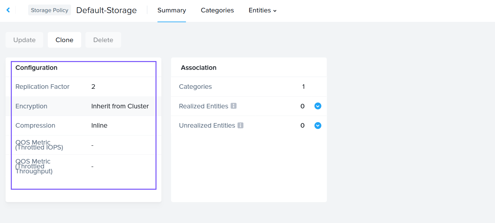

default storage policy จะไม่สามารถ update หรือ delete ได้ อย่างไรก็ตาม มันสามารถถูก cloned เพื่อทำการเปลี่ยนแปลงแก้ไขได้

Entities เช่น VMs และ Volume Groups สามารถถูกเพิ่มเข้าไปยัง Default Storage Policy ได้โดยการเปิดสวิตช์ "Enable Default-Storage Policy" เมื่อคุณทำการสร้างหรือ update ตัว VM หรือ Volume Group

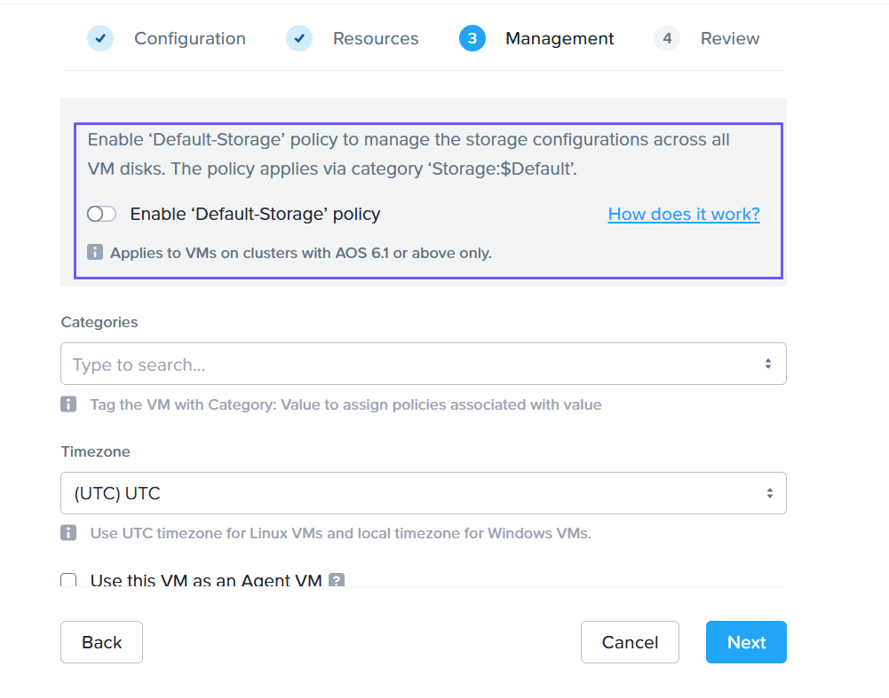

# Create a Custom Storage Policy

1.  Login เข้าสู่ Prism Central โดยใช้ `adminuser##` และ PC password จากหน้า Connection Details
    
2.  ขยาย **Storage** ใน Infrastructure Dashboard
    
3.  คลิก **Storage Policies**
    
4.  คลิก **Create Storage Policy**
    
5.  ตั้งชื่อให้กับ Storage Policy ให้ตั้งชื่อว่า user`##`\-sp โดยที่ `##` คือ `User #` ที่คุณได้รับมอบหมายจาก Connection Details
    
6.  เซ็ต **Replication Factor** เป็น **Inherit from Container**
    
7.  เซ็ต **Encryption** เป็น **Inherit from Cluster**
    
8.  เปิดใช้งาน **Compression** และเลือกใช้ **Inline Compression**
    
    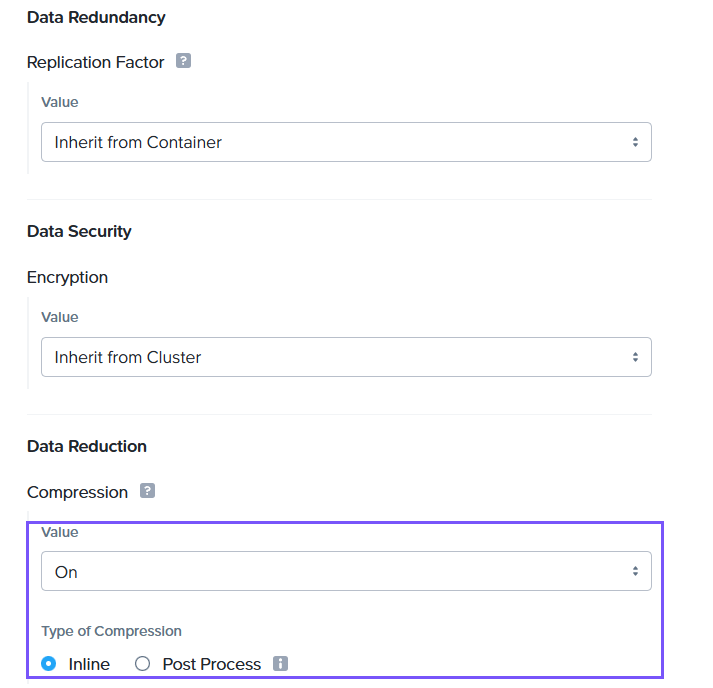    

7.  คลิก **Next**
    
8.  กำหนด VMs ที่อยู่ใน Category User`##`:Production โดยที่ `##` คือ `User #` ของคุณ ในตัวอย่างนี้คือ User01:Production
    
    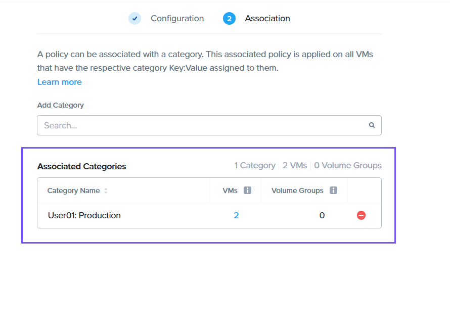

9.  คลิก **Save**
    
10.  คุณจะเห็น policy ของคุณปรากฏอยู่ใน **Storage Policies** 

    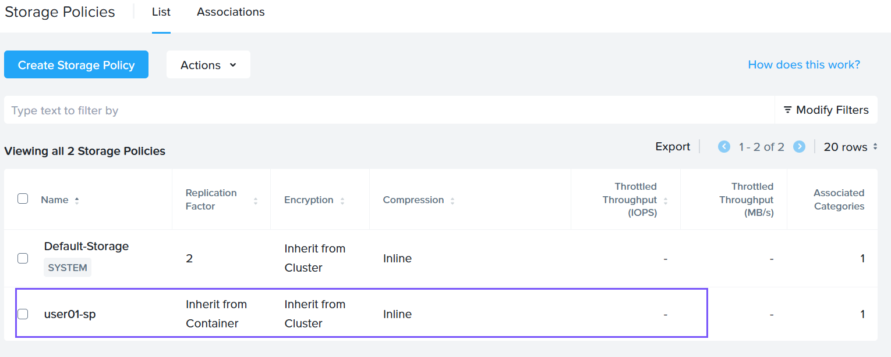
    
## Categories and Policies Takeaways

คุณจะเห็นการนำ categories และ policies เหล่านี้ไปใช้ใน lab ถัดๆ ไป ต่อไปเราจะขยับไปที่การตั้งค่า no-code automation เพื่อเตรียมพร้อมสำหรับ onboarded workloads ของเรา