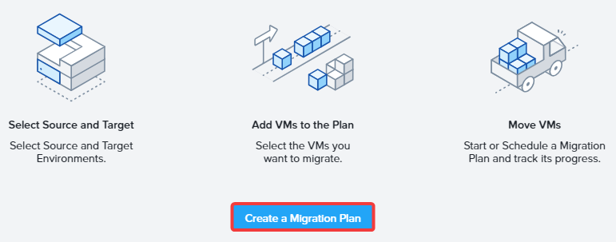
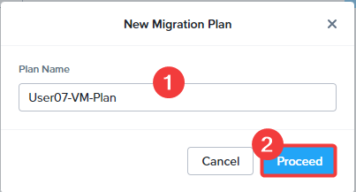
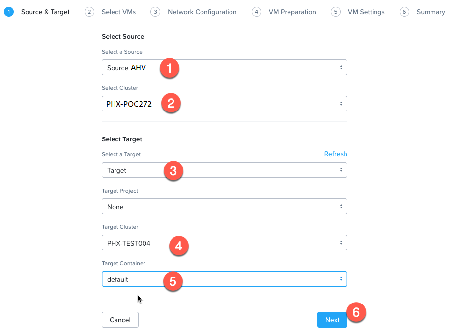
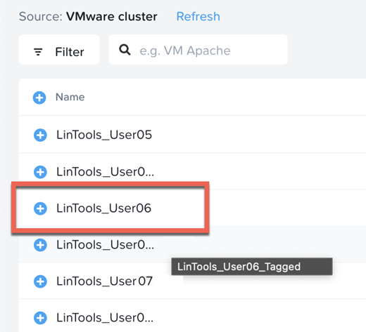
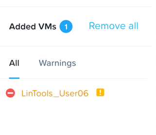
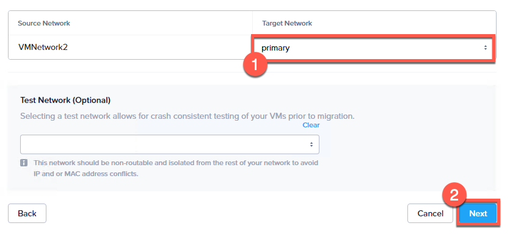
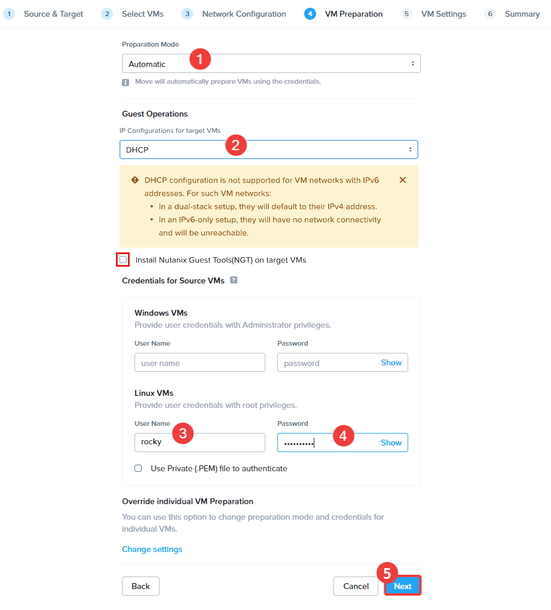
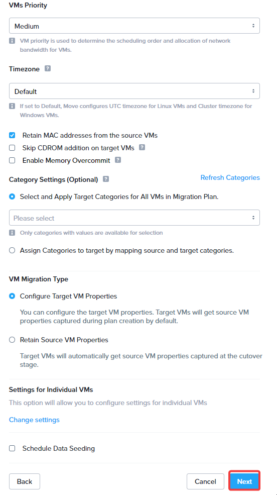
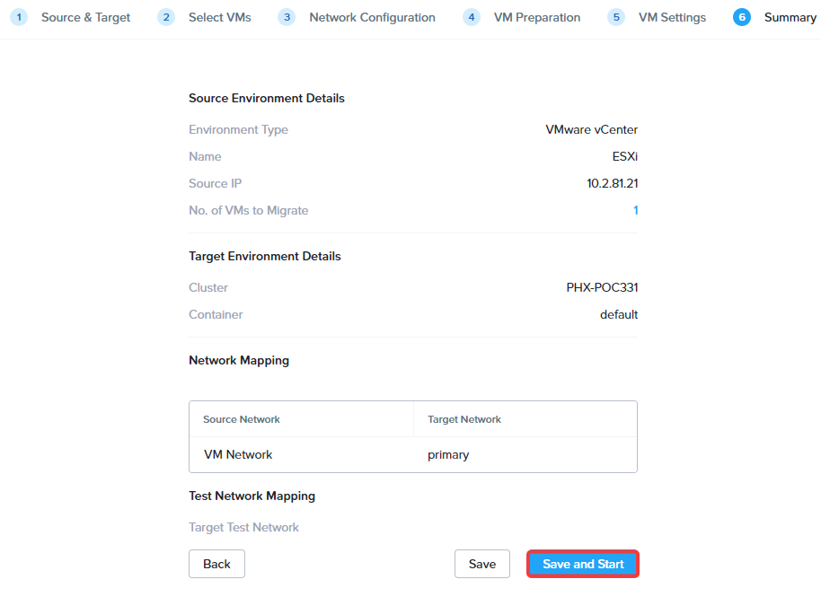

# Create a Migration Plan

เมื่อตั้งค่า source และ destination เรียบร้อยแล้ว ให้สร้าง migration plan

1.  คลิก `Create a Migration Plan`
    
    !!! note    
        หาก Create a Migration Plan button เป็นสีเทา ให้รอ 2-3 นาที
    
    
    
2.  ป้อนชื่อสำหรับ Plan `User##-VM-Plan` แล้วคลิก `Proceed`
    
    
    
3.  เลือก Source AHV และ Target AHV environment ของคุณ แล้วคลิก `Next`
    
    -   **Select a Source** : `Nutanix AHV Source or the name used before`
    -   **Select a Target** : `Nutanix AHV Target or the name used before`
    -   **Target Project** : `None`
    -   **Target Cluster** : `Select the destination AHV cluster`
    -   **Target Container** : `default`
    
    
    
4.  เลือก Linux VM ที่ต้องการย้าย `XXX-User##` โดยที่ `XXX` คือ prefix ที่ instructor กำหนดให้คุณ เมื่อเลือกแล้ว คลิก `Next` ที่มุมล่างขวา
    
    
    
    โปรดละเว้น warning signs ที่อาจปรากฏขณะเพิ่ม VM ซึ่งจะไม่ส่งผลต่อการ migration
    
    
    
5.  สำหรับ Networks เลือก `primary` สำหรับ Target Network แล้วคลิก `Next`
    
    
    
6.  บนหน้า VM preparation ให้เลือก option ตามที่แสดง และกรอก username และ password สำหรับ Linux VM
    
    -   **Preparation Mode** - `Automatic` โหมด Manual จะย้ายเฉพาะข้อมูลเท่านั้น โดย VM preparation script และ OS configuration ทั้งหมดจะต้องรันด้วยตนเองในโหมด Manual
    -   **Guest Operations**
        -   `DHCP` และตรวจสอบให้แน่ใจว่า `Install Nutanix guest Tools(NGT) on target VMs` ถูก **ยกเลิกการเลือก** หากใช้ DHCP เช่นในกรณีของเรา VM จะได้รับ IP address ใหม่บนปลายทาง _Retain static IP Addresses from source VMs_: หาก VM มี static IP จะถูกเก็บรักษาไว้บนปลายทาง
        -   _Uninstall Virt Tools from other Hypervisor on target VMs_: เนื่องจากเรากำลังย้ายไปยัง AHV จึงไม่จำเป็นต้องติดตั้ง Tools ที่ไม่ใช่ AHV บน VM
        -   _Bypass guest operations on source VMs_: จะดำเนินการเฉพาะ data migration เท่านั้น โดยไม่มีการดำเนินการกับ guest OS **ให้ยกเลิกการเลือกตัวเลือกนี้**
    -   **Credentials**
        -   _User Name_: `rocky`
        -   _password_: `nutanix/4u`
    
    
    
    !!! note 
        คุณต้องป้อน credentials เหล่านี้ในช่อง **Linux VMs** เท่านั้น และสามารถเว้นว่างช่อง Windows credentials ไว้ได้
    
7.  บนหน้า **VM Settings** ให้คงค่า default ไว้และเลือก `Next` โดย field ต่างๆ จะอนุญาตให้ปรับเปลี่ยน setting ของแต่ละ VM ได้ ซึ่งรวมถึง setting เช่น การเปิดใช้งาน Memory Overcommit หรือการใช้ category ที่มีอยู่ใน Prism Central สามารถเรียนรู้เพิ่มเติมเกี่ยวกับ category ได้ในส่วน advanced migration หากต้องการทราบข้อมูลเพิ่มเติมเกี่ยวกับ field ต่างๆ โปรดดูที่ [Move Guide](https://portal.nutanix.com/page/documents/details?targetId=Nutanix-Move-v5_5:top-create-migration-plan-t.html)
    
    
    
8.  บนหน้า **Summary** คลิก `Save and Start` การเลือก Save จะบันทึกเฉพาะ plan เท่านั้น ส่วน Save and Start จะบันทึก plan และเริ่มต้นการ Migration
    
    -   หมายเหตุ: หากเกิด migration error เมื่อบันทึก plan ให้รอประมาณ 30 วินาทีแล้วลองใหม่
    
    

---

[← Back: Migrating VMs with Move](migrate-workloads-move-view-source-vm.md) | [Home](migrate-nutanix-overview.md) | [Next: Migrate the VM →](migrate-workloads-move-migrate-vm.md)