# Migrate VM

เมื่อ Migration plan เริ่มต้นแล้ว ระบบจะทำการ validate ก่อน

1.  ตรวจสอบ Plan Validation ในส่วน Status 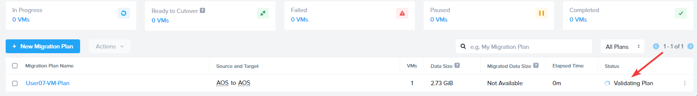
    
2.  เมื่อ validation สำเร็จ status จะเปลี่ยนเป็น **In Progress** คลิก `In Progress` เพื่อติดตามสถานะ
    
    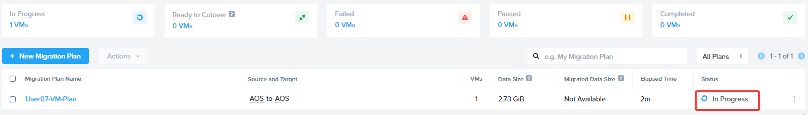
    
3.  คุณสามารถติดตาม **Migration Status** และ **Details** ได้บนหน้านี้ ขั้นตอนนี้ใช้เวลาประมาณ 5-10 นาที เป็นโอกาสดีที่จะไปชงกาแฟสักแก้ว ☕
    
    สำหรับผู้ที่อยากรู้เพิ่มเติม ในขั้นตอนนี้ Move กำลังเตรียม source VM สำหรับการถ่ายโอน โดยดำเนินการต่างๆ เช่น การติดตั้ง Nutanix VirtIO drivers และทำ data seeding บน target cluster สำหรับรายการงานโดยละเอียด โปรดดูที่ [Move Guide](https://portal.nutanix.com/page/documents/details?targetId=Nutanix-Move-v5_5:top-create-migration-plan-t.html)
    
    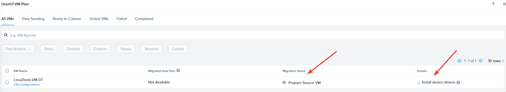
    
    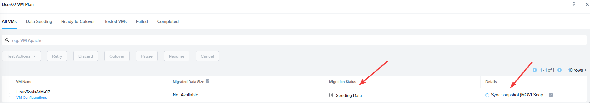
    
4.  เมื่อ data seeding เสร็จสมบูรณ์ status จะเปลี่ยนเป็น `Ready To Cutover` และยังแสดงการประมาณเวลา cutover เพื่อให้คุณวางแผนการ cutover จริงได้
    
    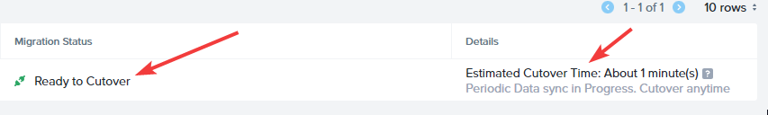
    
    หากคุณอยู่ที่หน้าหลักของ Move จุดสีน้ำเงินหมายความว่า VM พร้อมสำหรับการ cutover
    
    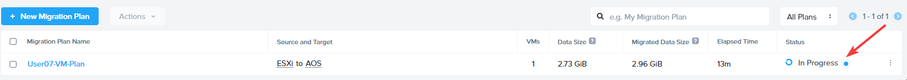
    
5.  ในการดำเนินการ cutover ให้เลือก VM แล้วคลิก `Cutover` จากนั้นคลิก `Continue` เพื่อยืนยัน
    
    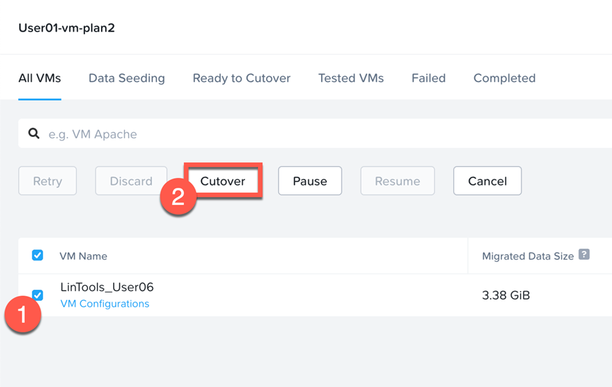
    
    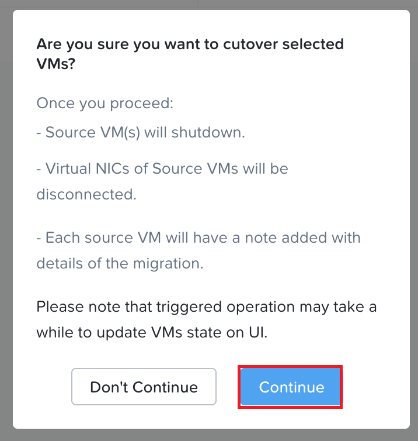
    
    กด `Continue` บน splash screen
    
6.  คุณสามารถติดตามการ cutover ได้ใน **Migration Status** และ **Details**
    
    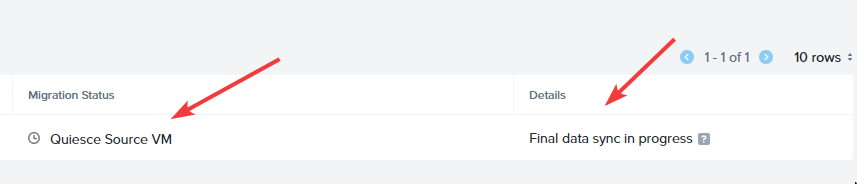
    
7.  เมื่อการ cutover เสร็จสมบูรณ์ **Status** จะแสดงว่า Completed และ **Details** จะมีลิงก์ไปยัง View Target VM
    
    **อย่าคลิก View Target VM** การคลิกจะพาคุณไปยัง Prism Element แต่เราต้องการกลับเข้าสู่ Prism Central แทน
    
    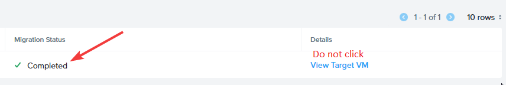
    
8.  เข้าสู่ระบบ Prism Central
    
    -   **username** - `<PC login> will be adminuser##@ntnxlab.local` or `adminuser##`
    -   **password** - `<PC password>` from Connection Details
9.  ไปที่ **Compute & Storage** > **VMs**
    
    
    
10.  ค้นหา VM ที่ migrate แล้วในหน้าหลัก หรือค้นหาผ่าน search bar จดบันทึก IP address ของ VM ของคุณ
    
    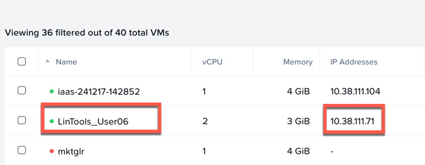
    
11.  คุณจะใช้ IP address ของ VM ที่ migrate แล้วเพื่อเชื่อมต่อกับ code-server ผ่าน browser ใน Parallels VDI environment
    
    -   **link** - `http://vmIP:8001`
    
    
    
12.  จากนั้นคุณจะสามารถเข้าสู่ระบบ code-server ด้วยข้อมูลต่อไปนี้:
    
    -   **password** - `adminuser01`
    
    !!! note    
        ผู้ใช้ทุกคนจะใช้ `adminuser01` เป็น password โดยไม่คำนึงถึง password ที่เคยใช้ก่อนหน้านี้
    
    จากนั้นคุณจะสามารถเข้าถึง terminal ได้
    
    
    
13.  ในหน้าต่าง console พิมพ์คำสั่ง `ls` และตรวจสอบว่าไฟล์มีอยู่
    
    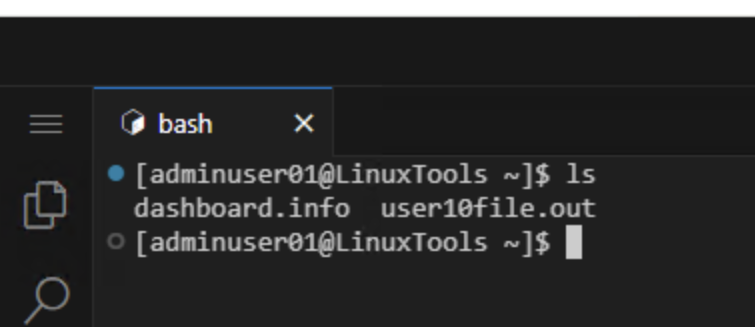
    

🎉🎉🎉🎉🎉🎉🎉🎉🎉🎉🎉🎉🎉🎉🎉🎉

ยินดีด้วย!! คุณได้ทำการ migrate VM จาก AHV ไปยัง AHV สำเร็จแล้วด้วยการคลิกเพียงไม่กี่ครั้ง

ถัดไป หากมีเวลา ให้ทำการ migrate อีกครั้งด้วย Move และสำรวจฟังก์ชันขั้นสูงที่ Move นำเสนอ ผู้สอนสามารถช่วยกำหนดขั้นตอนถัดไปได้

---

[← Back: Create a Migration Plan](migrate-workloads-move-creating-migrate-plan.md) | [Home](migrate-nutanix-overview.md) | [Next: Advanced VM Migrations →](migrate-workloads-move-advanced-migration.md)
