# Configuring Nutanix Files

ในส่วนนี้ คุณจะทำการสร้าง Nutanix Files share บน cluster ที่ถูก provision ไว้ให้โดยอัตโนมัติของเรา share นี้จะเป็นปลายทาง (destination) สำหรับ source share ที่เรากำลังจะทำการ migrate

## Creating A Nutanix Files Share

เราได้ทำการสร้าง 1-node Files instance ที่ชื่อว่า `nextfiles` ซึ่งทำงานอยู่ใน lab สำหรับแบบฝึกหัดนี้ ผู้ใช้จะต้องล็อกอินเข้าสู่ Prism Central ทำการ access Files จากที่นั่น และสร้าง share ที่ไม่ซ้ำกัน share นี้จะทำหน้าที่เป็น destination share สำหรับ data migration ในบทถัดไป

1.  เชื่อมต่อเข้าสู่ Prism Central จากภายใน VDI session ของคุณ ตรวจสอบให้แน่ใจว่าหน้า Login ระบุว่า **Login with your Company ID**
    
    -   **username** - `<PC username> adminuser##@ntnxlab.local` หรือ `adminuser##`
    -   **password** - `<PC password provided>` จาก Connection Details

    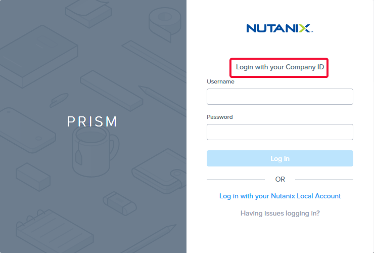

2.  นำทางไปยังส่วน App Switcher ที่บริเวณด้านซ้ายบนของ Prism Central
    
    !!! note
        คุณสามารถใช้ App Switcher เพื่อ navigate ระหว่างส่วนต่างๆ ใน Prism Central ได้อย่างรวดเร็ว
    
    คลิก `Files` ใน App Switcher ภายใต้ Unified Storage
    
    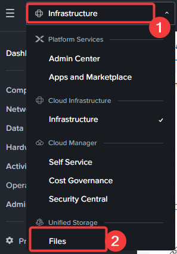
    
    file server ที่ชื่อว่า **nextfiles** ได้ถูก deploy ไว้ให้คุณใช้งานเรียบร้อยแล้ว คลิกที่ชื่อ `nextfiles` เพื่อเข้าใช้งาน
    
    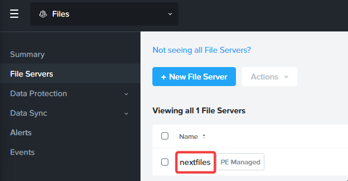
    
3.  คลิกที่ `Shares & Exports` จาก top menu
    
    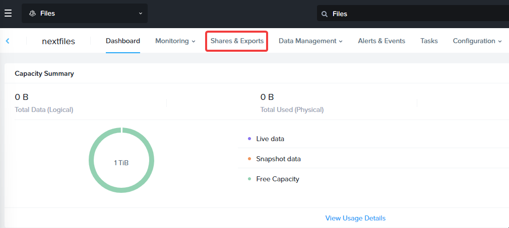
    
4.  คลิก `+New Share or Export`
    
    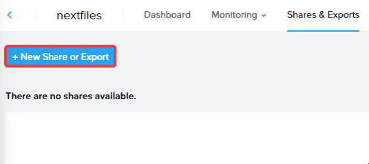
    
5.  ใส่ค่า `user##` ในฟิลด์ **Name** โดยที่ `##` คือ `User #` ที่คุณได้รับมอบหมายจาก Connection Details สำหรับส่วนที่เหลือ ให้คงค่า default ไว้ ข้อมูลต่อไปนี้คือคำจำกัดความของแต่ละฟิลด์เพื่อเป็นข้อมูลเพิ่มเติม คลิก `Next`
    

    -   Description: คำอธิบายเกี่ยวกับ share ที่เข้าใจง่าย
    
    -   Share Path: สำหรับ share/export บน path ที่มีอยู่แล้วเท่านั้น
    
    -   Max Size: หากคุณต้องการจำกัดขนาดของ share/export ให้มีขนาดเฉพาะเจาะจง
    
    -   Primary Protocol Access: เลือก `SMB (Ideal for Windows Clients)` เนื่องจาก source share เป็น Windows
    
    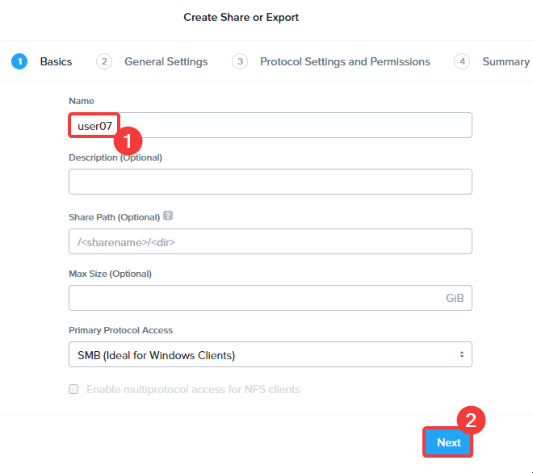
    

6.  ในหน้า General Settings ให้คงค่า default ไว้ ข้อมูลต่อไปนี้คือคำจำกัดความของแต่ละฟิลด์เพื่อเป็นข้อมูลเพิ่มเติม คลิก `Next`
    
    -   Enable Self-Service Restore: อนุญาตให้ผู้ใช้งานสามารถ restore files บน File Server ได้
    -   Enable Compression: เปิดใช้งาน Compression บน share เพื่อช่วยประหยัดพื้นที่จัดเก็บ
    -   Blocked File Types: จำกัดประเภทของ file ที่อนุญาตให้จัดเก็บไว้บน share/export ได้ 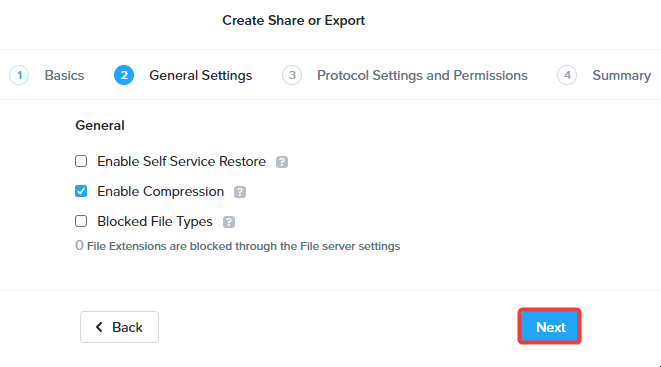

7.  ในหน้า Protocol Settings and Permissions ให้คงค่า default ไว้ ข้อมูลต่อไปนี้คือคำจำกัดความของแต่ละฟิลด์เพื่อเป็นข้อมูลเพิ่มเติม คลิก `Next`
    
    -   Enable Access Based Enumeration (ABE): จำกัดการเข้าถึง files และ folders ให้เห็นเฉพาะสิ่งที่ผู้ใช้มีสิทธิ์เข้าถึงเท่านั้น
    -   Encrypt SMB3 Messages: เข้ารหัส (Encrypt) ข้อความ SMB ระหว่าง Clients และ shares
    -   SMB Continuous Availability: อนุญาตให้เข้าถึง File share ได้ในระหว่างที่มี outage ทั้งแบบที่มีการวางแผนไว้และไม่ได้วางแผนไว้
    -   Share Permissions: ตั้งค่าสิทธิ์การเข้าถึงสำหรับ Users และ Groups สำหรับ share
    
    !!! note
        หากเราทำงานกับ file server แบบ 3-node หรือใหญ่กว่านั้น จะมีตัวเลือกในการกำหนด share ให้เป็นแบบ **Distributed** สิ่งนี้จะกระจาย top-level directories ไปยัง File Server VMs (FSVM) ทั้งหมด รวมถึงการทำ load balance ของ connections และ data ทั่วทั้ง Files cluster
    
    ในกรณีนี้ เราใช้ standard share ซึ่ง file server จะให้บริการจาก FSVM เพียงตัวเดียว
    
    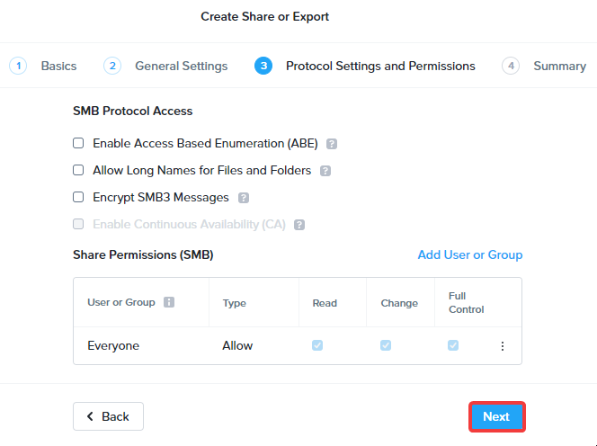
    
8.  ในหน้า Summary ตรวจสอบความถูกต้องของการตั้งค่าและคลิก `Create` share จะปรากฏขึ้นในไม่ช้า และพร้อมสำหรับจัดเก็บ files
    
    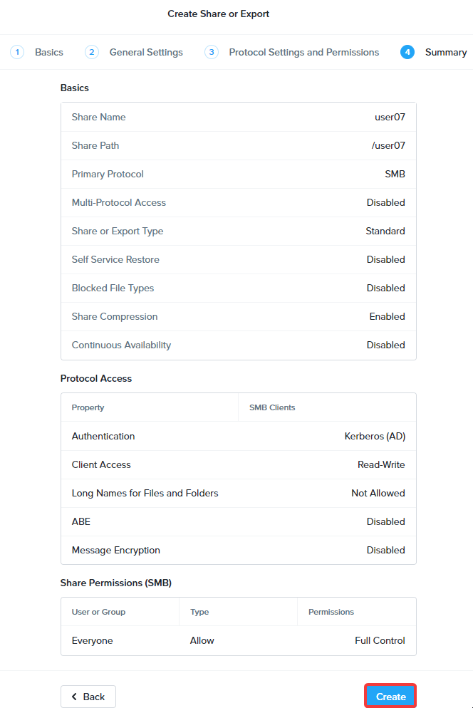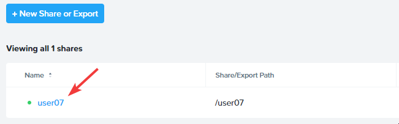
    

## Create REST API user

ในการดำเนินการ share migration ด้วย Move ตัวของ Move จำเป็นต้องให้มีการสร้าง REST API user บน Nutanix Files มาเริ่มต้นทำกันเลย

1.  คลิก `Configuration > Manage Roles` จาก top menu ของ Nutanix Files

    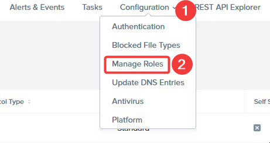

2.  ในส่วนของ REST API access users ให้คลิก `+New User`
    
    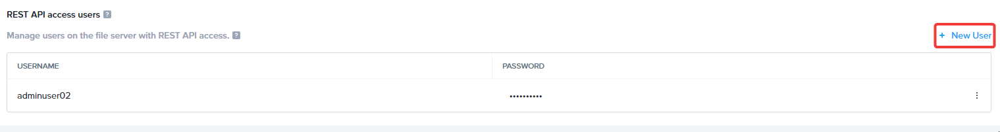
    
3.  ทำการสร้าง New user โดยใช้ credentials ต่อไปนี้ แล้วคลิกที่เครื่องหมายถูก (check mark) โปรดจำ username และ password นี้ไว้ใช้สำหรับส่วนถัดไป คุณสามารถเลือกใช้ password อื่นได้ตามอิสระ แต่คุณจะต้องใช้มันในภายหลัง

    -   **username** : `adminuser##`
    -   **password** : `dotNext25!`

    !!! note
        อย่าลืมคลิกที่เครื่องหมายถูก (check mark)

    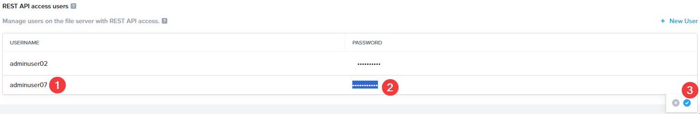

4.  จาก App Switcher คุณสามารถกลับไปยังส่วนของ Infrastructure

ตอนนี้เราได้ทำการ set up และ configure ตัว environment เรียบร้อยแล้ว ในส่วนถัดไปคุณจะได้เรียนรู้วิธีการ migrate file shares

---

[← Back: Migrating Shares with Move](migrate-workloads-move-share.md) | [Home](migrate-nutanix-overview.md) | [Next: View Source Share →](migrate-workloads-move-share-view-share.md)