# Create a Migration Plan

ต่อไปเราจะทำการสร้าง migration plan ใน Move สำหรับ share นี้

1.  ล็อกอินเข้าสู่ Move VM หรือกลับไปยังแท็บ Move VM หากยังเปิดอยู่
    
    -   **login name** : nutanix
    -   **password** : `dotNext25! หรือรหัสผ่านใดๆ ที่คุณตั้งไว้ตอนทำการ set up Move`
    
2.  คลิกที่แท็บ `Files`
    
    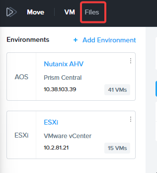
    
3.  คลิก `New Migration Plan`
    
    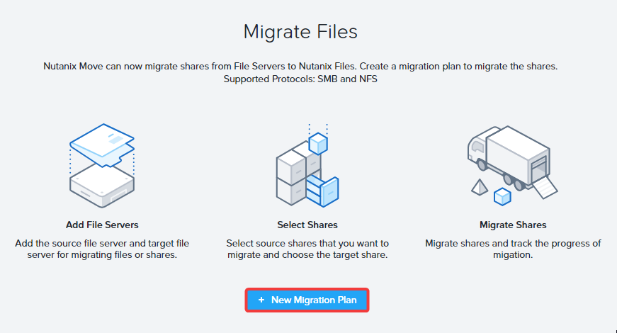
    
4.  ใส่ชื่อสำหรับ Plan เป็น `User##-Files-Plan` แล้วคลิก `Proceed`
    
    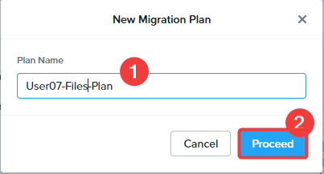
    
5.  ต่อไปเราจะเพิ่ม target Nutanix Files Server ของเรา คลิก `Add New Target`
    
    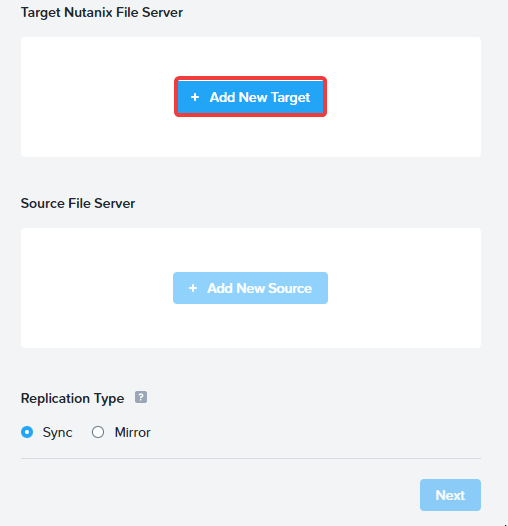
    
6.  เพิ่มรายละเอียดของ target Nutanix File Server จากนั้นคลิก `Add`
    
    -   **Name** : ตั้งชื่ออะไรก็ได้ที่คุณต้องการ เราขอแนะนำ **Nutanix Files**
    -   **FQDN Details/Address** : IP Address ของ nextfiles ที่คุณจดบันทึกไว้ใน [ขั้นตอนที่ 4 ของ View Source Share](migrate-workloads-move-share-view-share.md)
    -   **username** : `adminuser##` . *ตรวจสอบให้แน่ใจว่านี่คือ username เดียวกับที่คุณใช้สร้าง REST API user ในหัวข้อก่อนหน้า*
    -   **password** : `dotNext25! หรือรหัสผ่านใดๆ ที่คุณระบุตอนสร้าง REST API user`
    
    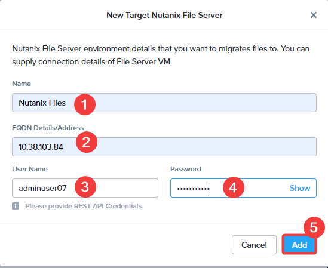
    
7.  ต่อไปเราจะเพิ่ม source File Server ของเรา คลิก `Add New Source`
    
    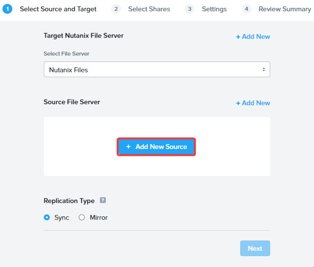
    
8.  เพิ่มรายละเอียดของ Source จากนั้นคลิก `Add`
    
    -   **Name** : ตั้งชื่ออะไรก็ได้ที่คุณต้องการ เราขอแนะนำ **Source Filer**
    -   **FQDN Details/Address** : `WinFS-Next.ntnxlab.local`
    -   **Username** : `ntnxlabdminuser##`
    -   **password** : `<Admin user password>`
    
    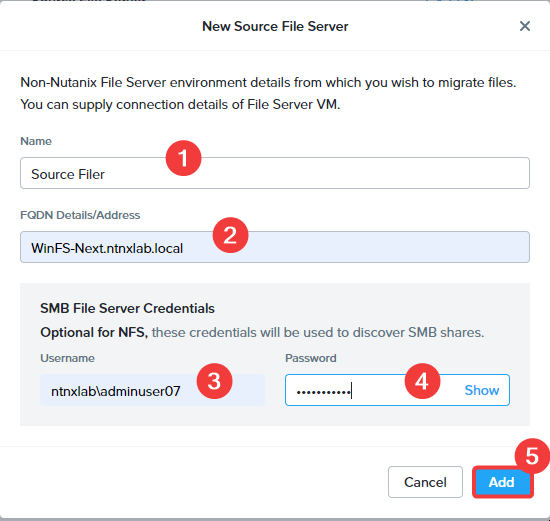
    
9.  หลังจากที่เพิ่ม target และ source แล้ว คุณสามารถเลือก replication type ได้ เราจะเลือกเป็นแบบ sync
    
    -   **Sync**: Sync replication จะอัปเดต target files ด้วยการเปลี่ยนแปลงจาก source โดยไม่ลบ target files ที่มีอยู่เดิม
    -   **Mirror**: Mirror replication จะสร้างสำเนาที่เหมือนกันทุกประการจาก source ไปยัง target ซึ่งอาจจะลบ target files ที่มีอยู่เดิมหากไม่มีอยู่ใน source
    
    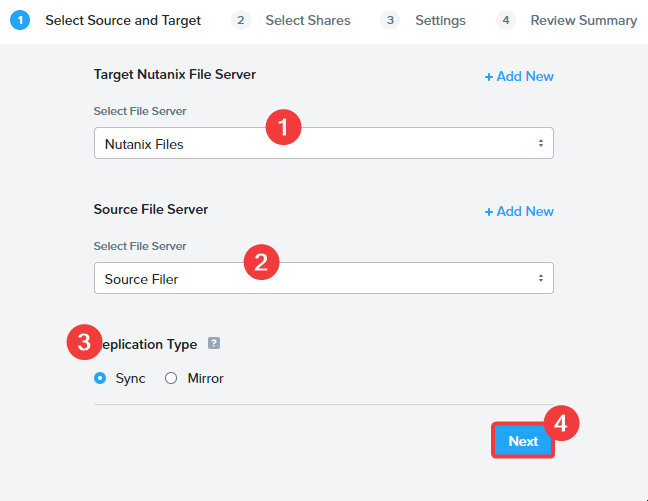
    
10. ต่อไป เราจะเพิ่ม share ที่ต้องการจะ migrate
    
    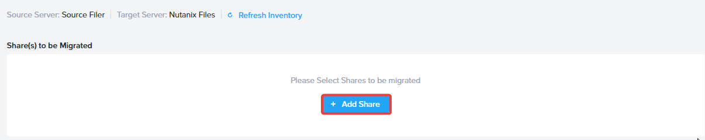
    
11. กรอกรายละเอียดดังต่อไปนี้ คลิกเครื่องหมายถูก (check mark) แล้วคลิก `Next` ที่ด้านล่าง
    
    -   ก่อนที่จะกรอก **Source** และ **Target** ให้คลิกที่ตัวเลือก `Refresh Inventory` สีน้ำเงิน หากคุณไม่คลิก Refresh Inventory คุณอาจจะไม่เห็น sources หรือ targets ใดๆ ที่พร้อมใช้งาน
    -   **Source** : `nextlab`
    -   **Target** : `user##`. สิ่งนี้คือ share เดียวกับที่คุณสร้างไว้ในส่วนก่อนหน้า
    
    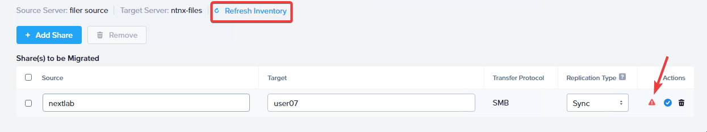
    
    ![](data:image/png;base64,iVBORw0KGgoAAAANSUhEUgAAAF8AAABqCAYAAADa+43rAAAABGdBTUEAALGPC/xhBQAAAAlwSFlzAAAOwwAADsMBx2+oZAAAA/xJREFUeF7tm89rE0EYhv0zPIsn/4ZCrh5KERQ85FbQIqIUb73oTbDUQsFLLfVQEQx4sRcLVrRFrAgGpD8Eg6UVpBIpIW3a7mY3+zmzO2s3cWuTsvqGyfvCA83ObvbbZzbfJCU5tVPbF4KB8oFQPhDKB0L5QCgfCOUDoXwglA+E8oFQPhDKB0L5QCgfCOUDoXwglA+E8oFQPhDKB0L5QCgfCOUDoXwglA+E8oFQPhDKB0L5QCgfCOUDoXwglA+E8oFQPhDKB0L5QCgfCOUDoXwglA+E8oFQPhDKB0L5QCgfCOUDoXwgp4SBhfKBoXxgKB8YygeG8oGhfGAoHxjKB4bygaF8YCgfGMoHhvKBoXxgMpdfn5+X/ZER2R0YkJ2+PivZPX9e9m/cELdQEHFdc+WdJzP5we5uWFBasTZTy+elsbVlLHSWzOQ7Y2OpxfUC+qY7STKRr2c+rahewnv/3thoP5nI130+WYju96WXS3J1wZVzTw/kzBO7uDBelIXL15uu2Xn82NhoP5nId6anmwr5PjphpfQko8OTTdesHXSafyL/2e2HqQXbRNfKH781mVqwTXStfF1YWsE2QflAKB8I5QOhfCCUD4TygVgs35N3+j+1QSDP37SMrTXEUUOlUsv2/4zF8n0pmeeWPV8Gk2Nfg3Dzt003sf9J8KSoJtjZ9lPGjqc35Ks4Ze9wLDP55hw1X/Kp43/Hfvl7gZT88BRSXHaisVb5s3V5XgnEiTaLuIHMfYj2vbgebYyPzS03pKoel7cDKYcjcdQxi8nzH4/98tVdOViMhGlBhVk11iTflYIe9AN5vVyX3Iu6zO3oUbPvK/U84eSptWPJ/K32LYTrCO/8I0iKceTuD3Nb68lIyv8YTUz1hye5+NilRnhXx6+M3O/J0wmkuBa3K8o/glYxrszVwlNJWbUinVCumQjlVBzvEJ3qVrxOODJTibZJ1Zf+I8/RGT0kX/FGbTP9XyeU/yl626nv/D+fI0L3eb2PniCd0lezdlD+UaSLyZfUwhqeMW4rdXl9oB+pnq/eN+ZmXbm7rtqO25AZfUw8Yerx1Fvz2UHtO5fs+U5D7quBw1dEe1gs35NVJc2ptN6Vcf8PZPWz6d1qkW16t6MW1NJ3T4bVgnttM9o37vNx/49akitTP+ODkmtBe1gsv/uhfCCUD4TygVA+EMoH0rXyJ24+SC3YJrpGvv6eerKQd5eupBZsE4+G7jVdM0y+/+VLUyG9iP6ycKfJRL7+dcbe0FBqUb1ApX9Agu1tI6P9ZCNfpbGxEf5cJq042/EWF42FzpKZfB09+wd37qQWaCP61e6vrJir7zyZymc6C+UDQ/nAUD4wlA8M5YNy+vRZ+QVxy5kxDzqgoAAAAABJRU5ErkJggg==)
    
12. หากการ migration จำเป็นต้องถูกกำหนดเวลา (scheduled) สำหรับวันและเวลาเฉพาะ สามารถทำได้ในหน้า settings page เราจะปล่อยให้ไม่ต้องทำเครื่องหมาย (unchecked) แล้วคลิก `Next`
    
    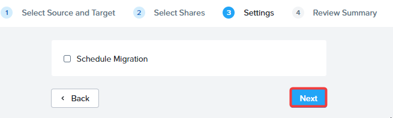
    

13. ในหน้า Summary คุณสามารถเลือก `Saved` สำหรับ plan ไว้ใช้งานภายหลังได้ แต่เราจะเลือก `Save and Start` สำหรับการ migration
    
    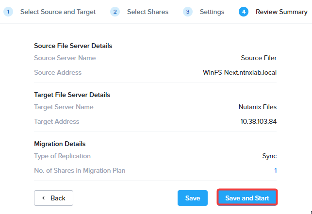
