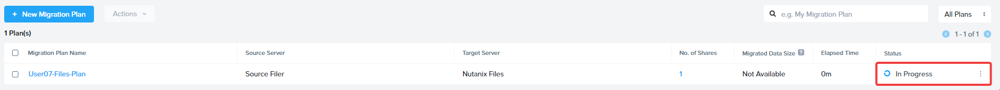
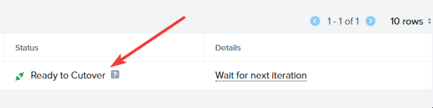
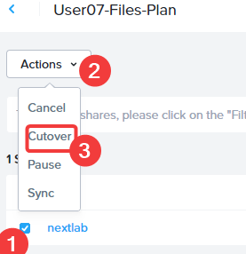
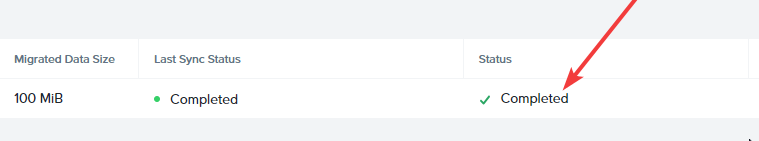
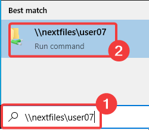
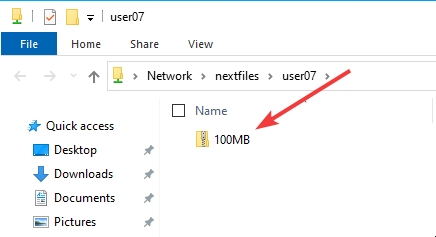

## Migrate Share

1.  เมื่อเริ่มต้นแล้ว plan จะถูกตรวจสอบ (validated) และจากนั้นจะดำเนินการต่อเมื่อการตรวจสอบสำเร็จ คลิก `In Progress`
    
    
    
2.  คุณสามารถตรวจสอบสถานะการ migration ได้ที่นี่ เช่นเดียวกับก่อนหน้านี้ที่ทำกับ VMs มันจะผ่านขั้นตอนการ seeding ซึ่งจะรวดเร็วเนื่องจากจำนวน data ที่จะ migrate มีขนาดเล็ก เมื่อ seeding เสร็จสมบูรณ์ สถานะจะเปลี่ยนเป็น `Ready to Cutover`
    
    ขั้นตอนนี้ควรใช้เวลา 1-2 นาที
    
    
    
3.  ในการ cutover ให้เลือก source และคลิก `Actions` จากนั้นคลิก `Cutover` คลิก `Confirm` เพื่อยืนยัน
    
    
    
4.  เมื่อ cutover เสร็จสมบูรณ์ สถานะจะแสดงเป็น **Completed**
    
    
    

## View Target Share

ตอนนี้เราได้ทำการ migration เสร็จสมบูรณ์แล้ว มาดูกันที่ target share จาก Windows client ของเรา

1.  ล็อกอินเข้าสู่ Remote Desktop Session ของคุณ
    
2.  เปิด target share โดยพิมพ์ `\\nextfiles\user##` ลงในฟิลด์ **Search** แล้วกด **Enter**
    
    
    
3.  target share จะมี file ขนาด 100MB ที่เราเห็นก่อนหน้านี้บน source share
    
    ตอนนี้ users สามารถ map ตัว target share นี้เป็น network share ได้แล้ว files ใหม่ใดๆ ที่พวกเขาสร้างจะถูกจัดเก็บไว้บน share ใหม่ภายใน Nutanix Files
    
    
    

🎉🎉🎉🎉🎉🎉🎉🎉🎉🎉🎉🎉🎉🎉🎉🎉

ขอแสดงความยินดีด้วย!! ตอนนี้คุณได้ย้าย file shares ของคุณไปยัง Nutanix และรวบรวม infrastructure ของคุณเข้าสู่ platform เดียวเป็นที่เรียบร้อยแล้ว

---

[← Back: Create Migration Plan](migrate-workloads-move-share-create-plan.md) | [Home](migrate-nutanix-overview.md) | [Next: Migration Takeaways →](migrate-workloads-migration-takeaways.md)