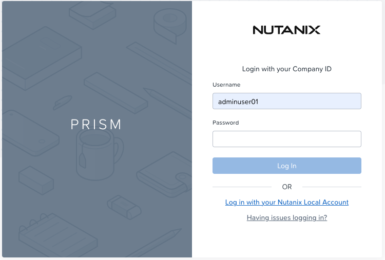
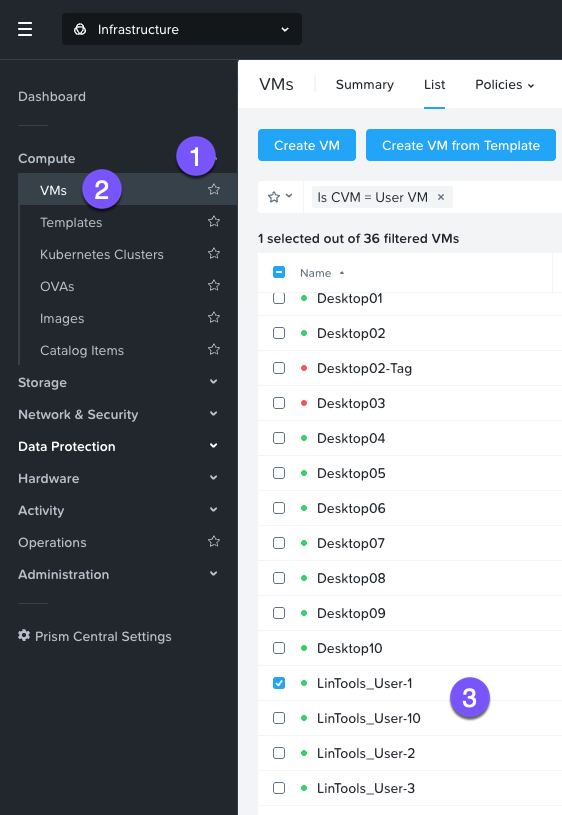
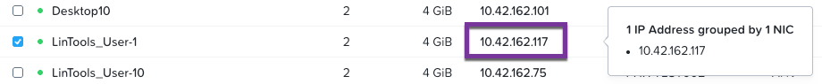
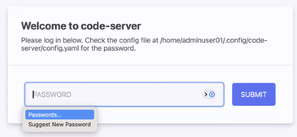
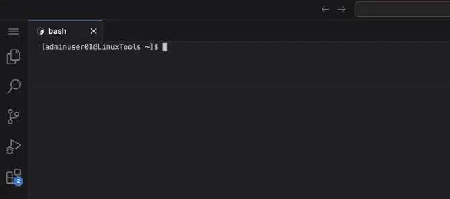
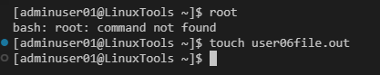

# Migrating VMs with Move

Nutanix Move ทำให้การย้าย VMs และ workloads ไปยัง Nutanix เป็นเรื่องง่ายและมี downtime น้อยที่สุด สำหรับ lab ส่วนนี้ เราจะ migrate VMs จาก Source AHV cluster ไปยัง Target AHV cluster

# View Source VM

ก่อนอื่นมาดู source VM บน AOS ที่เรากำลังจะ migrate ไปยัง Nutanix กัน เราได้ provision ตัว Linux VMs ให้กับผู้ใช้งาน lab ทุกคนบน source AHV cluster ซึ่งเราจะใช้ในการ migrate ไปยัง target AHV cluster ของคุณ

1.  Login เข้าสู่ Prism Central สำหรับ shared Source AHV Cluster จากเว็บเบราว์เซอร์โดยใช้ IP address ที่ให้ไว้ `ตรวจสอบให้แน่ใจว่าใช้แท็บเบราว์เซอร์ภายใน Parallels VDI instance ของคุณ`
    
    -   **Shared Prism Central Source** - `10.38.44.7`
    -   **username** - `admin`
    -   **password** - `nx2Tech787!`
    
    
    
2.  จากบานหน้าต่างด้านซ้าย ให้คลิกเพื่อขยาย Compute Group และคลิกที่เมนู VMs จากนั้นให้ดูในรายชื่อของ VMs และค้นหา LinuxTools VM ที่ตรงกับหมายเลขผู้ใช้ของคุณ `LinTools_User##`
    
    
    
3.  เมื่อคุณพบ tools VM ของคุณแล้ว ให้จดบันทึก IP address ของ VM ไว้ การคลิกที่ IP address จะทำให้มีหน้าต่างเล็กๆ ปรากฏขึ้นมา ซึ่งช่วยให้คุณสามารถเลือกและ copy เพื่อนำไป paste ในภายหลังได้
    
    
    
4.  เราจะใช้ IP address เพื่อเชื่อมต่อกับ code-server ผ่านเบราว์เซอร์ภายใน Parallels VDI desktop
    
    -   **link** - `http://your-XXX-VM-IP:8080`

    

5.  จากนั้นคุณจะสามารถ log in เข้าสู่ code-server บน VM นั้นได้ด้วยข้อมูลดังต่อไปนี้:
    
    -   **password** - `nutanix/4u`
    
    !!! note
        ผู้ใช้ทุกคนจะใช้ `nutanix/4u` เป็น password โดยไม่คำนึงว่าก่อนหน้านี้คุณจะเคยใช้ password อะไรมาบ้าง
    
    จากนั้นคุณจะสามารถเข้าถึง terminal ได้
    
    
    
6.  ต่อไปเราจะทำการสร้าง dummy file บน VM คุณสามารถปิดแท็บนี้ได้เมื่อทำเสร็จแล้ว
    
    
    

ตอนนี้เราได้ดู source VM ของเราแล้ว ต่อไปเราจะทำการสร้าง migration plan เพื่อย้าย VM กัน
