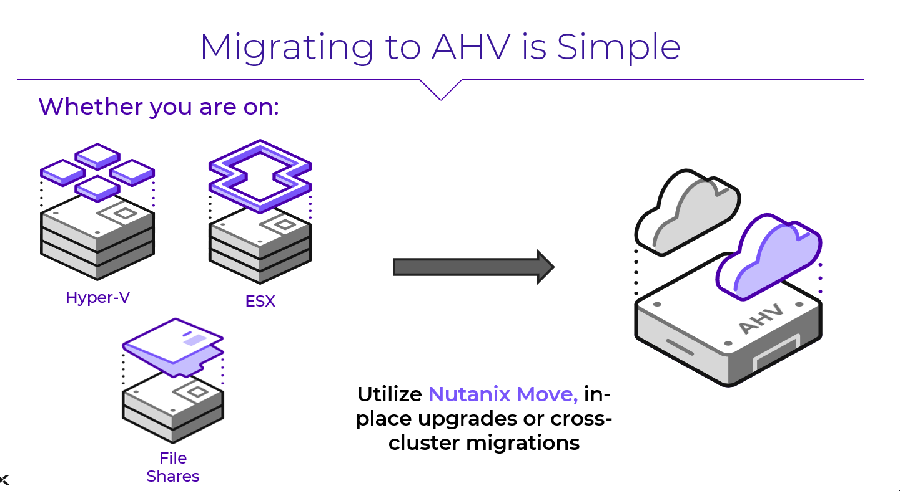
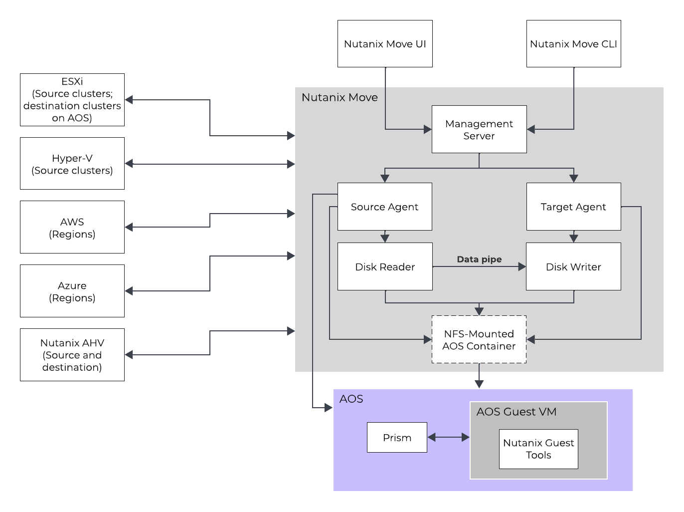

# Migrating Your Workloads

มี workloads หลายประเภทที่แตกต่างกันและหลากหลายวิธีที่แต่ละ workloads สามารถถูก migrated ได้ Customers จะเลือกวิธีที่เหมาะสมตาม requirements และ constraints ของพวกเขา สำหรับ lab นี้ เราจะโฟกัสไปที่การใช้วิธีแบบ Nutanix-based เนื่องจากมันมักจะให้ user experience ที่ดีที่สุด

## Move Architecture

ด้านล่างนี้คุณจะพบกับ distributed architecture ของ Move คุณสามารถอ่านเพิ่มเติมเกี่ยวกับ architecture และ components ทั้งหมดได้บน [Nutanix Bible](https://www.nutanixbible.com/21b-vm-migration-arch.html)

ตอนนี้คุณมี destination cluster ที่เปิดใช้งานและกำลังรันด้วย Prism Central และ AHV แล้ว มาย้าย workloads บางส่วนกันเถอะ

## Key Objectives

ส่วนหนึ่งของแบบฝึกหัดนี้ คุณจะได้:

-   Setup ตัว source และ target environments ของ Move
-   Migrate ตัว VMs จาก Nutanix AHV ไปยัง Nutanix AHV ด้วย Nutanix Move พร้อมสำรวจ basic features คุณสามารถข้ามส่วนนี้ได้หากคุณเคยใช้ Move มาแล้ว
-   Migrate ตัว VMs จาก VMware ESX ไปยัง Nutanix AHV พร้อมสำรวจ advanced features ในรูปแบบ guided experience เริ่มที่นี่หากคุณเคยใช้ Move มาแล้ว
-   สำรวจการ migration at scale โดยใช้ guided click-through demo ของ environment ที่ใหญ่ขึ้น
-   ทำความเข้าใจการ file share migration จาก non-Nutanix share ไปยัง Nutanix Files share โดยใช้ความสามารถในการ share migration ใน Nutanix Move

!!! note
    Expected Module Duration: 45 นาที