# Setup Move

!!! note
    หากคุณเลือกส่วน migration แรกของ lab นี้ `Migrating VMs with Move`, คุณ **ต้อง (must)** setup ตัว Move โดยใช้คำแนะนำเหล่านี้ ส่วน `Advanced VM Migrations` และ `Migrate at Scale` จะใช้ guided environment ดังนั้นขั้นตอน setup เหล่านี้จึงไม่จำเป็น

ไม่ว่ากรณีใดก็ตาม เราแนะนำให้ทำตามขั้นตอนเหล่านี้หากคุณไม่เคยใช้ Move มาก่อน

ในการ migrate เราจะ log in เข้าสู่ Move VM และ setup ตัว environments และ migration plan

source environment แรกของเราคือ AHV สำหรับจุดประสงค์ของ lab นี้

destination environment ของเราก็คือ AHV เช่นกัน

สิ่งนี้สามารถนำไปใช้ในกรณีที่ AHV clusters ที่แยกจากกันไม่สามารถเชื่อมต่อกันได้ง่ายสำหรับการทำ disaster recovery หรือ live migration เนื่องจากข้อจำกัดขององค์กร (organization restrictions) ซึ่งสามารถใช้ Move แทนได้

1.  Login เข้าสู่ Prism Central
    
    -   **username** - `<PC login> adminuser##@ntnxlab.local.` หรือ `adminuser##`
    -   **password** - `<PC password>` จาก Connection Details
2.  ไปที่ **Compute** > **VMs**
    
    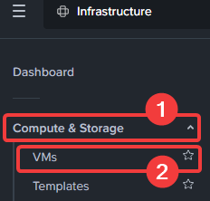
    
3.  Move VM สำหรับแต่ละ user ที่ชื่อ `User##-Move` ได้ถูกสร้างไว้เรียบร้อยแล้ว ให้มองหา VM นั้นในหน้าหลัก หรือคุณสามารถค้นหาใน search bar ก็ได้ ให้จดบันทึก IP address ของมันไว้
    
    IMPORTANT
    
    ## จะตรงกับ user number ของคุณ เช่น # ตัวที่ 2 ของ user number ของคุณควรจะตรงกับตัวเลขตัวที่ 2 ใน User##-Move
    
    ตัวอย่าง :
    
    User01, User11, User21, User31, User41 จะ map ไปยัง User01-Move
    
    User02, User12, User22, User32, User42 จะ map ไปยัง User02-Move
    
    และเป็นเช่นนี้ต่อไปเรื่อยๆ
    
    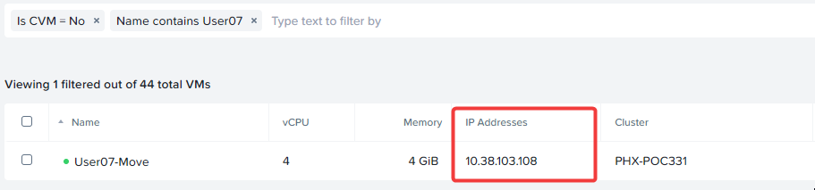
    
4.  เปิด tab ใหม่ในเบราว์เซอร์ภายใน VDI session และไปยัง IP address นั้นเพื่อเปิด Move หากมีข้อความว่า "Your connection is not private" ให้คลิก `Advanced` แล้วคลิก `Proceed to x.x.x.x (unsafe)`
    
5.  ยอมรับ Terms and Conditions และคลิก `Continue` คลิก `Ok` ในหน้าถัดไป
    
    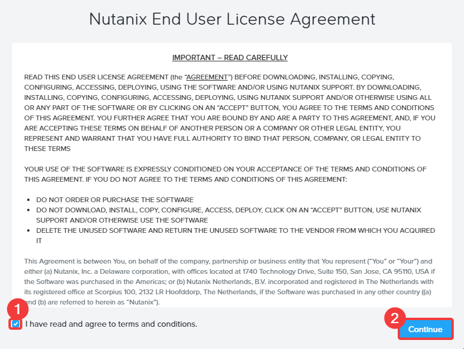
    
6.  ขั้นแรก ระบบจะขอให้คุณตั้ง password ให้ตั้งค่า `nutanix/4u` เป็น password คุณสามารถเลือก password อื่นใดก็ได้ที่คุณต้องการ แต่คุณต้องจำให้ได้เพื่อใช้ในภายหลัง
    
    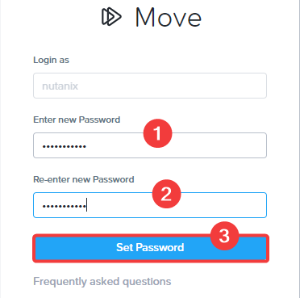
    
7.  Login โดยใช้ password เดียวกัน
    
    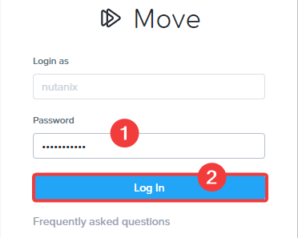
    
8.  คลิก `Do it later` บน splash screen จากนั้นคลิก `Okay` บน splash screen ที่สอง
    

## Add the Source AHV Environment

1.  เลือก Migration Type เป็น `VM` แล้วคลิก `Continue`
    
    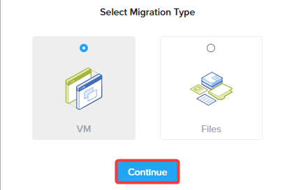
    
2.  เราจำเป็นต้องเพิ่ม Source และ Destination Environments สำหรับ Move ก่อนอื่นให้เพิ่ม source environment คลิก `Add Environment`
    
    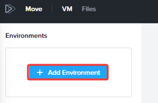
    
3.  ใน Select Environment Type ให้เลือก `Nutanix AOS`
    
    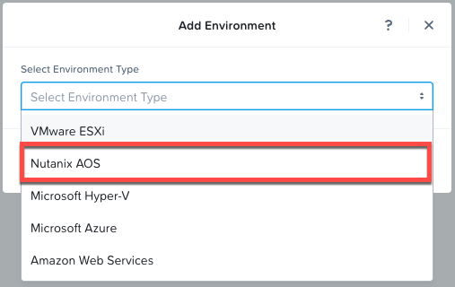
    

!!! note
    อย่างที่คุณเห็น Move รองรับ environment types ที่แตกต่างกัน รวมถึง public clouds อย่าง AWS และ Azure

4.  ระบุรายละเอียดสำหรับ environment คลิก `Add`
    
    -   **Environment Name** : ชื่อใดก็ได้ที่คุณชอบ เราขอแนะนำ **Source AHV**
    -   **AHV Source Cluster** : ระบุ IP address: `10.38.44.7`
    -   **username** - `admin` **username เป็น case sensitive (ตัวพิมพ์เล็ก-ใหญ่มีผล)**
    -   **password** - `nx2Tech787!`
    
    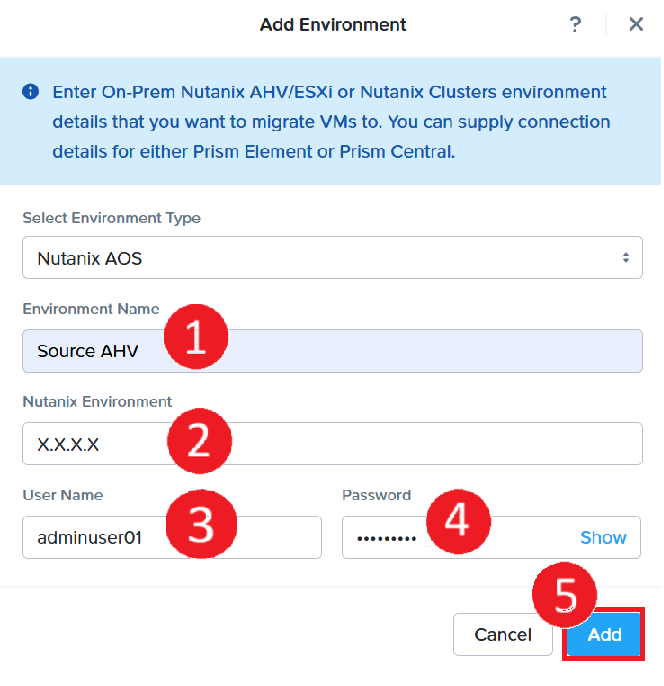
    

## Add the Destination AHV Environment

1.  เมื่อ AHV Source environment ถูก validate และเพิ่มเรียบร้อยแล้ว ต่อไปให้เพิ่ม destination Nutanix AHV cluster ของเรา คลิก `Add Environment`
    
    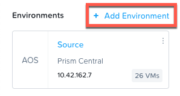
    
2.  ใน Select Environment Type ให้เลือก `Nutanix AOS` จากนั้นระบุรายละเอียดสำหรับ environment คลิก `Add`
    
    -   **Environment Name** : ชื่อใดก็ได้ที่คุณชอบ เราขอแนะนำ **Target AHV**
    -   **Nutanix Environment** : ระบุ `IP address of your target PC`
    -   **username** - `<PC login> adminuser##`
    -   **password** - `<PC password>`
    
    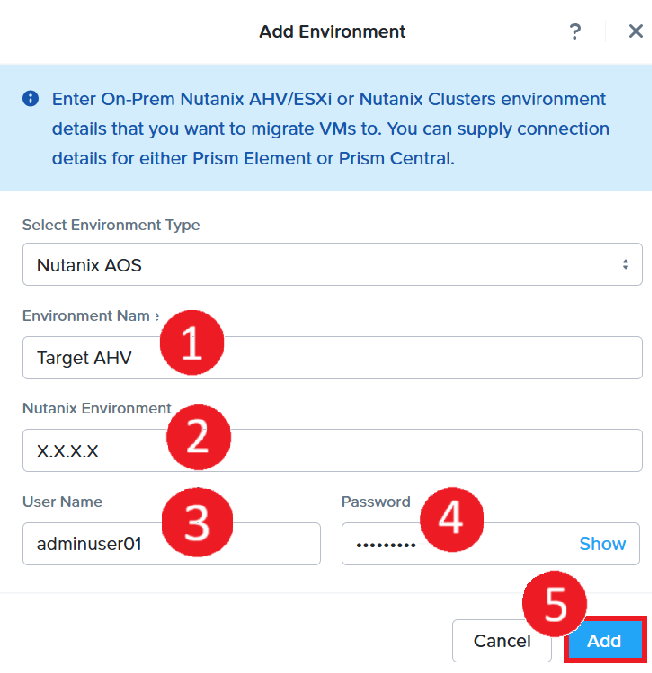
    
3.  ตอนนี้เป็นเวลาที่ดีที่จะหยุดพักสักครู่ ในขณะที่ Prism Central ถูกเพิ่มเข้าไปยัง Move instance และมันกำลังดึงข้อมูล inventory
    

## Environment Setup Completed

ตอนนี้เราได้เพิ่ม source AHV และ destination AHV cluster เพื่อใช้สำหรับการ VM migration ใน lab แล้ว

1.  หลังจากหยุดพักสั้นๆ คุณสามารถดำเนินการ basic migration ต่อใน "[Migrating VMs with Move](/migrate/migrating-your-workloads/migrating-vms-view-source-vm.html)"
2.  หากได้รับคำแนะนำและคุณคุ้นเคยกับ basic migrations อยู่แล้ว คุณสามารถข้ามไปที่ "[Advanced VM Migrations](/migrate/migrating-your-workloads/migrating-create-advanced-migration-plan.html)" ได้เลย
