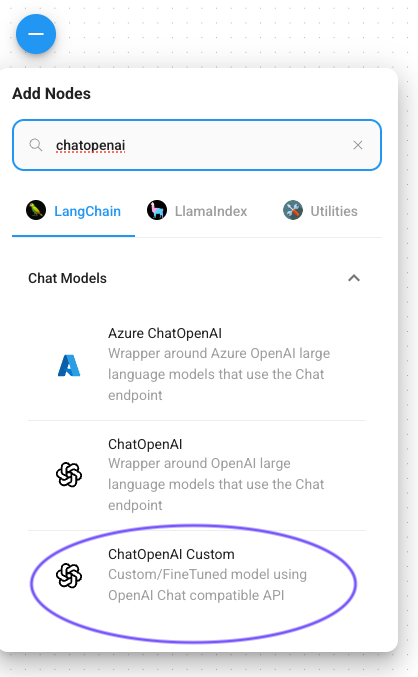
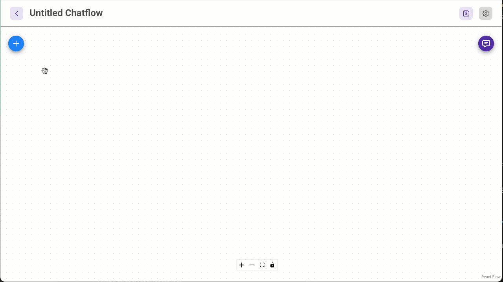

# Add nodes to the chatflow

A node is a visual representation of a component that performs a specific function in our AI workflow. For our simple chatbot, we'll use 3 nodes.

!!! info

    **Node Types**

    A Flowise node is a modular, configurable building block in Flowise's visual editor that represents a discrete function or component. In this chatbot, you're using the following nodes based on the Langchain framework:

    -   **ChatOpenAI Custom** - a wrapper around Langchain's `ChatOpenAI` class that enables flexiblity by allowing parameter tweaking to connect to custom endpoints
    -   **Conversation Chain** - enables back-and-forth interactions by maintaining conversation history between the user and a language model
    -   **Buffer Window Memory** - provides memory for Conversation Chain to store and retrieve past exchanges

    Flowise requires the chatflow to end with a Chain (Langchain), Engine (LlamaIndex), or Agent node. In this lab we are using the Conversation Chain.

1.  Click the **+** sign in the top left corner to add a new node.
    
2.  Under Langchain > Chat Models, find **ChatOpenAI Custom** and drag it onto the canvas. You can search for **ChatOpenAI**.
    
    
    
    !!! tip    
        The Nutanix Enterprise AI endpoints are OpenAI-compatible.
    
3.  Click the **+** sign in the top left corner to add another new node.
    
4.  Under Langchain > Chains, find **Conversation Chain** and drag it onto the canvas.
    
5.  Click the **+** sign in the top left corner to add our last node.
    
6.  Under Langchain > Memory, find **Buffer Window Memory** and drag it onto the canvas.
    
7.  Click the **Save** icon to save your chatflow.