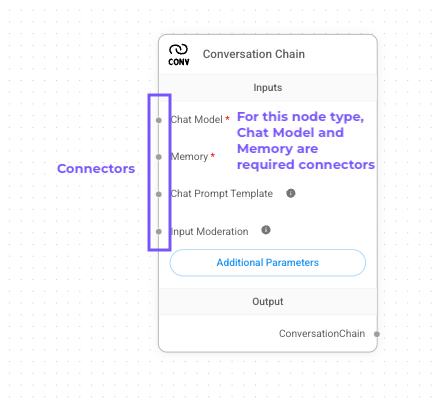
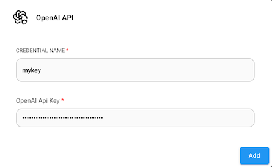
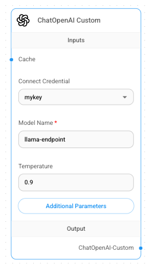
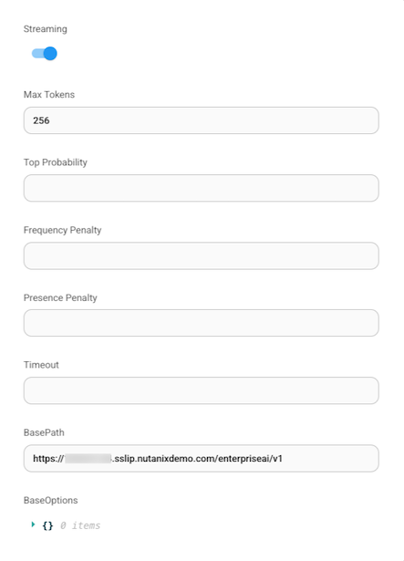

# Configure nodes

Now that our nodes are on the canvas, let's configure them to actually do something.

You'll notice on each node one or more connector dots on the borders of the nodes. This means this is where they will connect to other nodes. Some are required connections and are indicated by a red asterisk. The connectors on the left are inputs and the connectors on the right are outputs.

First, you'll configure our endpoint information in the **ChatOpenAI Custom** node.

1.  On the **ChatOpenAI Custom** node, click on the drop down under **Connect Credential**.
    
2.  Click **Create New**.
    
3.  Provide a name for the key and copy your API key you gathered earlier, and click **Add**.
    
    
    
4.  Under **Model Name**, type in your endpoint name (e.g. `llama-endpoint##`). At this point, the node should look similar to the image below.
    
    
    
5.  Click **Additional Parameters**.
    
6.  Since our inference engine is running on non-accelerated CPU, let's limit the max token size. Under **Max Tokens**, enter 256.
    
    !!! warning    
        Make sure Max Tokens is set to 256, otherwise your chatbot may not return a response due to the limited resources.
    
7.  Under **BasePath** enter your endpoint URL (without `/chat/completions`)
    
8.  Click out of the dialog to save. You can double check that your inputs were saved by clicking **Additional Parameters** again.
    
    