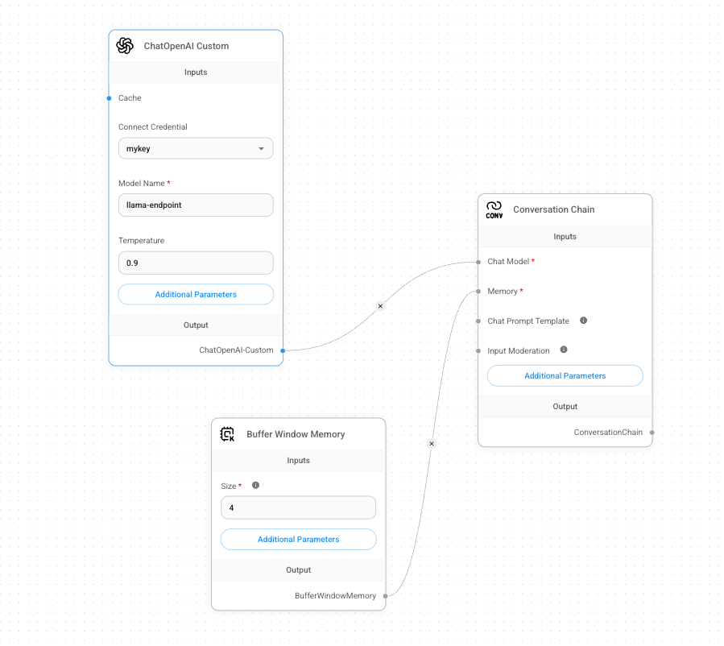

# Connect nodes

เมื่อกำหนดค่า LLM แล้ว เราสามารถเชื่อมต่อ chatflow เข้าด้วยกันได้

1.  เชื่อมต่อ output connector **ChatOpenAI-Custom** ของ **ChatOpenAI Custom** node กับ input connector **Chat Model** บน **Conversation Chain**
    
2.  เชื่อมต่อ output connector **BufferWindowMemory** บน **Buffer Window Memory** node กับ input connector **Memory** บน **Conversation Chain**
    
    !!! tip    
        ในการเชื่อมต่อ node วางเมาส์เหนือ connector จนกว่า cursor จะเปลี่ยนเป็น + แล้วลากไปยัง connector อีกตัว
    

chatflow ของคุณควรมีลักษณะคล้ายกับภาพด้านล่าง

---

[← Back: Configure Nodes](nai-application-chatbot-confnode.md) | [Home](nai-welcome.md) | [Next: Test Chatflow →](nai-application-chatbot-test.md)