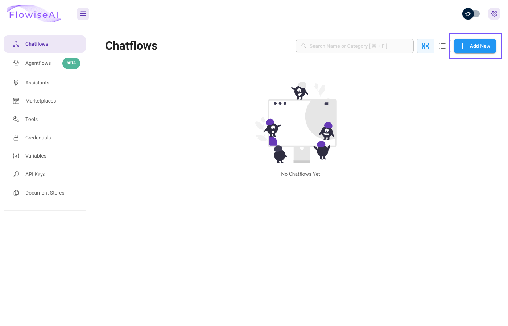
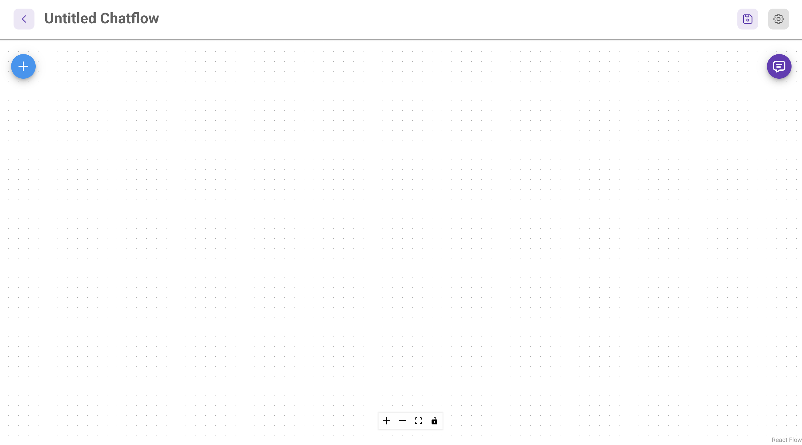

# Create a Blank Chatflow in Flowise

1.  เชื่อมต่อกับ Flowise instance ของคุณผ่าน URL ที่เข้าถึงได้จากหน้า Connection Details หรือจาก instructor
    
2.  หน้าจอของคุณควรมีลักษณะดังต่อไปนี้
    
    
    
3.  คลิกปุ่ม **\+ Add New** ที่มุมบนขวาเพื่อสร้าง chatflow ใหม่
    

!!! tip
    chatflow คือการแสดงภาพแบบ drag-and-drop ของ conversational AI pipeline

ณ จุดนี้ หน้าจอของคุณควรมีลักษณะดังนี้

!!! tip
    สังเกตไอคอน save ที่มุมบนขวา อย่าลืม save บ่อยๆ ครั้งแรกที่ save ระบบจะแจ้งให้ตั้งชื่อ chatflow ของคุณ

    

ต่อไป เราจะเริ่มเพิ่ม node ลงใน chatflow ของเรา

---

[← Back: Gather Information](nai-application-chatbot-gather.md) | [Home](nai-welcome.md) | [Next: Add Nodes to Chatflow →](nai-application-chatbot-addnode.md)