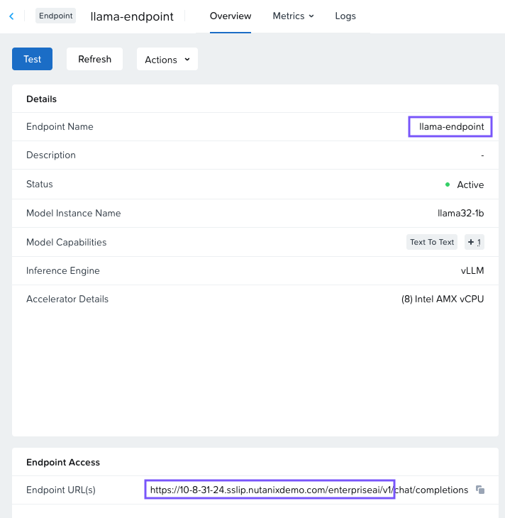

# Gather Information

You'll need 3 pieces of information to get started:

-   The URL of your endpoint that you created
-   The endpoint name
-   The API key that has access to that endpoint

If you need a new API key, follow the instructions in [Creating Additional API Keys](nai-fundamentals-endpoint-keys.md).

The other information can be obtained from the endpoint dashboard page. From the Nutanix Enterprise AI interface, click on Endpoints, then click on the endpoint name to view the endpoint dashboard. Find the values under:

-   Details > Endpoint Name
-   Endpoint Access > Endpoint URL

!!! warning
    Don't include `chat/completions` when copying the URL. Flowise only requires the base URL path.