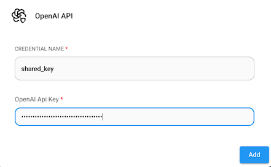
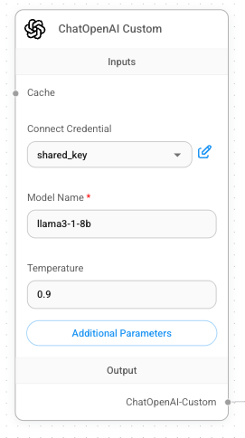
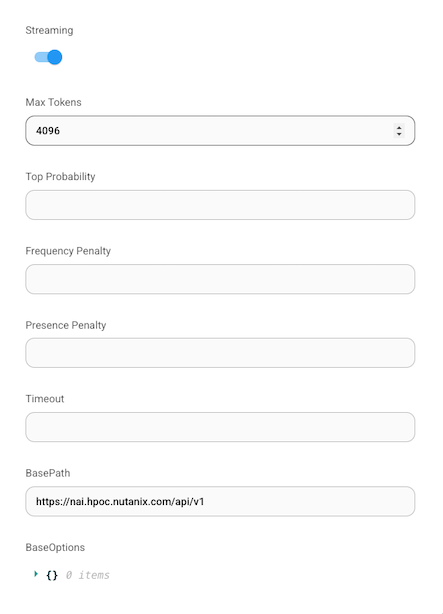

# Configure Shared Endpoint

In the next section, we'll be leveraging a shared inference endpoint backed by an L40S GPU. Let's prepare our existing chatbot by updating the required configuration details.

!!! tip

    The inputs you'll need can be found on the Connection Details page or from your instructor.

    -   BaseURL: `Shared NAI Endpoint URL`
    -   Model Name: `Shared NAI Text Generation Model Name`
    -   OpenAI API key: `Shared NAI API Key`

1.  On the **ChatOpenAI Custom** node, click on the drop down under **Connect Credential**.
    
2.  Click **Create New**.
    
3.  Provide a name for the key and copy in the shared API key, and click **Add**.
    
    
    
4.  Under **Model Name**, type in the `Shared NAI Text Generation Model Name`.
    
    
    
5.  Click **Additional Parameters**.
    
6.  Increase the Max Token size to 4096 and change the BaseURL to the `Shared NAI Endpoint URL`.
    
    
    
7.  Click the **Save** icon to save the chatflow.
    
    
    
8.  Click the purple chat icon below the gear icon.
    
    
    
9.  Try out the chatbot again by asking the same or a different question, and note the improved performance. 🏎️