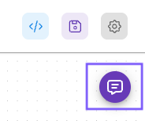
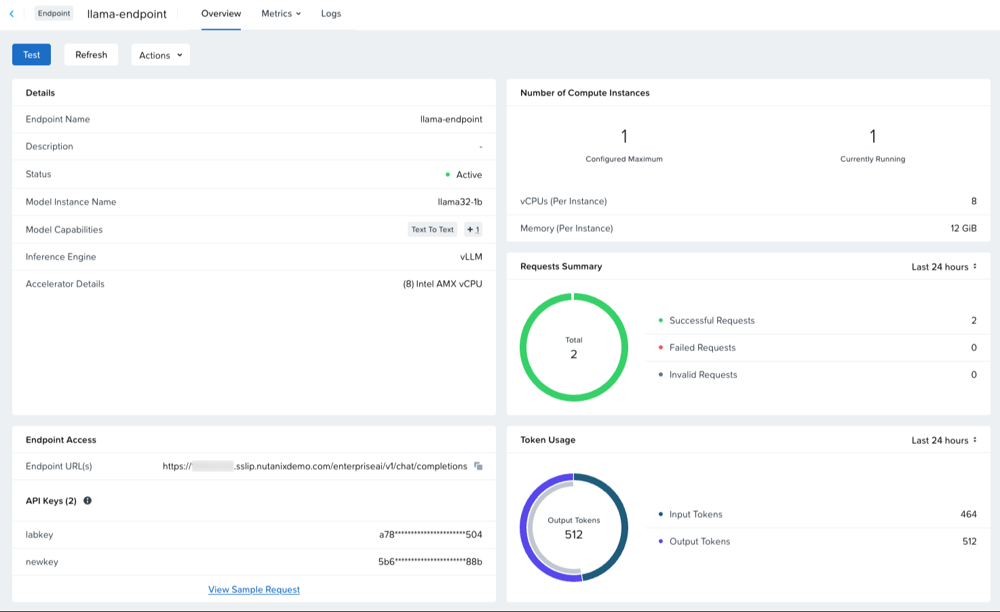

# Test Chatflow

1.  Click the **Save** icon to save your chatflow.
    
    
    
2.  Click the purple chat icon below the gear icon.
    
    
    
3.  Ask a question, for example `What is there to do in Chicago, IL?` and wait for the answer. Since the inference engine is running on CPU, the answer may take between 1-2 minutes, depending on if the CPU is AMX-enabled or not.
    

!!! tip
    While the answer is streaming, you can view the log updates from the endpoint logs on the endpoint dashboard in Nutanix Enterprise AI as described in [View the Endpoint Details](/nai/fundamentals/create-an-endpoint/view-endpoint-details.html).

After a few minutes, the request information will be reflected in the endpoint dashboard.

You can also view the metrics details by clicking on **Metrics > Usage** or **Metrics > Performance**.