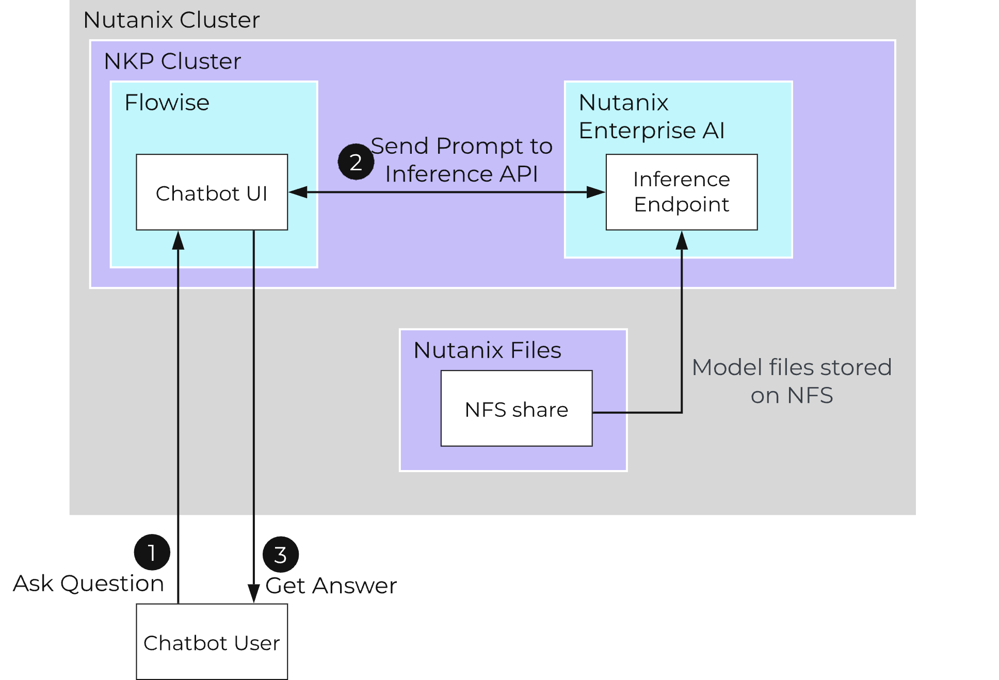

# Create Your First Chatbot

## Chatbot Flow

The flow of a chatbot looks similar to the below diagram.

1.  **Ask Question**
    
    -   User asks a question to the chatbot.

2.  **Send Prompt to Inference API**
    
    -   The chatbot is configured to query the inference endpoint running on Nutanix Enterprise AI.

3.  **Get Answer**
    
    -   The chatbot returns an answer.

## Steps to Create a Chatbot

In order to create your first chatbot, you'll do the following:

1.  **Gather information from Nutanix Enterprise AI**
    
    -   Gather the endpoint details from Nutanix Enterprise AI.

2.  **Create a Chatflow in Flowise**
    
    -   Login to the Flowise application and create a new chatflow.

3.  **Add, configure, and connect nodes in the chatflow**
    
    -   Learn about the different types of nodes that will make up your chatbot and configure them.

4.  **Test the chatflow**
    
    -   Now it's time to try out our chatbot.