# Configure Chatflow

## Duplicate Chatflow

Now that you've configured your Document Store, you can use it in your chatflow.

Let's start by duplicating the existing chatflow.

1.  From Flowise user interface, click on **Chatflows** in the menu.
    
2.  Change to the table view by clicking the List View icon.
    
    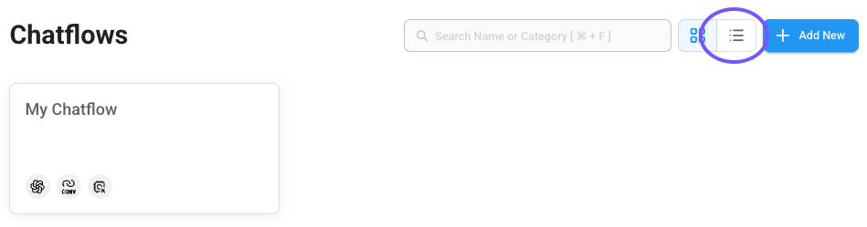
    
3.  Under **Options**, click on **Duplicate**.
    
    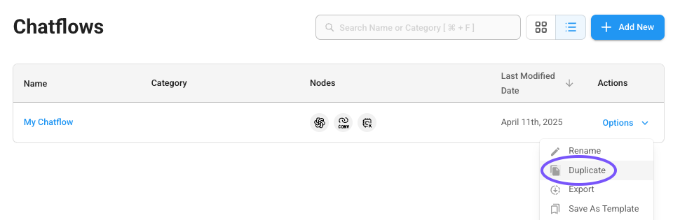
    
    A new chatflow canvas opens up with our duplicated chatflow.
    
4.  Click **Save** and give your duplicated chatflow a name.
    
    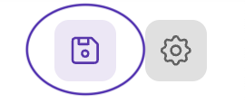
    

## Configure Chatflow for RAG

!!! info

    **Node Types**

    We introduced Flowise nodes in the [Add Nodes to Chatflow](nai-application-chatbot-connnode.md) section. For your chatbot, you used the following node types:

    -   **ChatOpenAI Custom** - a wrapper around Langchain's `ChatOpenAI` class that enables flexiblity by allowing parameter tweaking to connect to custom endpoints
    -   **Conversation Chain** - enables back-and-forth interactions by maintaining conversation history between the user and a language model
    -   **Buffer Window Memory** - provides memory for Conversation Chain to store and retrieve past exchanges

    For implementing Retrieval Augmented Generation (RAG), we'll be using a total of 4 nodes:

    -   **ChatOpenAI Custom** - unchanged
    -   **Buffer Window Memory** - unchanged
    -   **Conversational Retrieval QA Chain** - replacing the **Conversation Chain** node, this node has similar functionality but also includes a **Vector Store Retriever** input
    -   **Document Store (Vector)** - the connection to the Document Store you configured in the previous section

1.  Under the node **ChatOpenAI Custom**, ensure you are using the shared inference endpoint details for **Connect Credential**, **Model Name**, and **Additional Parameters** > **BasePath**
    
    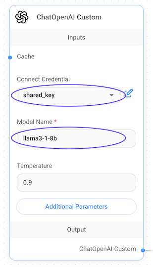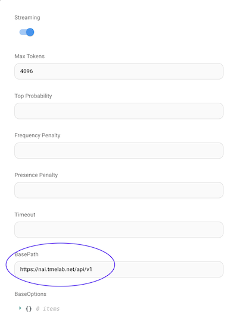
    
2.  Hover over the Conversation Chain node, and click the trash can to delete the node.
    
    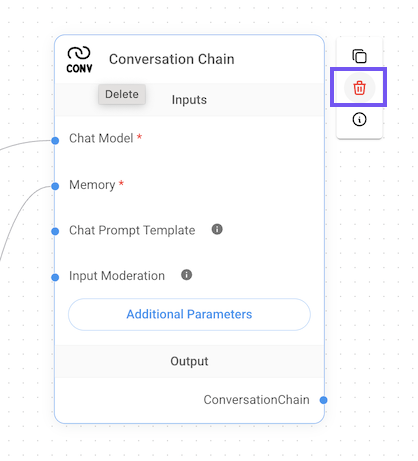
    
3.  On the left hand side, click the **+** sign to add a new node.
    
4.  Under **Langchain > Chains**, select the **Conversational Retrieval QA Chain** node and drag it to the canvas.
    
    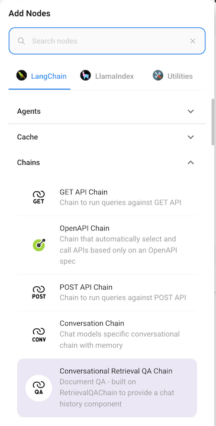
    
5.  On the left hand side, click the **+** sign to add another new node.
    
6.  Under **Langchain > Vector Stores**, select the **Document Store (Vector)** node and drag it to the canvas.
    
    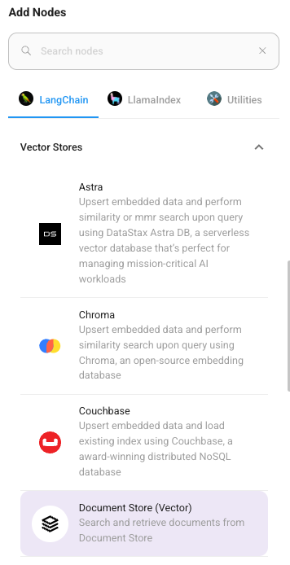
    
    At this point your canvas should look similar to the below:
    
    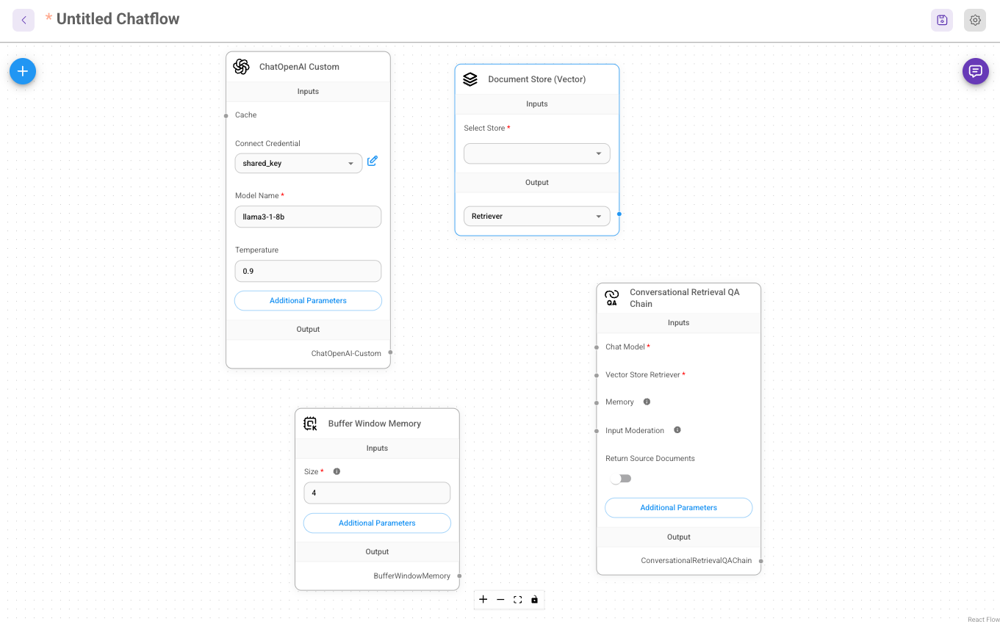
    
7.  In the Document Store node, from the **Select Store** drop down, select the **documents** Document Store you created in the previous section.
    
8.  Drag the **Retriever** output connector to the **Vector Store Retriever** input on the Conversational Retrieval QA Chain node.
    
    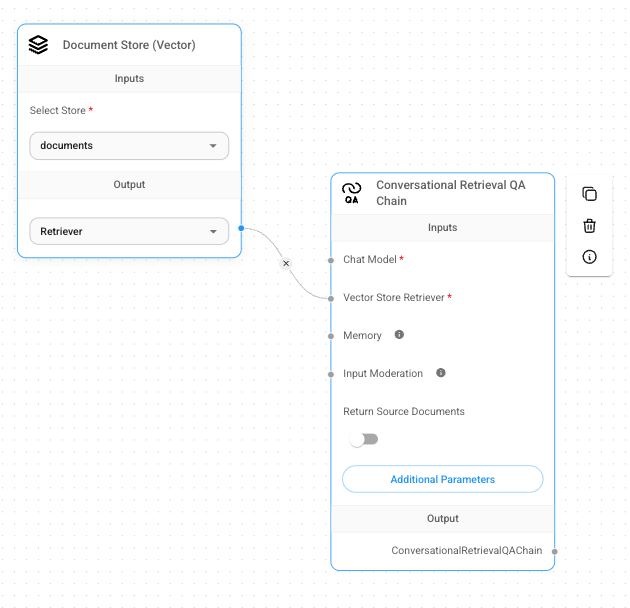
    
9.  In the ChatOpenAI Custom node, drag the **ChatOpenAI-Custom** output connector to the **Chat Model** input on the Conversational Retrieval QA Chain node.
    
10.  In the Buffer Window Memory node, drag the **BufferWindowMemory** output connector to the **Memory** input on the Conversational Retrieval QA Chain node.
    
11.  In the Conversational Retrieval QA Chain node, enable **Return Source Documents**.
    
    Your canvas should now look similar the below:
    
    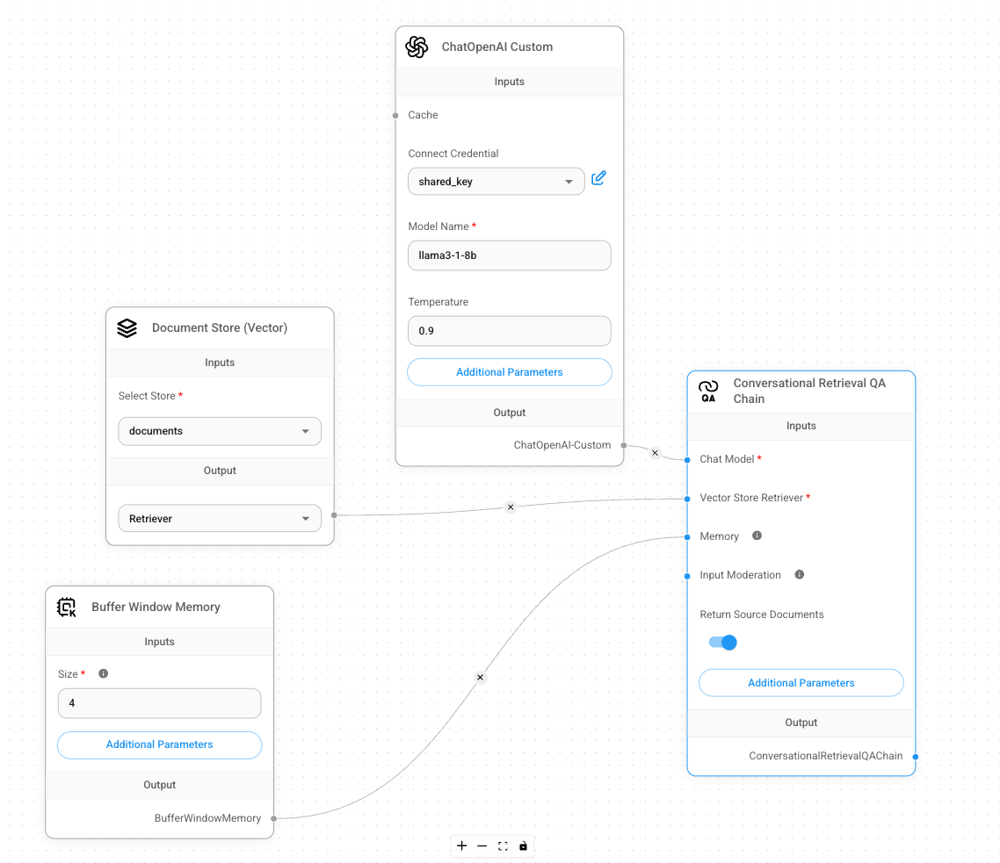
    
12.  Click the **Save** icon in the top right corner to save your new chatflow.