# Configure Document Store

## Create document store

1.  จาก chatflow ของคุณ ตรวจสอบให้แน่ใจว่า chatflow ถูกบันทึกแล้ว จากนั้นคลิกลูกศรย้อนกลับ
    
    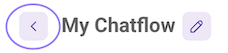
    
2.  คลิก Document Stores ในเมนูทางซ้าย หากเมนูถูกซ่อนอยู่ ให้คลิกไอคอน hamburger สีม่วงข้างๆ โลโก้ FlowiseAI
    
    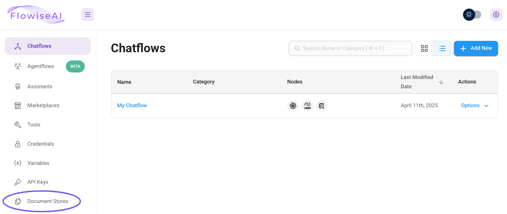
    
3.  คลิก **+Add New** ที่มุมบนขวา
    
    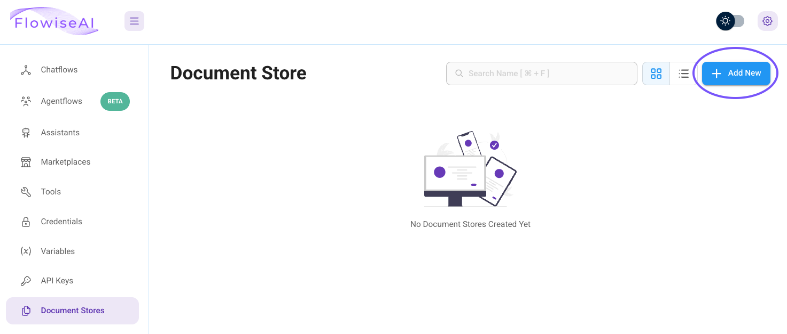
    
4.  ตั้งชื่อ Document Store เช่น `documents` แล้วคลิก **Add**
    
    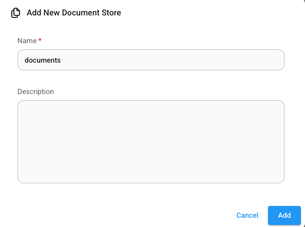
    

## Add a document loader

1.  คลิกเข้าไปใน Document Store และคลิก **\+ Add Document Loader**
    
    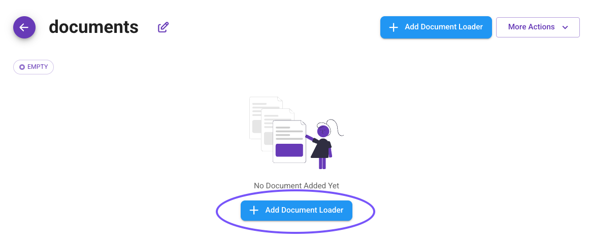
    
2.  ค้นหา **S3** และคลิก **S3 Directory** ซึ่งจะช่วยให้เรากำหนดค่า Object Storage bucket ที่ต้องการใช้
    
    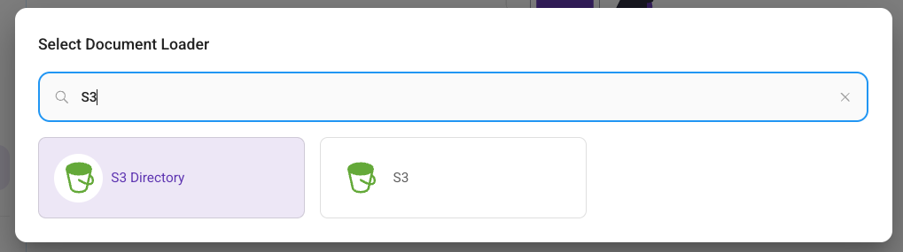
    

## Configure document loader

1.  คลิก drop-down สำหรับ **Credential** และคลิก **Create New**
    
2.  ป้อนชื่อสำหรับ credential ของคุณ (เช่น `objects-creds`)
    
3.  ใต้ AWS Access Key และ AWS Secret Key ป้อน Access และ Secret Key ของ Nutanix Objects bucket ที่ดูได้จากส่วน [Obtain Object Store URL and Credentials](nai-application-rag-store.md) แล้วคลิก **Add**
    
    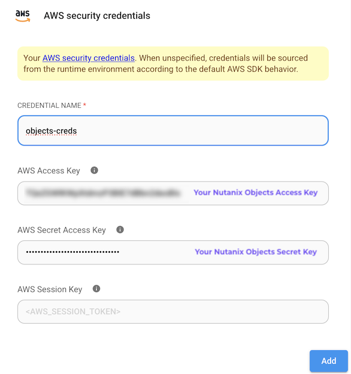
    
4.  ใต้ **Bucket** ป้อนชื่อ bucket ของคุณ เช่น `adminuser##`
    
5.  ปล่อย region ไว้ที่ค่า default
    
6.  ใต้ **Server URL** ป้อน IP ของ object store เช่น `http:/#.#.#.8`
    
    !!! warning    
        ใน lab นี้เราใช้ self-signed certificate ดังนั้นตรวจสอบให้แน่ใจว่าใช้ `http` ไม่ใช่ `https`
    
7.  ใต้ **Select Text Splitter** เลือก **Recursive Character Text Splitter** จาก drop-down
    
    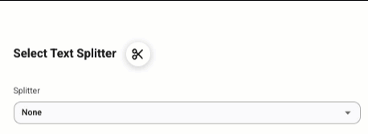
    
    ณ จุดนี้ หน้าจอของคุณควรมีลักษณะคล้ายกันนี้:
    
    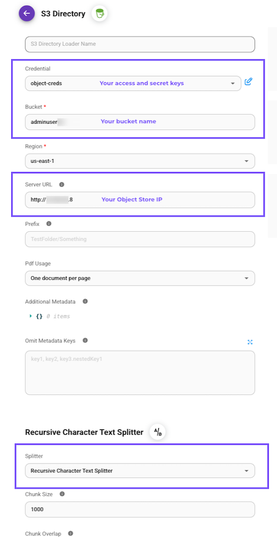
    
8.  ทางด้านขวามือ คลิก **Preview Chunks**
    
9.  preview chunks ควรปรากฏทางด้านขวามือ หากไม่ปรากฏ ให้ตรวจสอบ input สำหรับการเชื่อมต่อ Objects ของคุณ
    
    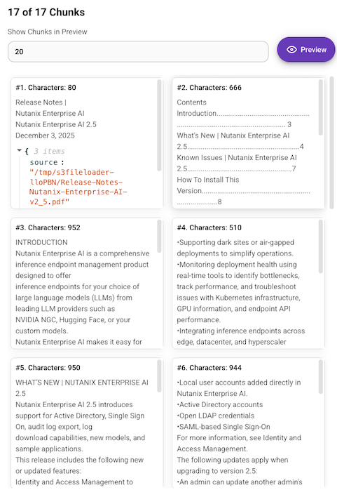
    
10.  ที่มุมบนขวา คลิก **Process**
    
    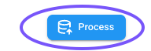
    
11.  document store จะแสดงสถานะ "stale" พร้อมไอคอนวงกลมสีเหลือง คลิกปุ่ม refresh สีน้ำเงิน
    
    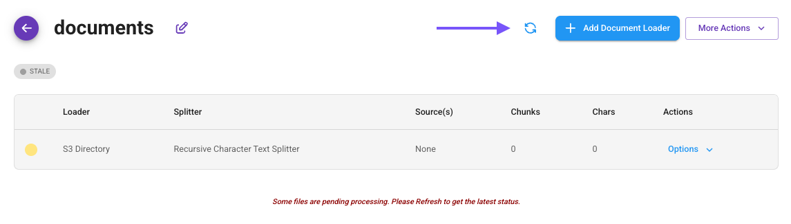
    
12.  สถานะ "stale" ควรเปลี่ยนเป็น "sync" และไอคอนควรเปลี่ยนเป็นสีเขียว หากไม่เปลี่ยน ให้ตรวจสอบการตั้งค่า Document Loader อีกครั้ง
    
    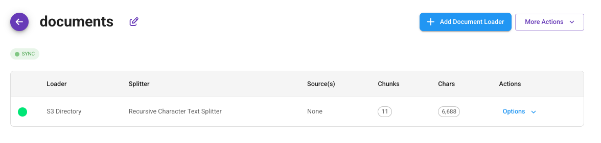

---

[← Back: Upload Document to Object Store](nai-application-rag-upload.md) | [Home](nai-welcome.md) | [Next: Configure Embeddings and Vector Store →](nai-application-rag-vector.md)