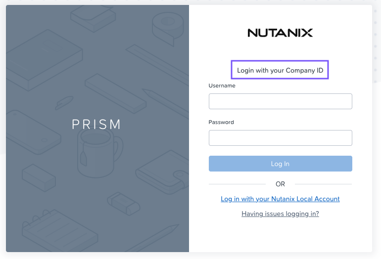
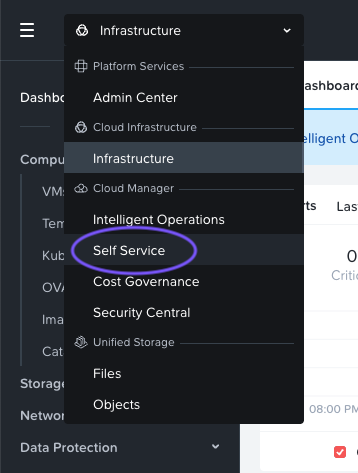
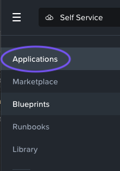
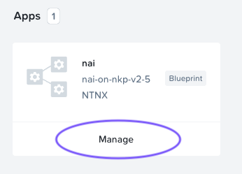
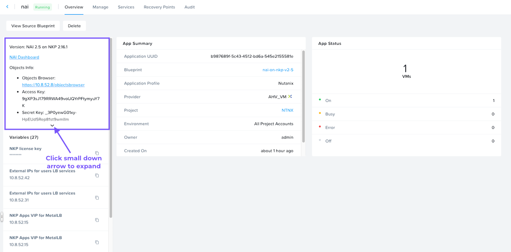

# Obtain Object Store URL and Credentials

To obtain the Object Store URL and credentials that are specific to your environment, you'll need to login to Prism Central.

1.  From the Chrome web browser, enter the Prism Central IP address into a new browser tab.

!!! tip
    The Prism Central IP can be obtained from the Connection Details page or from your instructor.

1.  Log into Prism Central. Ensure the Login screen says **Login with your Company ID**
    
    -   Username: `<PC Username>` (e.g. adminuser##@ntnxlab.local)
    -   Password: `<PC Password>`

2.  Once logged in, click on the drop down and navigate to Self Service.
    
    
    
3.  From the left hand menu, click on **Applications**.
    
    
    
4.  Click on **Manage** underneath the `nai` app.
    
    
    
5.  The next screen will show the app summary. In the top left, there is a widget containing information about the app, including a link to the NAI dashboard and the Objects information. Click on the small down arrow to expand it.
    
    
    
6.  Click on the Objects Browser link to open the Objects browser in a new tab.
    
7.  Copy and paste the Access and Secret Keys into a text editor for future reference.