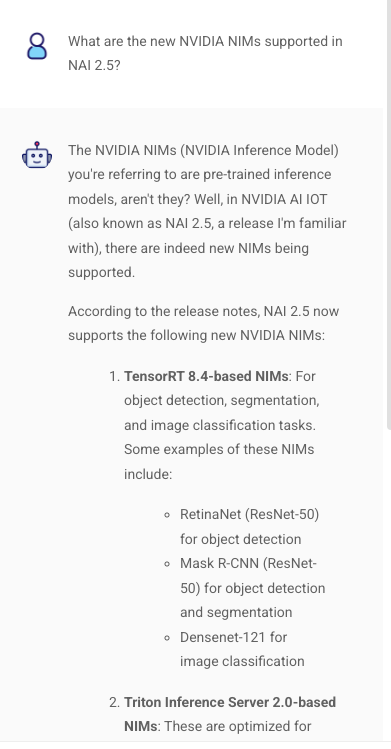
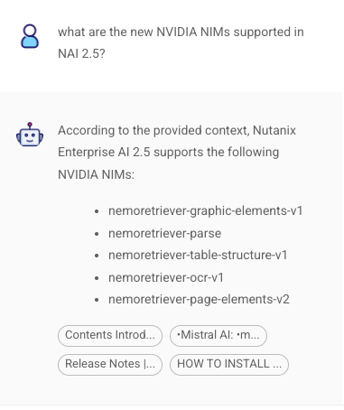

# Test the Chatbot

ก่อนทดสอบ chatbot ใหม่ มาลองถามคำถามเฉพาะเจาะจงกับ chatbot เดิมก่อน

1.  หากคุณอยู่บน chatflow canvas ให้คลิกลูกศร **<** เพื่อกลับไปที่รายการ chatflow
    
    
    
2.  จากรายการ chatflow คลิก chatflow เดิมของคุณ
    
3.  เปิด chatbot โดยคลิกไอคอน chat
    
    
    
4.  ถามคำถาม `What are the new NVIDIA NIMs supported in NAI 2.5?` และดู output
    
    เนื่องจาก chatbot นี้ไม่ได้ใช้ document store ของเรา จึงอาศัยความรู้ทั่วไปและจะให้คำตอบที่ไม่เฉพาะเจาะจงและไม่ถูกต้อง
    
    
    
5.  คลิกลูกศรย้อนกลับและคลิก chatflow ที่เปิดใช้งาน RAG ใหม่ของคุณ
    
6.  เปิด chatbot โดยคลิกไอคอน chat
    
7.  ถามคำถามเดิม `What are the new NVIDIA NIMs supported in NAI 2.5?` และดู output คำตอบควรอ้างอิงจากเอกสารที่เราอัปโหลด คุณสามารถดู document chunk ที่อ้างอิงได้ที่ท้าย output
    
    

---

[← Back: Configure Chatflow](nai-application-rag-chatflow.md) | [Home](nai-welcome.md) | [Next: Application Takeaways →](nai-application-takeaways.md)