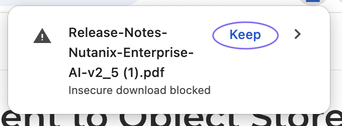
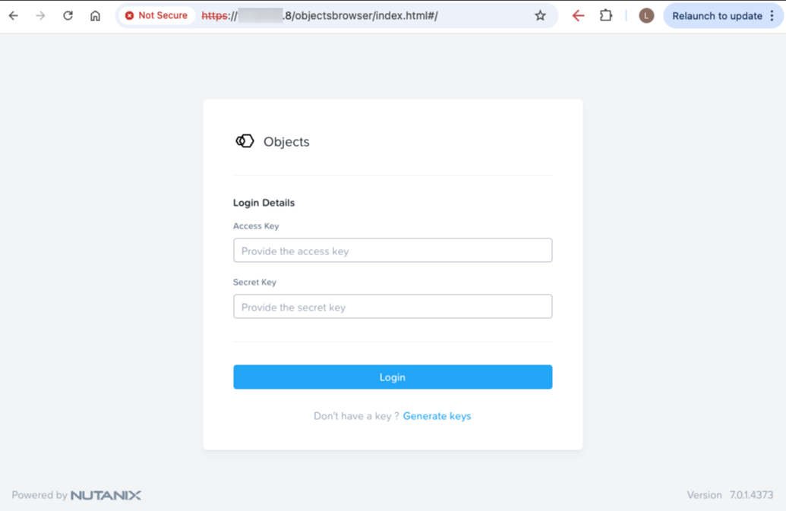
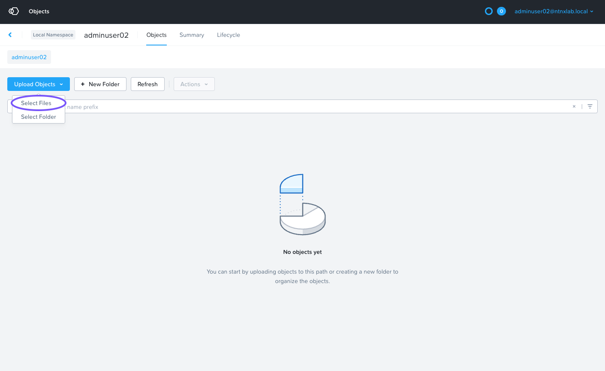
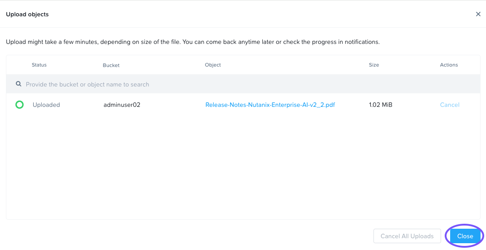

# Upload Document to Object Store

1.  บน VDI workstation ของคุณ ดาวน์โหลดเอกสารตัวอย่างโดยคลิกขวาและบันทึก [ลิงก์นี้open in new window](http://10.42.194.11/workshop_staging/tradeshows/experimental/nai-bootcamp/Release-Notes-Nutanix-Enterprise-AI-v2_5.pdf)
    
    !!! tip    
        หาก Chrome แสดงคำเตือน ให้คลิก **Keep**
    
        
    
2.  หากยังไม่ได้เปิด ให้เปิดแท็บใหม่ในเบราว์เซอร์ไปยัง URL ของ Objects browser ที่ดูได้จากส่วนก่อนหน้า
    
    
    
3.  ป้อน shared Access Key และ Secret Key สำหรับ Nutanix Objects bucket ที่ดูได้จากส่วนก่อนหน้า แล้วคลิก **Login**
    
4.  คลิก bucket ที่ตรงกับ username ของคุณ
    
5.  คลิก **Upload Objects** > **Select Files**
    
    
    
6.  เลือก PDF ที่ดาวน์โหลดในขั้นตอนที่ 1
    
7.  เมื่ออัปโหลดเสร็จแล้ว คลิก **Close**
    
    
    

ตอนนี้เราพร้อมกำหนดค่า document store แล้ว

---

[← Back: Obtain Object Store URL and Credentials](nai-application-rag-store.md) | [Home](nai-welcome.md) | [Next: Configure Document Store →](nai-application-rag-confstore.md)