# Configure Embeddings and Vector Store

!!! tip

    input ที่คุณต้องการสามารถดูได้จากหน้า Connection Details หรือจาก instructor ครั้งนี้เราจะใช้โมเดล **Embedding**

    -   BaseURL: `Shared NAI Endpoint URL`
    -   Model Name: `Shared NAI Embedding Model Name`
    -   OpenAI API key: `Shared NAI API Key`

## View Chunks

1.  Document Loader ของคุณควรแสดง 17 chunks ในขณะนี้ หากต้องการดู chunk คลิกที่ชื่อ Document Loader
    
    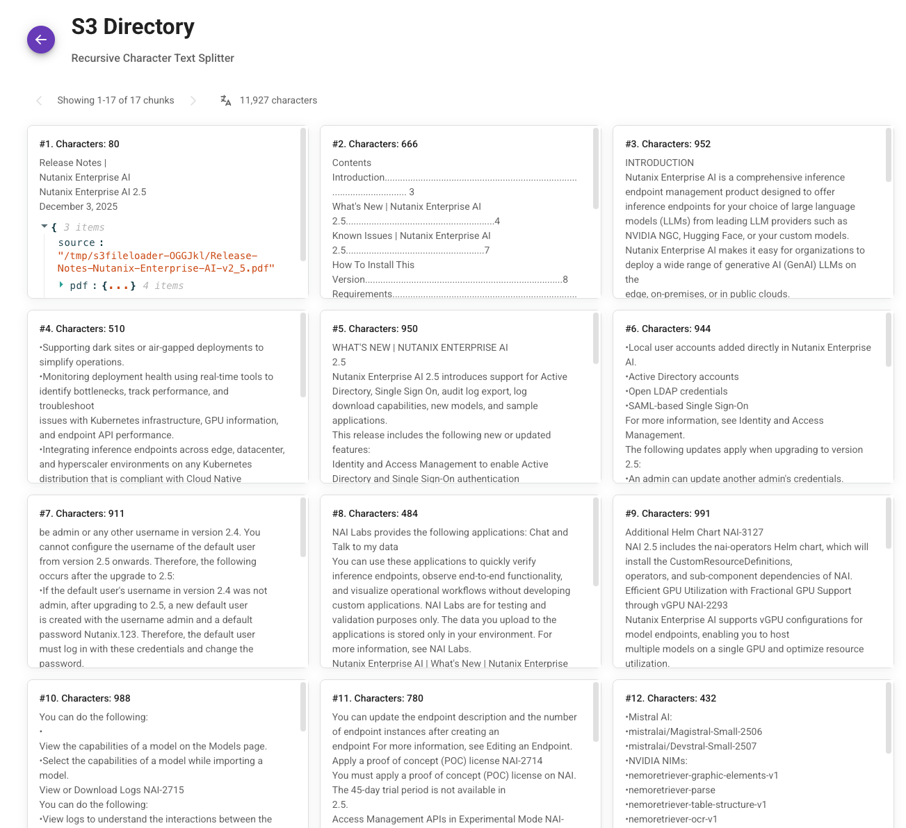
    
2.  คลิกลูกศร **Back** สีม่วง
    

## Configure Embeddings

1.  ใต้คอลัมน์ Actions ในตาราง **documents** คลิก **Options** > **Upsert Chunks**
    
    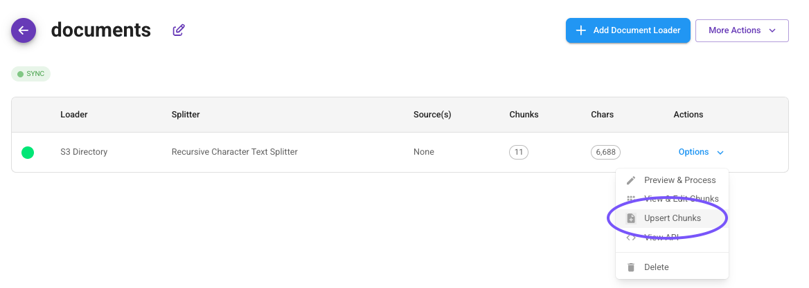
    
2.  คลิก **Select Embeddings**
    
    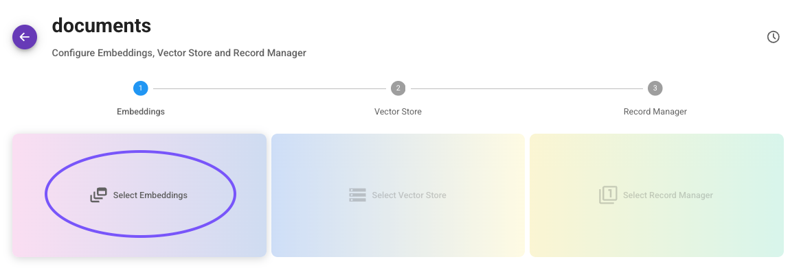
    
3.  ค้นหา **OpenAI Embeddings Custom**
    
    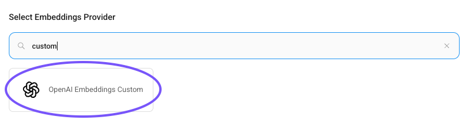
    
4.  ใต้ **Connect Credential** เลือก Shared Key credential ที่กำหนดค่าไว้ในส่วน [Configure Shared Endpoint](nai-application-chatbot-shared.md)
    
5.  ใต้ **BasePath** ป้อน `Shared NAI Endpoint URL`
    
6.  ใต้ **Model Name** ป้อน `Shared NAI Embedding Model Name`
    

หน้าจอของคุณควรมีลักษณะคล้ายกับด้านล่าง

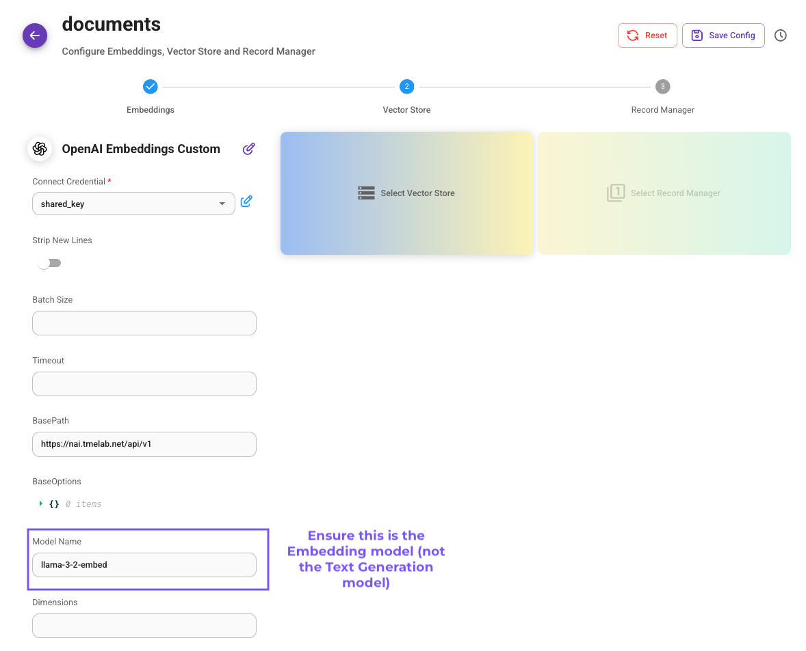

!!! warning

    ตรวจสอบให้แน่ใจว่าคุณใช้โมเดล **Embedding** ที่ใช้ร่วมกันตามที่อ้างอิงไว้ด้านบน มิฉะนั้น คุณจะพบข้อผิดพลาด 504 เมื่อทำการ upsert

## [#](#configure-vector-store) Configure Vector Store

1.  คลิก **Select Vector Store**
    
2.  เลือก **Milvus**
    
3.  ใต้ Connect Credential คลิก **Create New**
    
4.  ป้อน root สำหรับชื่อ credential และ Milvus user และปล่อย password ว่างไว้ จากนั้นคลิก **Add**
    
    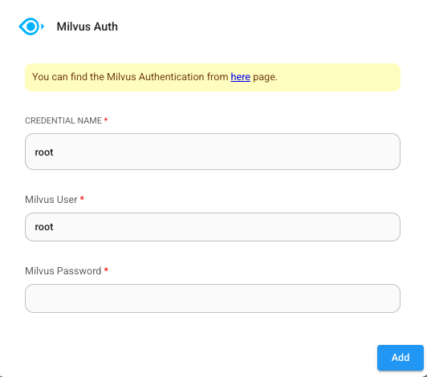
    
    !!! tip
    
        เราใช้ root user เพื่อวัตถุประสงค์ในการสาธิต ในการใช้งานจริง ไม่แนะนำให้ใช้ root user
    
5.  ใต้ **Milvus Server URL** ป้อน URL ไปยัง Milvus Database ที่ตรงกับ user ของคุณ
    
    !!! warning
    
        อย่าใช้ URL ที่มี **attu** ในชื่อ เพราะนั่นสำหรับ UI ไม่ใช่ database
        
        อย่าใส่ trailing slash ที่ท้าย URL
    
6.  ใต้ **Milvus Collection Name** ป้อน **docsuser`##`** โดยที่ `##` ตรงกับหมายเลข user ของคุณ
    
7.  ที่มุมบนขวา คลิก **Save Config** แล้วคลิก **Upsert**
    
    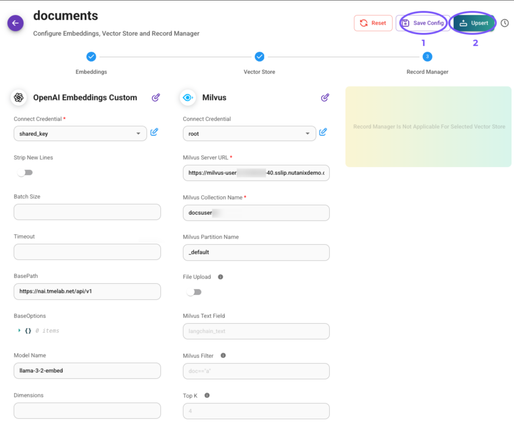
    
8.  เมื่อ upsert สำเร็จ คุณควรเห็นหน้าจอดังต่อไปนี้ คลิก **Close**
    
    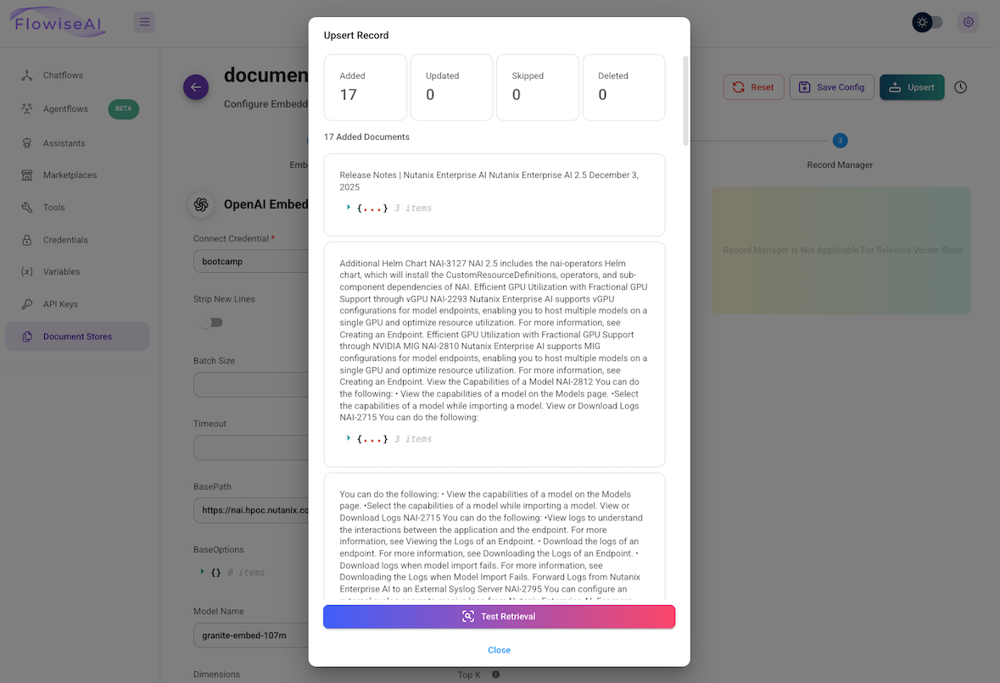
    

ตอนนี้คุณพร้อมเชื่อมต่อ chatflow กับ vector database แล้ว

## View Documents in Milvus (optional)

1.  เปิดแท็บใหม่ในเบราว์เซอร์และไปยัง Milvus Attu UI ที่ตรงกับ database ของคุณ
    
2.  คลิก **Connect** เพื่อเข้าสู่ระบบ
    
    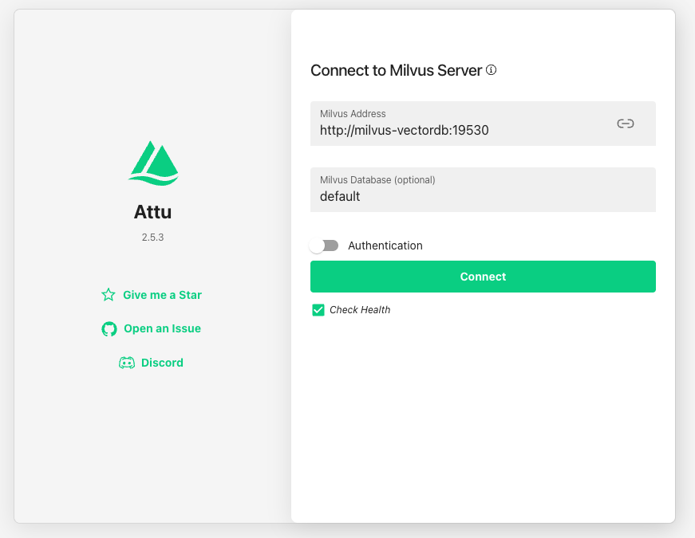
    
3.  คลิก database **default**
    
4.  คุณควรเห็น collection ที่สร้างโดยกระบวนการ upsert
    
5.  คลิกป้าย **unloaded** แล้วคลิก **Load**
    
    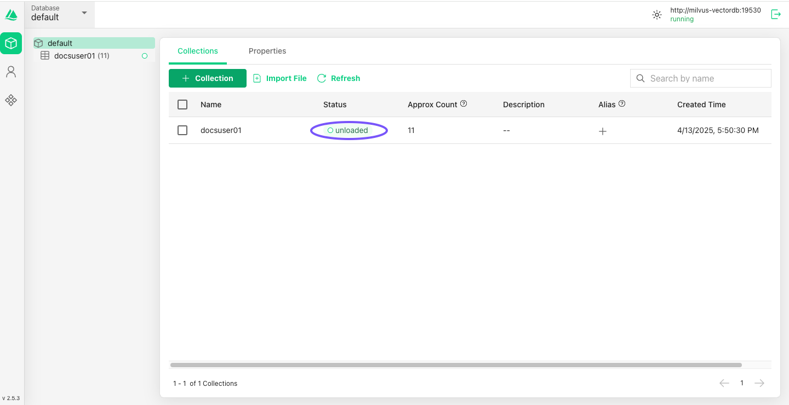
    
6.  เมื่อสถานะเปลี่ยนเป็น **loaded** ให้คลิกชื่อ collection แล้วคลิกแท็บ **Data**
    
7.  เลื่อนไปทางขวาเพื่อดูข้อความและ vector ที่สอดคล้องกัน
    
    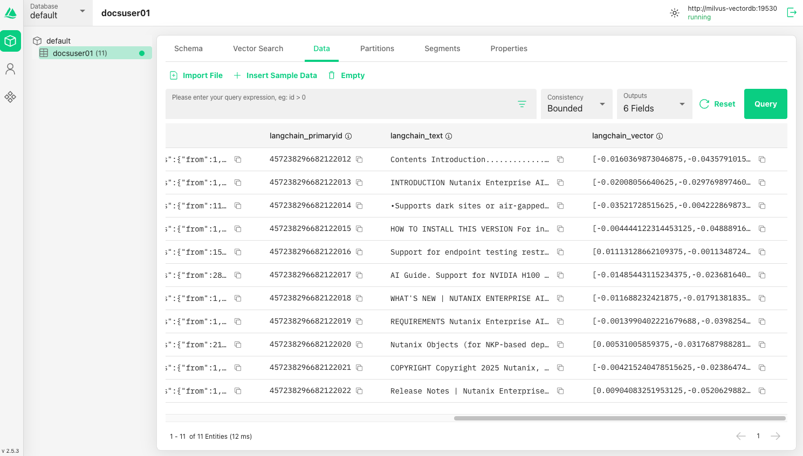

---

[← Back: Configure Document Store](nai-application-rag-confstore.md) | [Home](nai-welcome.md) | [Next: Configure Chatflow →](nai-application-rag-chatflow.md)