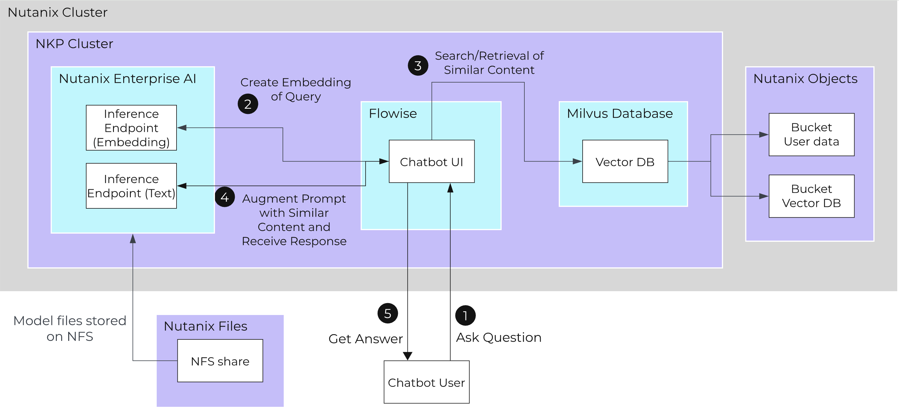

# Create a RAG pipeline to chat with your documents

## RAG-enabled Chatbot Flow

The flow of a RAG-enabled chatbot looks like the below diagram.

1.  **Ask Question**
    
    -   User asks a question to the chatbot.

2.  **Create Embedding of Query**
    
    -   Instead of going directly to the inference API, Flowise will first create an embedding of the query using an **embedding** model hosted on Nutanix Enterprise AI.

3.  **Search/Retrieval of Similar Content**
    
    -   With that embedding, Flowise will search for similar embeddings in the vector database that has been populated with the embeddings of source documents.

4.  **Send Prompt to Inference API**
    
    -   Flowise augments the user's prompt with the found context and sends this to a **text generation** model hosted on Nutanix Enterprise AI.

5.  **Get Answer**
    
    -   The chatbot returns an answer to the user.

## Steps to Create a RAG-enabled Chatbot

In order to chat with your documents and data, you'll do the following:

1.  **Upload a document to Nutanix Objects**
    
    -   Access your object store bucket and upload a sample document to it.

2.  **Configure a Document Store in Flowise**
    
    -   Configure a document store pointing to your bucket and define how the documents should be split and processed.

3.  **Upsert the document chunks into a Vector Database**
    
    -   Configure the vector database and embedding model information to create vectors out of your documents.
    
4.  **Configure existing chatflow to use RAG**
    
    -   In your chatflow, you'll add a new node for the Document Store and modify the **Conversation Chain** node to connect to your Document Store.