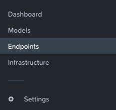
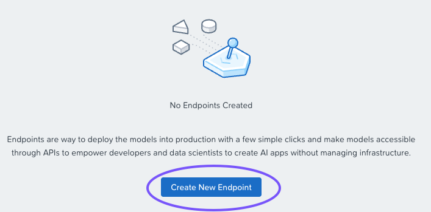
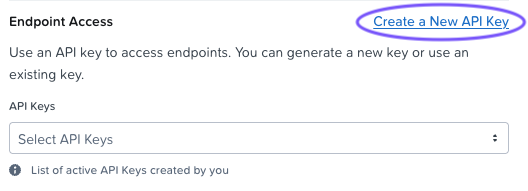
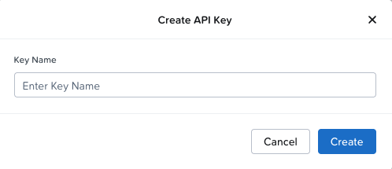
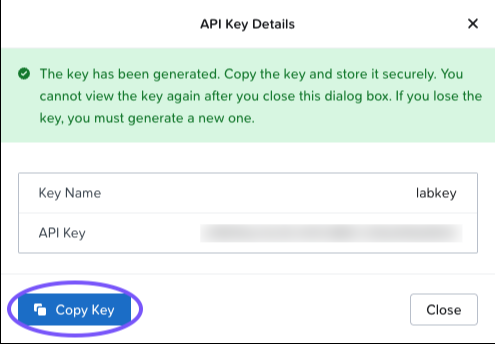
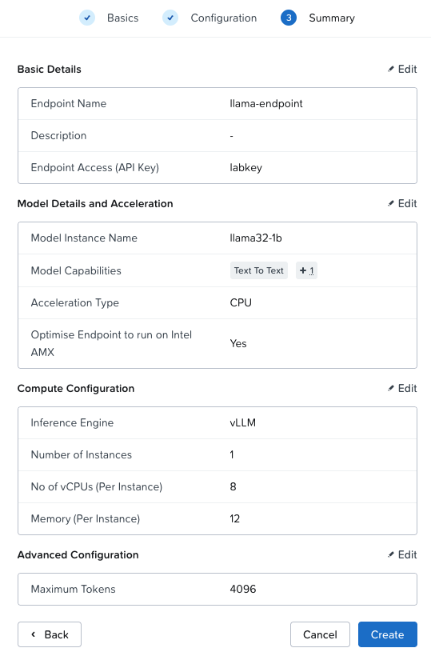
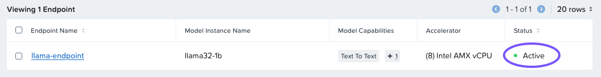

# Create an Endpoint and API Key

1.  From the menu on the left, click **Endpoints**
    
    
    
2.  Click on **Create New Endpoint**
    
    
    

There will be 3 short screens to step through:

-   Basics
-   Configuration
-   Summary

## Basics

1.  Name the endpoint `llama-endpoint##`, where `##` corresponds to your username.
    
2.  Select your model from the **Model Instance Name** drop-down list. Only models that are in Active status, imported by your user, will be shown.
    
3.  Under **Acceleration Type**, select CPU.
    
4.  Click **Create a New API Key** to generate an API key.
    
    
    
5.  Give the API Key a name and click **Create**.
    
    
    
6.  Click Copy API Key.
    
    
    
    !!! tip    
        Be sure to copy the API key to a text editor (e.g. VS Code) in your VDI session for access later.
    

## Configuration

1.  We'll leave the defaults for the compute configuration.
2.  Click **Next**.

!!! note

    The inference engine defines libraries used for LLM inferencing and serving. For CPU-based inference, this will always be the open-source vLLM engine. For GPU-based inference, this can also be TGI or NIM:

    -   **TGI (Text Generation Interface)** - Hugging Face's toolkit for inference, now in maintenance mode as of December 2025.
    -   **NVIDIA NIM** - When downloading NVIDIA NIMs, you are actually downloading the NIM (NVIDIA Inference Microservices) container, which gets run when spinning up the endpoint. Therefore, selecting the NVIDIA NIM engine is required when using NVIDIA models.

## Summary

1.  Review the summary screen. It should look similar to the image below. If you need to fix anything, feel free to click **Back**.
    
    
    
2.  Click the **Create** button when you are ready.
    
3.  The endpoint will be provisioned. Wait until the Status is **Active** before moving on to the next step (about 3-4 minutes).
    
    
    
!!! info
    What's Happening on the Backend

    A pod is getting scheduled on the backend Kubernetes cluster with the vCPU and Memory that was configured during endpoint creation (8vCPU/12GB). This pod will run the inference service. The number of instances configured in the endpoint is how many pod replicas will be spun up. Due to the constraints of the lab environment, leave the default of 1 instance.