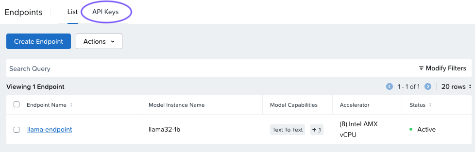
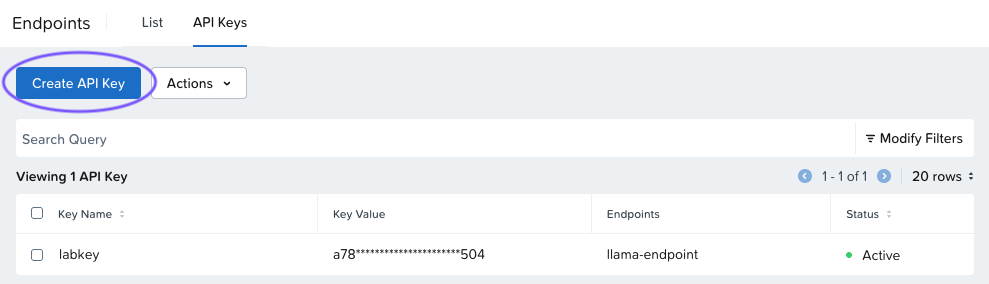
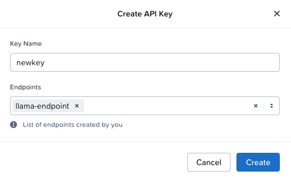
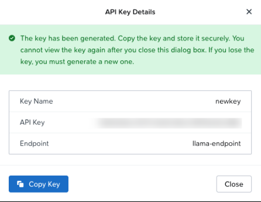

# Creating Additional API Keys Optional

ดังที่คุณเห็นเมื่อสร้าง endpoint คุณสามารถสร้างและเพิ่ม API key ให้กับ endpoint ได้ในระหว่างกระบวนการสร้าง หลังจากสร้าง endpoint แล้ว คุณสามารถสร้าง key ใหม่และจัดการ key ที่มีอยู่ได้ทุกเมื่อจากแท็บ API Keys บนหน้าจอ Endpoints

หากคุณไม่ได้สร้าง API key ในระหว่างกระบวนการสร้าง endpoint หรือต้องการสร้างใหม่ ให้ทำตามขั้นตอนด้านล่าง

1.  จากเมนูทางซ้ายมือ คลิก **Endpoints**
    
2.  คลิก API Keys
    
    
    
3.  คลิก **Create API Key**
    
    
    
    !!! info
        Existing Keys
        
        สำหรับ key ที่มีอยู่ คุณสามารถดำเนินการต่างๆ ผ่านเมนู **Actions**
        
        -   **Delete**: ลบ API key ออกจากระบบและ endpoint ทุกตัว
        -   **Update**: แนบหรือถอด endpoint ออกจาก API key
        -   **Deactivate** (ถ้า key มีสถานะ Active): ปิดการใช้งาน API key
        -   **Activate** (ถ้า key มีสถานะ Inactive): เปิดใช้งาน API key ที่ถูกปิดไว้อีกครั้ง
    
4.  พิมพ์ Key Name และเลือก endpoint ของคุณ จากนั้นคลิก **Create**
    
    
    
5.  รายละเอียด API key ใหม่ของคุณจะปรากฏขึ้น อย่าลืม copy key เพราะจะแสดงเพียงครั้งเดียว จากนั้นคลิก **Close**
    
    

---

[← Back: View The Endpoint Details](nai-fundamentals-endpoint-view.md) | [Home](nai-welcome.md) | [Next: Takeaways →](nai-fundamentals-takeaways.md)